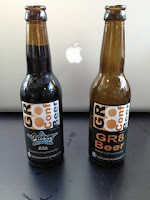
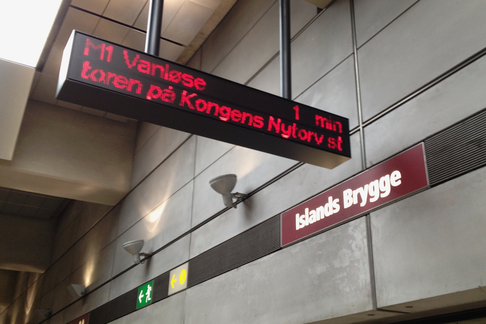

The first session on the last day of [GR8Conf](http://gr8conf.eu/) was led by [Ivo Houbrechts](http://www.slideshare.net/gr8conf/grails-ee), was about his big scale Grails project (1.000 users, 75 screens, 14 developers), and quickly got my attention. The problems they had to deal with where quite recognizable to our current project (even to past projects in other platform besides Grails). Funny enough this brought some sort of realization that "if we run in the same limitations, we are probably understanding what the capabilities of the platform are and aren't. That we are starting to get past the newbie stage" (ok, we might have to admit here that we did enjoy the specially brewed conference beer last night, so thinking might have been a bit foggy).

Ivo continued to show they had created two Grails plugins to implement some solutions for the problems they (and we) ran into. Thanks for that! Another two more items were added on our post-conference todo list;

- Discover the [GSP taglib plugin](http://grails.org/plugin/gsp-taglib) that makes it possible to define tags in GSP syntax.
- Play with the [Rich Domain plugin](http://grails.org/plugin/rich-domain) that adds functionality like validation support for POGO's and instance constraints and constraint-groups.

The next presentation by [Netflix' Joe Sondow](http://gr8conf.eu/Presentations/Asgard--the-Grails-App-that-De) was easily the most polished one of the conference. They have opensourced their mission-critical Grails application, used by [Netflix engineers](http://www.netflix.com/) to deploy code changes and manage resources in the [Amazon cloud](http://aws.amazon.com/ec2/). Not something we have at hand on a day-to-day basis, but nice to store in background memory nevertheless.

During the remainder of the day we saw Burt Beckwith of SpringSource explaining the [Spring Security Plugin](http://gr8conf.eu/Presentations/Hacking-Spring-Security-Plugin) and showing more Spring stuff [under the Grails hood](http://gr8conf.eu/Presentations/Under-the-Hood-Spring-in-Grails). 
Every now and then we fantasize about using a [NoSQL](http://en.wikipedia.org/wiki/NoSQL) database (but never had a project with a real need/advantage so far), so the [MongoDB](http://gr8conf.eu/Presentations/Grails-and-MongoDB) session got easily absorbed too. 
[Groovier testing with Spock](http://gr8conf.eu/Presentations/Groovier-Testing-With-Spock) brought what the title promised, and Robert Fletcher clearly showed the advantages of [Spock](http://code.google.com/p/spock/) by side-to-side comparism with plain tests.

But the last few days, and certainly this mornings' session had certainly planted a seed. Development of a Grails plugin should be the next step in my exploration of Grails and would be the main subject (besides beautiful Danish women) of our discussions during the travel back home. We arrived home a bit delayed (our plane was struck by lighting when inbound [CPH](http://en.wikipedia.org/wiki/Copenhagen_Airport)), but full of new ideas, inspiration and enthusiasm for the Grails ecosystem.

See y'all next year.
