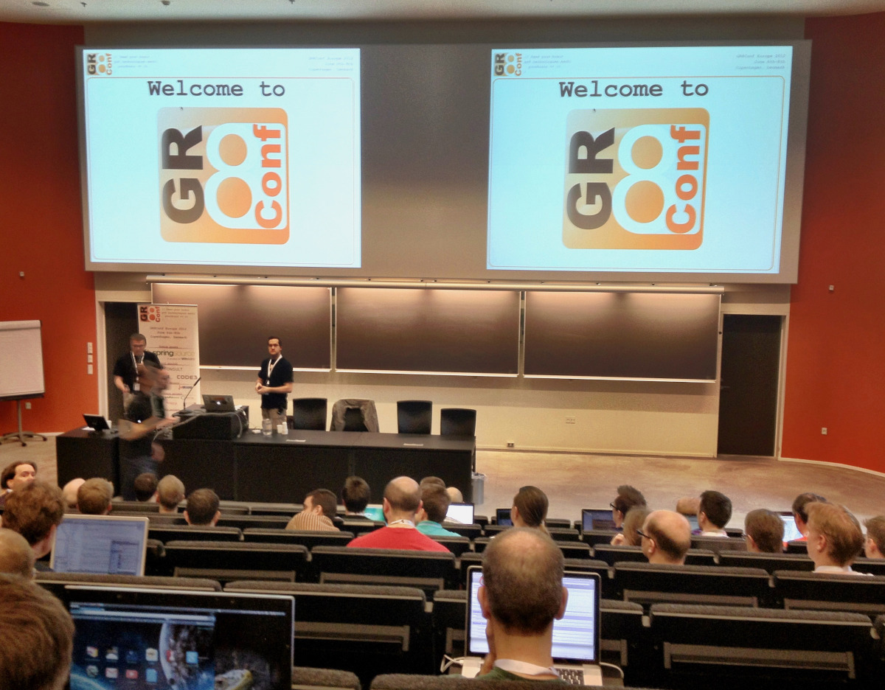
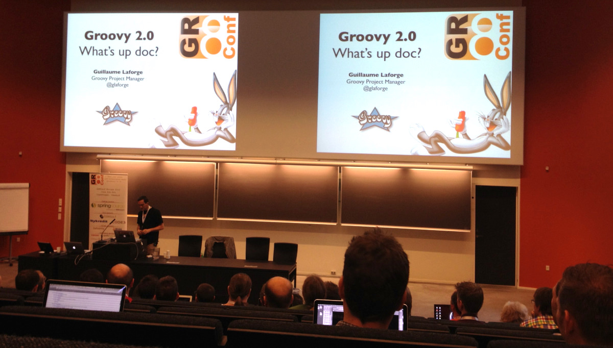

The first 'official' day of [GR8Conf](http://gr8conf.eu/). After some welcome words Groovy project manager [Guillaume Laforge](http://gr8conf.eu/Speakers/Guillaume-Laforge) took the stage and introduced many new or not so new features of Groovy 1.8 and the upcoming Groovy 2.0. Since this came straight from the source, so you better check out [Guillaume's slides](http://www.slideshare.net/glaforge/groovy-18-and-20-at-gr8conf-europe-2012).

The [Grails Hidden Gems](http://gr8conf.eu/Presentations/Grails-hidden-Gems) of [mrhaki](http://gr8conf.eu/Speakers/MrHaKi) showed us even more of, well hidden gems of Grails, actually. All the examples can be found on [github](https://github.com/mrhaki/gr8conf2012-grails-hidden-gems).

A very interesting session by [Luke Daley](http://gr8conf.eu/Speakers/Luke-Daley) explained a scenario for testing with [Geb](http://www.gebish.org/), which is a browser automation solution, based on Page Object modelling. Of course this did rang many bells. We used to have something similar called [TestFrame](http://nl.wikipedia.org/wiki/TestFrame) working for native MS-Windows applications. Such a Page Object based approach will consume quite some development time, but will certainly pay-off in regression tests and/or big applications. Another entry on our todo list.

Without trying to replicate the whole conference, there is still one session I attended on this first day I want to highlight. [Andreas Aredal](http://gr8conf.eu/Speakers/Andreas-Aredal) from Sweden plotted the Clean Code mantra of [Robert C. Martin](https://twitter.com/#!/unclebobmartin), better known as [Uncle Bob Martin](http://devnology.nl/podcast/10-content/98-devnology-podcast-006), on the Grails architecture in the [Keeping your Grails Code Clean](http://gr8conf.eu/Presentations/Keeping-your-Grails-code-clean) session.  
Some of the Clean Code highlights presented by Andreas:

- The **MODEL** should handle business domain data and it's domain logic ... _[DRY](http://en.wikipedia.org/wiki/Don't_repeat_yourself) with Named Queries and remember that these are chainable._
- The **VIEW** is for presenting data to the user (and only that) ... _Don't put business logic here and use templates and taglibs for repeating stuff._
- The **CONTROLLER** is responsible for handling request flow ... _Services should do the heavy lifting and Command Objects should be used if a controller needs data beyond a single domain class._
- **SERVICES** should do the difficult and/of transactional stuff ... _Thus Services should never store state. Furthermore services are singletons and transactional by default._
- **JAVASCRIPT** should only be responsible for the behavior of your views ... _Learn jQuery but don't use it for everything and learn [Design Patterns](https://refactoring.guru/design-patterns/catalog)._

Oh, and last but not least, not everything is a Grails component, so use plain Groovy or even Java classes when and where appropriate. All points are quite obvious when summarized like this; but so easy to slip out of our focus in day-to-day coding! 

Finally Andreas dropped another entry on our todo list; [Codenarc](http://codenarc.sourceforge.net/) for static analysis of Groovy code, like in: put your money where your mouth is.