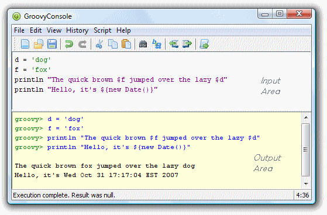
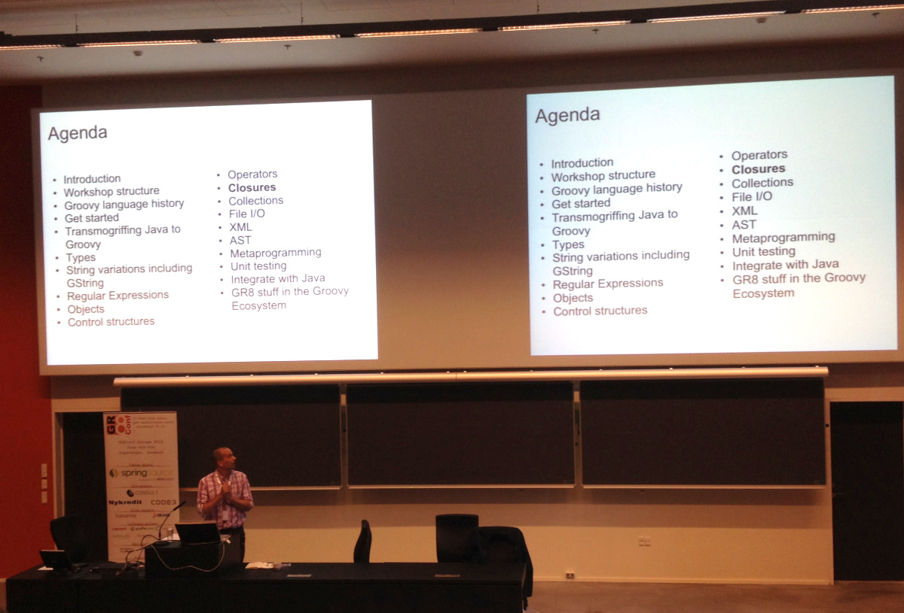

So we went to [GR8Conf](http://gr8conf.eu) at the [IT-Universitetet i København](http://www.itu.dk/en/). To my shame, I must say, that I never travelled to any of the Scandinavian countries and I was surprised how close it actually is to Holland. From the short insight we got in Denmark this is certainly a region to visit more often. Friendly and disciplined people, well-organised while keeping 'savoir-vivre'.

But let's get back on subject. The first day we attended the 'University Day' which consisted of longer and more in-depth sessions on a couple of subjects. The first session I picked was [_Getting Groovy_](http://gr8conf.eu/Presentations/Getting-Groovy) presented by fellow dutchman [_MrHaki_](http://mrhaki.blogspot.nl/). Seeing him perform in the past, this could not be a disappointment and it wasn't. _MrHaki_, who is acutally called Hubert Klein Ikkink, touched a broad range of language concepts in a quick and entertaining way. The [Groovy Console](http://groovy.codehaus.org/Groovy+Console) proved to be an invaluable tool. Since I had been working in [IntelliJ](http://www.jetbrains.com/idea/) for the past years, I did not give the Groovy Console a lot attention before but that prooved a mistake and in the week after GR8Conf I now regularly test pieces of code in this console before pasting it in the whole Grails application architecture in IntelliJ. Led by MrHaki we typed away for a couple of hours and learned a lot of new little concepts and language constructs. ~~[The slides](https://docs.google.com/present/view?id=0Aad2ZbZ4fTjzZGNjbjhidHFfNTBkYjl6azhkdg) (basically useless because of MrHaki's hands-on presentation style) are published here but there is a detailed document he wrote to go along with his slides. Download this document, open Groovy Console and do your Groovy workout, now!~~

Next session we picked was [_Creating Responsive HTML 5 Applications in Grails_](http://gr8conf.eu/Presentations/responsive-HTML-5-apps) but that turned out a bit of a disappointment. We were looking forward to a walkthrough, pro's and con's etc. but after a so-so presentation of broad architecture concepts we were basically told, take [Backbone.js](http://backbonejs.org/), read the manual, see the examples, and work it out for yourself. We will certainly do this but at some other time and place.

Switching to the other auditorium in the coffee-break we caught some of [Stefan Armbruster](http://gr8conf.eu/Presentations/my-perfect-grails-toolchain)'s presentation on his [_Perfect Toolchain for Grails Projects_](http://www.slideshare.net/gr8conf/my-perfect-toolchain-setup-for-grails-projects). Important stuff, but luckily for us, it was mostly a confirmation we were on the right track. I will use this blog someday to explain what tools we use and why.

The most striking advice from Stefan?
"In a [Distributed Scrum](http://www.se-radio.net/2011/12/episode-181-distributed-scrum-with-rini-van-solingen/) project, always use a physical Kanban, make somebody responsible for maintaining the state after every Daily Standup Meeting and put a webcam on it!
That sounds like an interesting experiment which we certainly will try in one of our projects.

The final session we attended on wednesday was [_Jumpstarting Griffon_](http://gr8conf.eu/Presentations/Jumpstarting-Griffon); desktop applications using Groovy in a Grails-like way. [Griffon](http://griffon.codehaus.org/) works with Swing, JavaFX, SWT and the like. A good in-depth overview, nice to see how well it all works but somehow we hardly have projects requiring these kind of applications. When there will be; we now trust that we are prepared for it.

That about rounds the first day of [GR8Conf](http://gr8conf.eu/), more soon ...