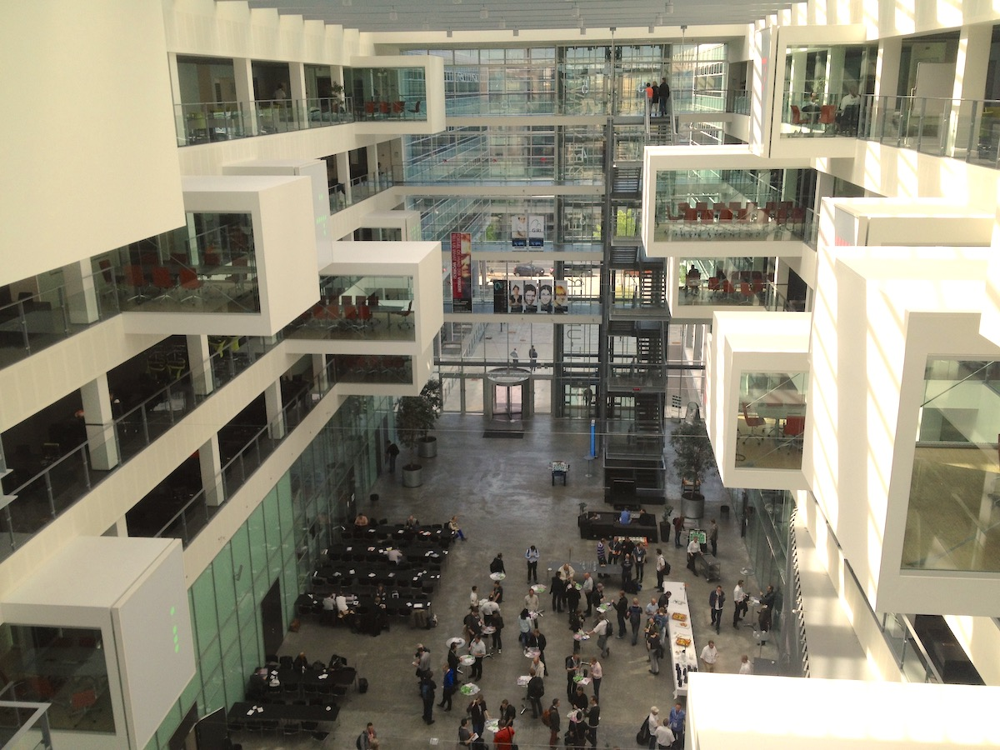
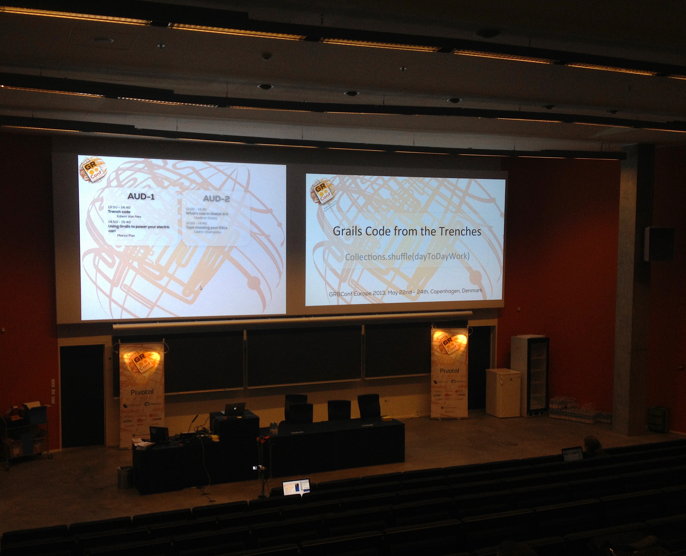
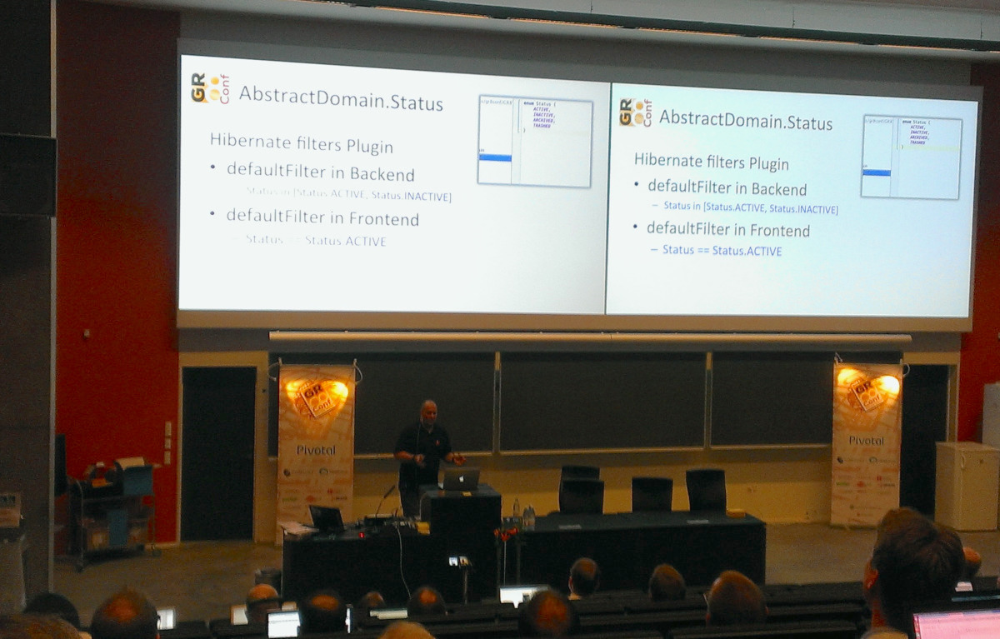
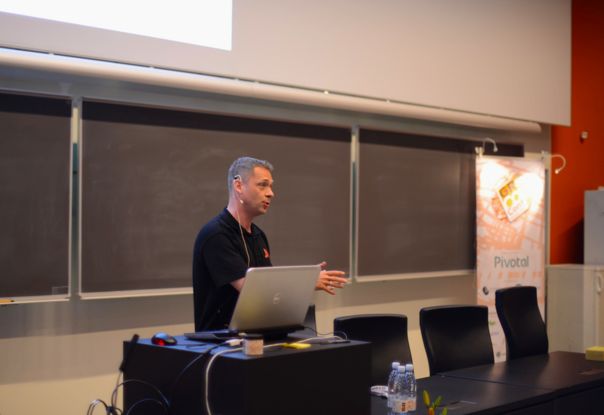

## Rise up
Back in Auditorium 1 in København for the final day of this GR8 Conference. Starting with a session by Jan Reher explaining two rather big projects done in Grails and trying to [determine if it was wise to choose Grails](http://gr8conf.eu/Presentations/We-chose-Grails-and-Groovy-for); and hey, it was according to Jan, but he learned a couple of valuable lessons. The biggest mistake to make is thinking you can just write Java in Groovy. You'll end up with the worst of both worlds. (Hmmm, I guess we have to plead guilty on that one). The centuries-old problem of every development team is re-inventing wheels rather than looking for third-party solutions (point noted!).

## Release, thy will
But there were even more interesting lessons to learn for managing [Agile development](http://en.wikipedia.org/wiki/Agile_software_development) teams. Both points rise around the most important aspect of Agile Development, i.e. _Release Early and Release Often_, which is extremely important creating a tight feedback loop between developers and testers or users.
This approach is opposite to _Feature-based releases_. But the features of a product are usually what's important to marketing/management of the product!  

Personally I've seen multiple projects come into trouble when features are treated as Sprints and reported/invoiced as 'done' at the end of a Sprint. This is very clearly a bad approach for Agile projects but real-world projects turn out to be different than theory. However, this creates two symptoms:
- **Release Early versus Knowledge** The first project(s) in a new technology will start with a big backlog in knowledge. Actually, every project will start with a backlog in knowledge albeit on the particular business realm rather than the technology, once you're down the line.
Not investing in education is not a requirement for Agile development(!), but fed by 'Release Early' a team will release software that still contains beginners mistakes (not necessarily resulting in bugs). Feature-driven marketing reports the features as 'done' and the possibility to re-engineer (which IS a requirement for [Agile development](http://en.wikipedia.org/wiki/Agile_development)) disappears and the team has to maintain what effectively went into production.
- **Release Early versus Experience** In order to release at the end of a [Sprint](http://en.wikipedia.org/wiki/Scrum_(development)#Sprint), it's very tempting to have the most experienced developer work on big chunks of the work. But this is a short-term approach, as it leaves the rest of the developers in the dark (and thus amplifies the first symptom). Expert developers should focus on teaching and coaching the other developers rather than making the most mileage for the team.

## Good Form Mate!
I was particular interesting in the talk of [Peter McNeil](http://gr8conf.eu/Speakers/Peter-McNeil) from nerdErg and was not disappointed either. Peter introduced an open source project he'd been working on called [Good Form](http://nerderg.com/Good+Form). Every killer product should solve a problem, so Peter starts explaining a couple of form [anti-patterns](http://en.wikipedia.org/wiki/Pattern_(software)) that sound uncomfortably familiar. Literally quoting from the slides there are:
- **Domain-o-rama** ... basically mapping forms 1:1 on your [Boyce-Codd NF](https://en.wikipedia.org/wiki/Boyce–Codd_normal_form) database
- **Splatter Logic** ... splattin' your business logic all over the place, ultimately in your [JavaScript](http://en.wikipedia.org/wiki/Javascript)
- **State of Flux** ... where to store the data when it doesn't meet the Domain constrains?
- **Page Proliferation** ... [DRY](http://en.wikipedia.org/wiki/Don%27t_repeat_yourself) & be consistent

Looking at a form as an 'input document' rather than an 'entry-point for your database' is the paradigm chosen by [Good Form](Good Form), and looks particular worthwhile for more complicated forms like tax-papers, contracts etc. The project uses a Business Rules engine called [One Ring](http://nerderg.com/One+Ring) from the same developer. Forms are primarily defined by a [DSL](http://en.wikipedia.org/wiki/Domain-specific_language) and focus on questions. An overall nice presentation and this projects is certainly something that we will dive into soon.

After a short break there was a presentation of [Yasuharu Nakano](https://twitter.com/nobeans) coming all the way from Japan (who rather unnecessarily for this audience, took great care in excusing for his non-native English). Yasuharu showed us how to speed up your development, which for most of us means: trial-and-error little blocks of code in an IDE of choice. Using an approach with GroovyClient and ultimately the [Improx Plugin](http://grails.org/plugin/improx) developed by Yasuharu, there are huge (like 40 times faster) roundtrip times to reach.

Then it was time to prepare and present my own talk, which by now raised lotsa insecurities. I would not be presenting the latest and greatest like Guillaume Laforge, or the [rocket-science](http://en.wikipedia.org/wiki/Large_Hadron_Collider) practiced by Dr. Russel Winder, but just bits-and-pieces from the [trenches](http://en.wikipedia.org/wiki/Trench_warfare) of day-to-day development of business applications. If I could just inspire one or two developers I'd be fine ... :-)

I'm happy I get to chat to a couple of people that were (somewhat) inspired by our scaffolding ideas or plainly amused by the similarities in the issues we are dealing with. Thanks! everyone, for your attention. Slides are available [here](http://www.slideshare.net/nevermind2010/2013-gr8-confgrailscodefromthetrenches). Since the default scaffolding of Grails is too mager for a production system (wasn't meant for that purpose to begin with), it was suggested to release the whole lot as a plugin. Have to think a bit about the consequences of that, but I do appreciate the suggestion.

## The session after
Currently on, is my co-worker Marco Pas explaining the [problems and solutions](http://gr8conf.eu/Presentations/Using-Grails-to-power-your-ele) he dealt with implementing a [platform for managing chargers](http://evectric.com/?page_id=67) for electrical vehicles. Glad to see he has a good and interested audience too, since the other auditorium has [Luke Daley](http://gr8conf.eu/Presentations/Ratpack) talking about [Ratpack](https://github.com/bleedingwolf/Ratpack).

Unfortunately, this is where our conference has to end, since we have a plane to catch. All in all I had a wonderful conference, am glad I was able to present some ideas and spent some time with fellow developers. Looking forward to 2014 edition but have enough ideas to fill the time in-between. C Ya!