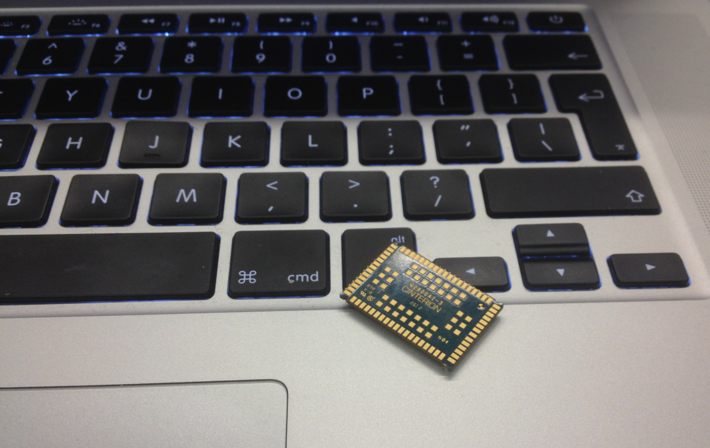
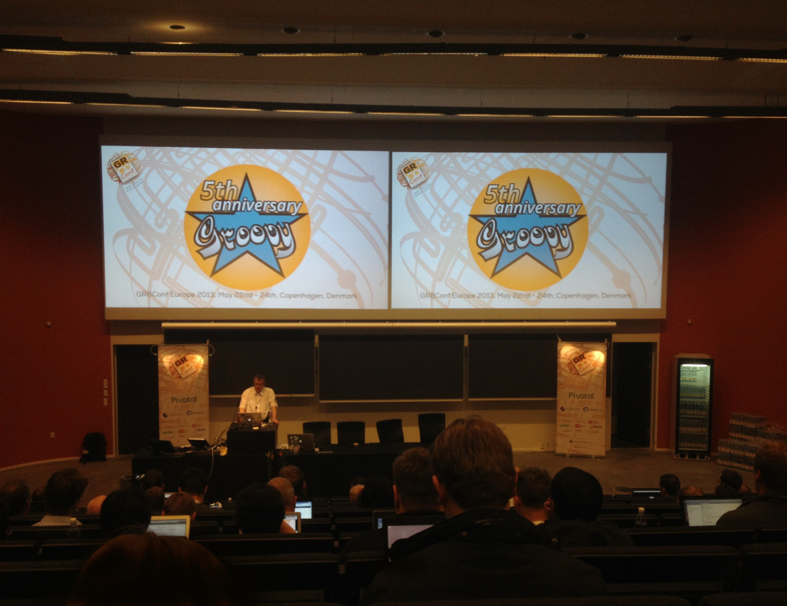
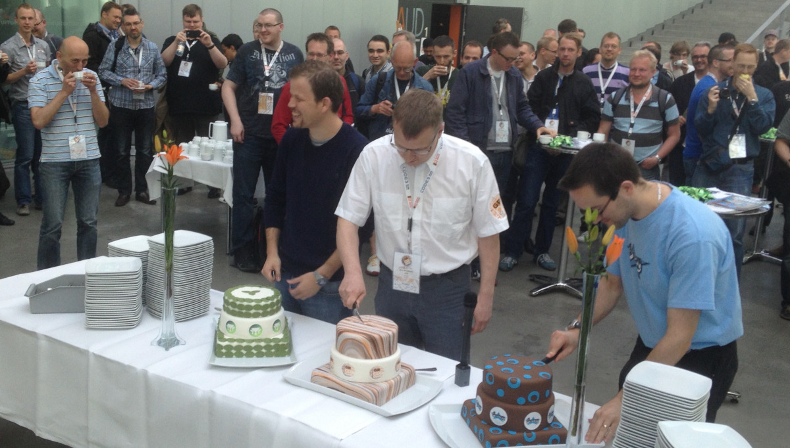
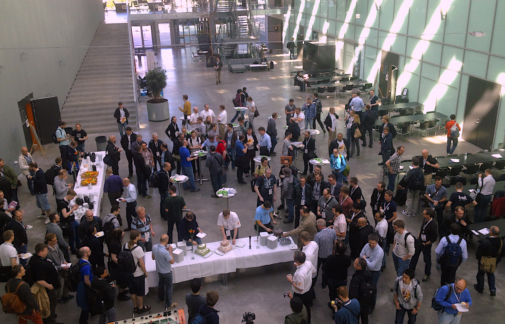

## 5th Anniversary
[Søren Berg Glasius](https://twitter.com/sbglasius) kicked off the first day of the actual conference by welcoming everybody and highlighting the 5th anniversary of the event. A couple of hardcore-devotees where celebrated and presented with free passes for next years' event before Søren announced the keynote by [Dr. Venkat Subramaniam](http://www.agiledeveloper.com/). Having attended the workshop by Venkat the day before, our expectations were high, and boy where they met! In a virtually continuous flow of words, highlighted by a cornucopia of historical persons, Venkat showed us, grounded on his socks, the exact relation between [Mahatma Gandhi](http://en.wikipedia.org/wiki/Ghandi) and Groovy developers.

We sat in on the session where Jeff Beck presented some best practices in static code analysis. The weapons of choice are [Codenarc](http://codenarc.sourceforge.net/) and [Cobertura](http://cobertura.sourceforge.net/) for Groovy and [JSLint](http://www.jslint.com/) for JavaScript, while it all comes together in [Jenkins](http://en.wikipedia.org/wiki/Jenkins_(software)), which we have been using for quite some time too.

Several centuries ago, I started my education in electronics actually, so I could not resist sitting down for [Stephen Chin of Oracle](http://steveonjava.com/) showing how he runs [Groovy Fx](http://groovyfx.org/) on a [Raspberry Pi](http://www.raspberrypi.org/). Maybe I should just order this [Arduino kit](http://www.conrad.nl/ce/nl/product/095060/The-Arduino-Starter-Kit) I've been lurking at for some time now, and start [playing around](http://blog.makezine.com/arduino/).

[Grails](http://en.wikipedia.org/wiki/Grails_(framework)) 'foundationalist' [Graeme Rocher](http://grails.io/) presented us with a sneak preview on the things to come in Grails 2.3 and [Grails 3.0](http://grails.org/Roadmap). Specially the features on [REST](http://www.ics.uci.edu/~fielding/pubs/dissertation/rest_arch_style.htm) URL mapping and [GORM for REST](https://github.com/grails/grails-core/wiki/Grails-2.3:-REST-Improvements) caught our attention, not in the least because of the console that will present us with a nice overview of the effective URL mapping in an application.

Following the keynote show of [Dr. Subramaniam](https://twitter.com/venkat_s) this morning, it was no surprise to see the whole auditorium packed for his talk on Functional Programming. Venkat started with a reference ([GOTO is evil!](http://nl.wikipedia.org/wiki/GOTO)) to famous dutch engineer [Edsger Dijkstra])http://nl.wikipedia.org/wiki/Edsger_Dijkstra and introduced the audience to "Assignment-less programming". While we do feel a bit sorry for Søren and his crew, we learned from Venkat that all the [conference-swag](http://en.wikipedia.org/wiki/Promotional_item) is dirty programming and should be re-engineered:

from: ` gr8.technologies.each { yourBrain << it }`

to: `yourBrain << gr8.technologies.collect { it }`

Venkat continued by highlighting the typical psychiatric disorders of Java programmers (i.e. **self-inflicted-wound-pattern**, **primitive-obsession**, ***[trainwreck-pattern](http://en.wikipedia.org/wiki/Language_primitive)*** or even the **[there-is-a-reason-they-invented-copy-and-paste-syndrome](http://en.wikipedia.org/wiki/Copy_and_paste)**). All ended well when we learned how senseless the discussion on [lambda expressions](http://www.codeproject.com/Tips/298963/Understand-Lambda-Expressions-in-3-minutes) versus [closures](http://groovy.codehaus.org/Closures) actually is, and how easy imperative style - can be re-engineered to [functional style](http://stackoverflow.com/questions/602444/what-is-functional-declarative-and-imperative-programming) programming. Yet again, a witty and insightful presentation delivered at warp speed.

[Ready, Steady, Transform](http://gr8conf.eu/Presentations/Ready--Steady--Transform) presented the experiences of a software team learning and building a framework for manipulation of data with a groovy DSL. Learning [sprint-by-sprint](http://en.wikipedia.org/wiki/Scrum_(development)) in the realm of investment bankers and financial traders where [typos](http://en.wikipedia.org/wiki/Typos) tend to cost serious amount of money.

To finish today's report loosely quoting Ghandi: 'Code as if you were to die tomorrow. Learn as if you were to code forever.'