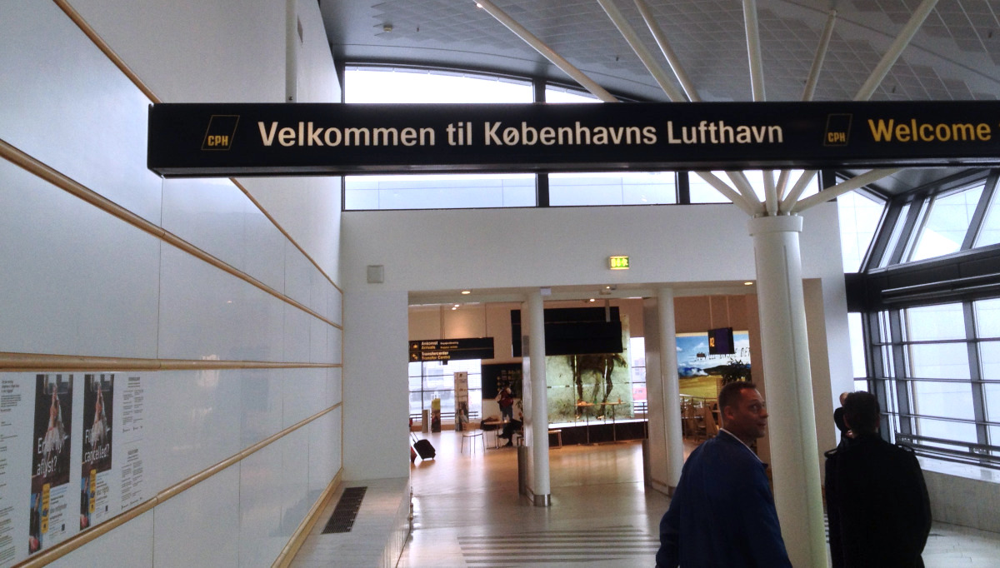
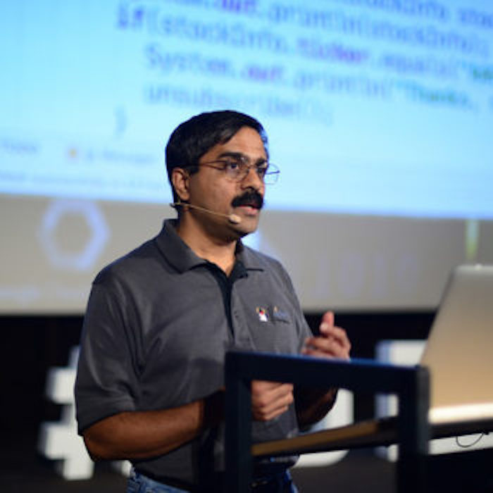

Now we find ourselves back at the [IT-Universitetet](http://www.itu.dk/) i København attending the 5th Anniversary of [GR8Conf Europe](http://gr8conf.eu/). Last year, when we attended this event, we went home buzzin' with excitement and new ideas. One of them resulted in this little back alley of the web. Sadly, my private life was turned upside down and business has been somewhat tougher than usual, so a year later, there is enough residue left of last years' ideas. No reason to skip this event in the nice city of København.

While I'm tempted to agree with the tweet below, it's a scary tweet too, since [I'm on the schedule](http://gr8conf.eu/Speakers/Edwin-Van-Nes) this year doing a [technical talk](http://gr8conf.eu/Presentations/Trench-code) on friday, just before my friend and serial-co-worker [Marco](http://gr8conf.eu/Speakers/Marco-Pas) will present his [session](http://gr8conf.eu/Presentations/Using-Grails-to-power-your-ele). At least we know the expectations are high, we will do our best to meet them.

 

On the cold and rainy day of wednesday, the overture of the conference, a.k.a. the University Track, commenced with registration and seeing lots of familiar faces. Being well acquainted with his topic, we skipped the [session hosted](http://mrhaki.blogspot.dk/2013/05/gr8conf-2013-europe-conference-report.html) by _Mr. Haki_, and sat down for a workshop on [Asynchronism]("http://gr8conf.eu/Presentations/---Async-Grails-Workshop). While the workshop turned out to be a bit of a bumpy ride, it highlighted an interesting approach which we have mostly ignored in day-to-day work so far. Have to look into it.

Maybe we should have been more confident and skipped the early-afternoon session on [Web Development with Grails](http://gr8conf.eu/Presentations/---Web-Development-with-Grails), but there wasn't a lot to learn here. The presenter of this session however, [Venkat Subramaniam]("https://twitter.com/venkat_s) kept me on the edge of my seat, for the extremely good way he hosted this workshop. Experienced engineers that are good teachers and entertainers too are a surely a scarce species.

The third and last session I attended, about [AST Transformations](http://gr8conf.eu/Presentations/---Unleashing-the-power-of-AST) was a whole different beast. Hard to grab stuff but giving a developer extremely powerful possibilities. I'm still a bit indecisive if we should go this way, mostly since I'm a bit scared 'bout raising the level of abstractness for maintenance teams. Also, our discussion during the evening on "is making clever code better for a business or isn't it" did not come to a final verdict.
Eventually, we crashed in the hotel lobby to finish the respective slide-decks for our own sessions. Or the quote the former [governor of California](http://en.wikipedia.org/wiki/Arnold_Schwarzenegger): "I'll be back!"