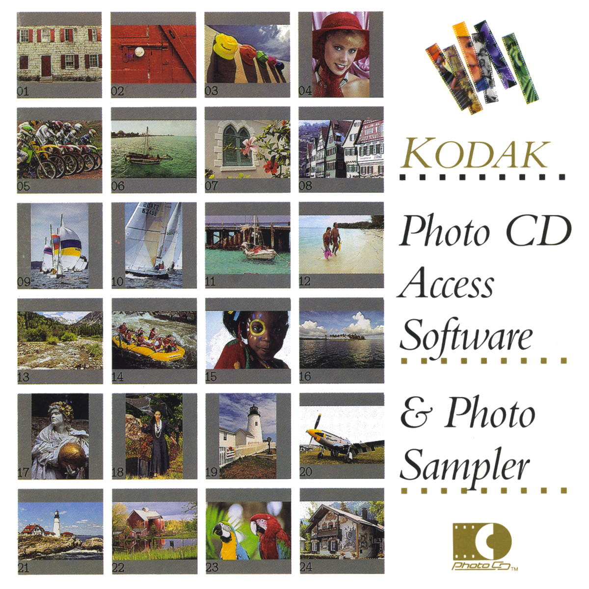
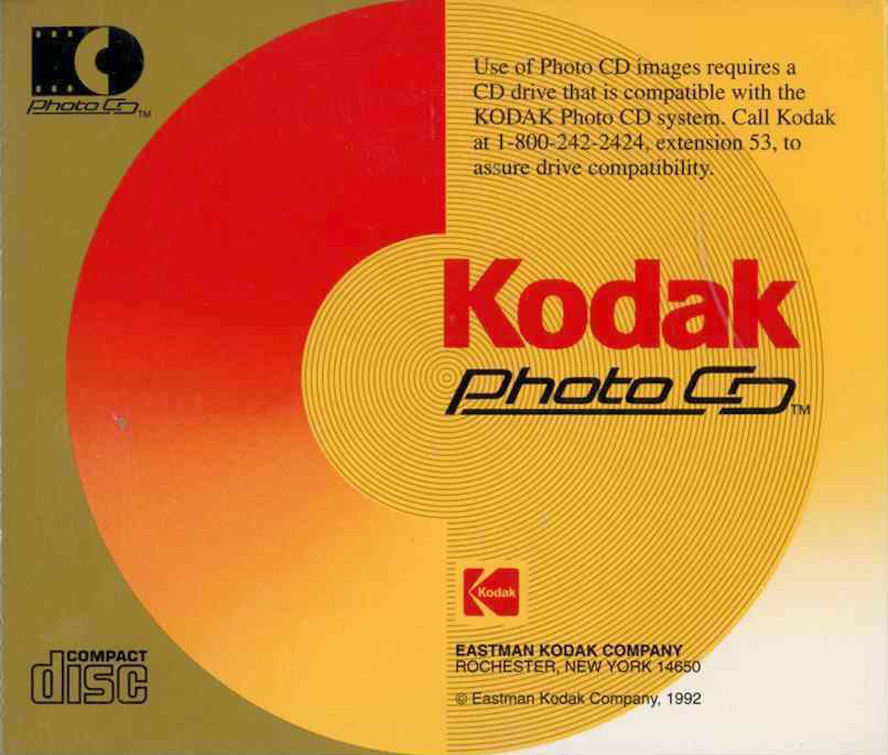
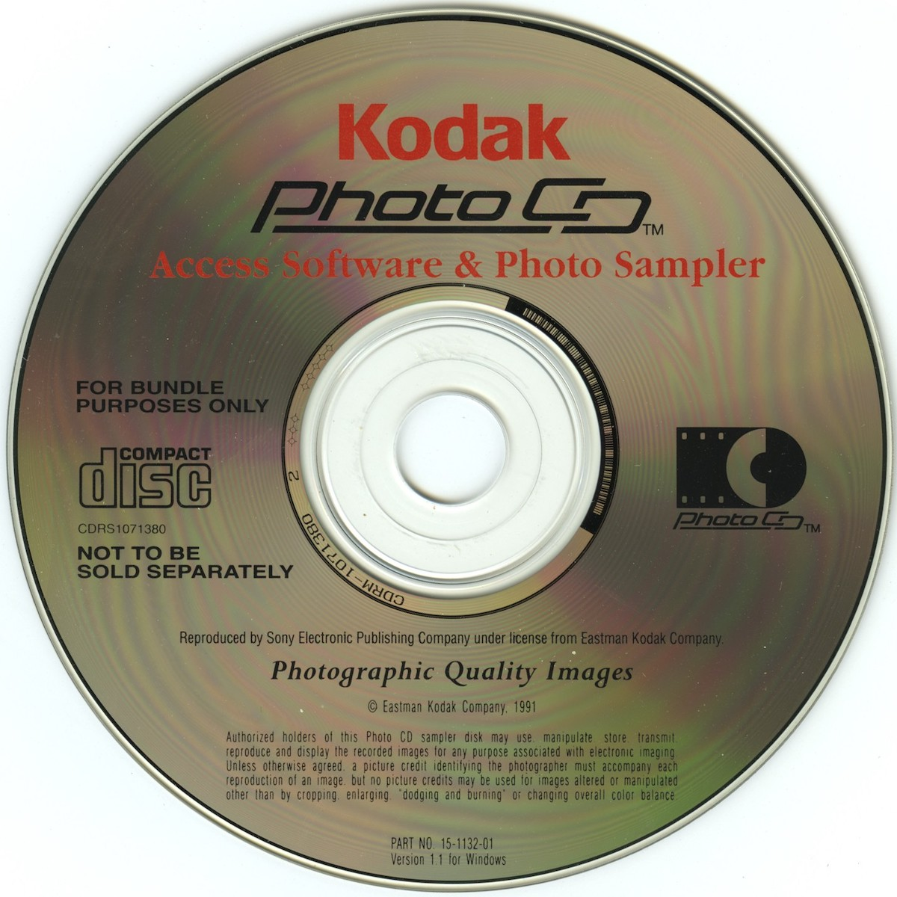

George Eastman created the Eastman Kodak Company in 1880 and revolutionised photography dominating the film market with a 90% market share in the 1970s. In that same era, Kodak created the first digital camera prototypes but they did not want to threaten their prospering film business and did not follow through at that time.

In 1992 Eastman Kodak Company launched their impressive system for digitising and encoding images on a CD-ROM. While the whole concept was quite impressive in those days, the [PhotoCD](http://en.wikipedia.org/wiki/PhotoCD) was never a big success in the consumer market. A PhotoCD was designed to hold nearly 1000 high resulotion digitized images in a proprietary encoding. Roughly 10 years later Kodak [abandoned](http://www.kodak.com/global/en/service/professional/products/ekn017045.jhtml?CID=go&idhbx=photocd) the whole concept and never published the encoding format, thus leaving all their customers in the dark. 

Anyhow, in 1995 Kodak released a PhotoCD sampler that was delivered complimentary a [CD-i player](http://en.wikipedia.org/wiki/CD-i) (another stillborn technology) which was my introduction to high-end digital images. For this 6-megapixel images to become useful at the [Intel-clone](http://en.wikipedia.org/wiki/Intel_80486), a few more years of [Moore's Law](http://en.wikipedia.org/wiki/Moore%27s_law) passed, but I did end up ordering piles of this PhotoCD's at the local laboratory in this pre-[digicam](http://www.steves-digicams.com/pro90is.html) era. 

In need for a versatile set of test images for the development of the Glickr Plugin I decided to create a [dedicated Flickr](http://www.flickr.com/photos/glickr/) account and uploaded some professional imagery. Kodak granted the right "to use, manipulate, store, transmit, reproduce and display" the images on their PhotoCD sampler, "for any purpose associated with electronic imaging". So after collecting dust for 17-years, I pulled out the PhotoCD, had to use [ImageMagick](http://www.imagemagick.org/script/index.php) to translate the proprietary PCD files, and uploaded the sampler set as test-images on the new [Flickr account](http://www.flickr.com/photos/glickr/).