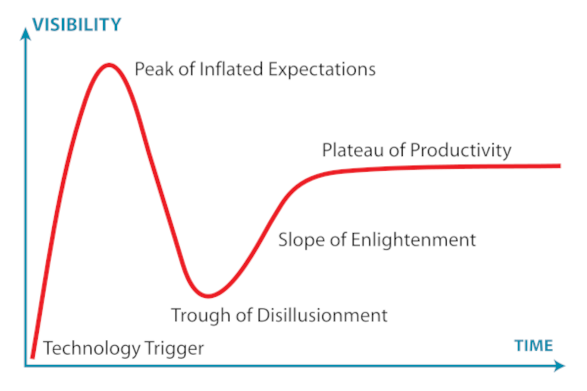

In the first weeks after [GR8Conf](http://gr8conf.eu/) I enthusiastically started with the blog and development of the plugin. Sadly we had to deal with an event in real life that thoroughly consumed all our energy and enthusiasm.

While the last mumbling on this blog is already a couple of months away, today seems like a good day to drop some thoughts on the [internets](http://en.wikipedia.org/wiki/Internets). On a positive note I could argue I'm perfectly compliant with the [Gartner Hype Cycle](http://en.wikipedia.org/wiki/Hype_cycle), so nothing is lost while I commence the Slope of Enlightenment.

## REST assured
With slightly over 200 interface methods, the [Flickr API](http://www.flickr.com/services/api/) is quite an impressive beast to tame. What I aim to achieve (given I'll arrive somewhere mimicking the [Plateau of Productivity](http://en.wikipedia.org/wiki/Hype_cycle)), is a full implementation of the API as a Grails service, using native (and probably extensive) Groovy classes for the relevant entities, like Photos, People, Places, etcetera. The [REST format](http://www.flickr.com/services/api/request.rest.html) seems to be the most sensible way to approach the API, so essentially I'll be implementing a [Facade](http://en.wikipedia.org/wiki/Design_Patterns_(book)) for the REST.request and corresponding [XML response](http://www.flickr.com/services/api/response.rest.html).

## private def apiCall
After some [tire kicking](http://www.urbandictionary.com/define.php?term=tire+kicker) I started with an abstraction of what all API calls should do:
1. Validate the parameters before doing the call to Flickr
2. Well eh, do the actual call
3. Process the response or handle any errors

In Pseudo Groovy Code it looks something like this:


void apiCall(method, params) {
   if (validator(params)) {
      try {
         def rsp = doApiCall(method,params)
         return process(rsp)
      } catch (Exception ex) {
         ...
      }
   } else {
      // todo: raise validation exception
   }
}


## Non disclosure
Now using the power of Groovy Closures I made the params, the validator and the processor variable for each different API method. Furthermore, to help in the maintenance of what will potentially be over 200 different sets of params, validators and processors, I decided to wrap the Closures in a Class. The whole concept will likely evolve over time, but generally the code looks like this:


//
//  abstracting the whole call handling with closures implemented
//  in individual classes and connected below
//
private def apiCall(def apiImplementation, def apiModel = {} ) {
    def validator = apiImplementation.validatorClosure
    def params    = apiImplementation.paramsClosure
    def processor = apiImplementation.processorClosure

    if (validator(apiModel())) {
        try {
            def rsp = doApiCall(apiImplementation.apiMethod, params(apiModel()))
            return processor(rsp,apiModel())
        } catch (FlickrException ex) {
            FlickrExceptionHandler.handleApiCallException(ex)
        }
    }
    // todo: raise validation exception
    return apiModel()
}


Now the definition of a single Facade method looks like this:


FlickrPhoto photosGetInfo(FlickrPhoto photo) {
    return apiCall(
        new org.glickr.api.photos.photosGetInfo(),
        { photo }) as FlickrPhoto
}


And the actual implementation of the Flickr API method is done in this class:


class photosGetInfo implements FlickrApiMethod{
    static final String apiMethod = 'flickr.photos.getInfo'

    Closure validatorClosure = { FlickrPhoto photo ->
        if (!photo || photo?.id <= 0) { return false } // missing model
        return true
    }

    Closure paramsClosure = { FlickrPhoto photo ->
        [photo_id:photo?.id, secret:(photo?.secret ?:'')]
    }

    Closure processorClosure = { GPathResult response, FlickrPhoto photo ->
        photo.title       = response.photo.title.toString()
        photo.description = response.photo.description.toString()
        photo.isPublic    = (response.photo.visibility.@ispublic?.toString() == '1')
        // etcetera              
        
        return photo
    }
}


That'll be it for today. Any ideas, suggestions or blatant criticism will be greatly appreciated while I code my way up the [Slope of Enlightenment](http://en.wikipedia.org/wiki/Hype_cycle) towards an initial release of the Glickr plugin.