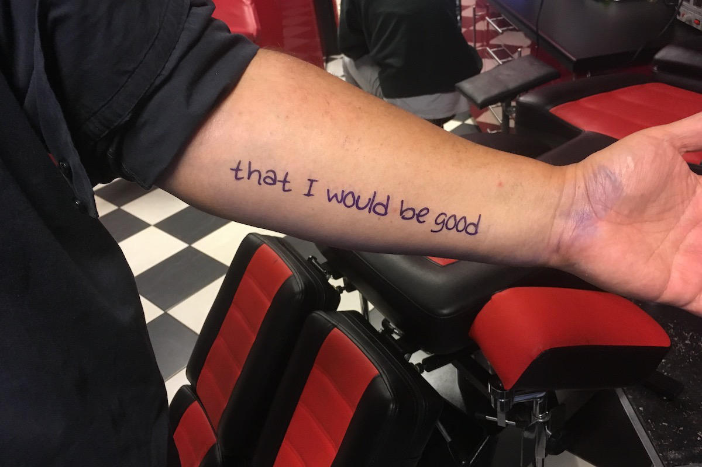
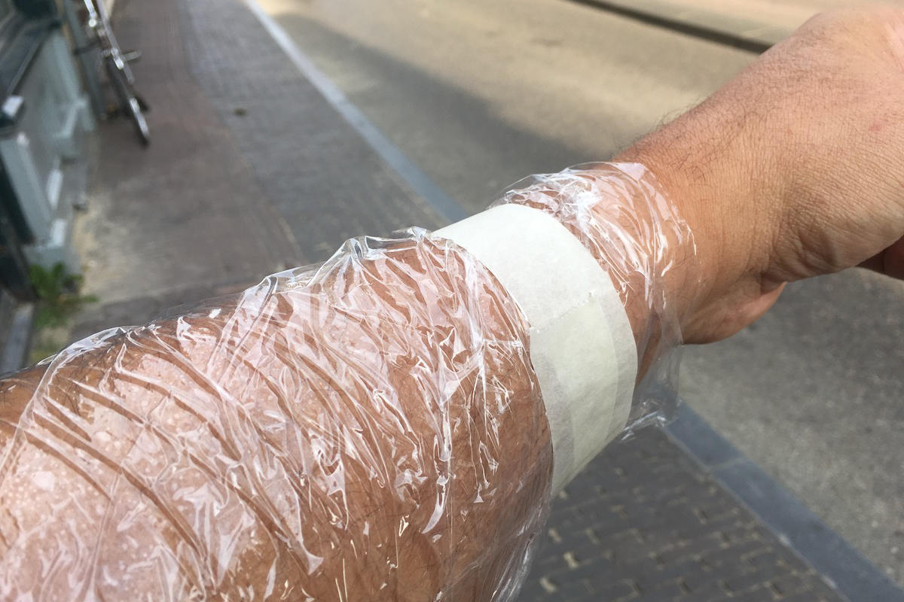
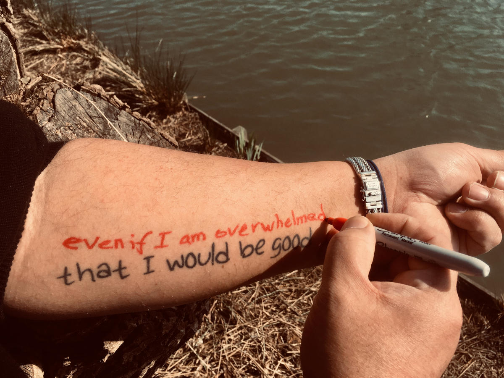

Littekens vormen als onderdeel van het genezingsproces nadat je lichamelijk gewond bent geraakt.
Na het genezingsproces ben je weer in orde en functioneer je weer, met het litteken als kleine herinnering aan het proces dat je hebt doorgemaakt.
Maar wat als je psychisch gewond raakte, hard werkte om weer te herstellen en normaal te functioneren, zou dat proces dan ook een litteken moeten achterlaten?



Hoewel ik niet specifiek fan van [Alanis Morisette](https://alanis.com) ben, staat het album [MTV Unplugged](https://en.wikipedia.org/wiki/MTV_Unplugged_(Alanis_Morissette_album)) uit 1999 stabiel in mijn top 10 van meest beluisterde albums.
Op een gegeven moment bleef het idee gewoon hangen; de tekst van _[That I Would Be Good](https://en.wikipedia.org/wiki/That_I_Would_Be_Good)_ is een perfecte, met een cynische ondertoon, weergave van mijn genezingsproces.

Deze tekst tatoeëren _"alsof ik het zojuist met een Sharpie heb geschreven"_ zou dat _litteken_ voor mij zijn.

### Lyrics

_That I would be good, even if I did nothing_  
_That I would be good, even if I got the thumbs down_  
_That I would be good if I got and stayed sick_  
_That I would be good even if I gained ten pounds_  

_That I would be fine even if I went bankrupt_  
_That I would be good if I lost my hair and my youth_  
_That I would be great if I was no longer queen_  
_That I would be grand if I was not all knowing_  

_That I would be loved even when I numb myself_  
_That I would be good even when I am overwhelmed_  
_That I would be loved even when I was fuming_  
_That I would be good even if I was clingy_  
_That I would be good even if I lost sanity_

_That I would be good_  
_Whether with or without you_

- Released op het [Supposed Former Infatuation Junkie](https://en.wikipedia.org/wiki/Supposed_Former_Infatuation_Junkie) album in 1998, released als een [single](https://www.discogs.com/master/210356-Alanis-Morissette-That-I-Would-Be-Good) in 1999  
- &copy; Alanis Morissette & Glen Ballard
- Ja, ik hou ook van Sharpies; [deze in het bijzonder](https://www.facebook.com/LunaReplicasLLC/posts/the-savage-industries-sharpie-sherpa-is-just-too-cool-another-apollo-inspired-ev/1043739049400248/) is mijn _Heilige Graal van Sharpie_


