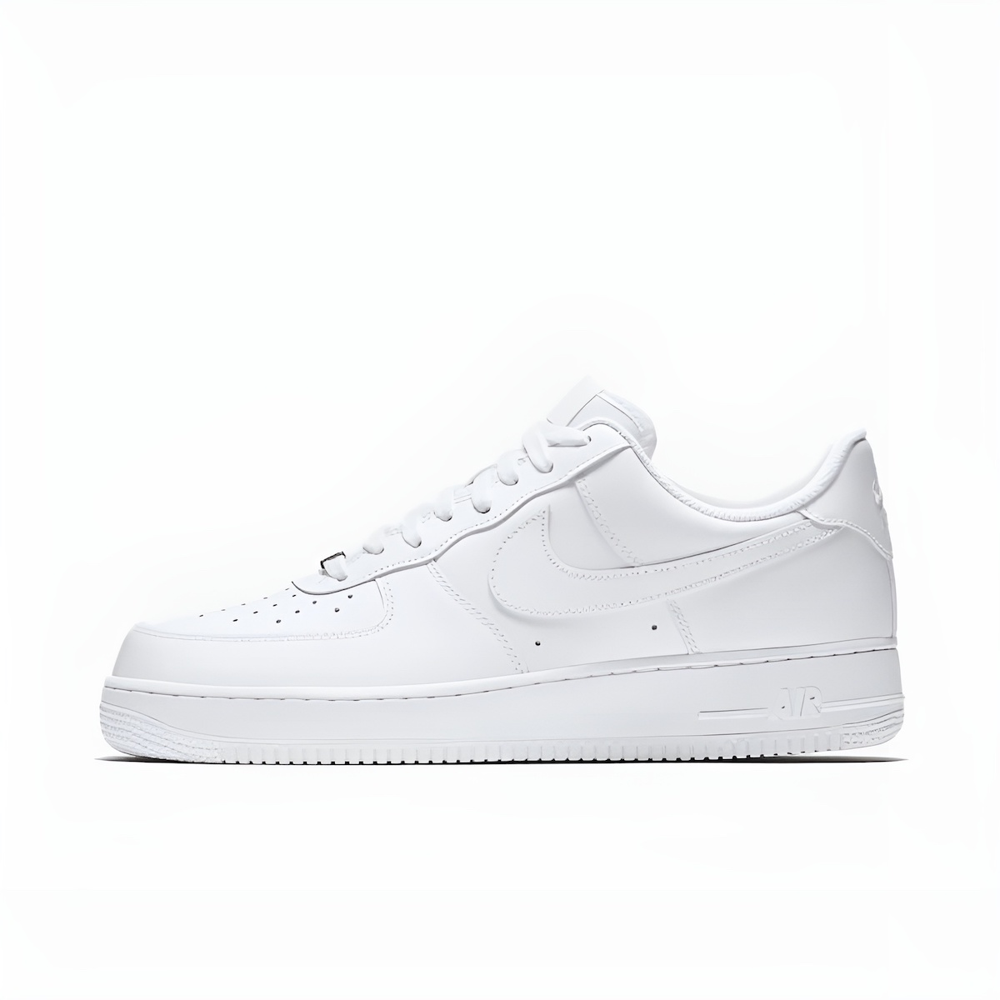
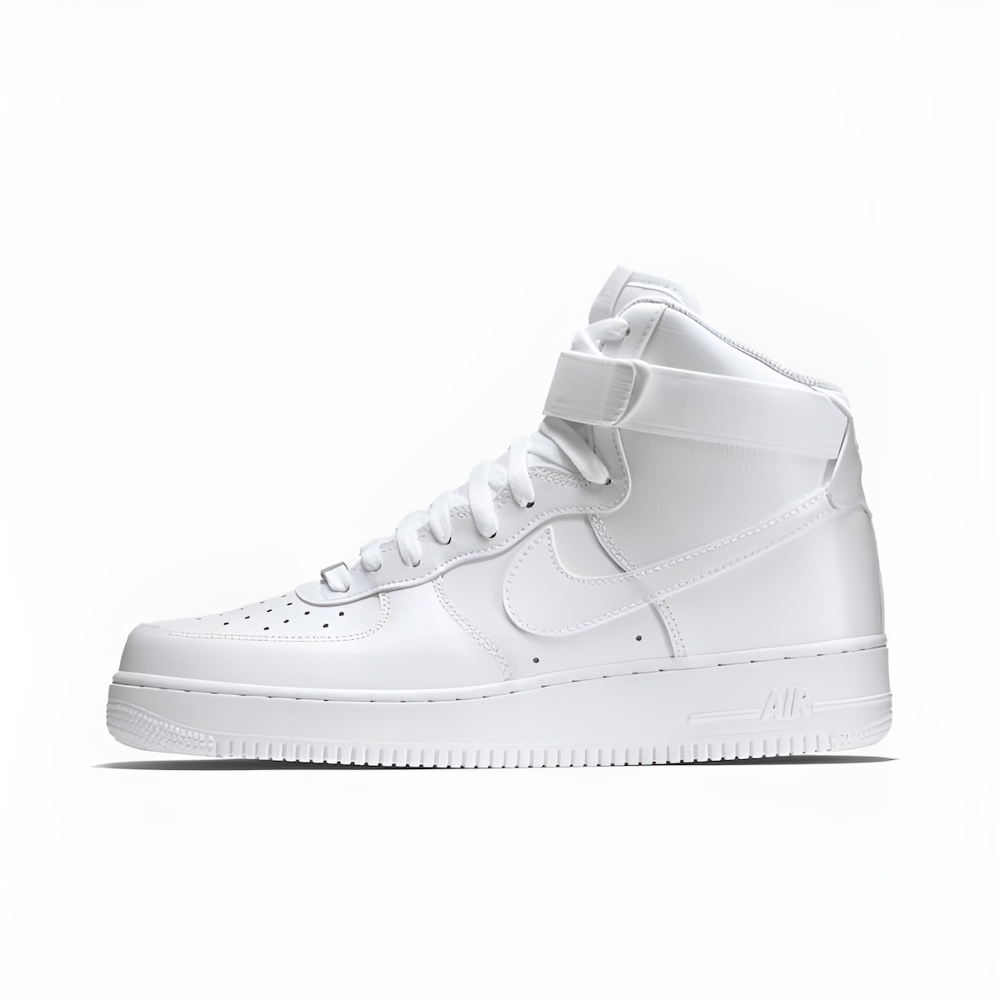
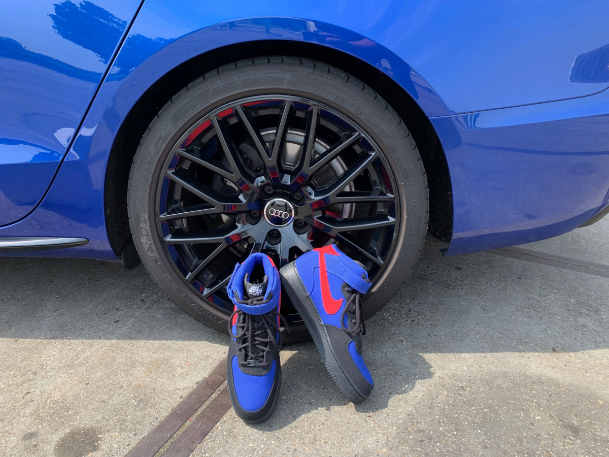

# Nike Air Force 1
In 1982 introduceerde [Nike](https://www.shoepalace.com/blogs/all/the-history-of-nike) hun eerste basketbalschoenen met de later zo succesvolle Nike Air-technologie.
De schoenen werden Nike Air Force genoemd als verwijzing naar het [Air Force One-vliegtuig](https://www.af.mil/About-Us/Fact-Sheets/Display/Article/104588/vc-25-air-force-one/) van de [POTUS](https://en.wikipedia.org/wiki/President_of_the_United_States).
Het model werd 2 jaar later stopgezet, maar in 1986 opnieuw uitgebracht als de Nike Air Force 1 en werd vooral populair in de [hiphopscene aan de oostkust](https://en.wikipedia.org/wiki/East_Coast_hip_hop) van de Verenigde Staten.
De Nike Air Force 1 is [nu meer dan 40 jaar oud](https://www.nike.com/air-force-1), geproduceerd in drie verschillende hoogtes en populair als altijd, vooral de "White-on-White" versie.

Het meest recente paar Nike Air Force 1 dat ik droeg, was een paar _Nike Air Force 1 High '07 LV8_ in volledig beige suède.
_LV8_ in de modelaanduiding slaat op "elevate" voor de iets verhoogde zolen in vergelijking met de reguliere '07-modellen.

# Nike Air Max 90
In 1987 werd een andere sneaker uitgebracht met een ander ontwerp, waarbij ook gebruik werd gemaakt van de [Nike Air-technologie](https://www.goat.com/editorial/nike-air-max-sneakers-history).
De derde editie van dit ontwerp, uitgebracht in 1990 en gedoopt Nike Air Max III. Vanaf 2000 werd deze schoen bekend als de [Nike Air Max 90](https://cultedge.com/history-nike-air-max-90/) en sindsdien heb ik verschillende zwart-op-zwarte schoenen gehad.

# NIKE BY YOU
Nu wilde ik een nieuw paar en koos ik voor _Nike Air Force 1 Mid '07_, de iets lagere schoenen zouden iets beter moeten zijn om auto mee te rijden.
Maar op zoek naar schoenen kwam ik het programma [_NIKE BY YOU_](https://www.nike.com/nl/en/w/mens-nike-by-you-shoes-6ealhznik1zy7ok) tegen.
Hier kun je je eigen sneakers ontwerpen, dat klonk leuk (en hey, ik was in de jaren tachtig de hele tijd sneakers aan het tekenen).

Na wat prutsen met de online editor; Ik besloot een eerbetoon te brengen aan mijn Sepang Blue gekleurde [Black Edition Audi](https://youtu.be/rCChHiiqUfY).
Toen een puur Zwart & _Old Royal Blue_-schema een beetje te saai bleek, werd de Nike-swoosh _Sport Red_ voor contrast in het uiteindelijke ontwerp.
De _Tip_ (voorkant) en _Foxing_ (hiel) zijn verschillend gekleurd om een beetje een 'raceschoenen'-gevoel te geven (maar wie zou er nu eigenlijk racen met basketbalschoenen?!).
Productie en levering duurden een paar weken waarin regelmatig leuke updates per e-mail werden ontvangen ... goed gedaan Nike!

En tot slot een paar kiekjes van de Nikes met de Sepang Blauwe 'Black Edition' Audi waarop ze geïnspireerd zijn.

