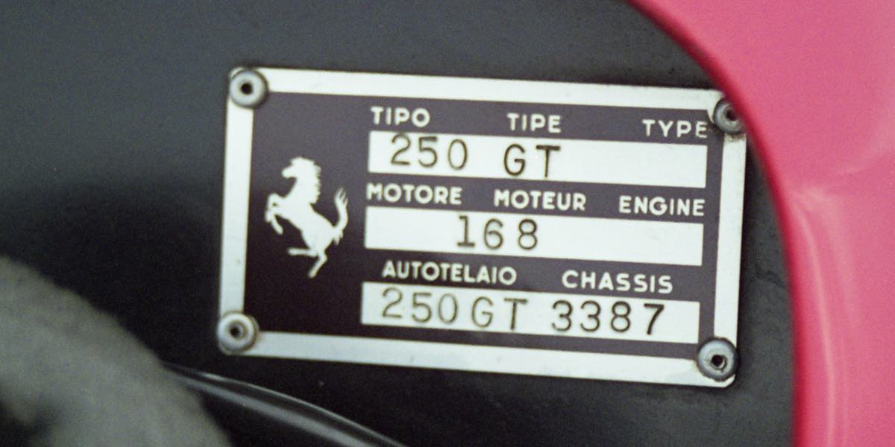
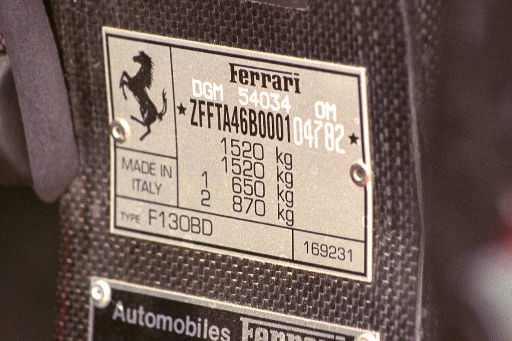
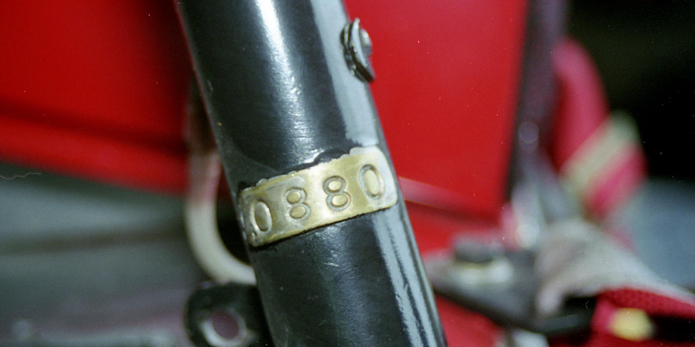
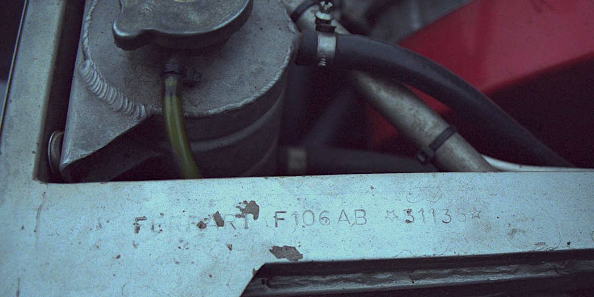
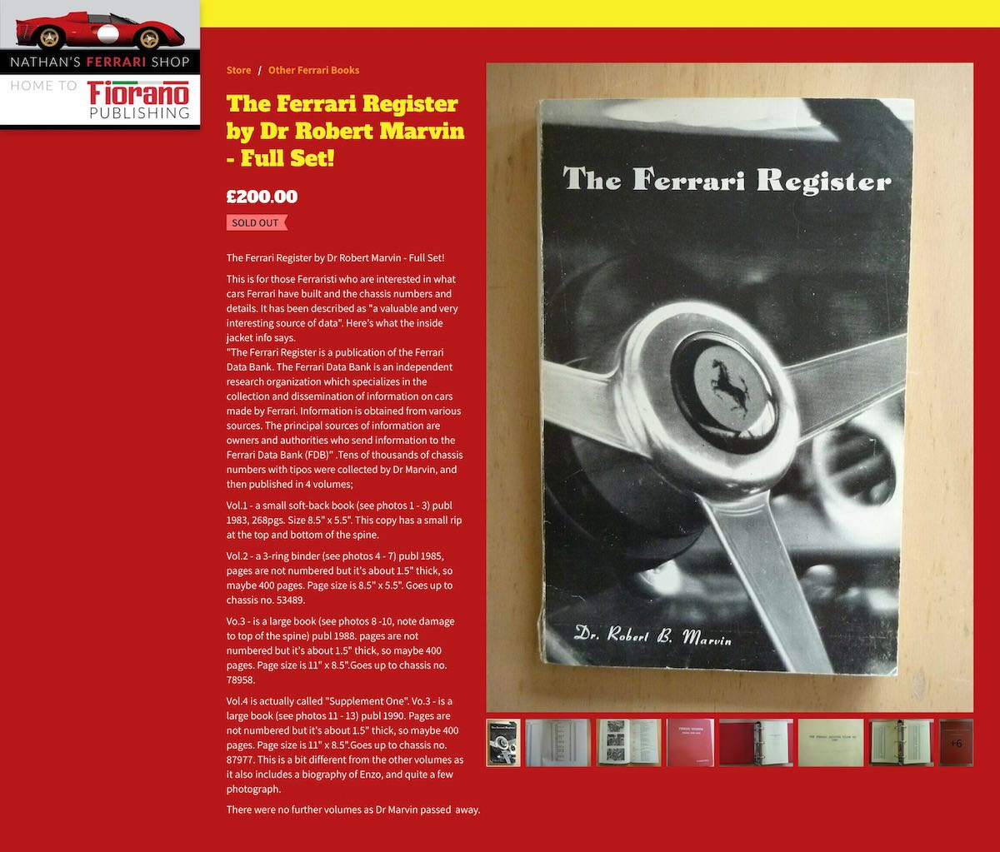
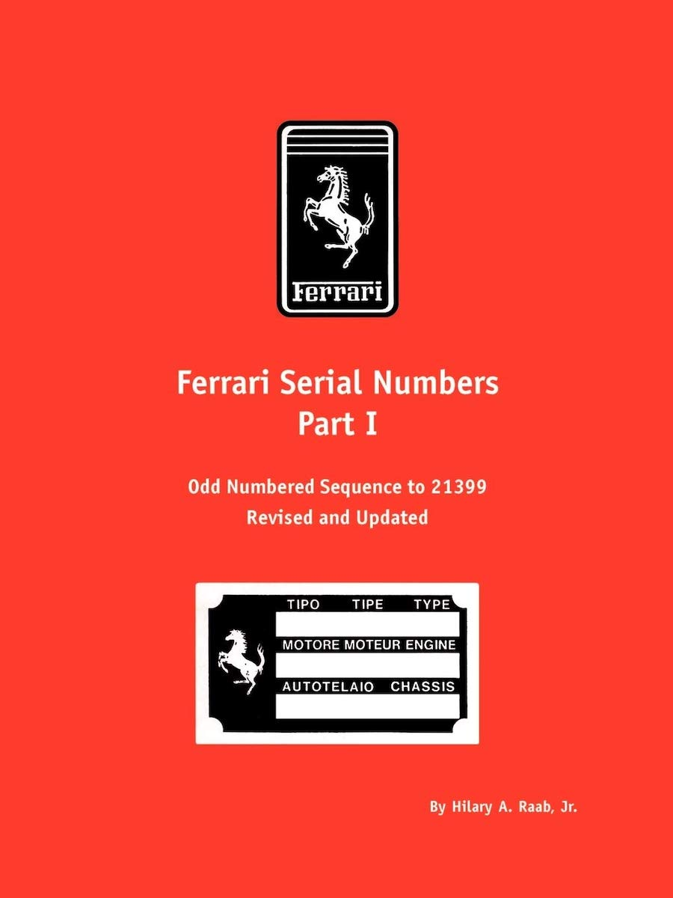
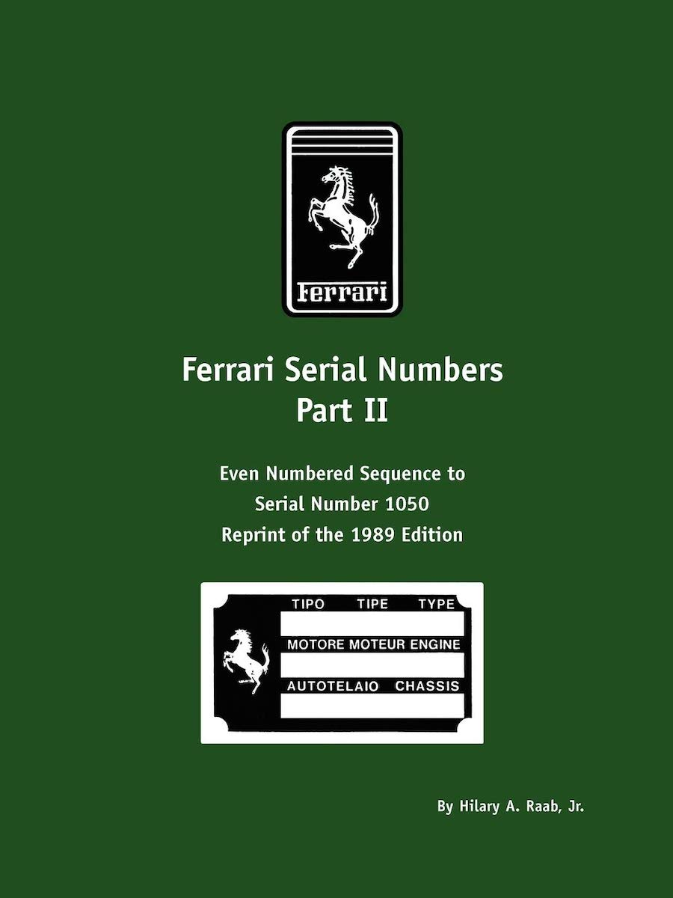
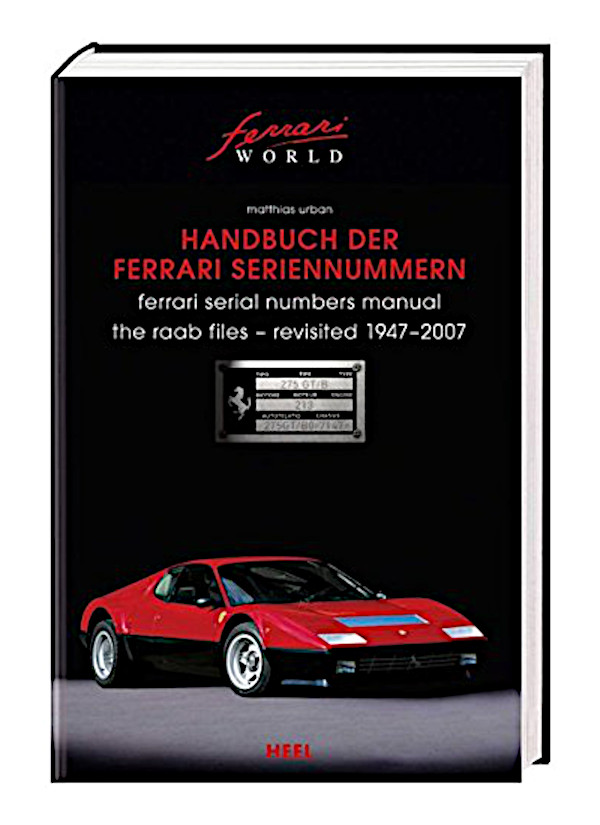

# Top 40
The first seeds must have been planted around 1983 when I was recording (like everyone else at that time) mix-tapes from radio-broadcasts with my beloved [Sharp RT-10 cassette-deck](https://www.cassettedeck.org/sharp/rt-10). Have the [TDK tape](http://vintagecassettes.com/tdk/tdk_files/tdk_type/tdk_sa.htm) standby on REC+PAUSE, skip the DJ talking over the intro and STOP recording at the very last moment. Every Friday afternoon there was a [Top 40 broadcast](https://en.wikipedia.org/wiki/Dutch_Top_40) and to be prepared for this we went by the local recordshop to pick up a printed copy of the Top 40. The printed copy were stored in a folder and browsing that folder you could see patterns, how a song moved up and down the charts over time. At some point in time the broadcast started to call listeners that had something that was called a “database”, a [collection of data on Top 40 hits](https://www.top40.nl) over a very long period of time, that could be searched and sorted and accumulated. That all was very fascinating to me, but I would take a couple of more years before I really learned about database technology, data collecting and [normalisation](https://en.wikipedia.org/wiki/Database_normalization) in my [education](https://nl.wikipedia.org/wiki/Ingenieur).

# Trainspotting
As early as the Victorian era at the end of the 19th century, people known as [“trainspotters”](https://en.wikipedia.org/wiki/Railfan#Trainspotting) were jotting down names and numbers of passing trains. The more people are collecting this information and combining their observations (or spots), the more complete the history of individual trains could be reconstructed. Half a century later, a similar scene of [“plane spotters”](https://www.planespotters.net) arose around the world. Personally, I was never into train- or plane-spotting, but the concept resonates with my early fascination with [databases](https://dbs.academy.lv/lection/dbs_LS02ENa_hist.pdf). Then in 1998, when I was properly educated and trained in database theories and database technologies, I was suddenly introduced to the world of “Ferrari spotters”.

# Ferrari Chassis Numbers
Most professionally produced machines will have something like a serial number, a way for the manufacturer to track individual products during production, for guarantee purposes of any other need to track individual products. Ferrari is no different. From the very early days each car leaving the factory has a serial number (well, in theory that is, there are stories of many structured, random and outright suspicious deviations). Transaxles, gearboxes and engines are numbered, but most important, the chassis of each car, or in Italian; _il telaio_ … is numbered. Nowadays most cars produced worldwide would need a standardised [Vehicle Identification Number](https://www.red-headed.com/vin.html).

By the end of the 90s I started photographing more-and-more Ferraris, collecting more-and-more books and became aware of these [Ferrari-chassis-spotters](https://ferraris-online.com/how-many-599-sa-apertas-2/). A bunch of dutch guys started such a group, that, thanks to their excellent networking skills, and the rise of the internet that enabled easy communication across the world, became an active an valuable for many years. The group called themselves _Telaio_ (after the Italian word for chassis) and it’s members ranged from prolific car dealers like [Michael Sheehan](https://ferraris-online.com) and the late Mark Ketcham, many acknowledged authors like [Marcel Massini](https://www.amazon.com/stores/Marcel-Massini/author/B00IVLPW58), Doug Nye and [Keith Bluemel](https://www.amazon.com/stores/Keith-Bluemel/author/B001H6J0XE) and parttime-enthousiasts like myself. While it was nothing like a secret group, one would not be able to join but needed to be invited based on their merits and/or the information that one would continually exchange with the group. To my great joy, at one point I was invited to join this group and exchange information. Telaio went from paper newsletter, to email-list, to online forum and boy did I enjoy that for many years.

# Books & Magazines
I’m quite sure anybody has seen some [generic book about Ferrari](https://www.deslegte.com/glans-en-glorie-van-ferrari-313538/) before. Hundreds and hundreds of books are published and will continue to be in the future. But by now I was no longer interested in hoarding general picture-books; like _“this model is a Testarossa famous from Miami Vice”_ or _“the F40 is the ultimate Ferrari”._ It made sense to have some sort of threshold for adding books to the collection. Now an avid collector of Ferrari chassis numbers that would (more or less) become my threshold; _only buy books that references Ferraris by their [chassis-number](https://dacorsa.com/publications/cavalleria/)._ Still a lousy limitation; since there are way more books passing this threshold at any moment in time than my funds or shelves can support. But hey, at least I can say I tried.

# Database & Registries
For the last 25 year I’ve been maintaining my database with Ferrari information, adding entries for all the chassis numbers I jotted down at events, adding information about the books I acquired and extracting information from those books and the internet etc. Interpolating some information and slowly adding cross-references between essentially events, books and cars. Never meant to be a complete register, but just adding my 2 cents and viewpoint in the world of Ferrari history.
Technically the database started in a standalone [Microsoft Access](https://en.wikipedia.org/wiki/Microsoft_Access) database went through an online period in [MySQL](https://www.mysql.com) and has been back as an offline database in [MariaDB](https://mariadb.org) for the better part of the last 10 years now. My personal Ferrari website, [dacorsa.com](https://dacorsa.com) (started as [dacorsa.net](https://dacorsa.net) in 1998) is rendered from snapshots of this database and published online at a very irregular basis. 

There are many other websites of (predominantly) guys that focus extensively on one particular model and quite a few of those guys I got to know in person or online. 
- [Ferrari 308 GTB registry](https://308gtb.de) by Robert Retzlaff
- [Ferrari 330 GT 2+2 registry](http://www.330gt.com) by Kerry Chesbro
- [Ferrari Testarossa registry](https://www.red-headed.com) by Edvar van Daalen 
- [Ferrari Register Nederland](https://www.ferrari-register.nl) by Marcel Wallenberg   
- [Ferrari Daytona Registry](http://www.ferrariregistry.net) by Paul Schwartz
- [Ferrari 250 GTE register](https://www.250gte.com) started by Len Miller
- There is even a [Ferrari F355 Registry](https://ferrari355registry.com) and likely more modern production registries I'm not aware of
- Then there is [Ferraris by Serial Number](http://www.barchetta.cc/All.Ferraris/ferrari.by.serial.number.summary/index.html) at Barchetta where many thousands of my images are too
- And last but not least [The Ferrari Market Letter](https://www.ferrarimarketletter.com) that was founded by Ferrari enthusiast and historian Gerald Roush. It is published 26 times a year and the publication began with the January 1976 issue, so they are getting close to their 50th year publication!

At the moment of writing (2023) my personal database has over 3.000 books or magazines and over 350.000 entries of cars (not solely Ferrari) in over 10.000 events. Not small at small list, but certainly not the biggest car database in the world. I’m just adding what events I attended, or cars I spotted, or whatever subject I like at one time or the other. 
While there are people striving for completeness of their registries; they are working essentially on a list of all Ferraris ever produced. I'm just freewheeling my hobbyist database however, while publishing snapshots of it on the internet every now and then.

## Chassisnumber books ?
The first noteworthy publication is [_The Ferrari Register_](https://www.nathansferrarishop.com/store/The-Ferrari-Register-by-Dr-Robert-Marvin-Full-Set-p175655468) by Dr. Robert B. Marvin, published by _The Ferrari Data Bank_. I happen to own a second edition book, that seems to be published in 1983 as an unbound, hand-published binder.
In 1989 preeminent Ferrari Historians Hilary A. Raab and Dyke Ridgley published _Ferrari Serial Numbers_ in softcover books. The [first part](http://www.velocepress.com/books/italian/18890.php) covers all of the odd-numbered Ferraris (normally reserved for the Ferrari street cars) to serial number 21399. A revised and updated edition of Raab's _Ferrari Serial Numbers Part I_ that covers all of the odd-numbered Ferraris (normally reserved for the Ferrari street cars) to serial number 21399. The [second part](http://www.velocepress.com/books/italian/18891.php) covers the even numbered chassis (normally reserved for the Ferrari racing cars) through serial number 1050.

## Matthias’ Book
In the 2007 [Matthias Urban](https://www.f-register.com/about-us/the-author) published his ‘Handbuch der Ferrari Serienummern” as a continuation of the work of Dr. Hillary Raab. Matthias, back then also a member of the Telaio group, asked the members for input for book of cours and I could give him a proper snapshot of my database at the time. I have confused more than a few family members or coworkers by first showing them the content (just shy of 1.000 page hardcover list of ferrari chassis numbers) to be continued with a proud glimpse of the attribution page were my name is mentioned among many big Ferrari history names. I'm very proud to have been a (albeit small probably) part of Matthias' effort, buy most normal people will completely loose faith in your sanity after this. Matthias continued and published 3 softcover supplements to the original book that are all out of print and [highly sought-after](https://www.amazon.de/Handbuch-Ferrari-Seriennummern-Numbers-1947-2007/dp/3898807118) nowadays. His [F-register](https://www.f-register.com) lives on online, is still actively extended with every newly produced car or newly discovered information.

