_Phototypesetting is a method of setting type which uses photography to make columns of type on a scroll of photographic paper. It has been made obsolete by the popularity of the personal computer and desktop publishing which gave rise to digital typesetting._

On this page a reasonable overview of the Berthold Fototype opto-mechnical typesetting machines from a brochure dated 1985, still in my archives and now uploaded to [Archive.org](https://archive.org/details/@edwin_dus).

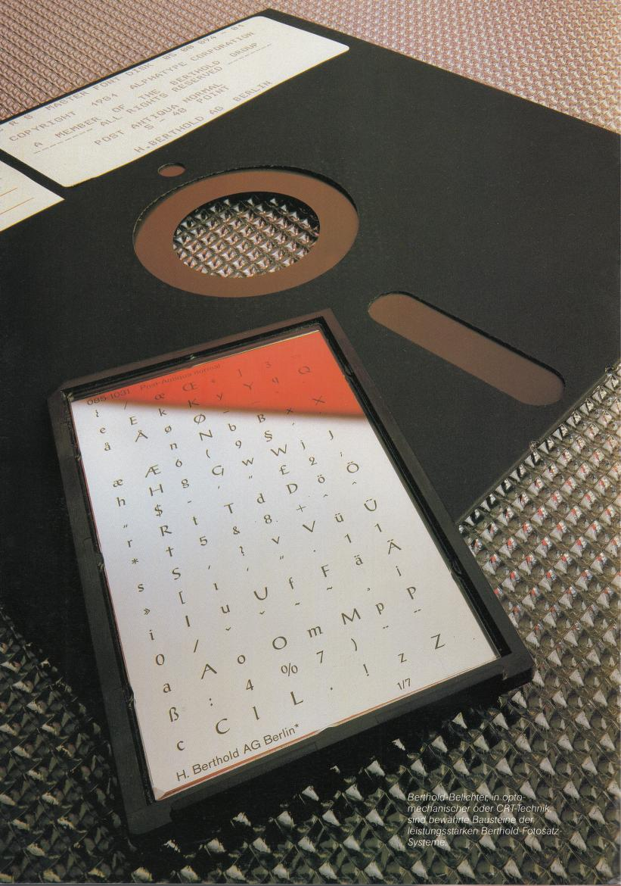

##### Berthold phototypesetting systems for all typesetting jobs and for companies of any size
Among the wide range of models Berthold offers, you will be able to find the phototypesetting system which corresponds exactly to the size and requirements of your firm.
Our products range from reasonably priced introductory models to customized systems for large-sized companies.

##### Berthold phototypesetting systems grow along with you
If the number of orders increases and your firm should grow, then Berthold systems can grow along with you and be expanded.
New systems with greater performance work smoothly with your present system.
Phototypesetting systems from Berthold are a secure investment for the future.

##### Berthold phototypesetting systems speak your language
Berthold phototypesetting systems are a great aid to the typesetter and are reliably adapted to fit his practical needs.
You don’t have to learn any abstract computer language to operate them.
Berthold phototypesetting systems speak the language of the typesetter - any one of 8 different languages can be selected.

##### Berthold means 125 years of experience in the field of phototypesetting
Berthold made a name for itself more than 125 years ago as a type foundry with the production of brass rules of a quality and precision unknown until then.
The technology has changed, but the claim to quality has remained.
You can convince yourself of this by examining the unsurpassed sharpness and quality of Berthold’s typefaces.

---
# &laquo;berthold gst 4000&raquo;
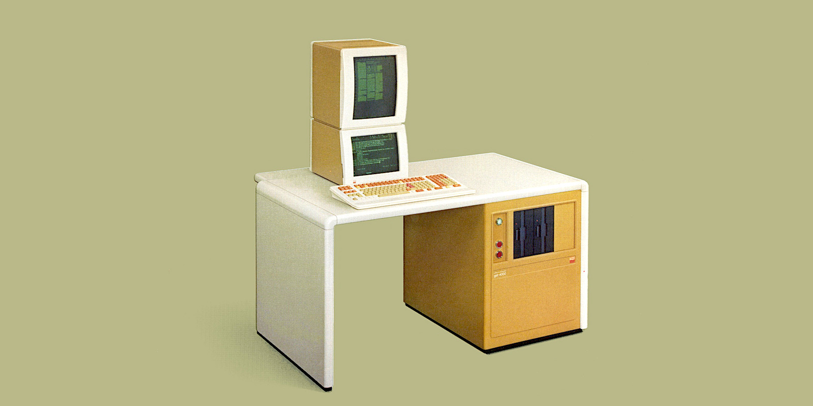

The _Graphic Setting Terminal_ offers a unique visual comfort by simultaneousIy displaying the setting job on the lower data monitor and its exact proportions on the upper instant display screen.
It can be used anywhere for all kinds of typesetting jobs, whether difficult job work or large output of pure text.
A particular advantage is: the instant display screen shows the exact proportions of the typesetting job and its typographic and formal arrangement before exposure.
Fast and easy correction. Numerous possibilities for page arrangement and make-up (area formatting).

Large sections of text can be stored in the intermediate memory.
Recurrent sections can be repeated or copied.
New functions for setting borders, underlining, filling in of areas, calculation.

The **&laquo;berthold gst 4000&raquo;** offers a multitude of functions which considerably simplify the entry of rules.
Any rules weight desired can be produced.
Automatic hyphenation programs with freely definable size of the final syllable.
Contour setting program, extensive kerning program, exception hyphenation dictionary, word processing program (options).   

- Up to 16 typefaces can be freely mixed
- Versions with 1 to 3 floppy disk drives are available   
- Can be connected to **&laquo;berthold dms 7000&raquo;**

---
# &laquo;berthold mft 4000&raquo;
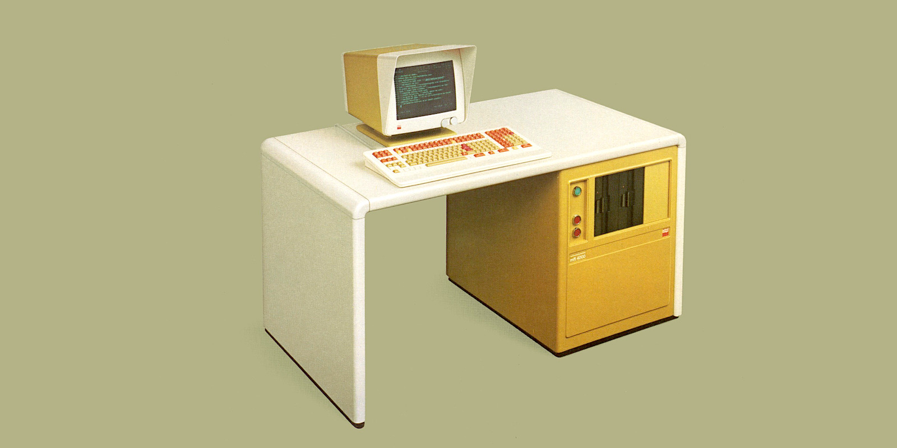

This _Multi Functional Terminal_ is suited for any kind of typesetting job.
A simple job can be completed rapidly and economically, but even the most difficult job can be produced quickly, flexibly and with ease.
The advantage: quick and easy correction.

Numerous possibilities for page arrangement and make-up (area formatting).

Extensive job sections can be stored in the intermediate memory.
Automatic setting of borders, calculating functions, automatic copying and repetition.

The **&laquo;berthold mft 4000&raquo;** offers a multitude of functions which considerably simplify the entry of rules.
Any rule weight desired can be produced.
Automatic hyphenation programs with freely definable size of the final syllable.
Contour setting program, extensive kerning program, exception hyphenation dictionary, word processing program (options).

- Up to 16 typefaces can be freely mixed
- Versions with 1 to 3 floppy disk drives are available
- Possible connection of the instant display screen **&laquo;berthold sbs 3001&raquo;**
- Can be connected to **&laquo;berthold dms 7000&raquo;**

---
# &laquo;berthold tps 6000&raquo;
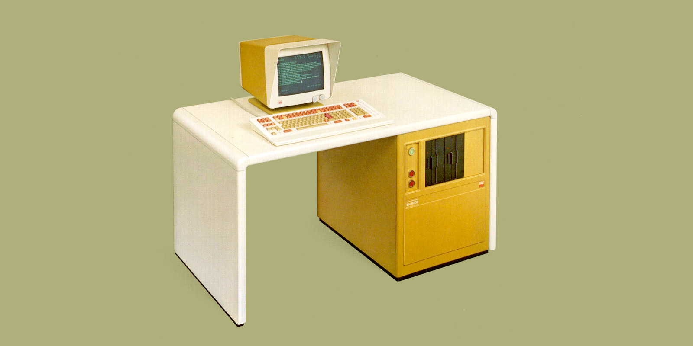

This _Text Production System_ is especially suited for typesetting jobs in which written texts predominate.

It offers: fast and easy correction of large amounts of text.
Numerous possibilities for page arrangement, make-up (area formatting).
Large-scale interim memory storage of sections of texts.
Particular ease of operation through numerous multicode functions.
Up to 16 typefaces can be freely mixed.
Input of point size in fractions of mm or didot points (capital height used as reference point).
Automatic hyphenation programs with freely definable size of the final syllable.

Extensive kerning program, exception hyphenation dictionary, word processing program (options).
Can be equipped with 1 to 3 floppy disk drives.
Possible connection for the instant display screen **&laquo;berthold sbs 3001&raquo;**.
Can be connected to **&laquo;berthold dms 7000&raquo;**.

---
# &laquo;berthold ads arabic 3000&raquo;
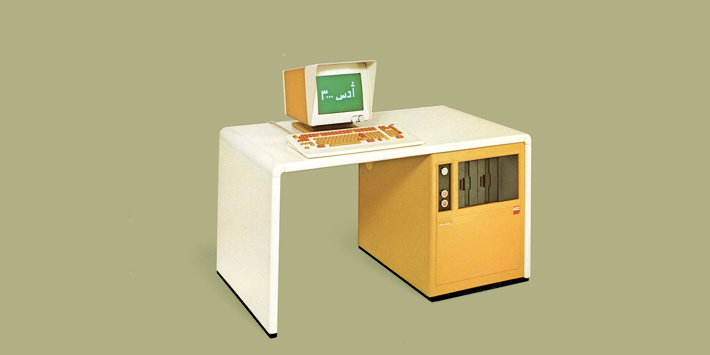

_Jobbing Dialogue System_ for the efficient compilation, arrangement and correction of Arabic texts.
Automatic conversion of characters, depending on context, when displayed on the monitor.

It is possible to switch over to compilation of a text using Latin letters while still retaining the zero position.
When compiling in Arabic, the characters are displayed continuously from right to left.
Automatic forming of lines by means of a Kashida automatic system.
The operator, however, can also select a semi-automatic or manual character formation.

Highest calligraphic typeface quality and multitude of characters, including characters for vocalization, ligatures, alternative and decorative forms for all Arabic language groups - distributed on 2 different type carriers.
If the decorative and special forms are not required, then only one font can be used.
Correspondingly, either 4 different Arabic or 8 Latin typefaces can be controlled in the photo units connected.

Possible connection of the instant display screen **&laquo;berthold sbs arabic&raquo;**.

---
# Berthold System 7000
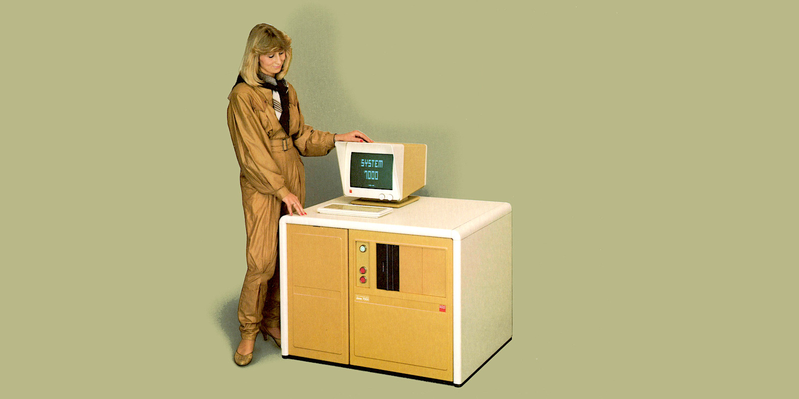

The **&laquo;system 7000&raquo;** is the modular system solution for typesetting professionals.
As the input end, 4 different keying units can be selected, at the output end, a wide range of opto-mechanical and digitally functioning photo units is available.

The heart of the complete system is the magnetic disk-orientated data management system **&laquo;berthold dms 7000&raquo;**.
One can individually determine which in- and output units are to be connected.
In this manner, system solutions tailored to the specific demand profile are possible.
The system is primarily conceived for those firms which mainly deal with business forms or area composition, as well as for tasks of text make-up, or any combination of such jobs.

---
# &laquo;berthold tps 7001s&raquo;
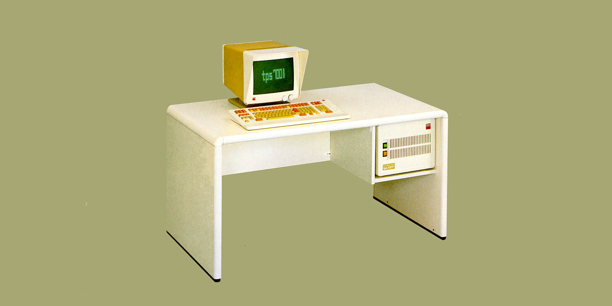

An intelligent online typesetting and editing terminal in the **&laquo;berthold system 7000&raquo;** which can be universally employed and which has a very high calculating speed.
The permanent online connection of the **&laquo;tps 70015&raquo;** to the main system **&laquo;berthold dms 7000&raquo;** allows direct access to all data stored on the hard disk of the **&laquo;dms 7000&raquo;**.

A standard comfortable software package is available for typesetting and editing work.
In addition to the standard software, various special application programs can be employed.

The computer of the instant display screen **&laquo;berthold sbs 70015&raquo;** can be subsequently built into the computer’s compact housing.

---
# Berthold &laquo;FOX&raquo; System
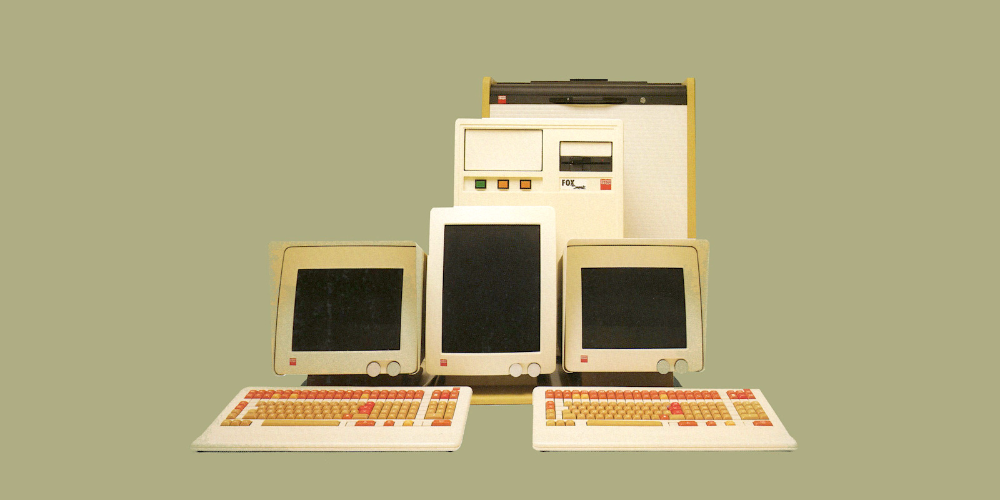

Berthold **&laquo;FOX&raquo;** is the alternative for jobs where emphasis is primarily on text.
It is conceived as a multi-computer integrated system.
Between one and four intelligent input stations with their own type-setting computers are connected with the output digital photo unit **&laquo;FOX 400&raquo;** via the I/O controller of the central unit **&laquo;FOX&raquo;**.

Decisive is: from the start, the central unit **&laquo;FOX&raquo;** is equipped with an integrated magnetic disk unit and data management software which is especially tailored to the possibilities offered by this rapid direct access memory.
This software allows all connected workplaces "immediate access" to all data and programs stored.   
The digital typefaces for the system's photo unit **&laquo;FOX 400&raquo;** are also stored on magnetic disk.
In this way, Berthold makes performance features possible for small companies which were previously only available in large systems.

---
# &laquo;berthold acs 2000&raquo;
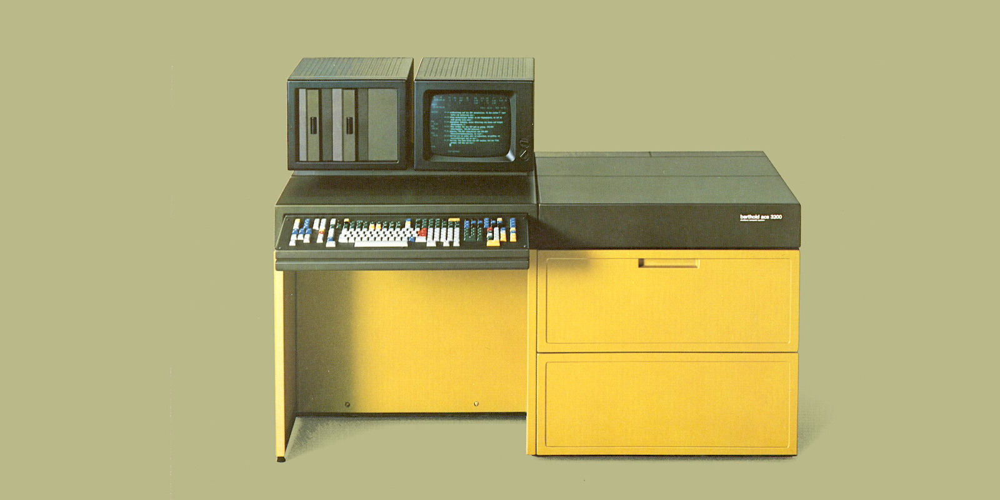

The unit with the greatest ease of operation among Berthold’s compact systems.
The innumerable possibilities of a highly developed jobbing system are combined here with the advantages of compact construction: input station and photo unit form one space-saving unit for all setting jobs.
Even for complicated setting of rules and for setting jobs in non-metric systems of measurement, e.g. for EDP forms.

- All 8 loadable typefaces can be freely mixed
- Inputs of point sizes in fractions of mm or in didot points (capital height used as reference points)
- Automatic hyphenation programs with freely definable size of the final syllable

Further possibilities for efficient use by means of (optional) special programs for specific typesetting jobs, e.q. setting of contours, word processing program, aesthetic program, exception hyphenation dictionary, make-up program for the instant display screen which can be connected, magnum program for point sizes up to 60 points.
High-performance photo unit even when typefaces and point sizes are changed often.
Standard equipment: multi-format cassette and optional: roll film cassette.

---
# &laquo;berthold tps 8000&laquo;
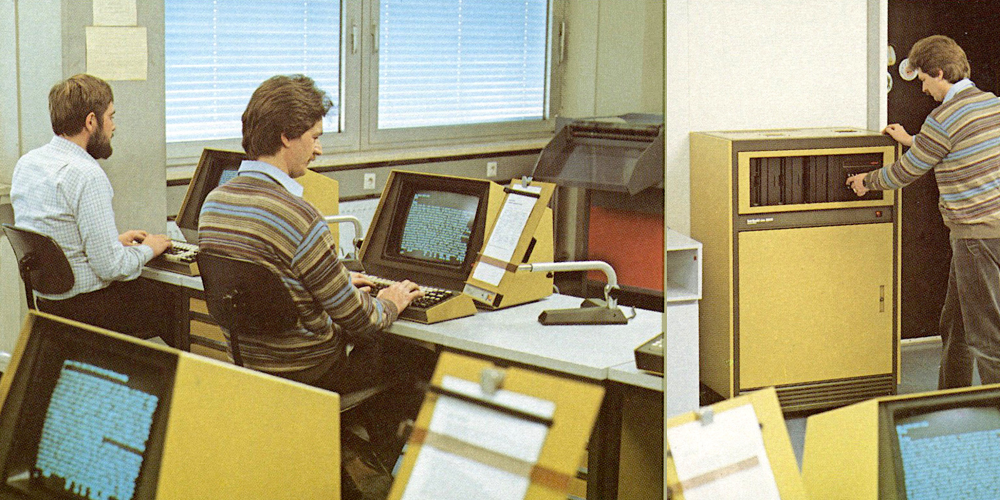

A multi-terminal _Text Production System_ with up to 10 intelligent, interactive workplaces.
The central computer (96 KB) works as manager of the data in the memory and controls the flow of data to the peripheral units.
Each of the 10 terminals has its own computer (32 KB) and direct access to the hard disk.
Hard disk drives with a memory capacity of 80 MB or 300 MB are available.
Two drives can be connected to each central unit.

The terminals operate interactively.
Each setter consequently receives immediate reports when setting or correcting.
Furthermore, he can scroll (up to 300 000 letters) as he wishes, forward and backward, within a job.
Two such systems can be interconnected to form a double system, if for example, more than 10 terminals or greater operating security is desired.

The large number of jobs which can be stored are arranged in tables of contents which can be easily surveyed.
Each terminal can permit the re-recording of the list of the tables of contents and the jobs stored under each table of contents.
The system regulates extensive statistics for each typesetting job, e.g. for typesetting and correction, film consumption, etc.
In addition to the terminals, many other peripheral units are available: CRT photo unit, print wheel or needle printer, punch tape, peripheral unit, magnetic tape drive.

---
# &laquo;berthold sbs&raquo;
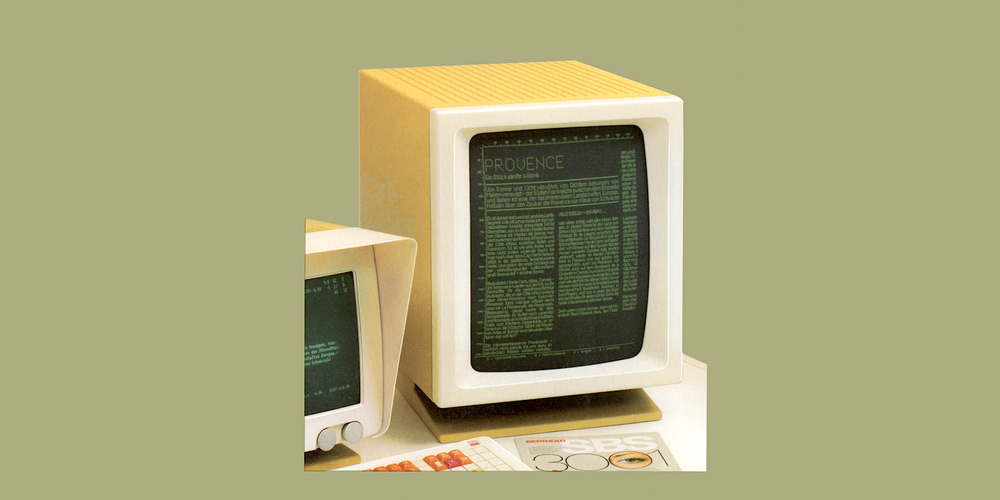

 
The _instant display screens_ which may be delivered as a complement to Berthold input units (not for **&laquo;tps 8000&raquo;**) represent a valuable work aid.
They immediately show - during typesetting - the structural arrangement of the setting image.
The finished product may thus be judged, the position of the text, as well as lengths and weights of rules may be checked and corrected where-ever necessary.
The results of corrections are likewise immediately displayed.

---
# &laquo;berthold apu 6016&raquo;
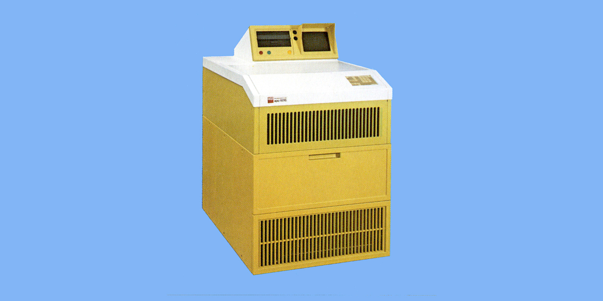

Opto-mechanical, high-performance precision photo unit for all phototypesetting jobs.
- Operates both off-line and on-line
- 16 typefaces can be freely mixed, integrated light dot element for drawing rules
- Sheet film cassette and/or roll film cassette 325 x 325mm  
- Type sizes: 1.32 - 15.89mm (5 - 60p), capital height used as reference point

---
# &laquo;berthold tpu 3608&raquo;
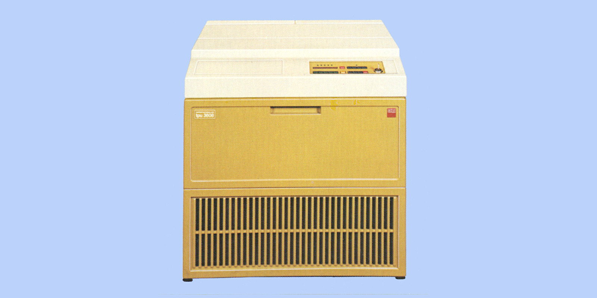

High-speed precision photo unit with great output performance even for most complex jobs.
- 8 typefaces may be freely mixed
- Type sizes: 1.32 - 9.55mm (5 - 36p)
- Type sizes: 9.56 - 15.90mm (37 - 60p); with Magnum disk and special program
- Sheet film cassette (standard): 300 x 300mm
- Roll film cassette (option): 210 x 300mm
- Photo unit suitable for **&laquo;berthold ads arabic 3000&raquo;**

---
# &laquo;berthold crs 6911&raquo;
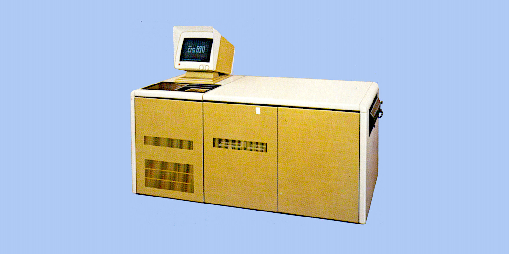

Digital roll film photo unit with full page output, operates online.
- Winchester disk for storage of 100 typefaces
- Step-by-step expansion to 200, 400 and 800 typefaces by upgrading
- Type sizes: 1.32 - 11.93mm (5 - 45p)
- Horizontal and vertical rules may be exposed in 24 different rule weights
- Exposure format: max. 335 x 500mm

---
# &laquo;berthold crs 8901&raquo;
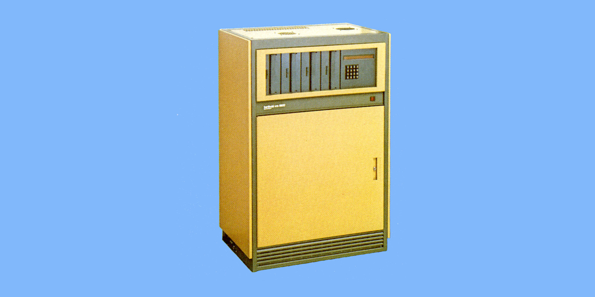

Digital quality photo unit for the system **&laquo;berthold tps 8000&raquo;**.
- Online or offline operation
- Type sizes: 1.32 - 11.93mm (5 - 45p)
- Material format: roll material width 100 - 400mm, length up to 60m

>&copy; Images are copyright of H. Berthold A.G.   