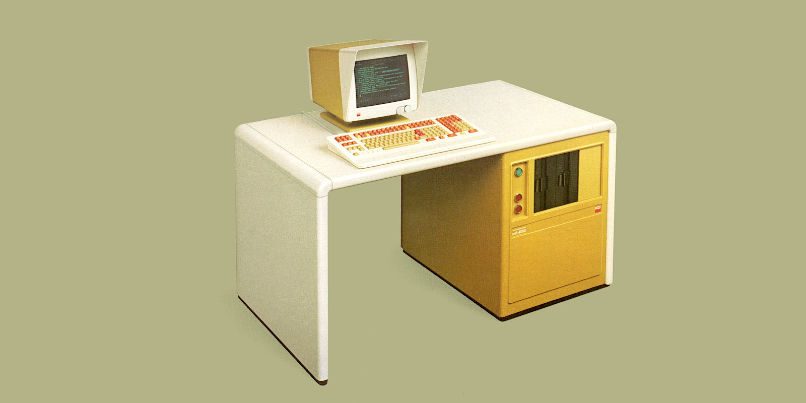
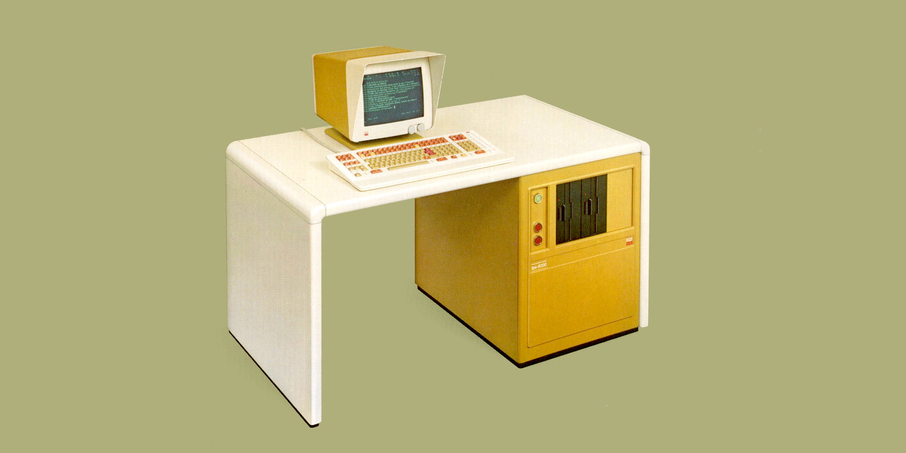
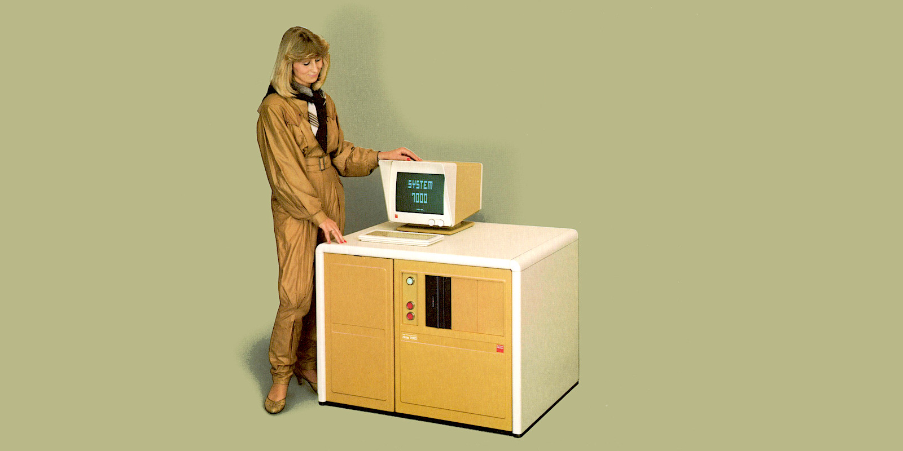
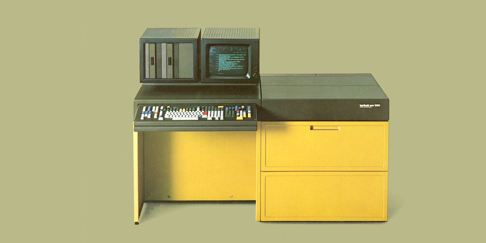
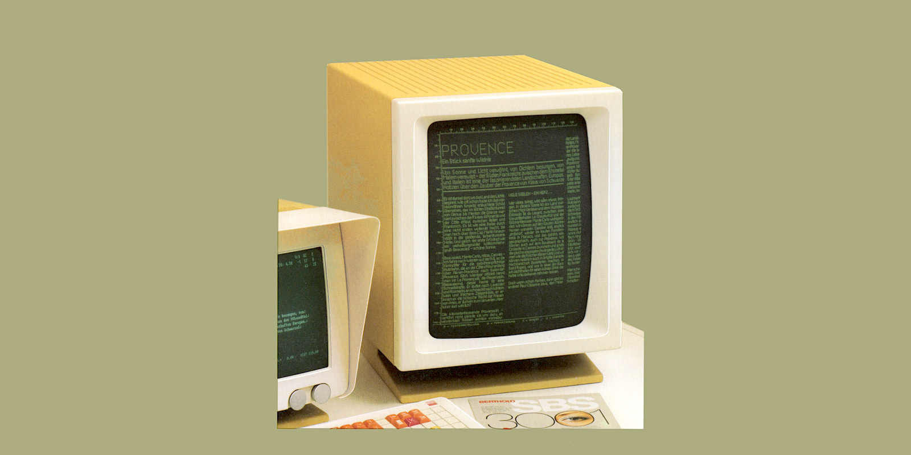
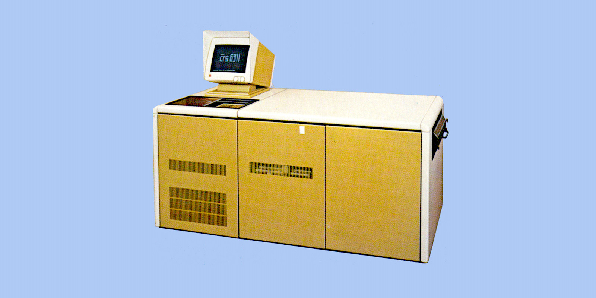
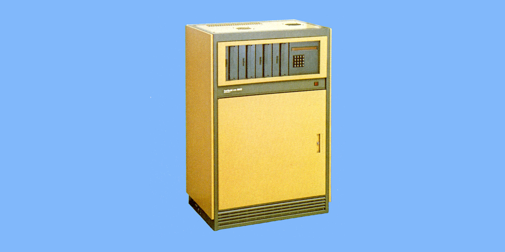

_Fotozetwerk is een methode voor het instellen van lettertypen waarbij fotografie wordt gebruikt om kolommen met letters op een rol fotografisch papier te maken.
Het is achterhaald door de populariteit van de personal computer en desktop publishing, die aanleiding gaven tot digitaal zetwerk._

Op deze pagina een redelijk overzicht van de Berthold Fototype opto-mechnische zetmachines aan de hand van een folder uit 1985 nog in mijn archief en nu toegevoegd aan [Archive.org](https://archive.org/details/@edwin_dus).

##### Berthold fotozetsystemen voor alle zetwerk en voor bedrijven van elke omvang
Onder de ruime keuze aan modellen die Berthold aanbiedt, vindt u zeker het fotozetsysteem dat precies aansluit bij de omvang en eisen van uw bedrijf.
Onze producten variëren van voordelig geprijsde introductiemodellen tot maatwerksystemen voor grote bedrijven.

##### De fotozetsystemen van Berthold groeien met u mee
Als het aantal orders toeneemt en uw bedrijf moet groeien, dan kunnen de systemen van Berthold met u meegroeien en worden uitgebreid.
Nieuwe systemen met betere prestaties werken soepel met uw huidige systeem.
Fotozetsystemen van Berthold zijn een veilige investering voor de toekomst.

##### De fotozetsystemen van Berthold spreken uw taal
De fotozetsystemen van Berthold zijn een grote hulp voor de zetter en worden op betrouwbare wijze aangepast aan zijn praktische behoeften.
U hoeft geen abstracte computertaal te leren om ze te bedienen.
De fotozetsystemen van Berthold spreken de taal van de zetter: er kan uit 8 verschillende talen worden gekozen.

##### Berthold betekent 125 jaar ervaring op het gebied van fotozetwerk
Berthold maakte ruim 125 jaar geleden naam als lettergieterij met de productie van koperen linialen van een tot dan toe ongekende kwaliteit en precisie.
De technologie is veranderd, maar de claim op kwaliteit is gebleven.
U kunt uzelf hiervan overtuigen door de onovertroffen scherpte en kwaliteit van Bertholds lettertypen te onderzoeken.

---
# &laquo;berthold gst 4000&raquo;

De _Graphic Setting Terminal_ biedt een uniek visueel comfort door gelijktijdig de instelopdracht weer te geven op de onderste gegevensmonitor en de exacte verhoudingen ervan op het bovenste instant display-scherm.
Het kan overal worden gebruikt voor allerlei soorten zetwerk, of het nu gaat om moeilijk werk of grote hoeveelheden pure tekst.
Een bijzonder voordeel is dat het instant-display-scherm vóór de belichting de exacte verhoudingen van de zetopdracht en de typografische en formele indeling ervan weergeeft.
Snelle en gemakkelijke correctie. Talrijke mogelijkheden voor pagina-indeling en opmaak (vlakopmaak).

In het tussengeheugen kunnen grote stukken tekst worden opgeslagen.
Terugkerende secties kunnen worden herhaald of gekopieerd.
Nieuwe functies voor het instellen van randen, onderstrepen, invullen van vlakken, berekenen.

De **&laquo;berthold gst 4000&raquo;** biedt een veelheid aan functies die de invoer van regels aanzienlijk vereenvoudigen.
Elk gewenst regel-gewicht kan worden geproduceerd.
Automatische woordafbrekingsprogramma's met vrij definieerbare grootte van de laatste lettergreep.
Contourinstellingsprogramma, uitgebreid kerningprogramma, woordenboek voor uitzonderingsafbreking, tekstverwerkingsprogramma (opties).

- Maximaal 16 lettertypen kunnen vrij worden gemengd
- Er zijn versies met 1 tot 3 diskdrives beschikbaar
- Kan worden aangesloten op **&laquo;berthold dms 7000&raquo;**

---
# &laquo;berthold mft 4000&raquo;

Deze _Multi Functionele Terminal_ is geschikt voor elk type zetwerk.
Een eenvoudige klus kan snel en voordelig worden uitgevoerd, maar zelfs de moeilijkste klus kan snel, flexibel en gemakkelijk worden uitgevoerd.
Het voordeel: snelle en eenvoudige correctie.

Talrijke mogelijkheden voor pagina-indeling en opmaak (vlak opmaak).

In het tussengeheugen kunnen omvangrijke taak secties worden opgeslagen.
Automatische instelling van randen, rekenfuncties, automatisch kopiëren en herhalen.

De **&laquo;berthold mft 4000&raquo;** biedt een veelheid aan functies die de invoer van regels aanzienlijk vereenvoudigen.
Elk gewenst regel-gewicht kan worden geproduceerd.
Automatische woordafbrekingsprogramma's met vrij definieerbare grootte van de laatste lettergreep.
Contourinstellingsprogramma, uitgebreid kerningprogramma, woordenboek voor uitzonderingsafbreking, tekstverwerkingsprogramma (opties).

- Maximaal 16 lettertypen kunnen vrij worden gemengd
- Er zijn versies met 1 tot 3 diskdrives beschikbaar
- Mogelijke aansluiting van het instant display-scherm **&laquo;berthold sbs 3001&raquo;**
- Kan worden aangesloten op **&laquo;berthold dms 7000&raquo;**

---
# &laquo;berthold tps 6000&raquo;

Dit _Tekst Productie Systeem_ is vooral geschikt voor zetwerk waarin geschreven teksten de boventoon voeren.

Het biedt: snelle en eenvoudige correctie van grote hoeveelheden tekst.
Talrijke mogelijkheden voor pagina-indeling, opmaak (vlakopmaak).
Grootschalige tussentijdse geheugenopslag van tekstgedeelten.
Bijzonder bedieningsgemak door talrijke multicode-functies.
Er kunnen maximaal 16 lettertypen vrij worden gemengd.
Invoer van puntgrootte in fracties van mm of didot-punten (hoofdletterhoogte gebruikt als referentiepunt).
Automatische woordafbrekingsprogramma's met vrij definieerbare grootte van de laatste lettergreep.

Uitgebreid kerning-programma, woordenboek voor uitzonderingsafbreking, tekstverwerkingsprogramma (opties).
Kan worden uitgerust met 1 tot 3 diskdrives.
Mogelijke aansluiting voor het instant display-scherm **&laquo;berthold sbs 3001&raquo;**.
Kan worden aangesloten op **&laquo;berthold dms 7000&raquo;**.

---
# &laquo;berthold ads arabic 3000&raquo;

_Jobbing Dialogue System_ voor het efficiënt samenstellen, ordenen en corrigeren van Arabische teksten.
Automatische conversie van tekens, afhankelijk van de context, wanneer ze op de monitor worden weergegeven.

Het is mogelijk om over te schakelen naar het samenstellen van een tekst met behulp van Latijnse letters, terwijl de nulpositie behouden blijft.
Bij het compileren in het Arabisch worden de tekens continu van rechts naar links weergegeven.
Automatische lijnvorming door middel van een Kashida automatisch systeem.
De operator kan echter ook kiezen voor een semi-automatische of handmatige karaktervorming.

Hoogste kalligrafische lettertype-kwaliteit en veelheid aan karakters, inclusief karakters voor vocalisatie, ligaturen, alternatieve en decoratieve vormen voor alle Arabische taalgroepen - verdeeld over 2 verschillende typedragers.
Als de decoratieve en speciale vormen niet vereist zijn, kan slechts één lettertype worden gebruikt.
Dienovereenkomstig kunnen in de aangesloten foto-units 4 verschillende Arabische of 8 Latijnse lettertypen worden aangestuurd.

Mogelijke aansluiting van het instant display-scherm **&laquo;berthold sbs arabic&raquo;**.

---
# Berthold System 7000

Het **&laquo;systeem 7000&raquo;** is de modulaire systeemoplossing voor zet-professionals.
Als invoerzijde kunnen 4 verschillende sleuteleenheden worden geselecteerd, aan de uitvoerzijde is een breed scala aan opto-mechanische en digitaal functionerende foto-eenheden beschikbaar.

Het hart van het complete systeem is het magnetische schijf georiënteerde gegevensbeheersysteem **&laquo;berthold dms 7000&raquo;**.
Men kan individueel bepalen welke in- en uitgangsunits aangesloten moeten worden.
Op deze manier zijn systeemoplossingen die zijn afgestemd op het specifieke vraagprofiel mogelijk.
Het systeem is in de eerste plaats bedoeld voor bedrijven die zich voornamelijk bezighouden met bedrijfsvormen of gebied-samenstelling, maar ook voor taken op het gebied van tekstopmaak of een combinatie van dergelijke banen.

---
# &laquo;berthold tps 7001s&raquo;

Een intelligente online zet- en redactie-terminal in het **&laquo;berthold systeem 7000&raquo;** die universeel inzetbaar is en een zeer hoge rekensnelheid heeft.
De permanente online verbinding van de **&laquo;tps 70015&raquo;** met het hoofdsysteem **&laquo;berthold dms 7000&raquo;** biedt directe toegang tot alle gegevens die zijn opgeslagen op de harde schijf van de **&laquo;dms 7000&raquo;* *.

Voor het zet- en redactiewerk is standaard een comfortabel softwarepakket beschikbaar.
Naast de standaardsoftware kunnen diverse speciale applicatieprogramma's worden gebruikt.

De computer van het Instant Display-scherm **&laquo;berthold sbs 70015&raquo;** kan vervolgens in de compacte behuizing van de computer worden ingebouwd.

---
# Berthold &laquo;FOX&raquo; System

Berthold **&laquo;FOX&raquo;** is het alternatief voor banen waarbij de nadruk vooral op tekst ligt.
Het is ontworpen als een geïntegreerd systeem met meerdere computers.
Tussen één en vier intelligente invoerstations met hun eigen zet-computers zijn via de I/O-controller van de centrale eenheid **&laquo;FOX&raquo;** verbonden met de digitale uitvoerfoto-eenheid **&laquo;FOX 400&raquo;**.

Doorslaggevend is: de centrale eenheid **&laquo;FOX&raquo;** is vanaf het begin uitgerust met een geïntegreerde magnetische schijfeenheid en datamanagementsoftware die speciaal is afgestemd op de mogelijkheden die dit snelle direct access-geheugen biedt.
Met deze software hebben alle aangesloten werkplekken "directe toegang" tot alle opgeslagen gegevens en programma's.
De digitale lettertypen voor de foto-unit **&laquo;FOX 400&raquo;** van het systeem zijn ook op een magnetische schijf opgeslagen.
Op deze manier maakt Berthold prestatiekenmerken mogelijk voor kleine bedrijven die voorheen alleen beschikbaar waren in grote systemen.

---
# &laquo;berthold acs 2000&raquo;

De unit met het grootste bedieningsgemak onder de compacte systemen van Berthold.
De talloze mogelijkheden van een hoogontwikkeld jobbing-systeem worden hier gecombineerd met de voordelen van een compacte constructie: invoerstation en foto-unit vormen één ruimtebesparende eenheid voor alle instelklussen.
Zelfs voor ingewikkelde regels en voor het instellen van taken in niet-metrische meetsystemen, b.v. voor EDP-formulieren.

- Alle 8 laadbare lettertypen kunnen vrij worden gemengd
- Invoer van puntgroottes in fracties van mm of in didot-punten (hoofdletterhoogte gebruikt als referentiepunten)
- Automatische woordafbreking-programma's met vrij definieerbare grootte van de laatste lettergreep

Verdere mogelijkheden voor efficiënt gebruik door middel van (optioneel) speciale programma's voor specifieke zet opdrachten, b.v. instellen van contouren, tekstverwerkingsprogramma, esthetisch programma, woordenboek voor uitzonderingsafbreking, opmaakprogramma voor het direct aan te sluiten scherm, magnumprogramma voor puntgroottes tot 60 punten.
Hoogwaardige foto-unit, zelfs wanneer lettertypen en puntgroottes vaak worden gewijzigd.
Standaarduitrusting: multi-formaat cassette en optioneel: rolfilm-cassette.

---
# &laquo;berthold tps 8000&laquo;

Een multi-terminal _Text Production System_ met maximaal 10 intelligente, interactieve werkplekken.
De centrale computer (96 KB) fungeert als beheerder van de gegevens in het geheugen en regelt de gegevensstroom naar de randeenheden.
Elk van de 10 terminals heeft een eigen computer (32 KB) en directe toegang tot de harde schijf.
Er zijn harde schijven met een geheugencapaciteit van 80 MB of 300 MB verkrijgbaar.
Op elke centrale eenheid kunnen twee aandrijvingen worden aangesloten.

De terminals werken interactief.
Iedere zetter krijgt hierdoor direct een melding bij het afstellen of corrigeren.
Bovendien kan hij binnen een taak naar wens vooruit en achteruit scrollen (tot 300.000 letters).
Twee van dergelijke systemen kunnen met elkaar worden verbonden om een dubbel systeem te vormen, als bijvoorbeeld meer dan 10 terminals of een grotere bedrijfszekerheid gewenst zijn.

Het grote aantal taken dat kan worden opgeslagen, is gerangschikt in inhoudsopgaven die gemakkelijk te raadplegen zijn.
Elke terminal kan het opnieuw opnemen toestaan van de lijst met inhoudsopgaven en de taken die onder elke inhoudsopgave zijn opgeslagen.
Het systeem regelt uitgebreide statistieken voor elke zetopdracht, b.v. voor zetwerk en correctie, filmconsumptie, etc.
Naast de terminals zijn er nog vele andere randapparatuur beschikbaar: CRT-foto-eenheid, printwiel- of naaldprinter, ponsband, randeenheid, magneetbandaandrijving.

---
# &laquo;berthold sbs&raquo;

De _instant display-schermen_ die kunnen worden geleverd als aanvulling op Berthold-invoereenheden (niet voor **&laquo;tps 8000&raquo;**) vormen een waardevol werkhulpmiddel.
Ze laten tijdens het zetten meteen de structurele opstelling van het zet beeld zien.
Zo kan het eindproduct worden beoordeeld, kan de positie van de tekst, evenals de lengte en het gewicht van regels worden gecontroleerd en waar nodig gecorrigeerd.
De resultaten van correcties worden eveneens onmiddellijk weergegeven.

---
# &laquo;berthold apu 6016&raquo;

Opto-mechanische, hoogwaardige precisie foto-eenheid voor alle fotozet-werkzaamheden.
- Werkt zowel offline als online
- 16 lettertypen vrij mengbaar, geïntegreerd lichtpunt-element voor tekenregels
- Vellen-filmcassette en/of rolfilm-cassette 325 x 325 mm
- Lettergroottes: 1.32 - 15.89 mm (5 - 60p), kapitaalhoogte gebruikt als referentiepunt

---
# &laquo;berthold tpu 3608&raquo;

Snelle, nauwkeurige foto-eenheid met uitstekende uitvoerprestaties, zelfs voor de meest complexe opdrachten.
- 8 lettertypen mogen vrij gemengd worden
- Type grootte: 1.32 - 9.55 mm (5 - 36p)
- Type grootte: 9.56 - 15.90 mm (37 - 60p); met Magnum-schijf en speciaal programma
- Vellen-filmcassette (standaard): 300 x 300 mm
- Rolfilm-cassette (optie): 210 x 300 mm
- Foto-unit geschikt voor **&laquo;berthold advertenties arabisch 3000&raquo;**

---
# &laquo;berthold crs 6911&raquo;

Digitale rolfilm foto-unit met volledige pagina-uitvoer, werkt online.
- Winchester-schijf voor opslag van 100 lettertypen
- Stapsgewijze uitbreiding naar 200, 400 en 800 lettertypen door te upgraden
- Type grootte: 1.32 - 11.93 mm (5 - 45p)
- Horizontale en verticale regels kunnen in 24 verschillende regelgewichten worden weergegeven
- Belichtingsformaat: max. 335 x 500 mm

---
# &laquo;berthold crs 8901&raquo;

Foto-unit van digitale kwaliteit voor het systeem **&laquo;berthold tps 8000&raquo;**.
- Online of offline werking
- Type grootte: 1.32 - 11.93 mm (5 - 45p)
- Rolbreedte 100 - 400 mm, lengte tot 60 m

>&copy; Op de afbeeldingen rust het copyright van H. Berthold A.G.