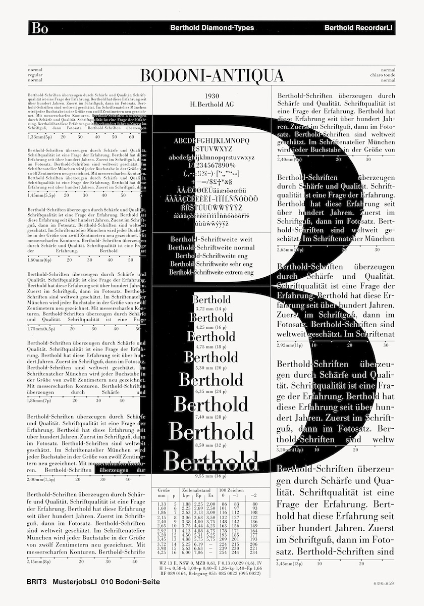
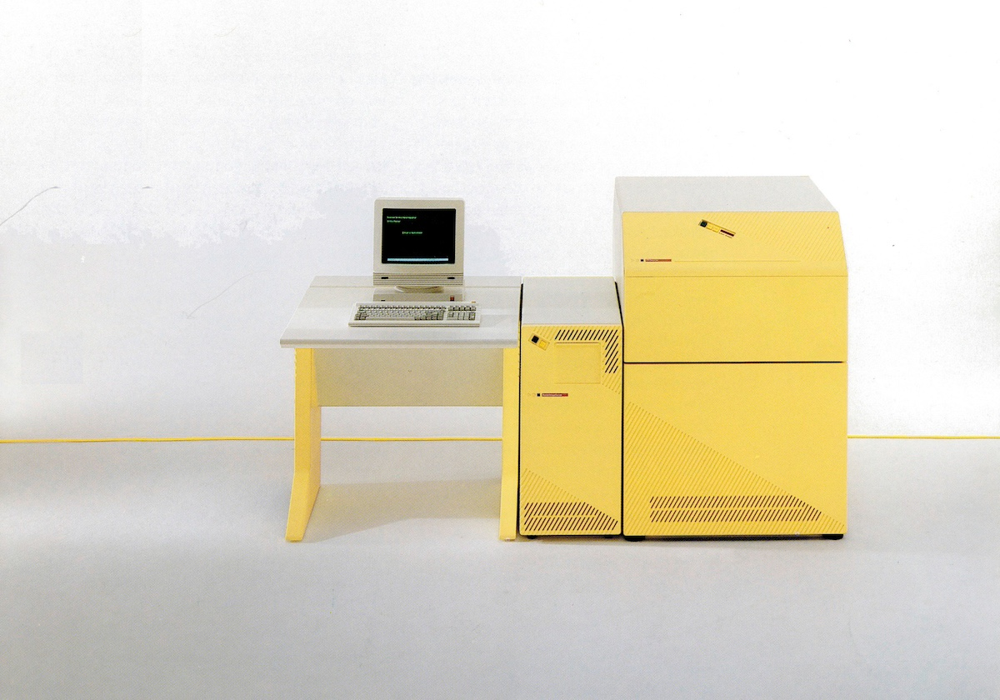

_Photo-typesetting is a method of setting type which uses photography to make columns of type on a scroll of photographic paper.  
It has been made obsolete by the popularity of the personal computer and desktop publishing which gave rise to digital typesetting._

### Berthold M Series

### Berthold Textstation

The Berthold**Textstation** is a workplace for creating text pages and complex typesetting, with text and line elements.
Because Berthold**Textstation** works with ProfiPage, Berthold's new universal typesetting program makes typesetting faster and easier.

### Berthold EasyScanner

The Berthold**EasyScanner** digitizes halftone and line images; which are later placed in the corresponding typesetting on the Berthold**Workstation**.
Linked to a photo typesetter from Berthold, you can then illuminate the entire page with texts, photos, logos, line and raster elements.

### Berthold HRScanner

The Berthold**HRScanner** is a flatbed scanner with a high resolution for black and white display.
This scanner can be used for the digitization of both halftone and line images.
This is possible due to the resolving power of 1 to 100 lines per millimeter.
The machine is equipped with CCD technology that controls the color and tonal value, regardless of the format.

### Berthold Laserstation

The Berthold**Laserstation**, Berthold's laser imager, not only increases productivity, but also makes new typesetting achievements possible.
The Laser Station consists of a Berthold**RasterServer** (RIP and PC) and a Berthold**LaserRecorder**.

### Berthold RecorderLI

The Berthold**RecorderLI** is a laser recorder system that can illuminate entire pages, including texts, photos, logos, line and raster elements.
With the recorder, complete films with line and halftone images can be produced quickly and efficiently.

### Berthold RecorderCI

The Berthold**RecorderCI** meets the highest possible quality standards with a resolution of 140 lines/mm.
The high quality and speed of this CRT recorder enables exposure of entire pages including texts, photos, logos, line and raster elements with very high quality.

### Berthold SofhaRIP

The Berthold**SofhaRIP** is a Raster Image Processor for film output of PostScript&reg; data on Berthold photo units.

