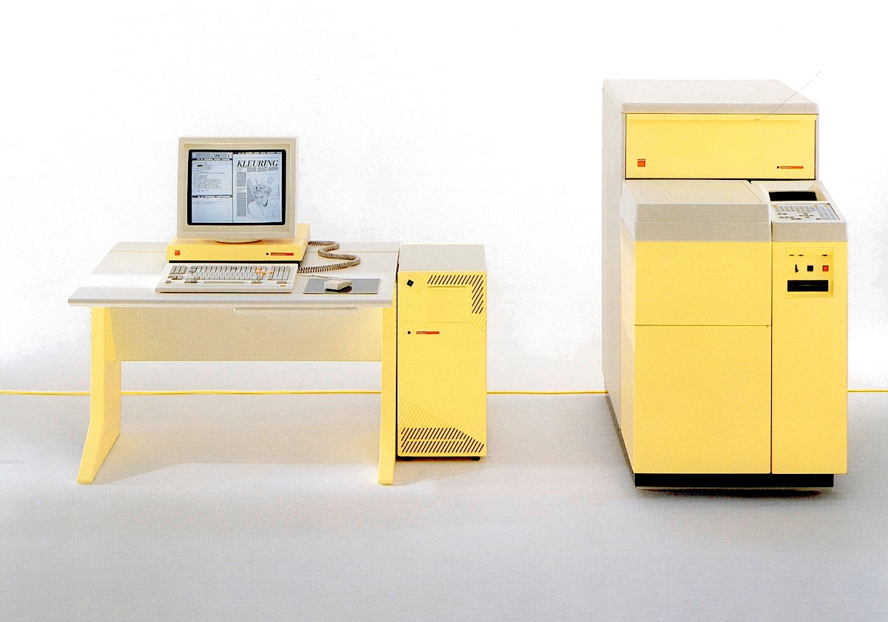
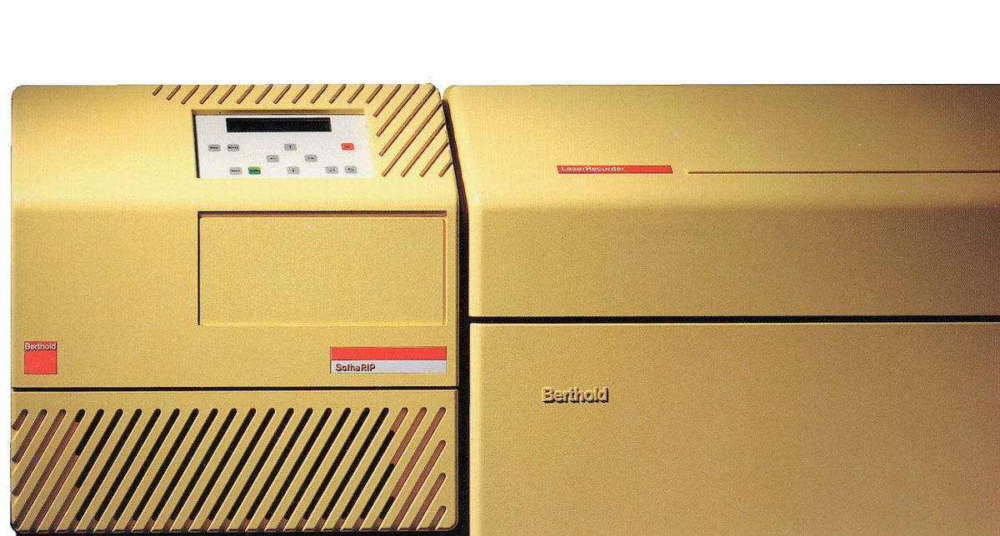

_Photo-typesetting is a method of setting type which uses photography to make columns of type on a scroll of photographic paper.
It has been made obsolete by the popularity of the personal computer and desktop publishing which gave rise to digital typesetting._

The internship period for my pre-vocationel education in [science](https://en.wikipedia.org/wiki/Science) fell within the intersection of 3 eras of [Prepress](https://en.wikipedia.org/wiki/Prepress).   
The company [Berthold](https://en.wikipedia.org/wiki/Berthold_Type_Foundry) was founded in Berlin in the eighteenth century and already specialized in typefaces.

Part of the internship company's customers were still in full use of the previous generation of [Berthold opto-mechanical phototypesetting machines](../berthold-fototype).
The software in which the texts are drawn up then controls a (largely) mechanical machine, which will expose a film letter by letter using glass plates on which all letters of one typeface (font) are etched.

Another part of the customers had switched to the state-of-the-art Berthold M system.
An extensive series of specifically composed hardware (based on the [Motorola 68000 series](https://en.wikipedia.org/wiki/Motorola_68000_series) microprocessors), operating system (based on [Unix](https://en.wikipedia.org/wiki/Unix) and [X Window System](https://en.wikipedia.org/wiki/X_Window_System)) and specific software (Berthold**ProfiPage**) for digital typesetting of complete pages.

With the advent of digital phototypesetting, the options for fonts were no longer physically limited and with such an M System (always partly spray-painted in light yellow) a typesetting company could have access to all 1.800 Berthold fonts.
Development in the computer industry continued to accelerate ([Moore's law](https://en.wikipedia.org/wiki/Moore%27s_law)), personal computers ([IBM cloning](https://en.wikipedia.org/wiki/Clone_(computing)) quickly became a standard.
In the wake of [Adobe PostScript](https://en.wikipedia.org/wiki/PostScript), the next era began in which it became possible for anyone with a decent Personal Computer, to set pages and have them printed or printed at decent quality.

That soon marked the end of the Series M and even the prestigious company [H. Berthold AG](https://en.wikipedia.org/wiki/Berthold_Type_Foundry), founded in 1858, fell ingloriously in 1993.
On this page a reasonable overview of the Berthold Series M based on a number of brochures from 1988/89 still in my archives.

# Berthold M Series
The trends in typography and design are influenced, among other things, by the technical development of typesetting systems and illuminators.
Creative designers and designers apply the new typesetting options quickly and with great enthusiasm.
Examples of this include diapositive texts as a headline, diapositive or rasterized surfaces and pages, and tilted lines.
By using modern production resources, typesetting companies can respond economically and efficiently to the new trends in typography and design of graphic products.

The integrated processing of whole pages is a new development in the phototypesetting industry.
The typesetting can be changed on the screen right up to the last minute and does not have to be reassembled and reassembled by hand in the event of a correction.
The completely formatted page is printed out on a recorder as a clean film, including texts, logos, lines and raster surfaces.

Berthold has become famous in (typo)graphic circles for its pioneering work in the development of high-performance typesetting systems and has the right technology and necessary know-how for the development of modern prepress systems.
This allows Berthold to meet the high demands set by the market.
Such as: high typesetting quality, excellent letter quality, professional software solutions for complex tasks and high production for widely varying assignments.

Working drawings, typographic designs, illustrations and photos can be edited geometrically when constructing the complete page.
They must then be digitized with the corresponding additional software or with a Berthold**Scanner**.
Photos scanned on a Berthold**Scanner** are saved in grayscale so that the images can be edited at any time on the Berthold**Workstation**.
The Berthold**RasterlmageServer** enlarges and reduces the images to the size required for the page to be exposed, calculates the crop and rasterizes the halftone images.

Special characters, logos and vignettes, which can be created with the Berthold**LogoType** program, are saved in the BertholdR**asterlmageServer** as a logo font and then treated as regular letters.

With the Berthold**Worknet** it is possible to put together a tailor-made text and image layout system for the layout of complete pages with text, line and halftone elements.
The Berthold**Worknet** works with a very high transfer speed between different input systems, storage media, formatting terminals and recorders.
Additionally, the Berthold**Laser printer** is available as an option.
This laser printer offers the option of cost-effectively printing letter-identical complete pages for correction or layout on typewriter paper.

# Berthold Textstation
The Berthold**Textstation** is a workplace for creating text pages and complex typesetting, with text and line elements.
Because Berthold**Textstation** works with ProfiPage, Berthold's new universal typesetting program makes typesetting faster and easier.

##### Hardware
As with the other Berthold**Workstations**, this Textstation is based on the proven standard hardware from [SUN Microsystems](https://en.wikipedia.org/wiki/Sun_Microsystems).
The SUN keyboard has been replaced by the user-friendly typographic Berthold keyboard, with 154 character functions and instruction keys.
An optical mouse is used to operate the menu windows.
The mouse also serves as an aid in setting contours.
All input appears interactively on the [WYSIWYG](https://en.wikipedia.org/wiki/WYSIWYG) window of the monitor, so that you can always check and correct the typesetting.
It is also possible to insert photo blocks as desired, in order to achieve a total typographic design of the page.

##### Software
Extensive Berthold typesetting software, together with [UNIX](https://en.wikipedia.org/wiki/Unix) (an international software standard) and 32-bit calculation technology, ensure high productivity.
The Berthold**Textstation** uses the universal Berthold**ProfiPage** typesetting software, which is stored in the Berthold**DataBox** or in the Berthold**DataTower**.
The software includes thickness value, decomposition, contouring and aesthetics programs and an exception dictionary.
The Berthold**ProfiPage** photocomposition software has new, simple, time-saving typesetting functions, making typesetting faster and more efficient.
An experienced Berthold user can follow the method he is familiar with from other Berthold systems.
This allows existing knowledge and experience to continue to be used.

##### Worknet
If the Berthold**Textstation** is connected to other M series components via the Berthold**Worknet**, it can access all text data on other connected units.
It is also possible to transmit data to the other Workstations.
This makes the Berthold**Textstation** ideal for the integrated editing of texts and line elements.
All functions of the Berthold**Recorder** connected to the Worknet can be used optimally.

##### Storage
The Berthold**Textstation** is connected to a Berthold**DataBox** or Berthold**DataTower**, which is used for administration and storage of the program data.
The Berthold**DataBox** has a 169 or 250 MB hard drive and a 60 MB Tape Streamer, for the input, output and storage of digital information.
The Berthold**DataBox** is used for the administration and storage of all programs, thickness and aesthetic values and typesetting.
Up to three Textstations can be connected to the Berthold**DataBox**.

The Berthold**Textstation** is a new development in the series of professional workstations.
It can be used as an independent input station for professional, text-oriented page layout and typographic typesetting, consisting of text and lines.
Connected to the Berthold**Worknet**, the Textstation can directly retrieve, edit and forward the data from other Berthold components.

# Berthold EasyScanner
The Berthold**EasyScanner** digitizes halftone and line images; which are later placed in the corresponding typesetting on the Berthold**Workstation**.
Linked to a photo typesetter from Berthold, you can then illuminate the entire page with texts, photos, logos, line and raster elements.

Berthold has developed the Berthold**EasyScanner** to record image data from halftone and line models for the integrated processing of texts, photos, logos, line and raster elements.   
This [flatbed scanner](https://en.wikipedia.org/wiki/Image_scanner) is suitable for digitizing halftone models of both color and black/white originals.

By using the CCD technique, correct tonal value reproduction is possible, even from color originals.   
Large format opaque and transparent models can be processed.

The scanner is controlled from one of the Berthold**Workstations**.
The name, scan characteristics, raster number, desired crop and magnification are recorded here.
The resulting resolving power can also be changed manually to influence the quality.
Originals up to a size of 216 x 500 mm can be digitized.
A pre-scan makes it possible to make a correct cut.   
The resolution depends on the format.
This can vary from 1 to 64 lines per millimeter.
All scan data is forwarded online to the Berthold**DataBox** or the Berthold**DataTower**, which are connected to one of the Berthold**Workstations**.

With halftone models, the gray values are stored so that the images can be edited after scanning on one of the Berthold**Workstations**.
The scanned images can then be enlarged, reduced, distorted and rasterized with various printing characteristics.

The built-in data compression (Berthold run-length code) ensures that the data quantity for line images is reduced by a factor of 20.
This significantly reduces the required storage space in the Datatower or the Databox.

The Berthold**EasyScanner** has automatic adjustment of the selected raster and optimal image sharpness.
A tonal value adjustment, which is independent of the model, is possible by determining the lightest and darkest points where the prescan determines the required values. The manipulation of halftones, highlights and deep shadows and the change of contrast can be applied in the Berthold**Workstation**.

For scanning line models, you can determine the black/white transition of your choice and assess the result after a prescan.
The higher resolution with line models is achieved by a gray value interpretation during scanning.

# Berthold HRScanner
The Berthold**HRScanner** is a flatbed scanner with a high resolution for black and white display.
This scanner can be used for the digitization of both halftone and line images.
This is possible due to the resolving power of 1 to 100 lines per millimeter.
The machine is equipped with CCD technology that controls the color and tonal value, regardless of the format.

This scanner is suitable for digitizing black and white images that meet the quality requirements set by Berthold.
Due to its high resolution, this flatbed scanner is suitable for digitizing halftone and line recordings.

With the Berthold**HRScanner** you can digitize black/white and color models up to a size of 320 x 520 mm.
The spectral properties of the Berthold**HRScanner** are tailored to the human eye, ensuring optimal tonal value conversion of even the most critical color models.
All scan data is passed on-line to the Berthold**DataBox** or to the Berthold**DataTower**.
These data stores are connected to a Berthold**Workstation**.
The gray levels of the halftone images are stored directly in memory, so that the images can be edited immediately after scanning on the Berthold**Workstation**.

Special attention has been paid to simple and task-oriented operation.
The image section to be scanned is determined with a ruler during the image check.
Determination of benchmark or distortion factors, automatically or manually, significantly reduces work preparation.

The standard software includes various tone value curves, which the operator can select from a tone value archive or determine and save themselves.
The determination or correction of these curves is carried out very quickly with signs or direct indication of the desired density.
High and low tones, just like the mid-tones, can be entered independently of each other.
These functions ensure standardized reproduction (same density of different originals).
The tonal value curve automatically obtained with prescan allows individual manipulation of images.
With line images it is possible to apply color and tone separation.
Dust particles can be retouched with a software filter.

# Berthold Laserstation
The Berthold**Laserstation**, Berthold's laser imager, not only increases productivity, but also makes new typesetting achievements possible.
The Laser Station consists of a Berthold**RasterServer** (RIP and PC) and a Berthold**LaserRecorder**.

The Berthold**Laserstation** is a laser recorder system, suitable for exposing entire pages.
With the well-known Berthold quality, the laid out pages are printed out as a clean film, including texts, logos, line elements and raster surfaces.
The easy Berthold typesetting software increases productivity and efficiency.
It also offers users new typesetting options.

With the Berthold **Laser Station**, characters, lines, texts, lines, logos and graphics can be illuminated both legibly and illegibly, positively or negatively.
Complicated editing, copying and copying and other reprotechnical operations have become redundant due to the page layout options of the Berthold**Workstations**.
It is possible to create work that is difficult or impossible to do by hand with precision, such as placing grid within grid.
The maximum exposure format of the imagesetter is 302 x 755 mm, in height or width.
The exposure time for a page of 302 x 302 mm is five minutes at a resolution of 80 lines/mm.

The Berthold**LaserRecorder** is controlled by the Berthold**RasterServer**.
This consists of a Berthold**PersonalComputer** and a Raster Image Processor (RIP).
The Berthold**PersonalComputer** can store 150 to 2,000 fonts and logos (depending on the capacity of the hard drive).
The complete Berthold type library is available in the form of Berthold**LaserTypes**.
These Berthold**LaserTypes** are digitized letters from the original Berthold type drawings.
The Berthold**LaserTypes** are compatible with the Berthold**Diatronic** letters and can be used from body 4 (capital height 1.06 mm) to 72 didot points (capital height 19.07 mm).

With the Berthold **Laser printer**, test layouts with letter-identical complete pages can be quickly created.
These prints are printed on regular, inexpensive typewriter paper.

The Berthold**Laser Station** can be connected online to the Berthold**Workstation**, the Berthold**Textstation**, to all autonomous keyboards and to the keyboards of the dms5000 and dms7000 system control panels.

# Berthold RecorderLI
The Berthold**RecorderLI** is a laser recorder system that can illuminate entire pages, including texts, photos, logos, line and raster elements.
With the recorder, complete films with line and halftone images can be produced quickly and efficiently.

The Berthold**RecorderLl** is ideally suited for illuminating the pages created by the Berthold**Workstations**.
Photos scanned on the Berthold**EasyScanner** or on the Berthold**HRScanner** are saved in grayscale so that the images can be edited at any time on the Workstation.
The Berthold**RasterlmageServer** enlarges and reduces the images to the size required for the page to be exposed, calculates the crop and rasterizes the halftone images.

The special characters, logos and punctuation marks that can be created with the Berthold**LogoType** program are saved in the Berthold**RasterlmageServer** as a logo font and then treated as regular letters.
In addition to exposing line and halftone images, the Berthold**LaserRecorder** can also illuminate letters from 1.06 to 200 mm capital height.
The complete Berthold Letter Library is available for these letters in the form of Berthold**DiamondTypes**.
The solution of 80 lines/mm in combination with the DiamondTypes meets the quality requirements set by Berthold and the market.

The high output quality of the imager is partly achieved by two parallel processors in the Berthold**RasterlmageServer**.
This allows the Berthold**LaserRecorder** to expose a 302 x 302 mm page with a grid of 80 lines/mm in 300 seconds.
The maximum exposure size is 302 x 800 mm.

The Berthold**RecorderLI** can be connected online to the Berthold**Workstation**, the Berthold**Textstation**, all autonomous keyboards and to the keyboards of the DMS 5000 and DMS 7000 system control panels.

# Berthold RecorderCI
The Berthold**RecorderCI** meets the highest possible quality standards with a resolution of 140 lines/mm.
The high quality and speed of this CRT recorder enables exposure of entire pages including texts, photos, logos, line and raster elements with very high quality.

The Berthold**RecorderCI** meets the highest possible quality standards with a resolution of no less than 140 lines/mm.

The high quality and speed of this CRT recorder enables exposure of complete pages including texts, photos, logos, line and raster elements with very high quality.

The Berthold**RecorderCI** was developed for exposing films for the production of high-quality printed matter.
The configuration consists of a CRT imager (the Berthold**HRRecorder**) and a Raster Image Processor (the Berthold**RasterlmageServer**).
This allows you to illuminate texts, photos, logos, line and raster elements in a constant production flow.

The high resolution of 140 lines/mm offers great tonal dynamics and allows raster gradients to be exposed by the Berthold**RecorderCI**.
The high speed of the imager is achieved by two parallel processors in the Berthold**RasterlmageServer**.
After a short preparation, the exposure begins, while the rest of the page to be exposed is still being made dynamically suitable.

For the lighting of the text, the complete Berthold font library is available in the form of the Berthold**DiamondTypes**.
These can be exposed from 4 (capital height 1.06 mm) to 453 didot points (capital height 120 mm) (capital height 240 mm in preparation).

# Berthold SofhaRIP
The Berthold**SofhaRIP** is a [Raster Image Processor](https://en.wikipedia.org/wiki/Raster_image_processor) for film output of [PostScript&reg;](https://en.wikipedia.org/wiki/PostScript) data on Berthold photo units.

The Berthold**SofhaRIP** enables all PostScript® data to be output on a Berthold**LaserRecorder**.
The PostScript data are the screenplay, the RIP is the director and the recorder is the film camera.

The Berthold**SofhaRIP** can be integrated very easily into an existing Berthold installation.
To do so, the RasterServer or the RasterImageServer and the LaserRecorder are connected to the SofhaRIP.
Data from a Berthold**Workstation** are passed on in the usual way to the recorder via the RasterServer or the RasterImageServer and are exposed here in top-class Berthold Quality.

If, on the other hand, the data are received in the form of a PostScript document from an Apple Macintosh® or from a PC, the Berthold**SofhaRIP** prepares the page for output on the recorder.
Graphics, illustrations and text are output at the resolution available on the respective recorder, i.e. with 20, 40 or 80 lines per millimetre.
The data are converted 1:1, i.e. the extent to which aesthetics, leadings, baseline positions and cap heights can be influenced depends on the layout program being used on the Mac or on the PC.
Apart from this, the programs Berthold**CreativeLink** and Berthold**OpenWorknet** provide the further possibilities of converting pure typesetting data from a Macintosh or the PC for enhancement on the Berthold**Workstation** without having to re-keyboard the data.

The Berthold**SofhaRIP** enables type-setting shops whose customers are not only accustomed to maximum quality, but also to flexible services, to support the PostScript standard — particularly widely-used in the creative graphic design field — without having to abandon the principle that high-quality copy can only be produced on high-resolution film recorders with high-quality typesetting fonts and using the respective professional know-how.

>&reg; PostScript is a registered trademark of Adobe Systems Inc.   
>&reg; Macintosh is a registered trademark of Apple Computers Inc. 