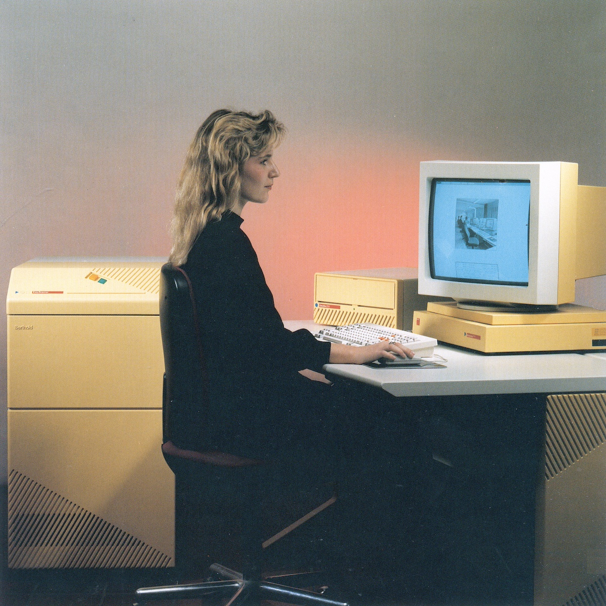
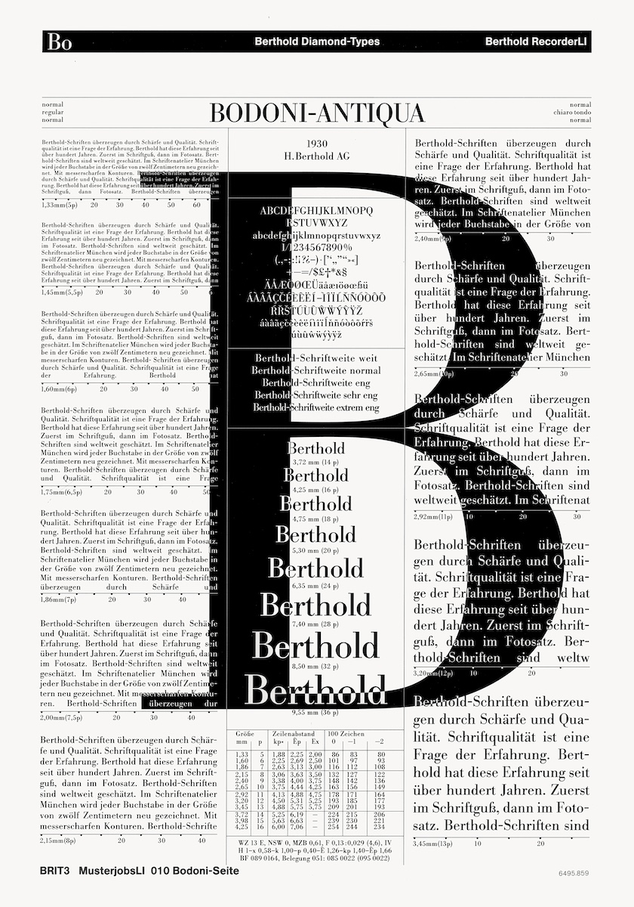
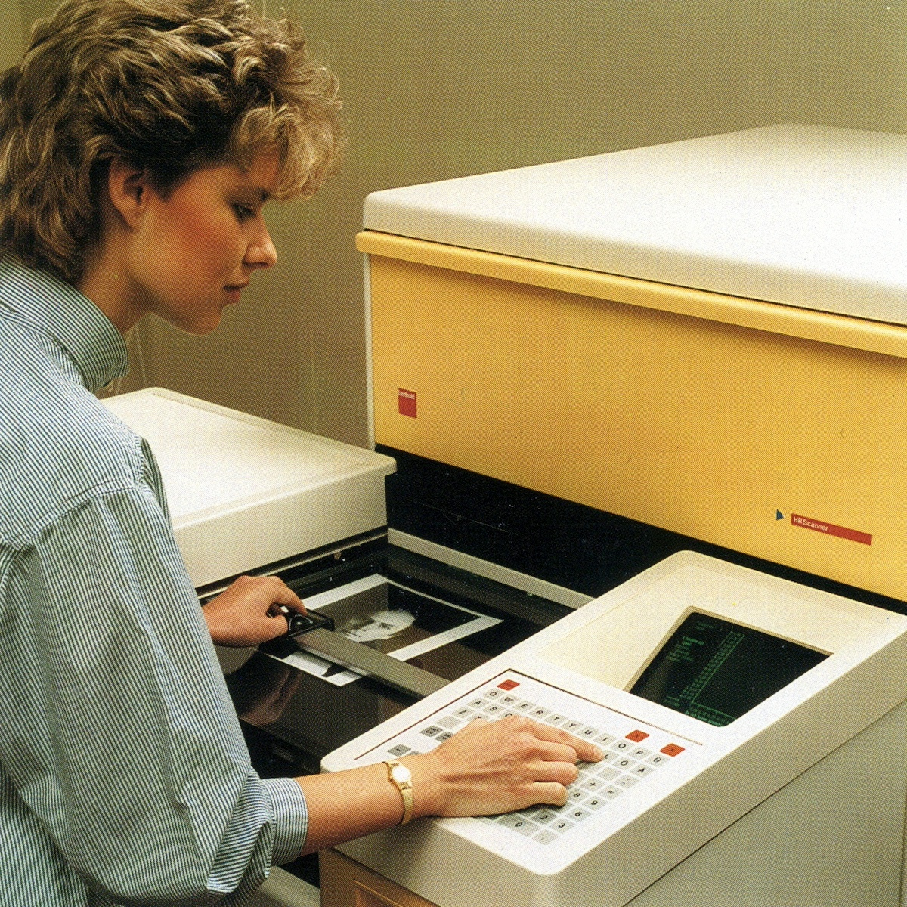
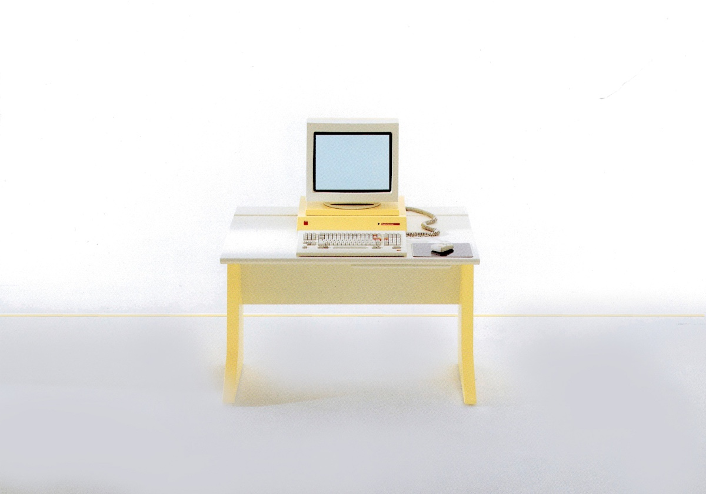
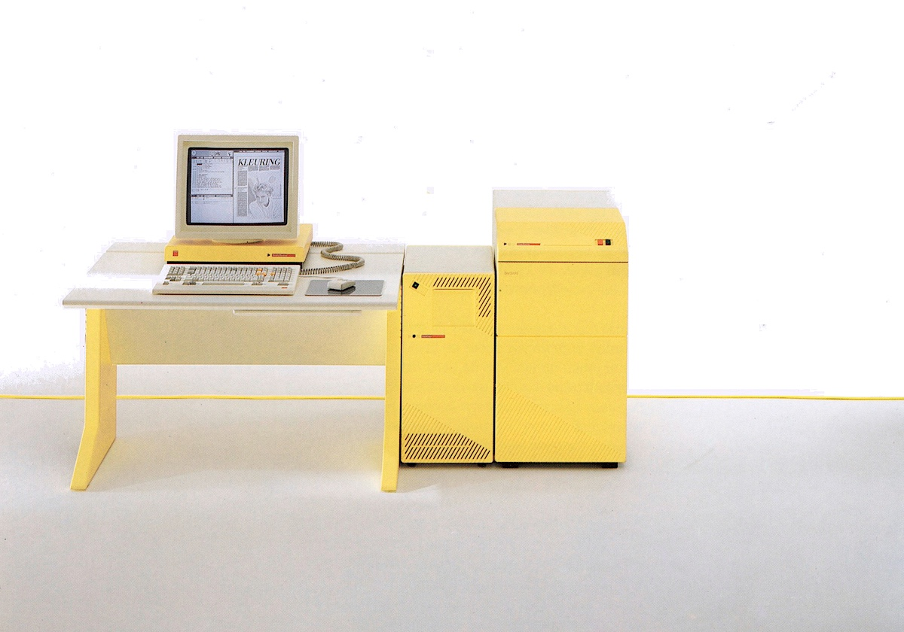
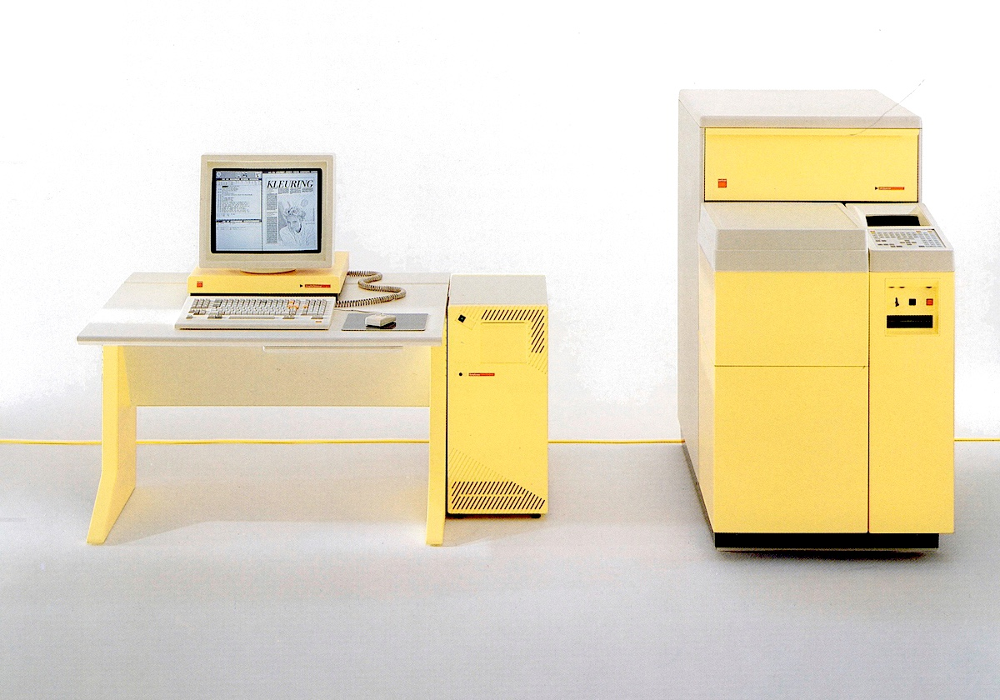
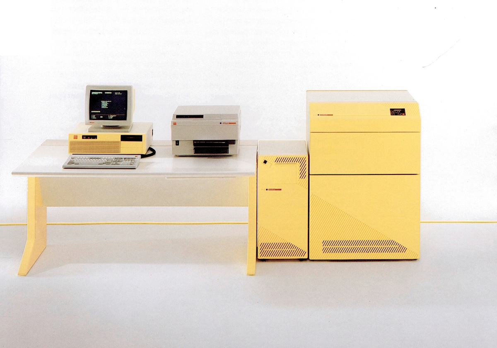
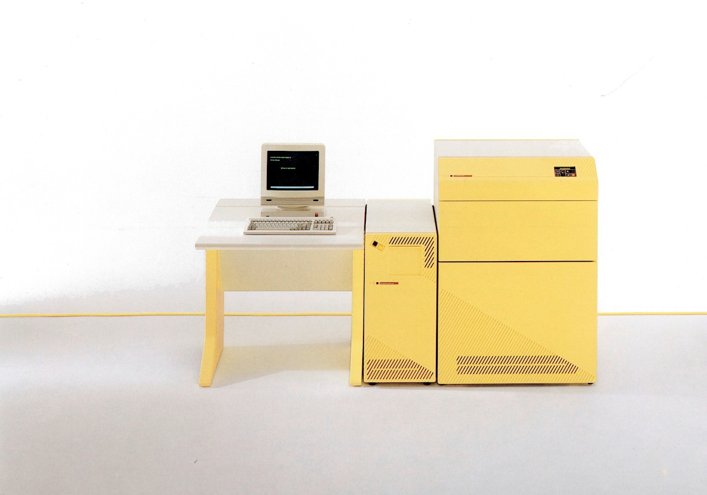
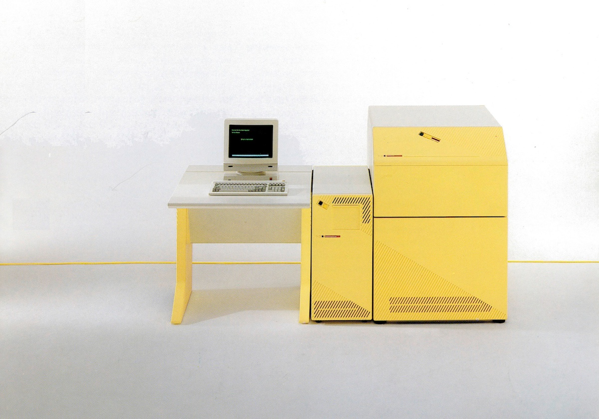
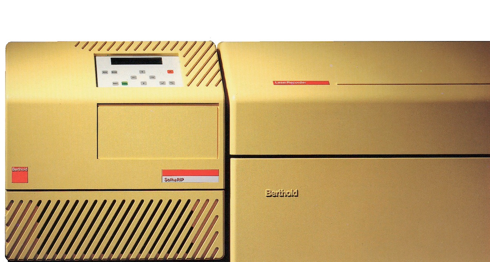

_Fotozetwerk is een methode voor het instellen van lettertypen waarbij fotografie wordt gebruikt om kolommen met letters op een rol fotografisch papier te maken.
Het is achterhaald door de populariteit van de personal computer en desktop publishing, die aanleiding gaven tot digitaal zetwerk._

### Berthold M Series

### Berthold Textstation

Het Berthold**Textstation** is een werkplek voor het opmaken van tekstpagina's en ingewikkeld zetwerk, met tekst en lijnelementen.
Doordat Berthold**Textstation** werkt met ProfiPage, het nieuwe universele standaard zet-programma van Berthold, wordt zetwerk sneller en eenvoudiger opgemaakt.

### Berthold EasyScanner

Met de Berthold**EasyScanner** worden halftoon- en lijn-modellen gedigitaliseerd; die later op het Berthold**Workstation** in het overeenkomstige zetwerk worden geplaatst.
Gekoppeld aan een fotozetter van Berthold, kan men dan de complete pagina met teksten, foto's, logo's, lijn- en rasterelementen belichten.

### Berthold HRScanner

De Berthold**HRScanner** is een vlakbedscanner met een hoog oplossend vermogen voor zwart/wit weergave.
Deze scanner kan worden ingezet voor de digitalisering van zowel halftoon- als lijn-afbeeldingen.
Dit is mogelijk door het oplossend vermogen van 1 tot 100 lijnen per millimeter.
De machine is uitgerust met de CCD techniek waarmee de kleur- en toonwaarde, onafhankelijk van het formaat, wordt gecontroleerd.

### Berthold Laserstation

Met het Berthold**Laserstation**, de laserbelichter van Berthold, wordt niet alleen de productiviteit verhoogd, maar zijn ook nieuwe zettechnische prestaties mogelijk.
Het Laserstation bestaat uit een Berthold**RasterServer** (RIP en PC) en een Berthold**Laserrecorder**.

### Berthold RecorderLI

De Berthold**RecorderLI** is een laser-recordersysteem dat complete pagina's kan belichten, inclusief teksten, foto's, logo's, lijn- en raster-elementen.
Met de recorder kunnen snel en efficiënt kant en klare, complete films met lijn- en halftoonbeelden worden uitgedraaid.

### Berthold RecorderCI

De Berthold**RecorderCI** voldoet met een oplossend vermogen van 140 lijnen/mm aan de hoogstmogelijke kwaliteitsnormen.
De hoge kwaliteit en snelheid van deze CRT recorder maakt belichting van complete pagina's inclusief teksten, foto's, logo's, lijn- en rasterelementen mogelijk met een zeer hoge kwaliteit.

### Berthold SofhaRIP

De Berthold**SofhaRIP** is een Raster Image Processor voor filmuitvoer van PostScript&reg; data naar Berthold recorders.

