_Phototypesetting is a method of setting type which uses photography to make columns of type on a scroll of photographic paper.  
It has been made obsolete by the popularity of the personal computer and desktop publishing which gave rise to digital typesetting._

# Berthold gts 4000
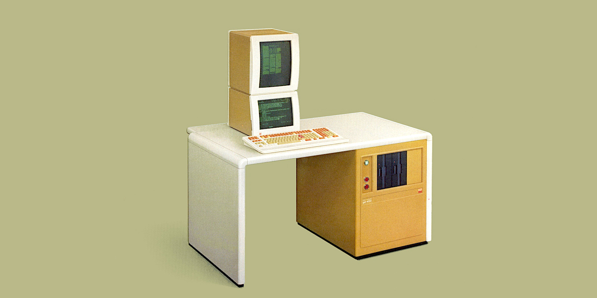

# Berthold mft 4000
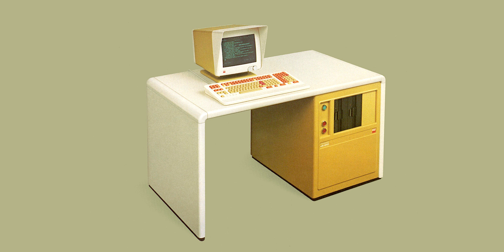

# Berthold tps 6000

# Berthold ads arabic 3000
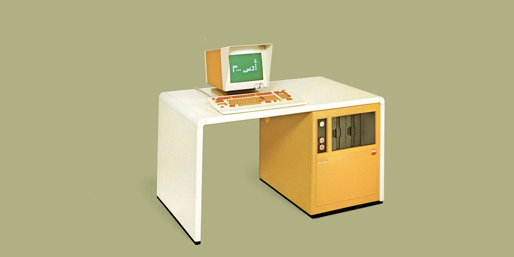

# Berthold system 7000
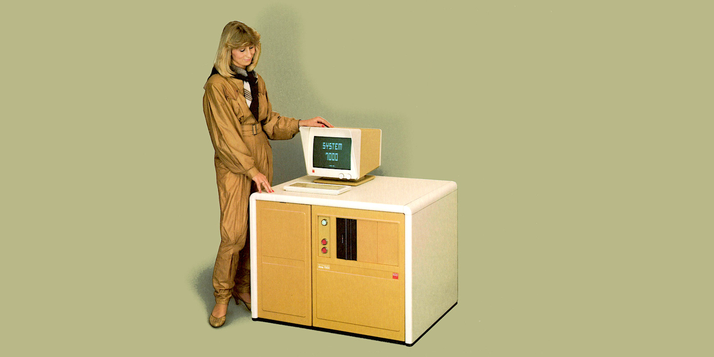

# Berthold tps 7001s
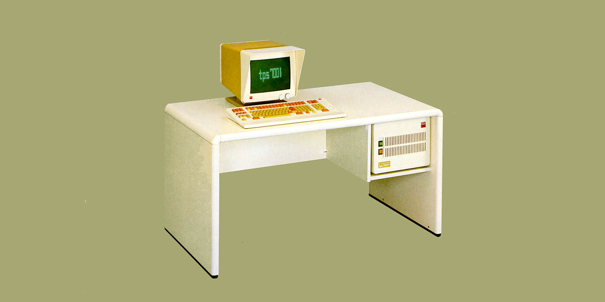

# Berthold FOX System
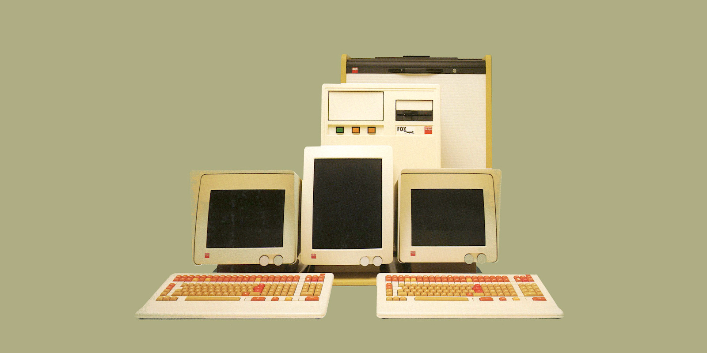

# Berthold acs 2000
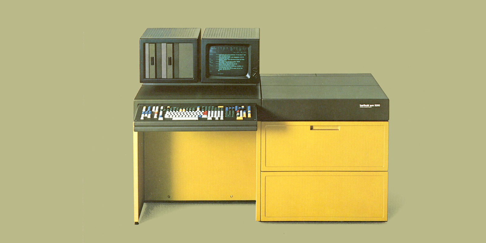

# Berthold tps 8000
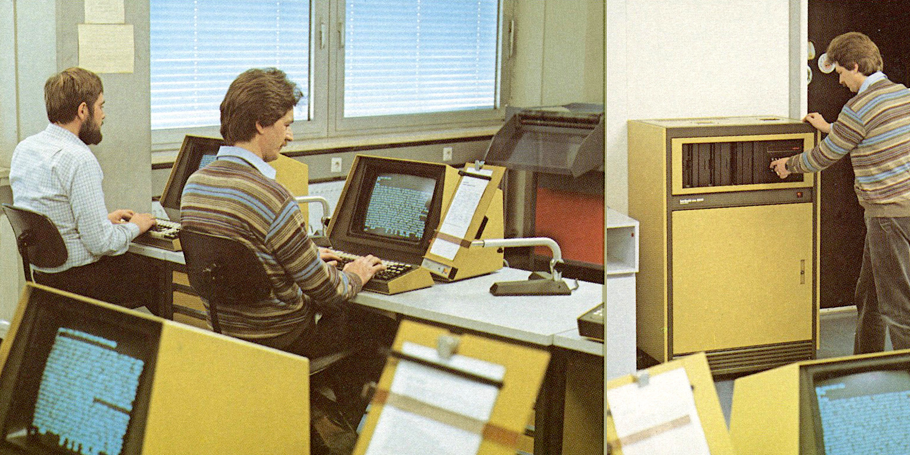

# Berthold sbs

# Berthold apu 6016
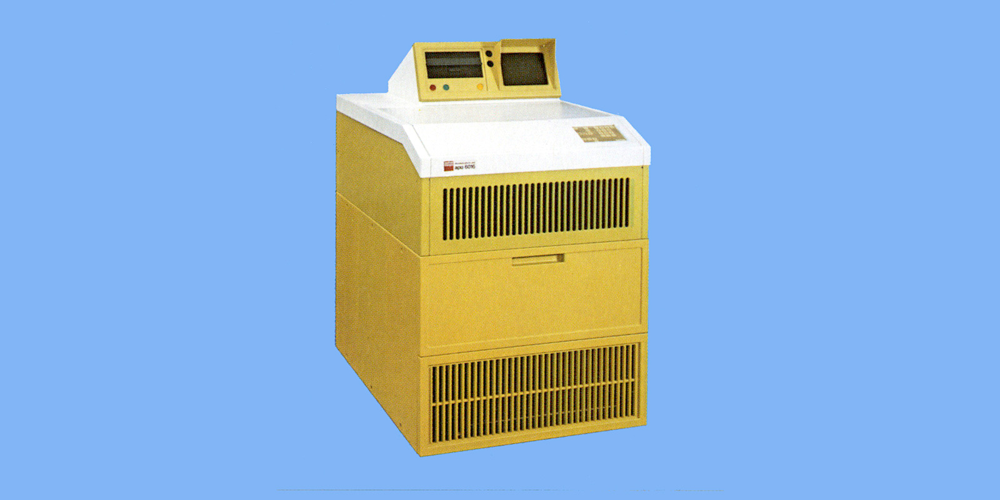

# Berthold tpu 3608
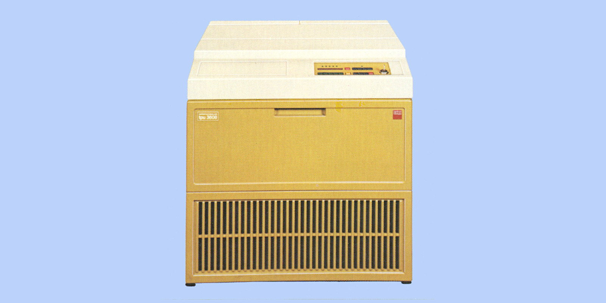

# Berthold crs 6911
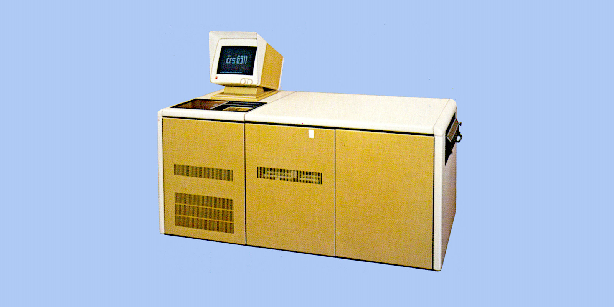

# Berthold crs 8901
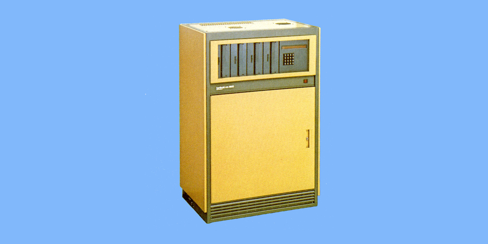

 
# CPS 2000 Satzmuster

# Fototype System

