_Sure, I might have had a Ferrari poster on the wall as a child, but my fascination for Ferrari started in 1990 with the [Bburago](https://en.wikipedia.org/wiki/Bburago) Ferrari F40 model ([cod. 3032](https://albaco.com/products/ferrari_f40_red_by_bburago_1-18_3032)).
Several years later there was the internet and everything just happened to evolve in the next 25 years to (what is now) [dacorsa.com](https://dacorsa.com).
This post will summarize (in rather technical) detail all the different incarnations of the website and database._ 

# Prelude
#### Spa Ferrari Days
The *Shell Ferrari Historic Challenge* was in its heyday, so when visiting the *Spa Ferrari Days* there was a plethora of classic race cars, some with impressive pedigree.
The concept of tracking chassis numbers quickly made sense and I started to make sure that each picture I took was annotated with the chassis number of the particular car.  

One or two years earlier, while the internet became mainstream in the Netherlands, I discovered this fansite for [Emanuele Pirro](https://en.wikipedia.org/wiki/Emanuele_Pirro) that was also publishing information on Ferraris, each image annotated with the chassis information.
Somehow I got in contact with the [webmaster](https://en.wikipedia.org/wiki/Webmaster) of this website (who later proved to be a vintage Ferrari collector) and for a couple of years I could contribute pictures and information to their Ferrari section that was eventually separated from [pirro.com](http://pirro.com) and called [maranello.cc](http://maranello.cc).

---
# First release as www&#46;dacorsa&#46;net in December 1998
`version 1 : StudioLine static website generator`

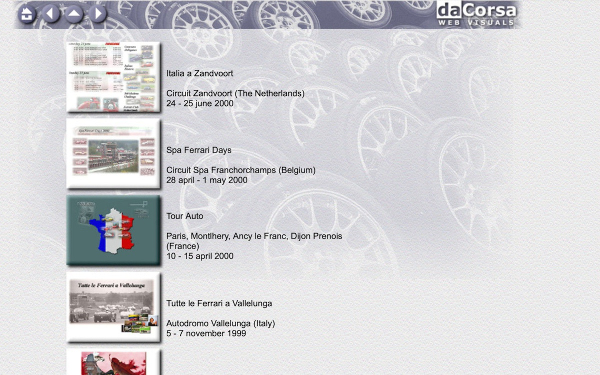

The main sponsor of *maranello.cc* was creating software to publish websites called [Studioline](https://www.studioline.net), using a completely different approach to [Microsoft Frontpage](https://en.wikipedia.org/wiki/Microsoft_FrontPage). I was given a beta copy of the software and created the first version of **dacorsa.net** publishing my contributions to other websites and magazines.

Secondly, 1999 was also the year that I learned about this international group of people called *'Telaio'* that were really into registering chassis numbers of Ferraris, and I was fortunate enough to be allowed to join them.
And finally, as part of an assignment for my professional education, I modelled a database in [Microsoft Access](https://en.wikipedia.org/wiki/Microsoft_Access).

The website and [database](https://en.wikipedia.org/wiki/Database) would prove to be a long living interest, maintained and re-incarnated for the next 25 years.

---
# Second release in January 2000
`version 2 : editthispage.com online blogserver`

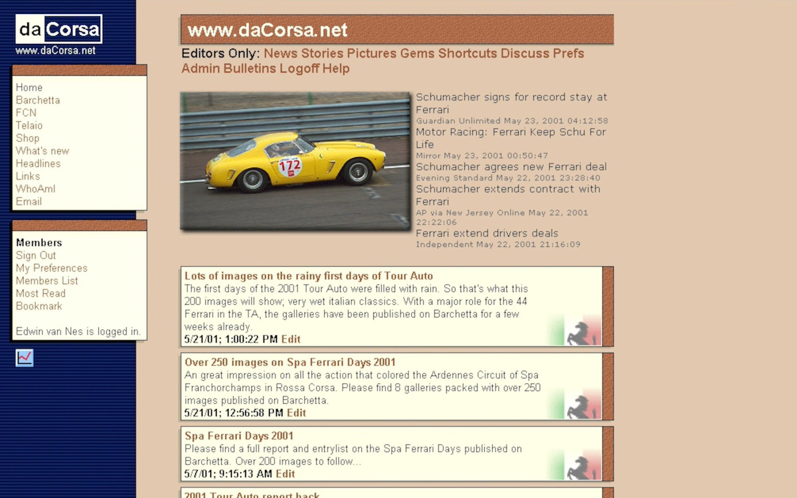

The image above shows a screenshot of the second version of **dacorsa.net**, created and hosted on editthispage.com of Radio Userland.
Professionally I became interested in the subjects [Dave Winer](https://en.wikipedia.org/wiki/Dave_Winer) and Adam Curry were working on; outliners, RSS (and what later would become podcasting) in particular.
Dave created [Radio Userland](https://en.wikipedia.org/wiki/Radio_UserLand) where a website was basically defined as a text-based outline (content) against a template that adds layout and colour.
The concept of editing a webpage right on the web was a quite spectacular at that time.
Furthermore, I read this *online book* by Philip Greenspun called '[Philip and Alex's Guide to Web Publishing](https://philip.greenspun.com/panda/)' (Alex being Philip's Dog obviously) with lots of fascinating ideas on [Sites that are really databases](https://philip.greenspun.com/panda/databases-intro).

---
# Third release in October 2001
`version 3 : phpNuke online portal`

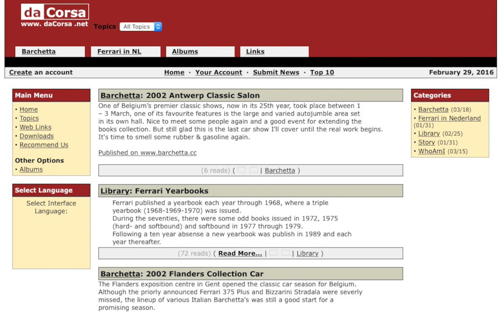

At the daytime job I was working with big and expensive content management systems and portals, so when open-source software with similar (albeit small scale) capabilites became mainstream, I could not withstand the urge to try it out and created a new version of **dacorsa.net**.
This time developed in the PHP programming language using [PHP Nuke](https://en.wikipedia.org/wiki/PHP-Nuke) and hosted on a shared virtual server.
The image above shows the PHP Nuke version of **dacorsa.net** where the typical portal look of PHP Nuke can be easily recognised.

---
# Fourth release in April 2003
`version 4 : online Typo3 content management system`

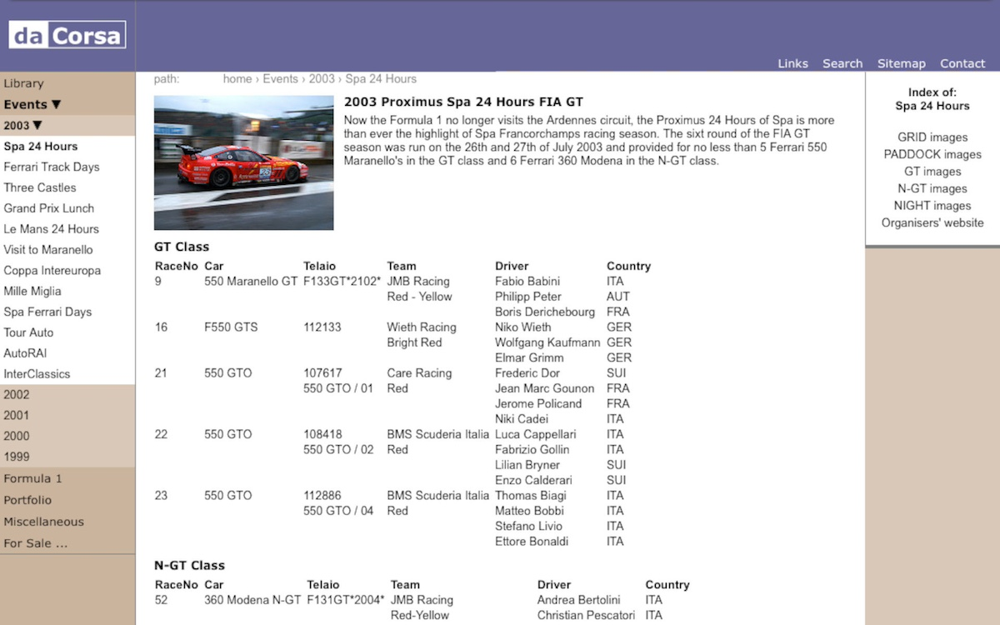

PHP Nuke was a nice excercise but the content of **dacorsa.net** was growing quickly and everything was stored in an unstructured database that felt pretty bad (for a software engineer that is, other people couldn't care less).
A new open-source project stood out called [Typo3 Content Management System](https://typo3.org), very professional and capable software that could easily compare to the big and expensive corporate CMS systems we worked with in the daytime job.

A template could be built from scratch, there was a scripting language and above all, you can model a database for your own data.
This was a nice and professional architecture and the start of something way more important (for me).
I have been collection chassis information and results of all the events I attended but this was mostly stored in seperate lists and partly in the (offline) database modelled in [Microsoft Access](https://en.wikipedia.org/wiki/Microsoft_Access) a couple of years earlier.
Now, with Typo3, the database started in 1999, becomes the 'single point of entry' and is even "always online".

---
# Fifth release in December 2004, Sixth in March 2005
`online Typo3 content management system`

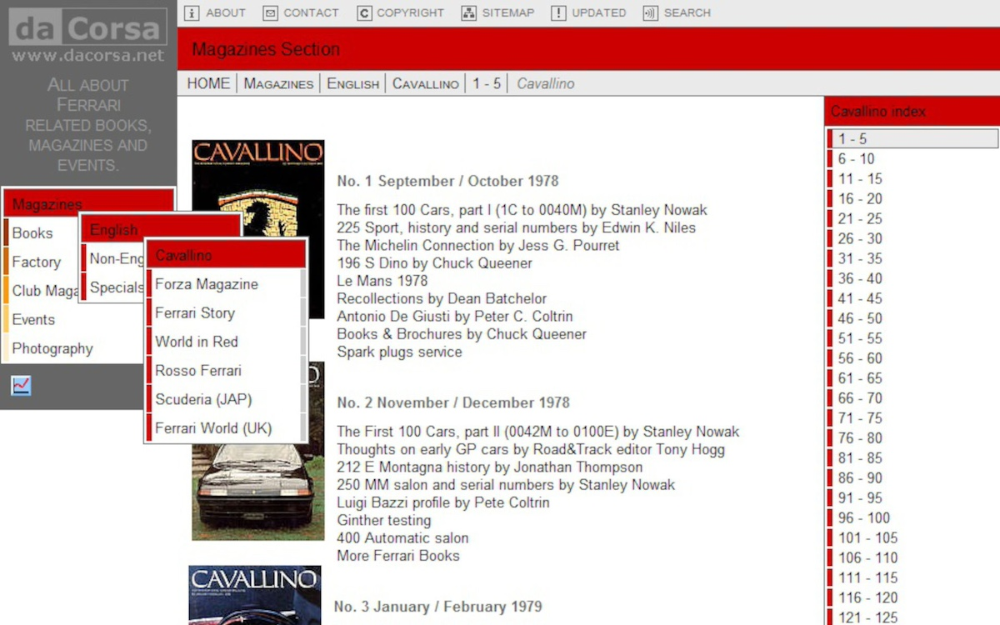
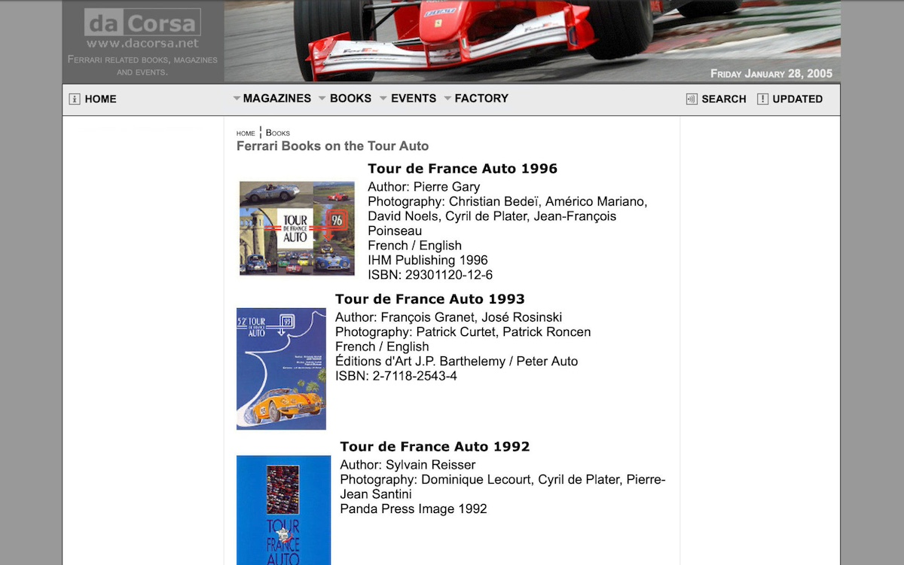

Just (comprehensive) new frontend templates for the existing [Typo3 online CMS](https://typo3.org) stack.

---
# Release 7 in February 2011 as dacorsa.com
`version 7 : online Joomla content management system`

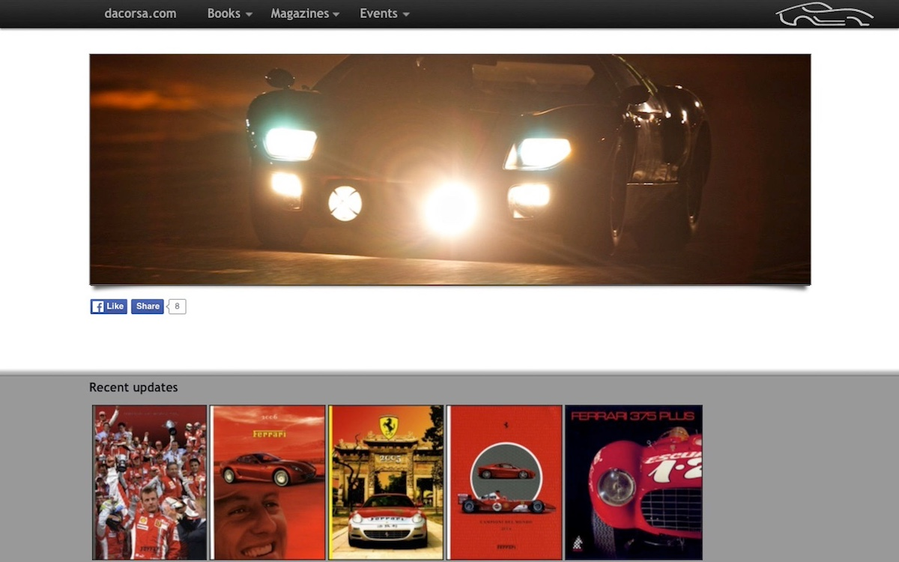

New open-source software keeps appearing on the web and after creating a couple of other websites with [Mambo](https://en.wikipedia.org/wiki/Mambo_%28software%29) and [Joomla CMS](https://www.joomla.org) it felt time to move **dacorsa.net** over to this more modern software.
My custom [Joomla](https://www.joomla.org) implementation of **dacorsa.net** kept my dedicated [SQL database](https://www.mysql.com) which by now had grown quite big.  
After many years of patiently waiting for a chance, I was finally able to acquire the [.com](https://en.wikipedia.org/wiki/.com) domain name, so the site continued to live on as **dacorsa.com**.

To keep the content of the whole database safe, an offline 'origin' database was (re-)introduced (maintained almost daily) and regular, but random, snapshots were copied to the online database.
Release 7 replaced the previous release of March 2005 after almost 6 years of service.

---
# Release 8 in January 2016
`version 8 : custom offline PHP static site generator`

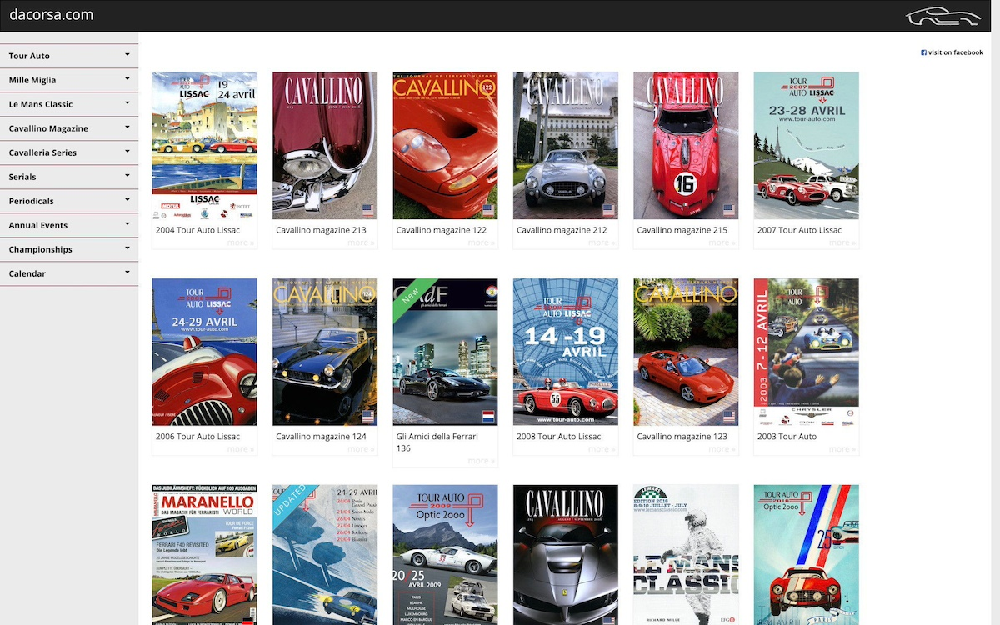

This month saw the release of a completely new build of **dacorsa.com** replacing the February 2011 version after almost 5 years of service.
This new incarnation would remain online for a good 10 years.

The database had become more and more complex which made it difficult to find (cheap) hosting for it.
Also, there was quite some information in there that was not meant for publication. So having the database online becomes a security problem.  
Last but not least, Joomla became so popular that I had to deal with attacks on the website on an almost daily basis.

The 2016 release saw a new (at that time still a bit controversial) approach of a static html site.
I created some purpose-made [PHP](https://www.php.net) software that generated a static HTML snapshot of the website, that can literally be hosted anywhere and attacking these files makes no sense.

---
# Release 9 in February 2021
`version 9 : custom offline Java generator + Angular single page application`

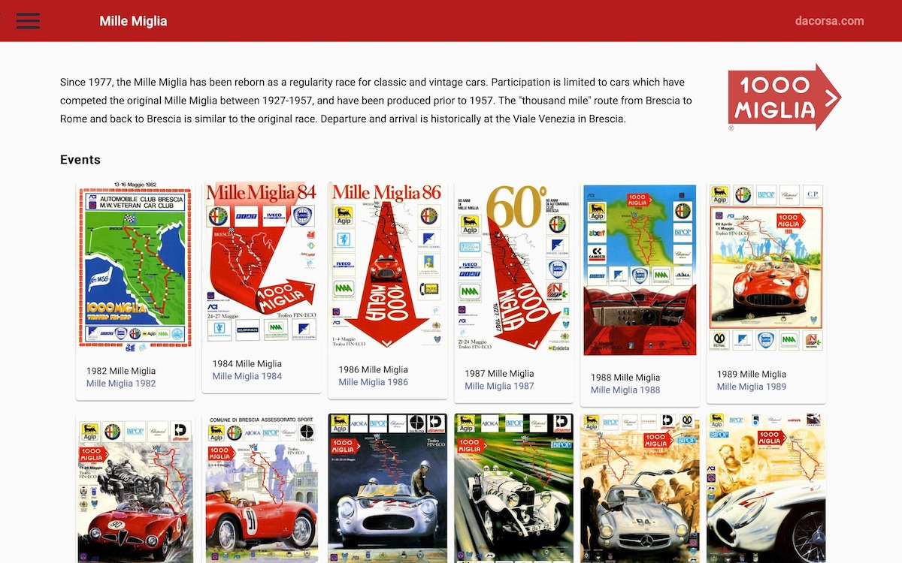
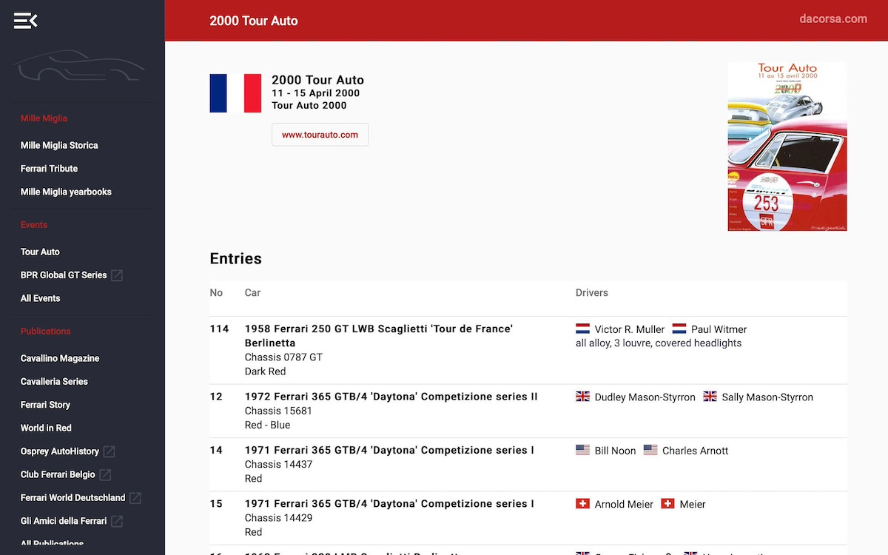

At some point in 2020 I started working on a new generator (this time written in [Java](https://en.wikipedia.org/wiki/Java_(programming_language))) against the offline database and the set of high-resolution scans that are related to the objects in the database.  
This complex Java generator creates snapshots of the database in [JSON](https://www.json.org/json-en.html) files and converts the high-resolution scans into more web-friendly version of those (event posters and book covers mostly) images.
Both the image - and JSON files are static exports, keeping most of the information in the database out-of-risk and keep hosting cheap and easy.
An [Angular](https://en.wikipedia.org/wiki/Angular_(web_framework)) frontend application was added for modern behavior and look-and-feel replacing the January 2016 version after almost 5 years of service.

---
# Release 10 in December 2021
`custom offline Java generator + Hugo static site generator`

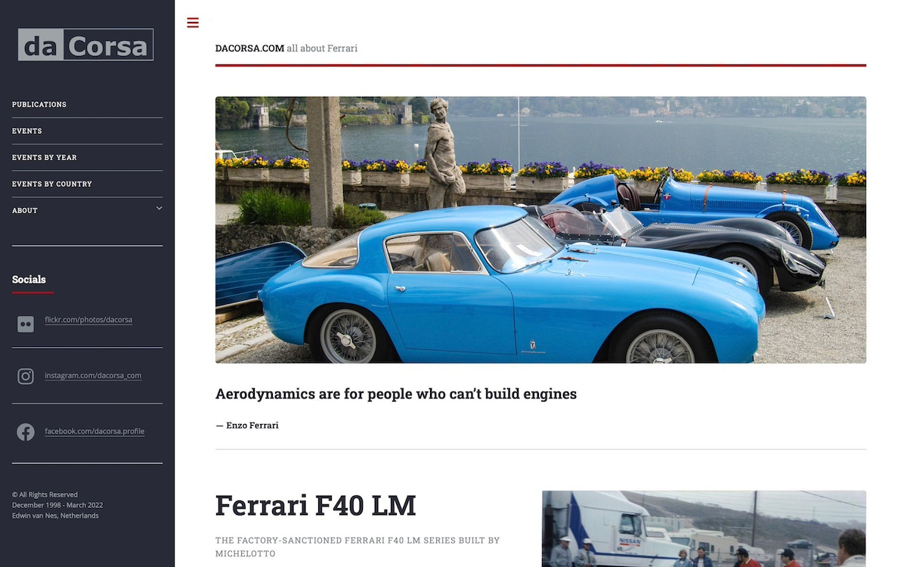
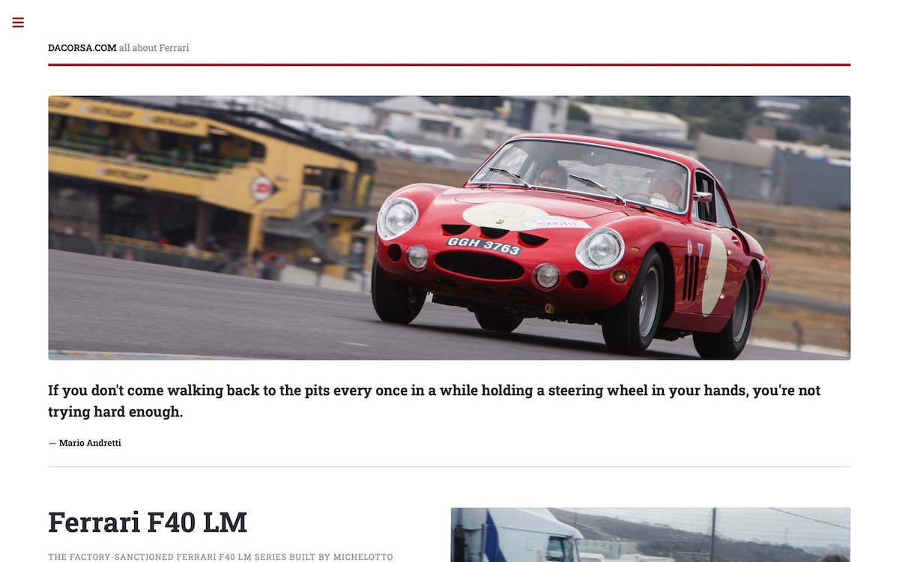

The [Angular](https://angular.io) application was a bridge too far for what is basically only a very fancy database report.
Too much time and attention was needed to keep the stack running and the coding fresh, time that I would rather spend on the content.
So I started consolidating a lot of scripts written against the database since around 2016 and refactored those in a 4-step approach.
At each step I should be able to debug the intermediate (content) situation.
Furthermore, possible future refactoring should minimize changes in earlier phases. (In theory that is, I've been around software engineering quite some time now, to know better).

But anyway, here is how it is set up:

### Maintenance
That's day-to-day maintenance; mostly done in [DataGrip](https://www.jetbrains.com/datagrip/) by JetBrains.
Manual data-entry, sql query, importing all kinds of datafiles etc.
There are some scripts uploading and converting images, some reports and validations and backup scripts. 
And the database itself of course.
Some numbers at the time of this writing: 
- 23 tables and 14 views, with 59 triggers attached
- 82 functions and stored procedures
- almost 30.000 records on articles for over **3.000 publications**
- **238.000 results for 244.000 entries** in over 11.000 events
- including supporting tables and yet unpublished content it all adds up to over **half a million records**!

### Publish Step
The purpose of this step, implemented completely in SQL scripting, is to create a snapshot of the database (described above), denormalized and containing only the published records.
The whole database also contains information not ready for publication or even blocked from ever being published publicly.

### Generate Step
The purpose of this step to generate some sort of publication from the database using a lot of custom written java programs.
The result of this step is sort of a generic publication; chapters and pages are available as [markdown](https://en.wikipedia.org/wiki/Markdown) documents, and images are formatted ready for publication.
Theoretically this intermediate publication can still become a book rather than a website.

### Render Step
For rendering, I started using this clever software called [Hugo](https://gohugo.io). This open-source project started in 2013 and is extremely useful for rendering static HTML websites, taking care of templating, indexes, sitemaps etc.
[Hugo itself](https://en.wikipedia.org/wiki/Hugo_(software)) (and the Hugo templates for **dacorsa.com**) are written in [GO](https://en.wikipedia.org/wiki/Go_(programming_language)) which is amazingly FAST.

The rendered result is FTP-ed to the [web hosting service](https://en.wikipedia.org/wiki/Web_hosting_service) a few times a month and presented as [dacorsa.com](https://dacorsa.com)