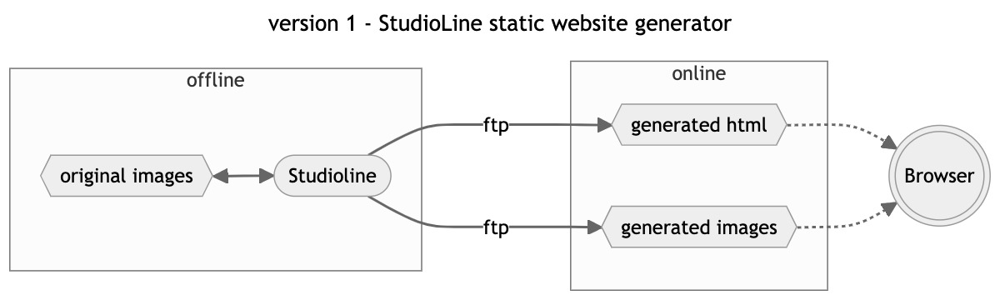
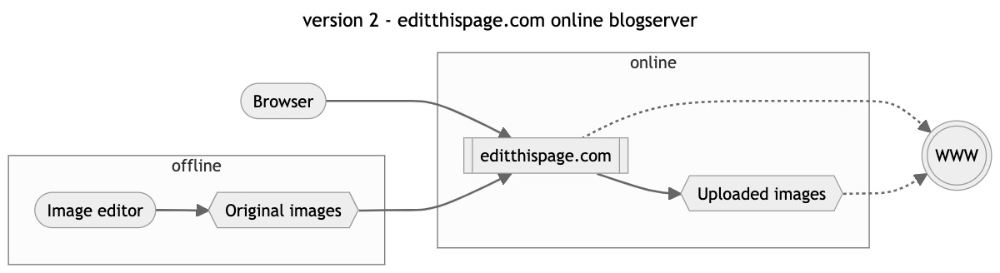
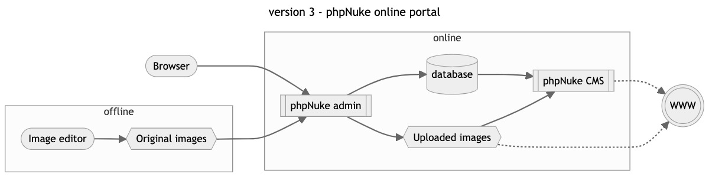
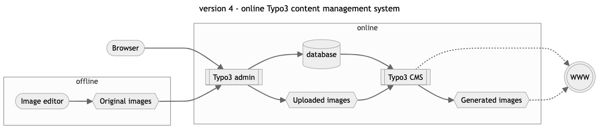
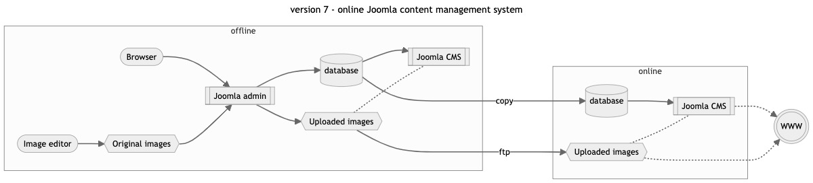
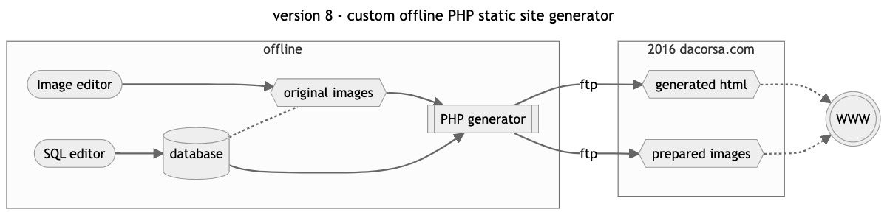
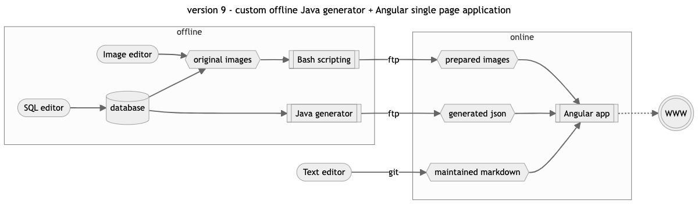
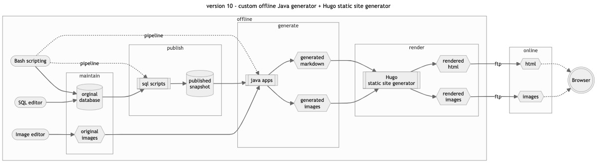

_Sure, I might have had a Ferrari poster on the wall as a child, but my fascination for Ferrari started in 1990 with the Bburago 1997 Ferrari F40 model (cod. 3032).
Everything just happened to evolve in the next 25 years to (what is now) [dacorsa.com](https://dacorsa.com)_
This post will summarize (in rather technical) detail all the different incarnations of the website and database. 

# Prelude
#### Cavallo Scrimante Modelcars
There were only a handful of 1:18 scale Ferraris available in 1994, but I liked to improve and make race versions of the [Bburago](http://www.bburago.com) models. When I went to *Circuit Zandvoort* for the first time there was this small company called *Cavallo Scrimante modelcars* in the paddock that were selling modified 1:18 scale racecars of Dutch drivers, like Dick Waaijenberg and Michel Oprey.
Seeing the Ferrari F40 Competition on track and leaving home with a reasonably matching 1:18 scale model of the same car was something fascinating.
I got to know Math and Sven Wolters of Cavallo Scrimante modelcars and became a regular visitor of their home and workshop in the south of the Netherlands where they told me all those stories about their adventures at the 1997 festivities in *Maranello* and how I should visit this birthplace of Ferrari.

#### Spa Ferrari Days 1998
The *Shell Ferrari Historic Challenge* was in its heyday, so when visiting the *Spa Ferrari Days* there was a plethora of classic race cars, some with impressive pedigree. The concept of chassis numers quickly made sense and I started to make sure that each picture I took was annotated with the chassis number of the particular car.  
And I started buying books; with one important restriction; *each book should include chassis numbers where referencing Ferraris*.

The internet was becoming mainstream in the Netherlands when I discovered this fansite for *Emanuele Pirro* that was also publishing information on Ferraris, each image annotated with the chassis information.
Somehow I got in contact with the "webmaster" of this website (who later proved to be a vintage Ferrari collector) and I could contribute some pictures and information to their Ferrari section that was eventually separated from *pirro.com* and called [maranello.cc](http://maranello.cc).

# First release in December 1998
`version 1 : StudioLine static website generator`
www&#46;dacorsa&#46;net

The main sponsor of maranello.cc was creating software to publish websites, but with whole different approach than [Microsoft Frontpage](https://en.wikipedia.org/wiki/Microsoft_FrontPage). I was given a beta copy of the software and created the first version of dacorsa.net publishing my contributions to other websites and magazines.
1999 was the year that I learned about this international group of people called *'Telaio'* that were really into registering chassis numbers of Ferraris, and I was fortunate enough to be allowed to join them.
As part of an assignment for my professional education, I modelled a database in [Microsoft Access](https://en.wikipedia.org/wiki/Microsoft_Access). The new website and database would prove to be a long living interest.

# Second release in January 2000
`version 2 : editthispage.com online blogserver`

# Third release in October 2001
`version 3 : phpNuke online portal`

# Fourth release in April 2003
`version 4 : online Typo3 content management system`

PHP Nuke was a nice excercise but the content of dacorsa.net was growing quickly and everything was stored in an unstructured database that felt pretty bad (for a software engineer ;-).
A new open-source project was picked called [Typo3 Content Management System](https://typo3.org), open-source too but very professional and capable software that could easily compare to the big and expensive corporate CMS systems we worked with in the daytime job.

A template could be built from scratch, there was a scripting language and above all, you can model a database for your own data.
This was a nice and professional architecture and the start of something way more important (for me). I have been collection chassis information and results of all the events I attended but this was mostly stored in seperate lists and partly in the (offline) database modelled in [Microsoft Access](https://en.wikipedia.org/wiki/Microsoft_Access) a couple of years earlier. Now, with Typo3, the database started in 1999, becomes the 'single point of entry' and is even "always online".

# Fifth release in December 2004
`version 5 : online Typo3 content management system`

Basically a new frontend template for the existing [Typo3 online CMS](https://typo3.org).

# Sixth release in March 2005
`version 6 : online Typo3 content management system`

Basically a new comprehensive new frontend template for the existing [Typo3 online CMS](https://typo3.org).

# Release 7 in February 2011 as dacorsa.com
`version 7 : online Joomla content management system`

New open-source software keeps appearing on the web and after creating a couple of other websites with [Mambo](https://en.wikipedia.org/wiki/Mambo_%28software%29) and [Joomla CMS](https://www.joomla.org) it felt time to move **dacorsa.net** over to this more modern software.
Ofcourse my [Joomla](https://www.joomla.org) implementation of **dacorsa.net** kept my dedicated [SQL database](https://www.mysql.com) which by now had grown quite big.  
After many years of patiently waiting for a chance, I was Finally able to acquire the [.com](https://en.wikipedia.org/wiki/.com) domain name, so the site continued to live on as **dacorsa.com**.

To keep the content of the whole database safe, an offline 'staging' database was introduced (that I maintain almost daily) where a snapshot of the publicly available information is copied to the online database at random intervals.
After almost 6 years; the [Typo3 based](https://typo3.org) release of [March 2005](..2005/03-release) is now replaced. 

# Release 8 in January 2016
`version 8 : custom offline PHP static site generator`

This month saw the release of a completely new build of **dacorsa.com** replacing the [February 2011](../../2011/02-february-release/) version after almost 5 years of service.
This new incarnation would remain online up until [February 2021](../../2021/02-february-release/).

The database had became more and more complex which made it difficult to find (cheap) hosting for it. Also there was quite some information in there that was not meant for publication. So having the database online becomes a security problem.  
Last but not least, Joomla became so popular that I had to deal with attacks on the website on an almost daily basis.

The 2016 release saw a new (at that time controversial) approach; I created some purpose-made [PHP](https://www.php.net) software that generated a static HTML snapshot of the website, that can literally be hosted anywhere and attacking these files makes no sense.

# Release 9 in February 2021
`version 9 : custom offline Java generator + Angular single page application`

At some point in 2020 I started working on a new generator (this time written in Java) against the offline database and the set of high-resolution scans that are related to the objects in the database.  
This complex Java generator creates snapshots of the database in json files and converts the high-resolution scans into more web-friendly version of those (event posters and book covers mostly) images. Both the images and the json files are static exports, keeping most of the information in the database out-of-risk and keep hosting cheap and easy.
An Angular frontend application was added for modern behavior and look-and-feel.

This month saw the release for this new approach for **dacorsa.com** replacing the [January 2016](../../2016/01-january-release/) version after almost 5 years of service.

# Release 10 in December 2021
`version 10 : custom offline Java generator + Hugo static site generator`

