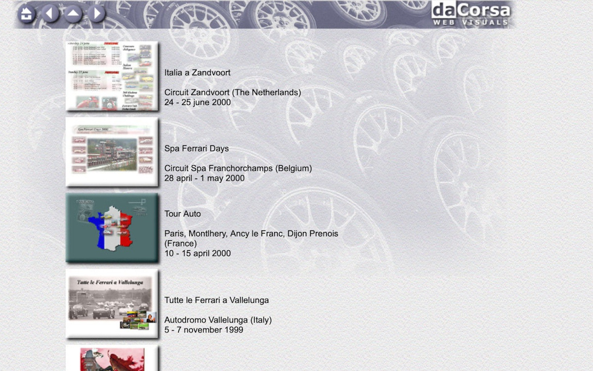
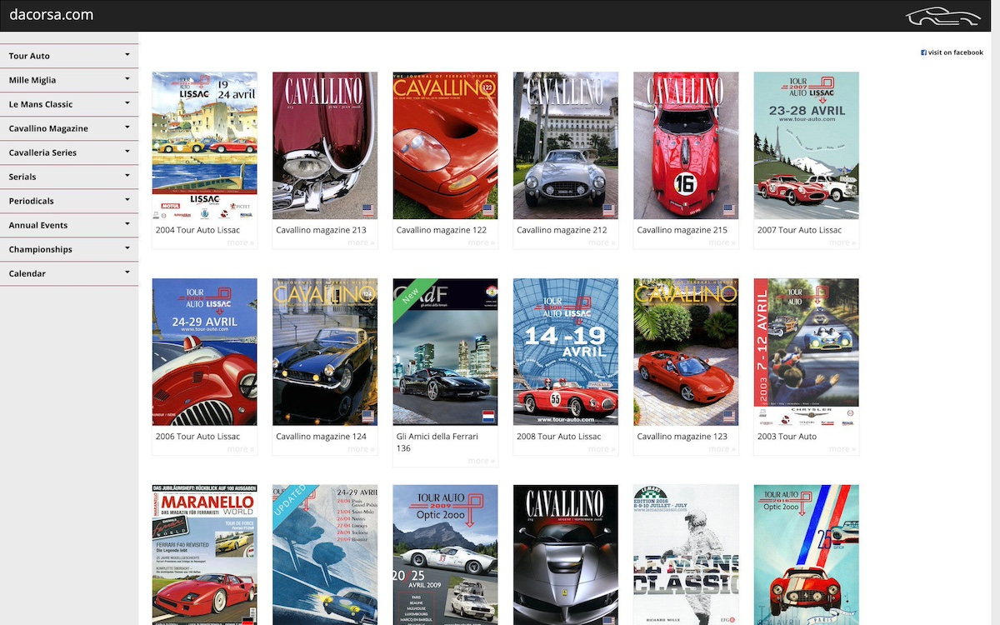
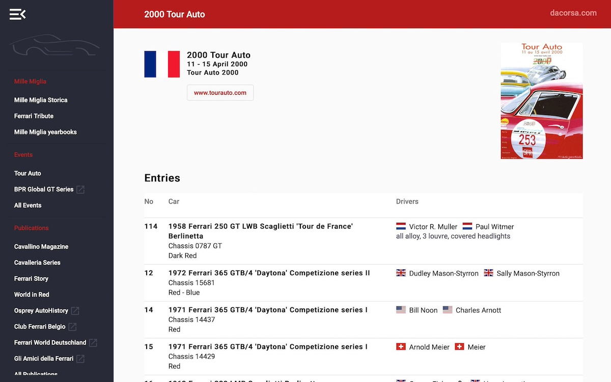

_Natuurlijk, als kind had ik misschien een Ferrari-poster aan de muur, maar mijn fascinatie voor Ferrari begon in 1990 met het [Bburago](https://nl.wikipedia.org/wiki/Bburago) Ferrari F40-model ([cod 3032](https://albaco.com/products/ferrari_f40_red_by_bburago_1-18_3032)).
Enkele jaren later was er internet en alles evolueerde in de daaropvolgende 25 jaar naar (wat nu is) [dacorsa.com](https://dacorsa.com).
Dit bericht zal (in nogal technisch) detail alle verschillende incarnaties van de website en database samenvatten._

# Prelude
#### Spa Ferrari-dagen
De *Shell Ferrari Historic Challenge* was in zijn hoogtijdagen, dus tijdens een bezoek aan de *Spa Ferrari Days* was er een overvloed aan klassieke raceauto's, waarvan sommige met een indrukwekkende afkomst.
Het concept van het bijhouden van chassisnummers werd al snel logisch en ik begon ervoor te zorgen dat elke foto die ik maakte werd voorzien van een annotatie met het chassisnummer van de specifieke auto.

Een of twee jaar eerder, toen internet mainstream werd in Nederland, ontdekte ik deze fansite voor [Emanuele Pirro](https://nl.wikipedia.org/wiki/Emanuele_Pirro) die ook informatie over Ferrari's publiceerde, waarbij elke afbeelding geannoteerd was met de chassisinformatie.
Op de een of andere manier kwam ik in contact met de [webmaster](https://nl.wikipedia.org/wiki/Webmaster) van deze website (die later een vintage Ferrari-verzamelaar bleek te zijn) en een paar jaar lang kon ik foto's en informatie naar hun Ferrari-sectie die uiteindelijk werd gescheiden van [pirro.com](http://pirro.com) en [maranello.cc](http://maranello.cc) heette.

---
# Eerste release als www&#46;dacorsa&#46;net in december 1998
`versie 1: StudioLine statische websitegenerator`

De hoofdsponsor van *maranello.cc* maakte software om websites te publiceren met de naam [Studioline](https://www.studioline.net), waarbij hij een compleet andere benadering gebruikte dan [Microsoft Frontpage](https://nl.wikipedia.org/wiki/Microsoft_FrontPage).
Ik kreeg een bètaversie van de software en maakte de eerste versie van **dacorsa.net**, waarmee ik mijn bijdragen op andere websites en tijdschriften publiceerde.

Ten tweede was 1999 ook het jaar waarin ik kennis maakte met deze internationale groep mensen genaamd *'Telaio'* die zich echt bezighielden met het registreren van chassisnummers van Ferrari's, en ik had het geluk dat ik me bij hen mocht aansluiten.
En tot slot heb ik, als onderdeel van een opdracht voor mijn professionele opleiding, een database gemodelleerd in [Microsoft Access](https://nl.wikipedia.org/wiki/Microsoft_Access).

De website en [database](https://nl.wikipedia.org/wiki/Database) zouden een langlevende interesse blijken te zijn, onderhouden en gereïncarneerd voor de komende 25 jaar.

---
# Tweede release in januari 2000
`versie 2: editthispage.com online blogserver`

De afbeelding hierboven toont een screenshot van de tweede versie van **dacorsa.net**, gemaakt en gehost op editthispage.com van Radio Userland.
Professioneel raakte ik geïnteresseerd in de onderwerpen waar [Dave Winer](https://en.wikipedia.org/wiki/Dave_Winer) en Adam Curry aan werkten; outliners, RSS (en wat later podcasting zou worden) in het bijzonder.
Dave heeft [Radio Userland](https://en.wikipedia.org/wiki/Radio_UserLand) gemaakt, waarbij een website feitelijk werd gedefinieerd als een op tekst gebaseerde schets (inhoud) tegen een sjabloon dat lay-out en kleur toevoegt.
Het concept van het rechtstreeks op internet bewerken van een webpagina was in die tijd behoorlijk spectaculair.
Verder las ik dit *online boek* van Philip Greenspun genaamd '[Philip and Alex's Guide to Web Publishing](https://philip.greenspun.com/panda/)' (Alex is uiteraard Philip's Dog) met veel fascinerende ideeën over [Sites die in werkelijkheid databases zijn](https://philip.greenspun.com/panda/databases-intro).

---
# Derde release in oktober 2001
`versie 3: phpNuke online portal`

Overdag werkte ik met grote en dure contentmanagementsystemen en portalen, dus toen open-sourcesoftware met vergelijkbare (zij het kleinschalige) mogelijkheden mainstream werd, kon ik de drang om het uit te proberen niet weerstaan en maakte ik een nieuwe versie van **dacorsa.net**.
Deze keer ontwikkeld in de programmeertaal PHP met behulp van [PHP Nuke](https://nl.wikipedia.org/wiki/PHP-Nuke) en gehost op een gedeelde virtuele server.
De afbeelding hierboven toont de PHP Nuke-versie van **dacorsa.net**, waar het typische portal-uiterlijk van PHP Nuke gemakkelijk kan worden herkend.

---
# Vierde release in april 2003
`versie 4: online Typo3 contentmanagementsysteem`

PHP Nuke was een leuke oefening, maar de inhoud van **dacorsa.net** groeide snel en alles werd opgeslagen in een ongestructureerde database, wat behoorlijk slecht aanvoelde (voor een software-ingenieur kon het andere mensen niets schelen).
Een nieuw open-sourceproject viel op, genaamd [Typo3 Content Management System](https://typo3.org), zeer professionele en capabele software die gemakkelijk te vergelijken was met de grote en dure bedrijfs-CMS-systemen waarmee we overdag werkten.

Er kon een sjabloon vanaf nul worden opgebouwd, er was een scripttaal en bovenal kun je een database modelleren voor je eigen gegevens.
Dit was een mooie en professionele architectuur en het begin van iets veel belangrijkers (voor mij).
Ik heb chassis-informatie en resultaten verzameld van alle evenementen die ik heb bijgewoond, maar deze werd meestal opgeslagen in afzonderlijke lijsten en gedeeltelijk in de (offline) database gemodelleerd in [Microsoft Access](https://nl.wikipedia.org/wiki/Microsoft_Access) een paar jaar eerder.
Nu wordt de database, gestart in 1999, met Typo3 het 'single point of entry' en is zelfs 'altijd online'.

---
# Vijfde release in december 2004, zesde in maart 2005
`online Typo3 contentmanagementsysteem`

Gewoon een (uitgebreid) nieuw frontend-ontwerp voor de bestaande [Typo3 online CMS](https://typo3.org) stack.

---
# Release 7 in februari 2011 als dacorsa.com
`versie 7: online Joomla contentmanagementsysteem`

Er verschijnt steeds nieuwe open-sourcesoftware op internet en na het maken van een aantal andere websites met [Mambo](https://nl.wikipedia.org/wiki/Mambo_(CMS)) en [Joomla CMS](https://www.joomla.org) voelde het tijd om **dacorsa.net** over te zetten naar deze modernere software.
Mijn aangepaste [Joomla](https://www.joomla.org) implementatie van **dacorsa.net** behield mijn speciale [SQL-database](https://www.mysql.com) die inmiddels behoorlijk groot was geworden.
Na vele jaren geduldig wachten op een kans, kon ik eindelijk de domeinnaam [.com](https://nl.wikipedia.org/wiki/.com) verwerven, dus de site bleef voortleven als ** dacorsa.com**.

Om de inhoud van de hele database veilig te houden, werd een offline 'origin'-database (opnieuw) geïntroduceerd (bijna dagelijks onderhouden) en werden regelmatig, maar willekeurige, snapshots naar de online database gekopieerd.
Release 7 verving de vorige release van maart 2005 na bijna 6 jaar dienst.

---
# Release 8 in januari 2016
`versie 8: aangepaste offline PHP statische sitegenerator`

Deze maand werd een volledig nieuwe build van **dacorsa.com** uitgebracht, ter vervanging van de versie van februari 2011 na bijna 5 jaar dienst.
Deze nieuwe incarnatie zou ruim tien jaar online blijven.

De database was steeds complexer geworden waardoor het lastig werd om er (goedkope) hosting voor te vinden.
Bovendien stond er behoorlijk wat informatie in die niet voor publicatie bedoeld was. Het online hebben van de database wordt dus een beveiligingsprobleem.
Last but not least werd Joomla zo populair dat ik vrijwel dagelijks te maken kreeg met aanvallen op de website.

De release van 2016 zag een nieuwe (toen nog een beetje controversiële) benadering van een statische html-site.
Ik heb speciaal gemaakte [PHP](https://www.php.net)-software gemaakt die een statische HTML-momentopname van de website genereerde, die letterlijk overal kan worden gehost en het aanvallen van deze bestanden heeft geen zin.

---
# Release 9 in februari 2021
`versie 9: aangepaste offline Java-generator + Angular single page-applicatie`

Ergens in 2020 begon ik te werken aan een nieuwe generator (dit keer geschreven in [Java](https://nl.wikipedia.org/wiki/Java_(programmeertaal)) tegen de offline database en de set met hoge resolutie scans die gerelateerd zijn aan de objecten in de database.
Deze complexe Java-generator maakt momentopnamen van de database in [JSON](https://www.json.org/json-en.html) bestanden en converteert de scans met hoge resolutie naar een meer web-vriendelijke versie daarvan (evenement-posters en boekomslagen meestal) afbeeldingen.
Zowel de afbeeldings- als de JSON-bestanden zijn statische exports, waardoor de meeste informatie in de database buiten risico blijft en het hosten goedkoop en gemakkelijk blijft.
Er is een [Angular](https://nl.wikipedia.org/wiki/Angular)) frontend-applicatie toegevoegd voor modern gedrag en look-and-feel, ter vervanging van de versie van januari 2016 na bijna vijf jaar dienst.

---
# Release 10 in december 2021
`aangepaste offline Java-generator + Hugo statische sitegenerator`

De applicatie [Angular](https://angular.io) was een brug te ver voor wat eigenlijk slechts een heel fraai databaserapport is.
Er was te veel tijd en aandacht nodig om de stack draaiende te houden en de codering fris te houden, tijd die ik liever aan de inhoud besteedde.
Daarom ben ik sinds ongeveer 2016 begonnen met het consolideren van een groot aantal scripts die in de database zijn geschreven en heb ik deze opnieuw verwerkt in een aanpak in vier stappen.
Bij elke stap zou ik de tussenliggende (inhoudelijke) situatie moeten kunnen debuggen.
Bovendien zou een mogelijke toekomstige refactoring de veranderingen in eerdere fasen tot een minimum moeten beperken. (In theorie ben ik al een tijdje bezig met software-engineering, om beter te weten).

Maar hoe dan ook, zo zit het in elkaar:

#### Maintenance
Dat is dagelijks onderhoud; meestal gedaan in [DataGrip](https://www.jetbrains.com/datagrip/) door JetBrains.
Handmatige gegevensinvoer, SQL-query, importeren van allerlei gegevensbestanden enz.
Er zijn enkele scripts die afbeeldingen uploaden en converteren, sommige rapporten en validaties en back-upscripts.
En de database zelf natuurlijk.
Enkele cijfers op het moment dat ik dit schrijf:
- 23 tabellen en 14 weergaven, met 59 triggers aangesloten
- 82 functies en opgeslagen procedures
- bijna 30.000 records over artikelen voor meer dan **3.000 publicaties**
- **238.000 resultaten voor 244.000 inzendingen** in meer dan 11.000 evenementen
- inclusief ondersteunende tabellen en toch ongepubliceerde inhoud komt dit allemaal neer op meer dan **een half miljoen records**!

#### 'Publish' stap
Het doel van deze stap, volledig geïmplementeerd in SQL-scripting, is het maken van een momentopname van de database (hierboven beschreven), gedenormaliseerd en die alleen de gepubliceerde records bevat.
De hele database bevat ook informatie die niet klaar is voor publicatie of zelfs geblokkeerd is om ooit openbaar te worden gepubliceerd.

#### 'Generate' stap
Het doel van deze stap is om een soort publicatie uit de database te genereren met behulp van veel op maat geschreven Java-programma's.
Het resultaat van deze stap is een soort generieke publicatie; hoofdstukken en pagina's zijn beschikbaar als [markdown](https://nl.wikipedia.org/wiki/Markdown) documenten, en afbeeldingen zijn opgemaakt klaar voor publicatie.
Theoretisch kan deze tussen-publicatie nog steeds een boek worden in plaats van een website.

#### 'Render' stap
Voor het renderen begon ik deze slimme software te gebruiken genaamd [Hugo](https://gohugo.io). Dit open-sourceproject startte in 2013 en is uitermate nuttig voor het renderen van statische HTML-websites, het verzorgen van templates, indexen, sitemaps etc.
[Hugo zelf](https://en.wikipedia.org/wiki/Hugo_(software)) (en de Hugo-sjablonen voor **dacorsa.com**) zijn geschreven in [GO](https://nl.wikipedia.org/wiki/Go_(programmeertaal)) wat verbazingwekkend SNEL is.

Het weergegeven resultaat wordt een paar keer per maand via FTP verzonden naar de [webhosting service](https://nl.wikipedia.org/wiki/Webhosting) en gepresenteerd als [dacorsa.com](https://dacorsa.com )