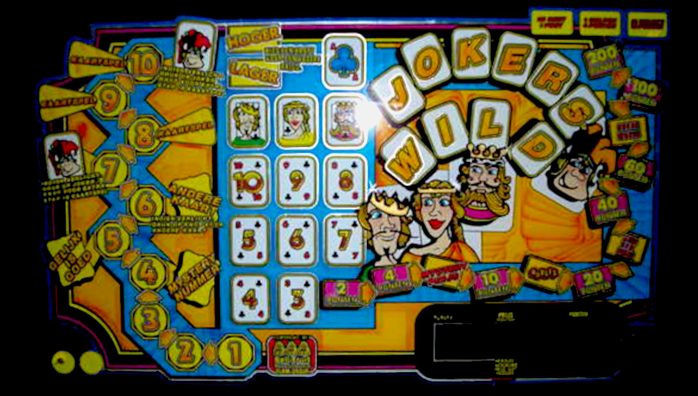
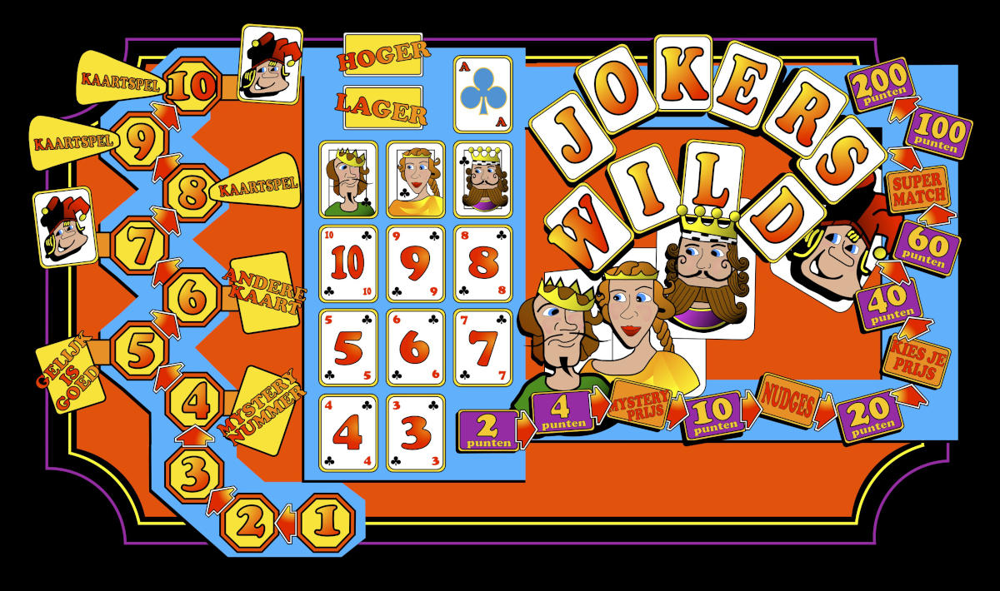
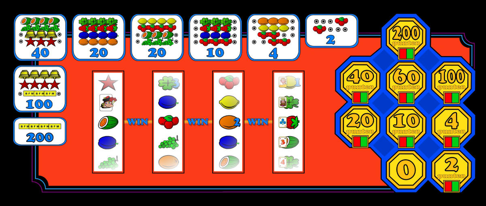
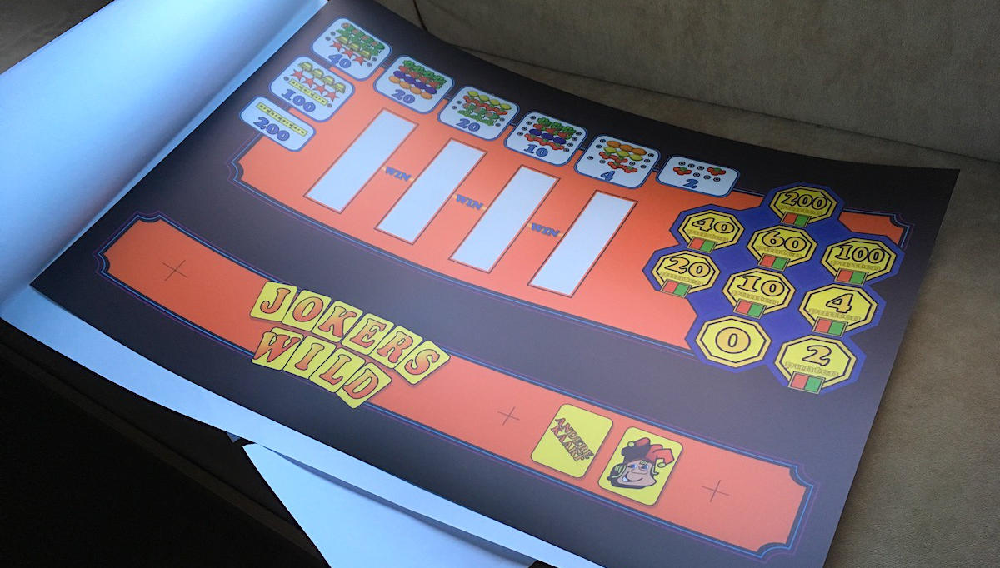
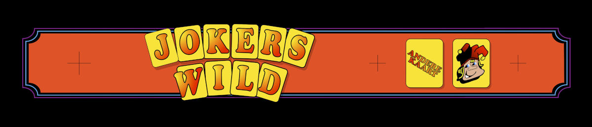

De HUD en gameplay van mijn JokersWild Tribute-machine zijn sterk geïnspireerd en komen in zekere zin vrij dicht in de buurt van de originele gokautomaat.
Mijn tekeningen zijn wat eenvoudiger, maar ik denk dat ik de essentie heb kunnen vatten.
De vectortekeningen werden omgezet naar een PDF-bestand en naar een specialist gestuurd die het ontwerp in kleur op een semi-transparant stuk plastic drukte (zodat het duidelijk van achteren verlicht kon worden).

Na verschillende pogingen om het lagere desk-paneel op een vergelijkbare manier te kopiëren, besloot ik dat het niet zou lukken.
Gevoed door de constructie dat ik nodig zal hebben om de rollen te besturen, zal de afstand tussen de rollen behoorlijk verschillen op mijn Tribute-machine.
Ook de resolutie van mijn tekeningen en het drukwerk zou leiden tot een rommelig ontwerp.
Het enige onderdeel dat de originele gokautomaat nabootst, is het gokspel aan de rechterkant van het paneel.
Er wordt een veel eenvoudigere set prijstabellen afgedrukt en ik besloot de lay-out van de volledige rollen aan de linkerkant van de originele machine los te laten.
Uiteindelijk besloot ik een kast te bouwen met een banner bovenop, dus ontwierp ik ook wat artwork voor dat specifieke display.

Al met al ben ik best tevreden met hoe het artwork is geworden.
Vervolgens moest ik een manier bedenken om afzonderlijke delen van de tekening te verlichten.
De eerste poging was om te beginnen met een massief stuk MDF van 9mm dik en een Dremel met een freesstuk te gebruiken om alle afzonderlijke dozen te routeren.
Dit werd vrij snel een slordig stuk werk en uiteindelijk besloot ik te stoppen met het frezen van gaten in een massief MDF-paneel en te proberen een soort rooster te 3D-printen.