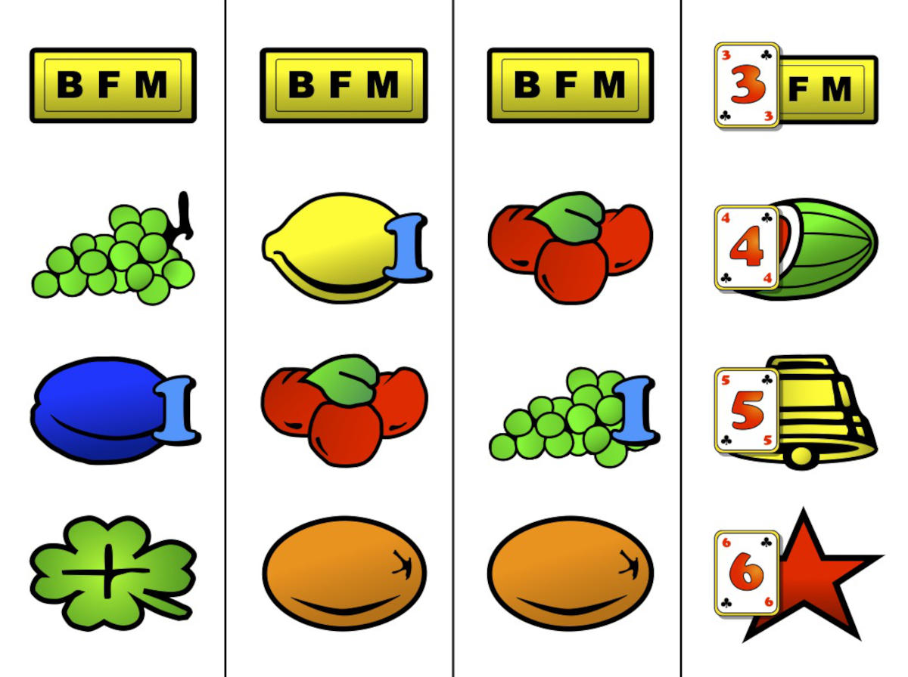
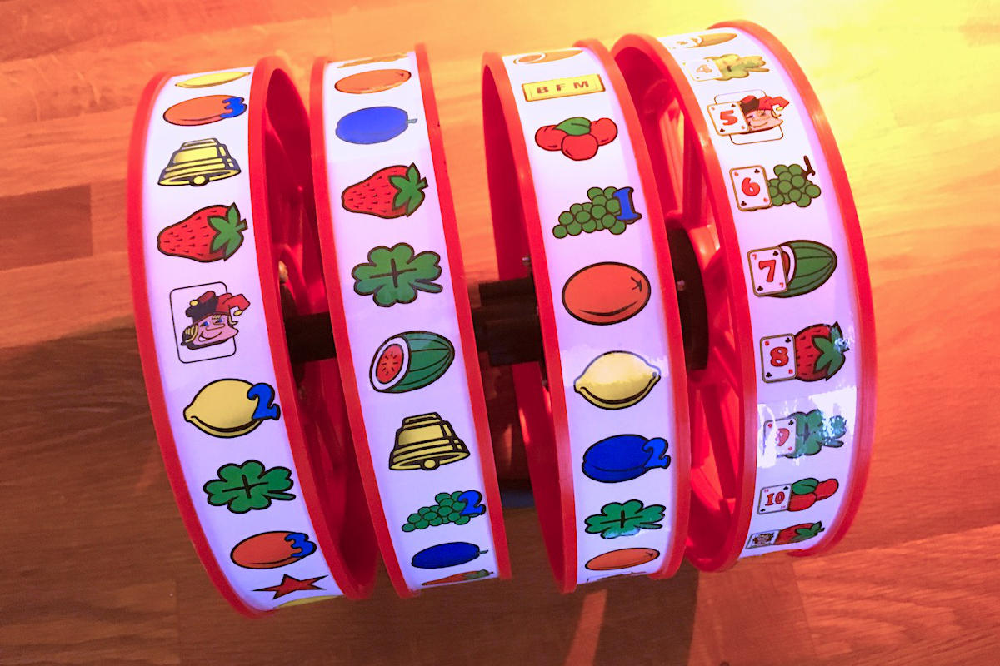

The slot machines was [invented in San Francisco](https://www.thoughtco.com/history-of-slot-machines-liberty-bell-1992409), around the end of the 19th century, by a mechanical engineer named Charles Fey. The slot machine invented by Frey where purely mechanical.
The reels where set in motion by pulling the handle on the side of the machine downwards giving these machines the [One-armed Bandit](https://en.wiktionary.org/wiki/one-armed_bandit) nickname. The turning wheels would stop at random positions by a springs and a gearing mechanism.

Modern slot machines a computer operated, i.e. the computer pulls a random number and the reels are spun and stopped only to achieve a look and feel similar to the original machines. For the Jokers Wild Tribute the reels that were [salvaged](../jokerswild/killing-one-for-the-cause/) needed appropriate artwork. So I made vector drawings of the different symbols and compiled the reels in the correct configuration. The fourth reel is somewhat different; because each position also has a playcard that have an important role in the game.

Just in case somebody wants to reuse them for their own project, the vector drawings I made for the different symbols on the reels can be downloaded below:

