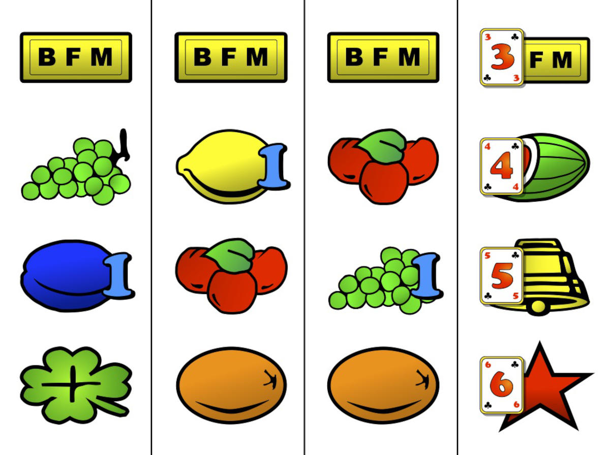
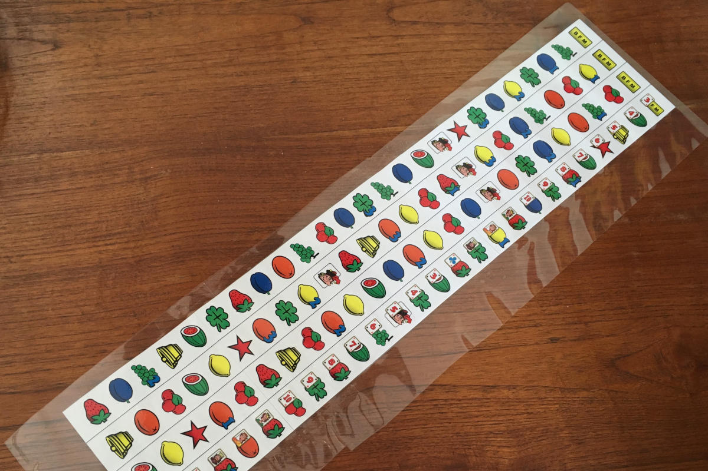
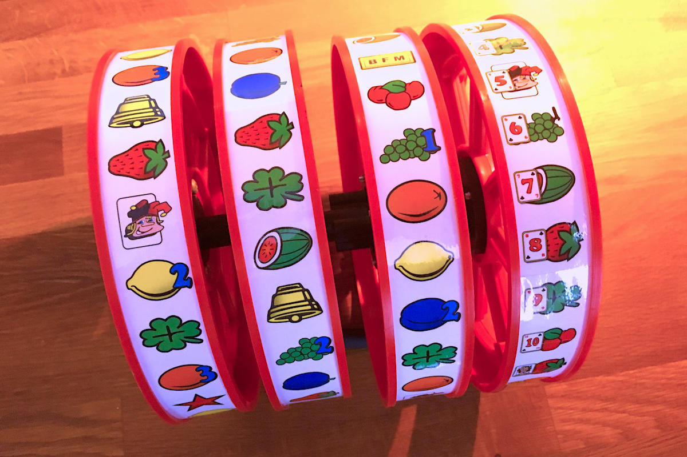

De gokautomaten werden [uitgevonden in San Francisco](https://www.thoughtco.com/history-of-slot-machines-liberty-bell-1992409), rond het einde van de 19e eeuw, door een werktuigbouwkundig ingenieur genaamd Charles Fey.
De door Frey uitgevonden gokautomaat was puur mechanisch.
De wielen werden in beweging gezet door de hendel aan de zijkant van de machine naar beneden te trekken, waardoor deze machines de bijnaam [één-armige bandiet](https://en.wiktionary.org/wiki/one-armed_bandit) kregen.
De draaiende wielen stopten op willekeurige posities door veren en een vertragend tandwielmechanisme.

Moderne gokautomaten worden door een computer bediend, d.w.z. de computer trekt een willekeurig getal en de rollen worden alleen rondgedraaid en gestopt om een look-and-feel te krijgen die vergelijkbaar is met de originele machines.
Voor de _Jokers Wild Tribute_ hadden de rollen die werden [recycled](../jokerswild/killing-one-for-the-cause/) passende afbeeldingen nodig.
Dus heb ik vectortekeningen gemaakt van de verschillende symbolen en de rollen in de juiste configuratie samengesteld.
De vierde rol is iets anders; omdat elke positie ook een speelkaart heeft die een belangrijke rol speelt in het spel.

Voor het geval iemand de afbeeldingen wil gebruiken in een eigen project, de vectortekeningen die ik heb gemaakt voor de verschillende symbolen op de rollen kunnen hieronder worden gedownload:

