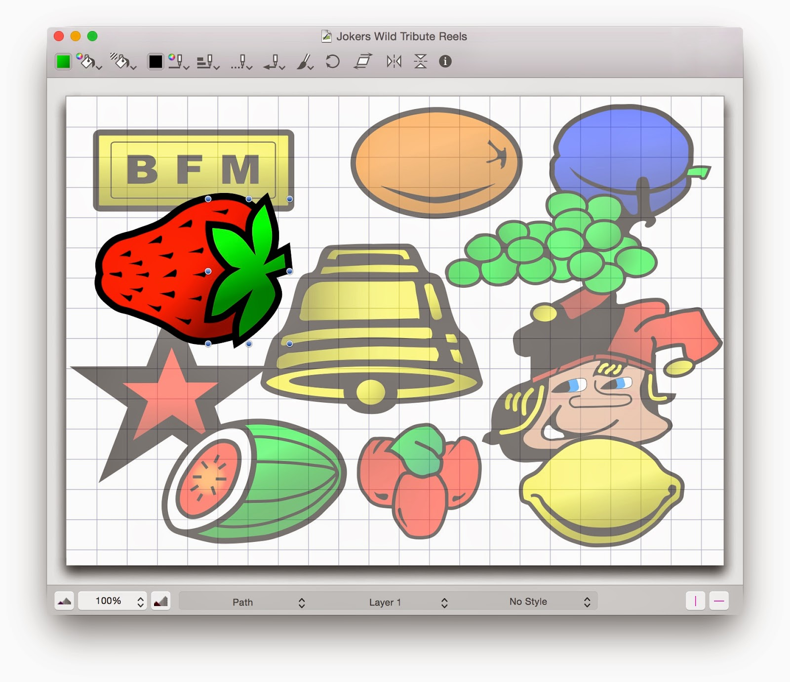
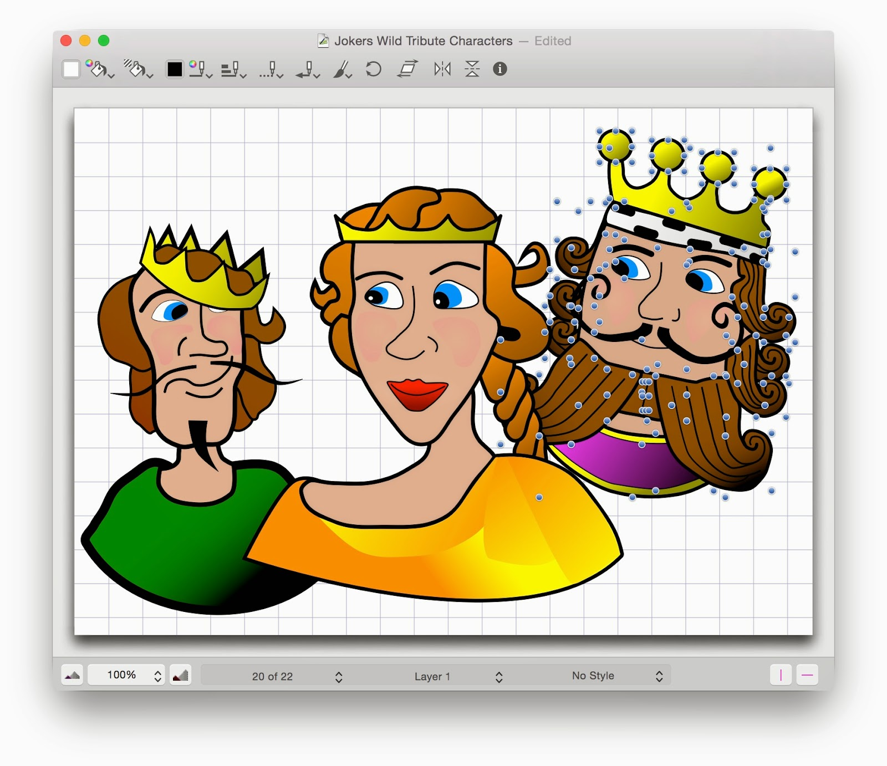

Tot nu toe kon ik slechts twee websites vinden met wat informatie over de originele (Nederlandse) fruitmachine Jokers Wild gebouwd door [Bell-Fruit Manufacturing Co. Ltd.](http://www.bellfruitgames.co.uk/bell-fruit-group/about-us).
De machine werd gebouwd op hun System'85 CPU-platform en kwam uit in december 1986. De eerste keer dat ik deze machine zag was in de zomer van 1987 (hé, daar gaat weer een belletje rinkelen. Die zomer besteedde ik vele uren aan het spelen met deze machine en heb er op de een of andere manier altijd goede herinneringen aan bewaard.

Het eerste wat ik ontdekte was [dit forum](http://www.fruit-emu.com/forums/index.php?/files/file/1542-jokers-wild-dx-dutch/) op web-emulators die een rom-emulatie van de BFM-machine.
Nog handiger is de website [Gokkasten Archief](http://www.gokkastenarchief.nl/online/jokers-wild/) die een verwijzing naar (oude) gokautomaten wil geven.
Stukjes informatie, wat artwork en enkele foto's van lage kwaliteit die op deze twee websites werden gevonden, werden gebruikt om te beginnen met het artwork voor mijn tribute-machine.

Ik ben eerder een techneut dan een artiest, dus ik bezit geen professionele tekentools zoals Adobe Illustrator en dergelijke, en ik heb ook niet de vaardigheden om ermee te werken.
Tijdens een goede dag tekenen in een (inmiddels ter ziele gegane) app genaamd Intaglio, heb ik de vectorillustraties gemaakt die op de rollen moeten worden gebruikt:

Het hoofdspel van Jokers Wild is gebaseerd op een pak speelkaarten, en afgezien van de voor de hand liggende [Joker-figuur](http://en.wikipedia.org/wiki/Joker_(playing_card)), de [Jack](http://en.wikipedia.org/wiki/Jack_(playing_card)), [Queen](http://en.wikipedia.org/wiki/Queen_(playing_card)) en [King](http://en.wikipedia.org/wiki/King_(playing_card)) worden herhaaldelijk weergegeven op de originele illustratie.
Door de schaarse afbeeldingen van lage kwaliteit die op internet te vinden zijn als referentie te gebruiken heb ik ook van deze drie karakters heb ik een impressie getekend.
Over het algemeen ben ik best tevreden met het resultaat, vooral omdat het niet mijn bedoeling is om een perfecte replica te maken.
De resulterende afbeeldingen geven me "het gevoel" van de daadwerkelijke machine zoals ik me die herinner, en zullen goed van pas komen op de rollen en displays.