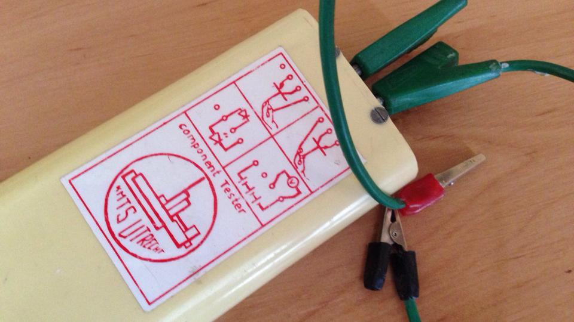

Een paar maanden geleden kwam ik dit leuke [kickstarter-initiatief](https://www.kickstarter.com/projects/alexklein/kano-a-computer-anyone-can-make) tegen genaamd [Kano](http://www.kano.me/).
Meer dan 13 duizend mensen steunen ze; en ze verzamelden 15 keer de 100.000 dollar die ze nodig hadden om hun product een vliegende start te geven. Goed gedaan!

We moesten [er gewoon één bestellen](https://www.youtube.com/watch?v=O9aZ8rVi7Bg) om de interesse van mijn zoon in computer(games) enigszins te verdiepen met behulp van de leuke [Kano Blocks](https://www.youtube.com/watch?v=AuqRGEXznfQ) om meer te leren over programmeren met behulp van [Minecraft](http://en.wikipedia.org/wiki/Minecraft) als een uitstekend instrument om de logica van coderen en 3D-codering aan te leren.

Kano is gebouwd op een [Raspberry Pi](http://en.wikipedia.org/wiki/Raspberry_Pi) single-board computer waarop een sterk gewijzigde Linux-distributie draait.

Voordat ik overstapte naar een bachelordiploma in [Computer Science](http://en.wikipedia.org/wiki/Computer_science), studeerde ik [Electronics](http://en.wikipedia.org/wiki/Electronics) aan de K.M.T.S. te Utrecht.
Iets in het spelen met deze Kano-computer heeft mijn interesse in elektronica (opnieuw) aangewakkerd.

Maar een Raspberry Pi is nog steeds een complete computer en ik was op zoek naar iets praktischer, en vergeet niet dat ik veel heb gelezen over [Arduino's](http://www.arduino.cc/) in [MAKE magazine](http://makezine.com/) in de afgelopen jaren.
De Arduino lijkt een perfect speeltje voor een leuk project.
Het enige wat ik nu nog nodig had, was een idee.

En ergens tijdens de volgende paar dagen leek een idee op zijn plaats te vallen:
_Wat als ik zou proberen een eenvoudige [slotmachine](http://en.wikipedia.org/wiki/Slot_machine) te maken met behulp van een Arduino?_

Dat zou veel verschillende componenten moeten hebben; zoals het laten draaien van [stappenmotoren](http://en.wikipedia.org/wiki/Stepper_motor) om de rollen aan te drijven, het proberen van [charlieplexing](http://en.wikipedia.org/wiki/Charlieplexing) als een eenvoudige manier om ongeveer 10 verschillende knoppen multiplexen naar de beperkte pinnen van de Arduino en een [Serial Pheriperal Interface](http://arduino.cc/en/Reference/SPI) gebruiken om ongeveer 100 verschillende [LED's](http://en.wikipedia.org/wiki/Light-emitting_diode) voor het beeldscherm met de zeer beperkte invoerpennen.
Als dit niet genoeg uitdaging zou bieden, wat dan wel?

Toen ik 17 was en elektronica studeerde, was er een bepaalde fruitmachine die ik graag bespeelde. Die specifieke machine, genaamd [_Jokers Wild_](https://www.gokkastenarchief.nl/online/jokers-wild/), en zijn gameplay zal mijn voorbeeld zijn bij het bouwen van een eerbetoonfruitmachine op basis van een Arduino.

Dat moet leuk zijn, niet?
