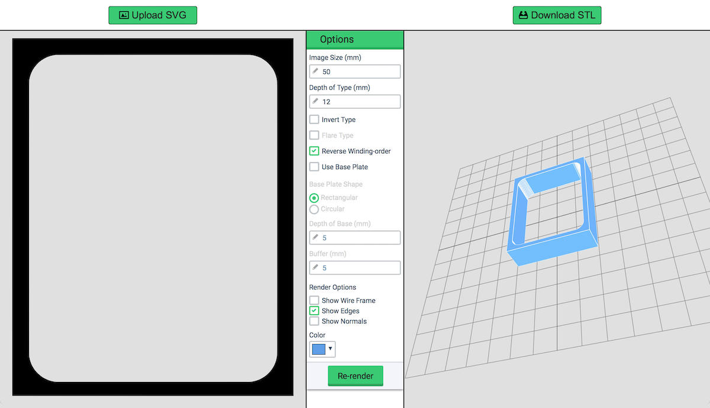
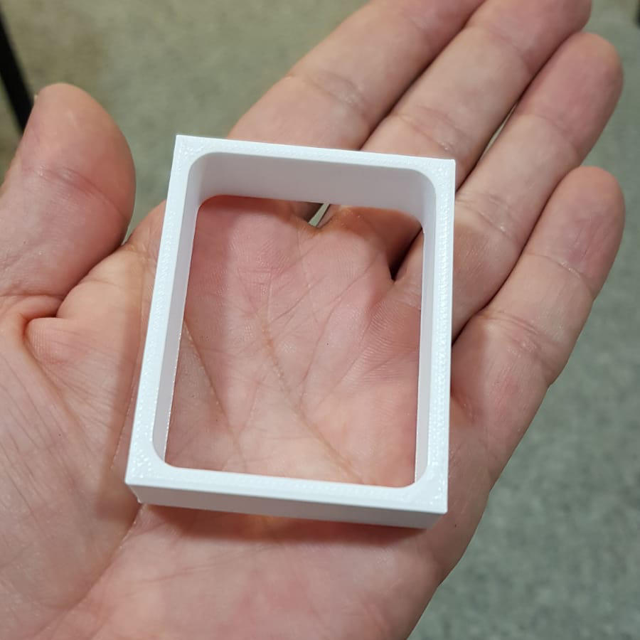
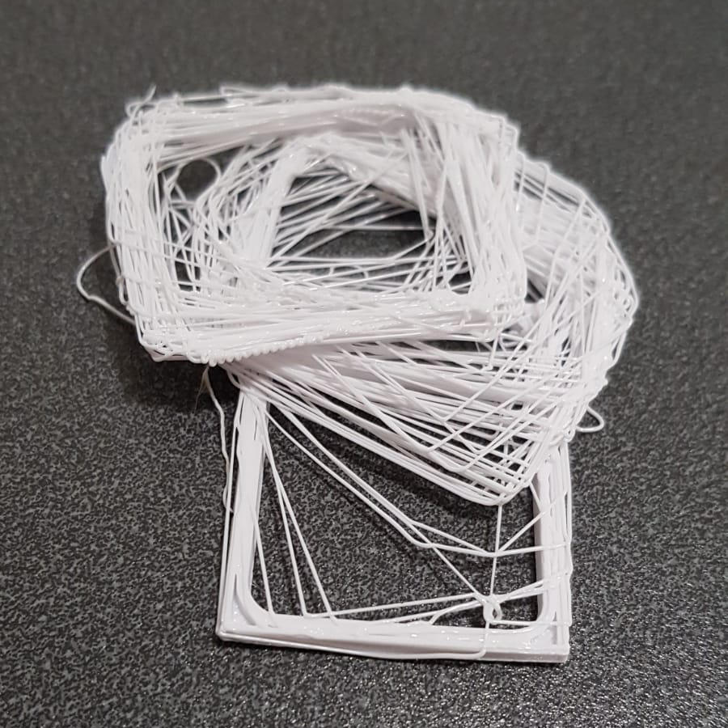
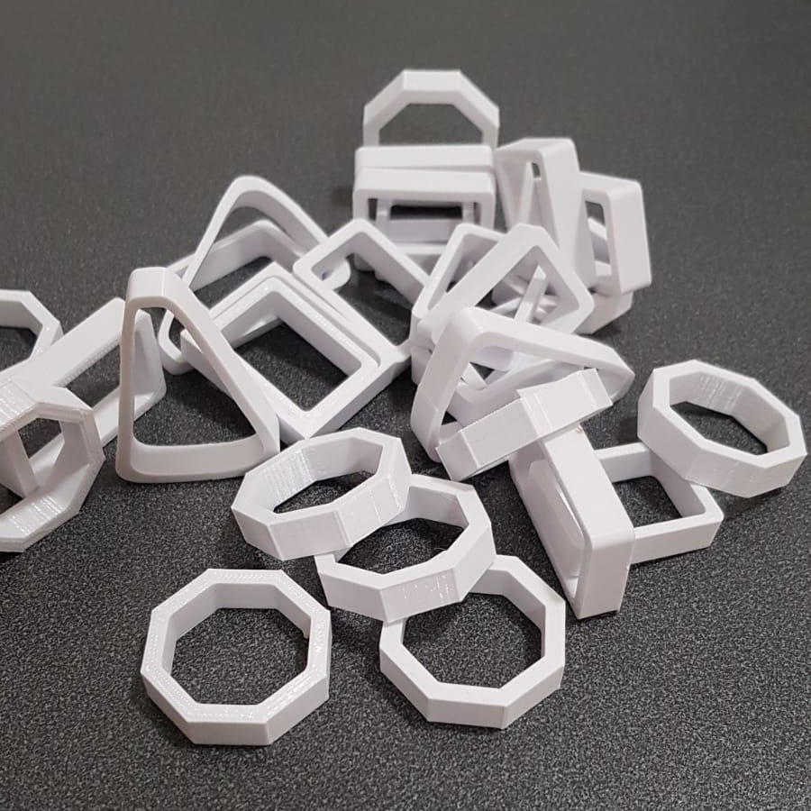
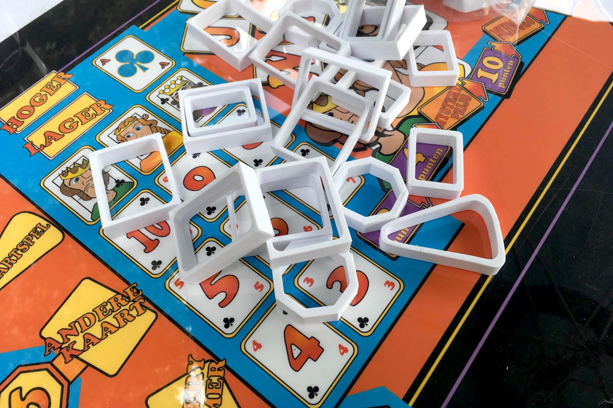
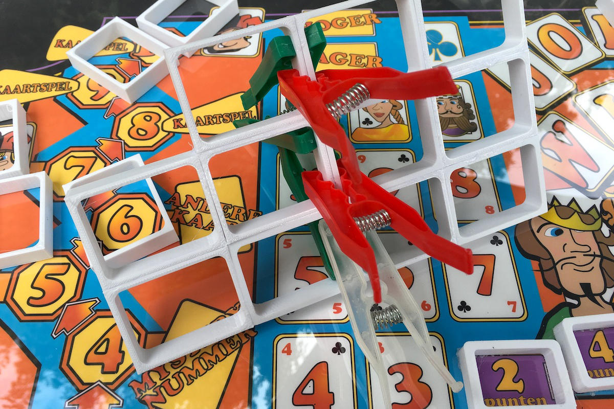
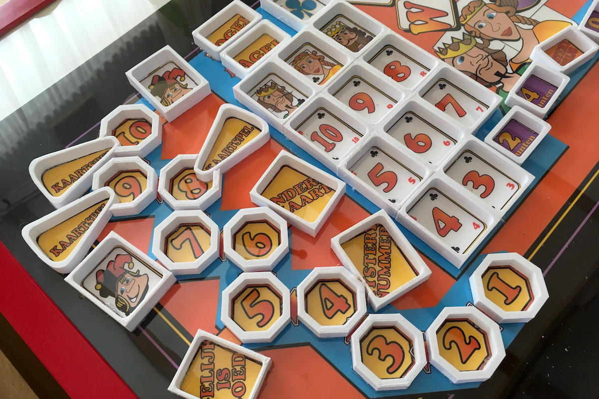
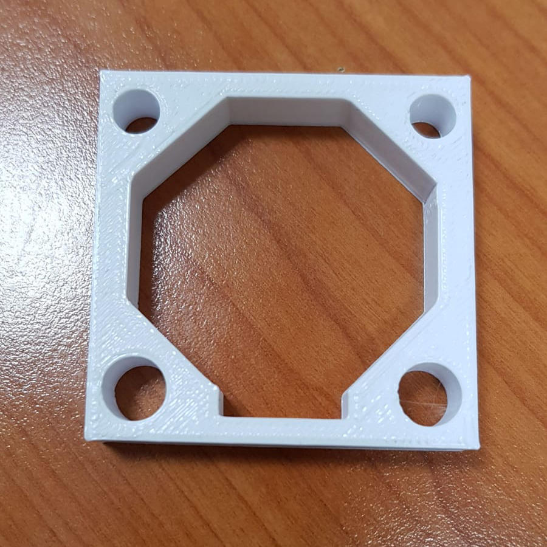
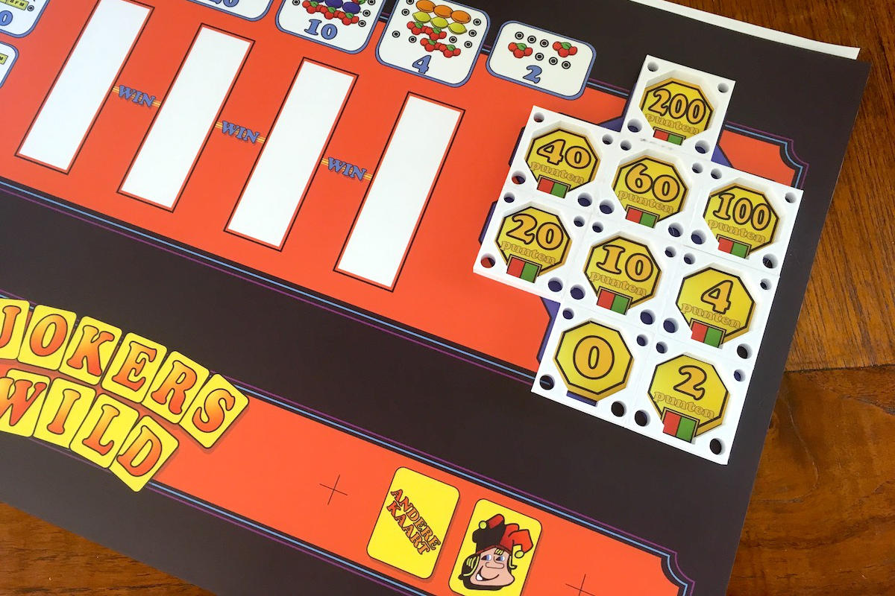
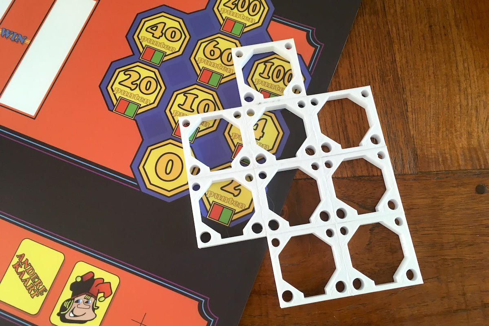

De eerste poging betrof het met de hand zagen van meer dan 60 individuele vakjes in een massieve MDF-plaat van 9mm.
Naast dat dit VEEL werk was om de gaten te zagen en te schuren, was het resultaat veel te slordig.
Een soort computerondersteunde router zou waarschijnlijk de beste oplossing zijn, maar dat gaat mijn toolset te boven.
Ik had toen nog geen 3D-printer, maar een vriend was bereid om wat 3D-printwerk voor me te doen als dat nodig was.

Het hele display is vrij groot en zou zeker niet in zijn geheel kunnen worden geprint met de 3D-printer die een vrij klein werkoppervlak heeft.
Zo ontstond het idee om losse, min of meer standaard vakjes te printen en deze later te verlijmen tot een geheel rooster.
Er werd een eenvoudige ontwerptool gebruikt om STL-bestanden te maken van een 2D-ontwerp en in een paar dagen tijd werden alle vakjes geprint.

Over de afdruk van het kunstwerk dat ik heb gemaakt, is een transparant stuk plastic geplaatst.
Dit zou de tijdelijke template zijn om ervoor te zorgen dat vakjes op de juiste positie terechtkwamen.
Individuele vakjes worden op de tijdelijke template gelijmd en de resterende ruimte zal worden gevuld met epoxy om te eindigen met één stevig paneel.

De constructie van het desk-paneel zal iets anders zijn, omdat het grootste deel van dit paneel niet verlicht zal zijn.
Eén rooster voor het gokspel ontstaat door 9 rechthoekige vakjes aan elkaar te lijmen.
De buitenkant van de vakjes is vierkant gemaakt om het lijmen eenvoudig te maken en er zijn 4 tunnels in elk stuk getekend om meer stabiliteit in de 3D-print toe te voegen.

