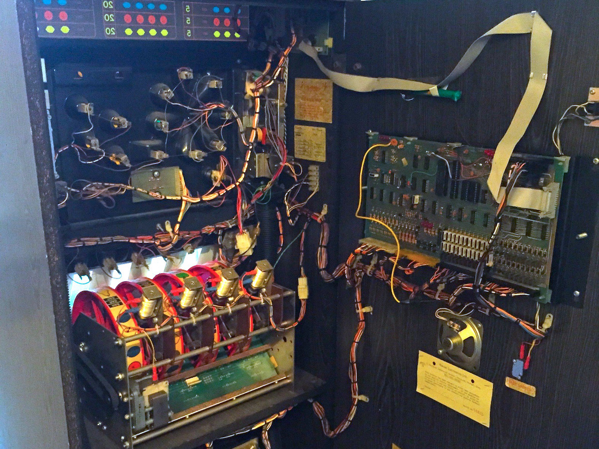
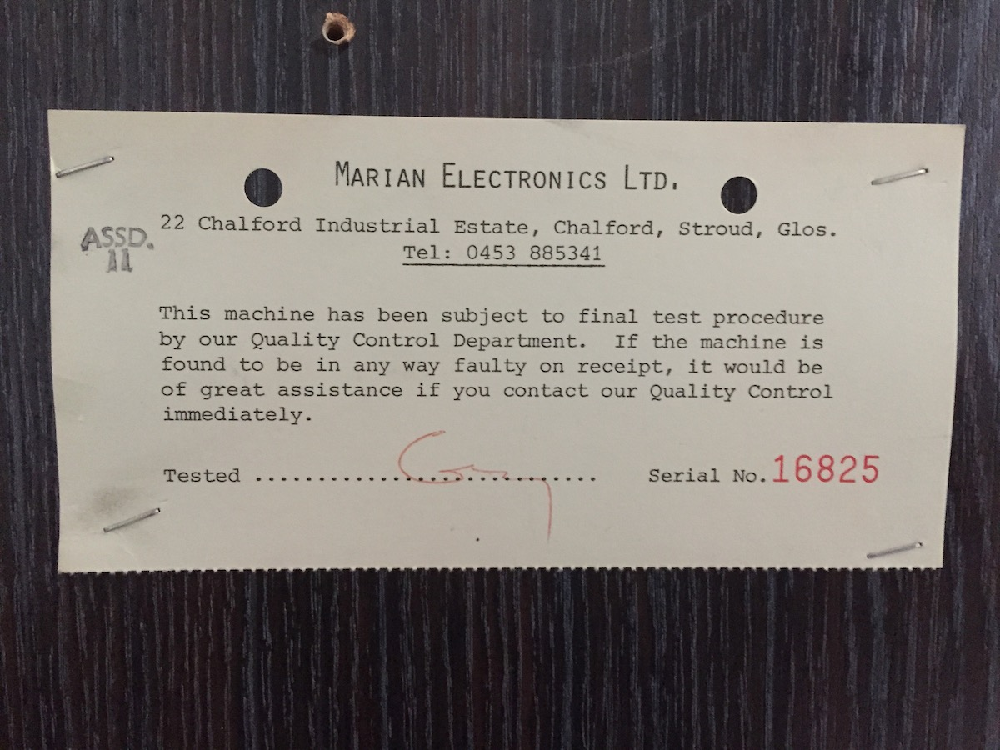
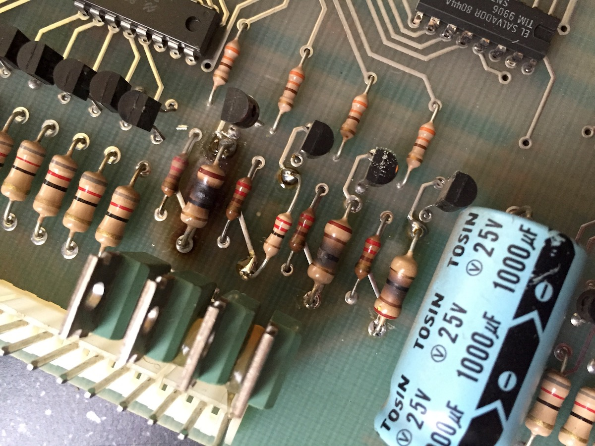

And so you have this idea for a project in your head, and many hours pass by browsing the [internets](http://en.m.wikipedia.org/wiki/Internets) and even the massive paper catalogue of [Conrad Electronic](https://www.conrad.nl/nl/componenten.html). Learning about components, their sources and their prices.

On [Marktplaats](http://www.marktplaats.nl/z/verzamelen/automaten-gokkasten-en-fruitautomaten.html?categoryId=1625) I came across an defunct early eighties slotmachine for a silly low price. This particular machine was built by [Marian Electronics Ltd.](http://uk.trademarkdirect.co.uk/marian-1162334) in February 1981 and the game was called _Hold It._
That was a nice start to harvest a couple of these typical slotmachine buttons from and since this old machine had four reels; these could possibly be reused too.

Picked it up and started to disassemble the poor machine. With heavily corroded [PCB's](http://en.wikipedia.org/wiki/Printed_circuit_board) and some burned [components](http://en.wikipedia.org/wiki/Resistor) it was obviously dead although I am not sure what it would have took te repair it. What I paid was well worth one or two buttons, so I swiftly removed what I needed and left the remainder of the machine in an even more miserable state than I found it (and a colleague wanted to adopt the housing).

_Hold It_ used mostly [incandescent](http://en.wikipedia.org/wiki/Incandescent_light_bulb) and [fluorescent](http://en.wikipedia.org/wiki/Fluorescent_lamp) lighting, so most of that was left inside or removed for another colleague that restores pinball machines. The reels proved to be of a different (even older) type than I envisioned for my project. This older machine used a powerful 50V motor, driving mechanical disc by a rubber band. [Solenoid valves](http://en.wikipedia.org/wiki/Solenoid_valve) stop the mechanical discs (and thus the reels of the slotmachine) in their required position, while holes in this discs are read by photosensors to determine and/or verify the correct position.

For my project I wanted to play with [stepper motors](http://en.wikipedia.org/wiki/Stepper_motor) driving the individual reels, so most of the mechanical stuff around the reels will be removed. But still, in addition to all the good buttons and a couple of [7-segment LED's](http://en.wikipedia.org/wiki/Seven-segment_display), I could harvest this 4 plastic reels that will be reused on my tribute slotmachine.