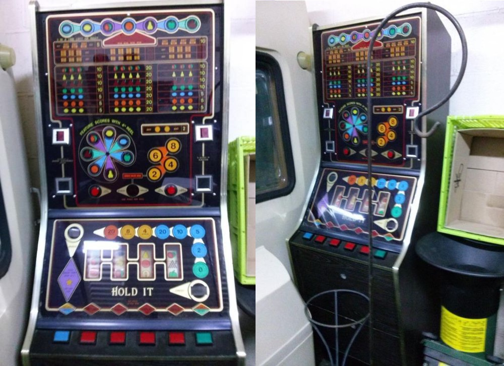
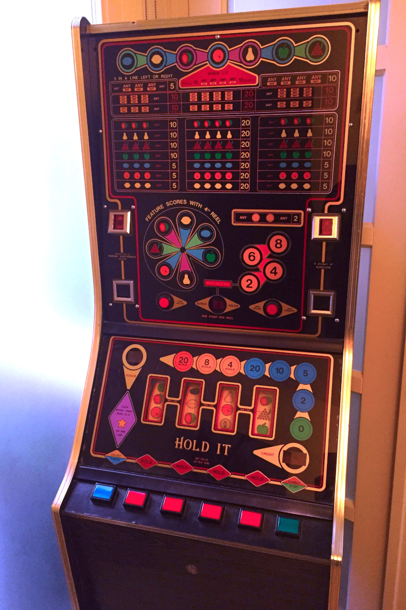
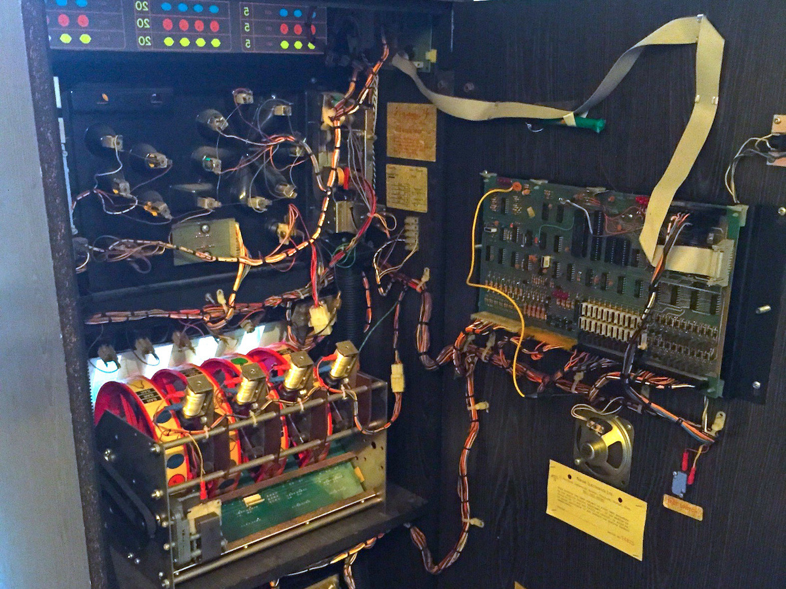
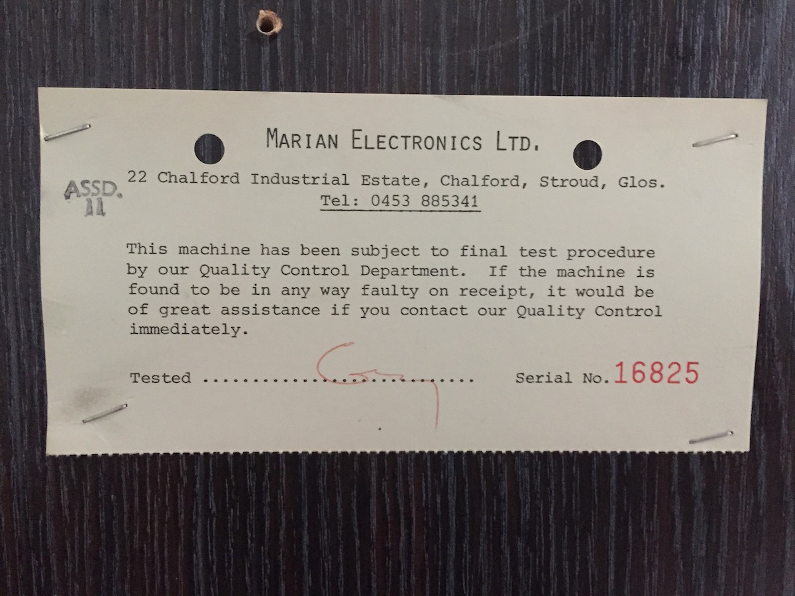
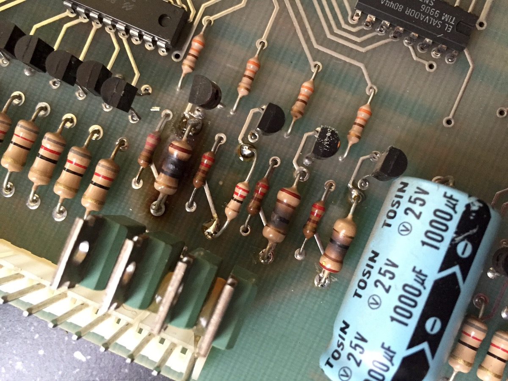
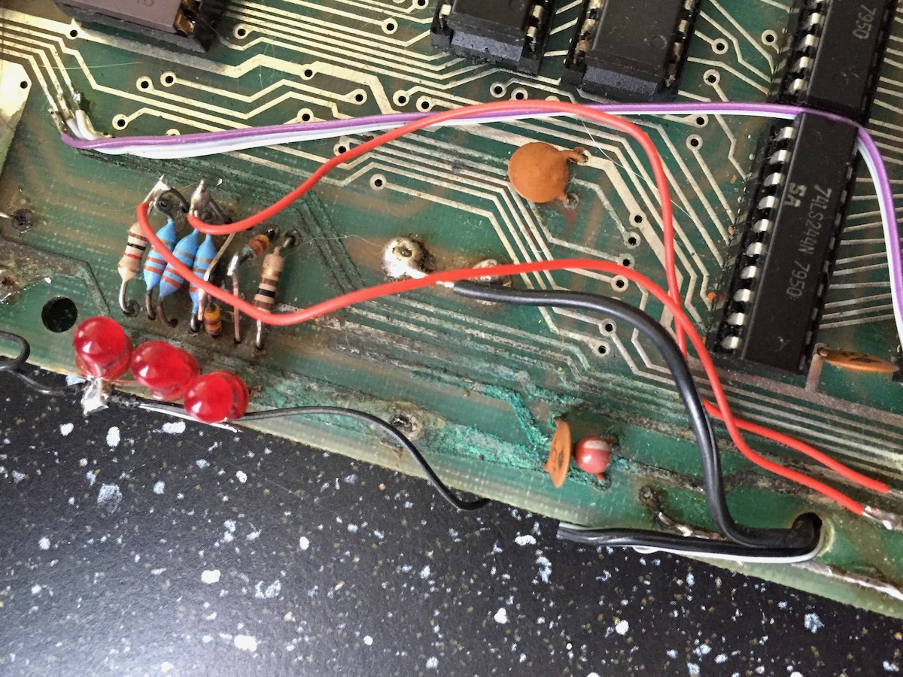

En dus heb je dat idee voor een project in je hoofd, en vele uren gaan voorbij met het surfen op [internet](http://en.m.wikipedia.org/wiki/Internets) en zelfs de enorme papieren catalogus van [Conrad Electronic ](https://www.conrad.nl/nl/componenten.html).
Leren over componenten, hun bronnen en hun prijzen.

Op [Marktplaats](http://www.marktplaats.nl/z/verzamelen/automaten-gokkasten-en-fruitautomaten.html?categoryId=1625) kwam ik een ter ziele gegane gokautomaat uit de vroege jaren tachtig tegen voor een belachelijk lage prijs.
Deze specifieke machine werd gebouwd door [Marian Electronics Ltd.](http://uk.trademarkdirect.co.uk/marian-1162334) in februari 1981 en het spel heette _Hold It._
Dat was een mooi begin om een paar van deze typische gokautomaat-knoppen te oogsten en aangezien deze oude machine vier rollen had; deze kunnen mogelijk ook worden hergebruikt.

Nu de machine te hebben opgehaald begon ik de arme machine te demonteren.
Met zwaar gecorrodeerde [PCB's](http://en.wikipedia.org/wiki/Printed_circuit_board) en enkele verbrande [componenten](http://en.wikipedia.org/wiki/Resistor) was de machine duidelijk overleden hoewel ik niet zeker ben hoeveel moeite het zou hebben gekost om hem te repareren.
Wat ik betaalde was één of twee knopen meer dan waard, dus verwijderde ik snel wat ik nodig had en liet de rest van de machine in een nog ellendiger staat achter dan ik hem aantrof (en een collega wilde de behuizing adopteren).

_Hold It_ gebruikte voornamelijk [gloeilampen](http://en.wikipedia.org/wiki/Incandescent_light_bulb) en [fluorescerende](http://en.wikipedia.org/wiki/Fluorescent_lamp) verlichting, dus het meeste daarvan bleef zitten of werd verwijderd voor een andere collega die flipperkasten restaureert.
De schijven bleken van een ander (zelfs ouder) type te zijn dan ik voor ogen had voor mijn project.
Deze oudere machine gebruikte een krachtige 50V-motor, die een mechanische schijf aandreef met een rubberen band.
[Solenoid valves](http://en.wikipedia.org/wiki/Solenoid_valve) stoppen de mechanische schijven (en dus de rollen van de gokautomaat) in hun gewenste positie, terwijl gaten in deze schijven worden gelezen door fotosensoren om te bepalen en/of verifiëren van de juiste positie.

Voor mijn project wilde ik spelen met [stappenmotoren](http://en.wikipedia.org/wiki/Stepper_motor) die de afzonderlijke spoelen aandrijven, zodat de meeste mechanische dingen rond de spoelen worden verwijderd
Maar toch, naast alle goede knoppen en een paar [7-segment LED's](http://en.wikipedia.org/wiki/Seven-segment_display), heb ik 4 plastic rollen kunnen oogsten die zullen worden hergebruikt op mijn tribute slotmachine.