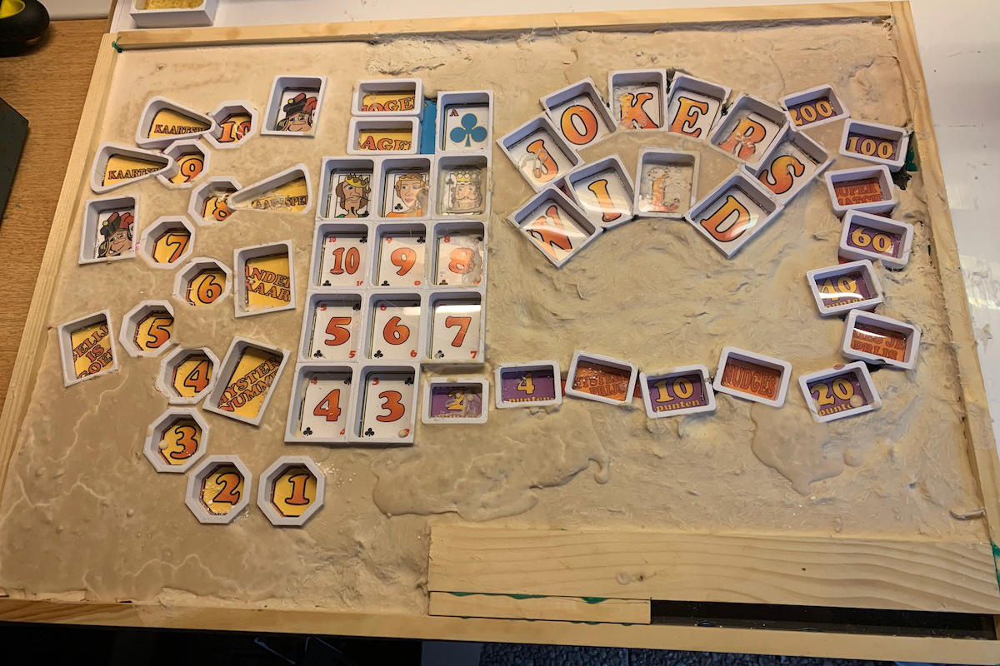
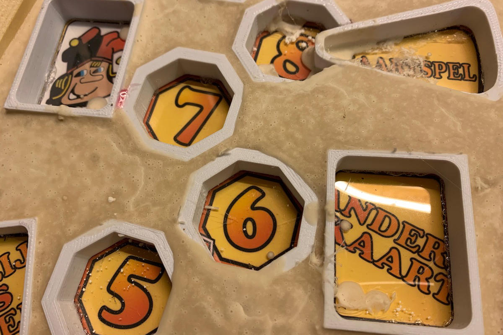
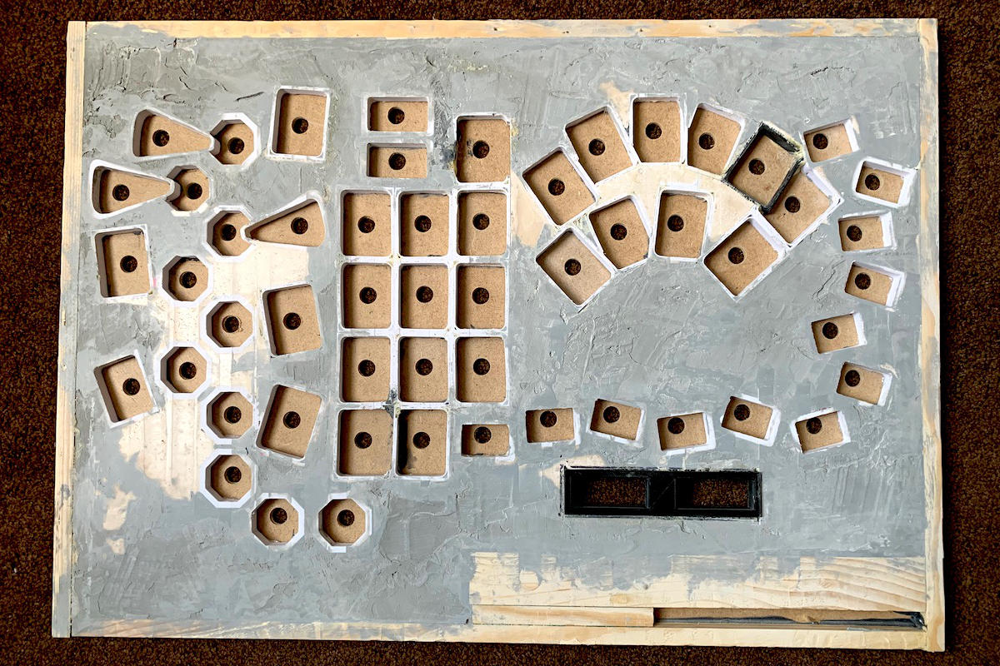
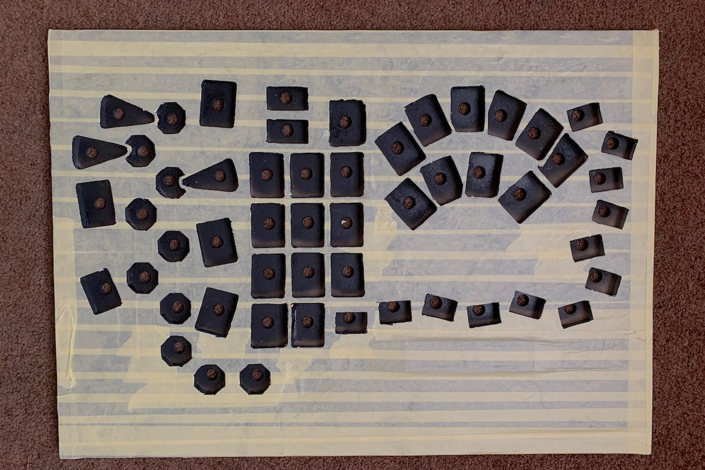
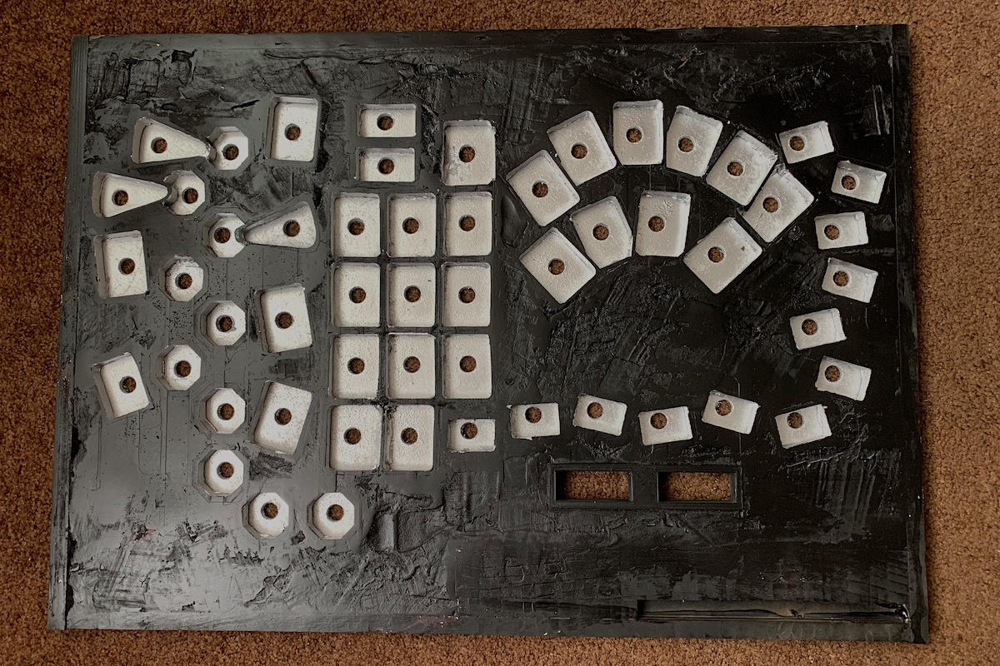
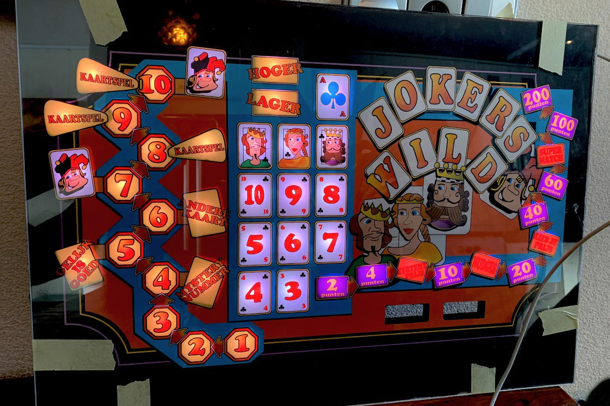

Nu was het tijd om een stevig rooster te maken van de ruim 60 individuele 3D prints die op een transparant stuk plastic waren geplakt.
Aan de buitenkant van het rooster is een houten rand gemaakt die de montage later eenvoudiger maakt.
Om de uithardingstemperatuur laag te houden (mijn PLA-printjes zijn niet zo hittebestendig) kies ik [resin](https://www.siliconesandmore.com/nl/a1-acrylhars.html).
Een vulmateriaal van glasvezel werd toegevoegd om hars te besparen en de sterkte van het gietsel te vergroten.
Dit was de eerste keer dat ik hars giet en het bleek dat ik te veel vulmateriaal had toegevoegd waardoor de hars niet lekker meer vloeide.
Het resultaat had daardoor wat extra plamuur en schuurwerk nodig, maar toch was ik best tevreden met het resultaat.
Ook in deze fase werd een 3D-geprinte (zwart in de afbeelding) frames toegevoegd om de montage van enkele [7-segment leds](https://www.adafruit.com/category/37_103) te vergemakkelijken om tijdens het spel verdiende punten weer te geven.
Uiteindelijk is het geheel een beetje opgeschuurd.

Tussen dit rooster en de bedrukte graphics komt een stukje zwart vilt om oneffenheden weg te werken en krassen op de graphics te voorkomen.
Hoewel nog wat ruw, was het paneel nu af en eerst zwart gespoten.
Een donkere kleur was natuurlijk logisch om lichtlekkage te minimaliseren.
De binnenkant van de vakjes is zilver gespoten om wat licht te weerkaatsen, en een zwarte onderlaag is hoe dan ook een goed idee bij het spuiten van zilver.

Om eindeloos solderen van LED's en draden te besparen, heb ik gekozen voor deze [individueel adresseerbare LED's](https://nl.aliexpress.com/item/32571441392.html) die een snelle test vrij eenvoudig maakten.
Bij het nadenken over het project, toen ik hiermee begon, leek het maken van het paneel een vrij eenvoudige klus om gaten in een stuk hout te frezen.
Uiteindelijk bleek het een heel avontuur te zijn dat verschillende keren werd uitgesteld.
Het resultaat, vanaf de buitenkant van het paneel, is ongeveer zoals ik het me had voorgesteld.

