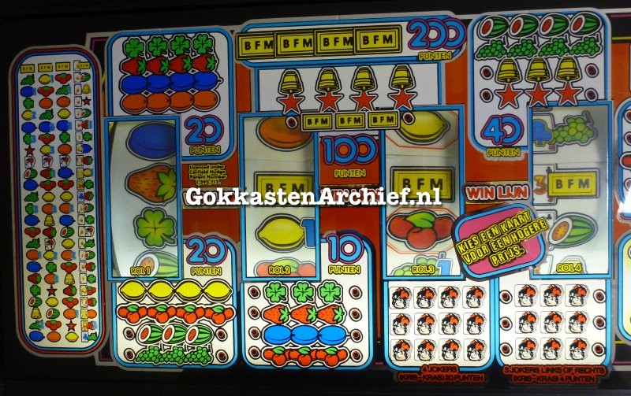
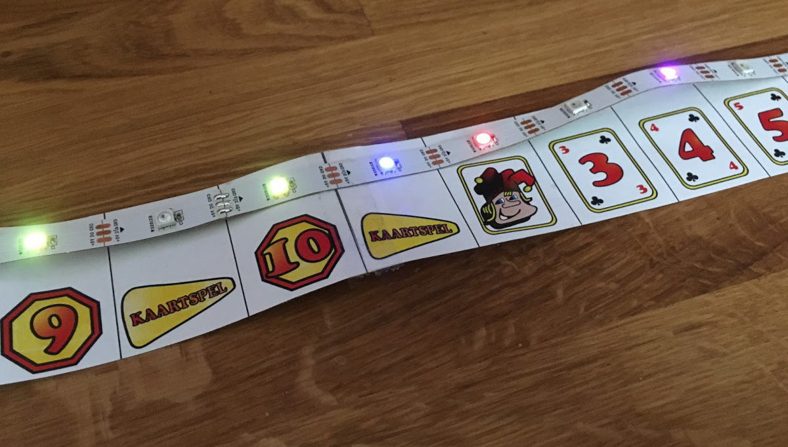

Er zijn vele maanden verstreken, maar ik heb wat tijd gevonden om weer aan het Arduino-project te werken.
Het doel van de volgende stap is om een proof of concept te doen met de HUD (head-up display) van de gokautomaat.
Hoewel ik geen idee heb of HUD de "officiële" naam is om te verwijzen naar de bovenste helft van de gokautomaat, waar het hoofdspel wordt gespeeld, lijkt het een handige term om te gebruiken.

Hoe dan ook; de website [gokkastenarchief.nl](http://www.gokkastenarchief.nl/online/jokers-wild/) is verreweg de beste referentie die ik kon vinden.
De afbeelding hieronder toont de 'HUD' en wat erop staat.

Het feature-spel wordt geactiveerd door punten die worden bepaald op de 4e rol en wordt gespeeld met kaarten die ook op deze 4e rol worden weergegeven.
Laten we dat voor nu even voor wat het is en gewoon het concept bewijzen van het aansturen van al deze lichten (en enkele eenvoudige geluidseffecten) van de Arduino.

Een eenvoudige schets (gemaakt met het geweldige online platform [circuits.io](https://www.circuits.io/) door AutoDesk) van de gebruikte opstelling:

Het interessante is het ding rechtsonder, een [NeoPixel](https://www.adafruit.com/products/1376) strip genoemd door AdaFruit.
Ik heb een overgebleven lengte met 46 NeoPixels dat ik heb gebruikt om de 3 hoofdonderdelen van de HUD te simuleren.

1. Weergave van punten (links) die het feature-spel activeren (de functie is op dit moment niet belangrijk)
   - Stappen **1** t/m **10**
   - **Mystery Number** naast positie 4
   - **Gelijk is Goed** naast positie 5
   - **Andere Kaart** naast positie 6
   - **Joker** naast positie 7 en 10
   - **Kaartspel** naast positie 8,9 en 10
2. Kaartspel, dat begint wanneer 8, 9 of 10 punten zijn bereikt
    - Kaarten **3** t/m **10**, **Boer**, **Koningin**, **Koning** en **Aas**
    - Gokken **Hoger** en **Lager**
3. Prijzen te winnen als het gokken met het Kaartspel lukt
    - 2, 4, 10, 20, 40, 60, 100, 200
    - Speciale prijzen **Mystery Prijs**, **Nudges**, **Kies je Prijs** en **Super Match**

Als we dat allemaal optellen; er zijn 44 LED's om aan te sturen in deze proof-of-concept voor de HUD.
De strip werd nog even intact gehouden en naast een afdruk met het symbool gelegd.

Ik vond het leuk om wat simpele geluidseffecten te hebben die bij de bewegende lichten passen, maar ik wilde geen mp3 of dergelijke bestanden gebruiken.
Gelukkig kwam ik na wat googelen deze [mooie bibliotheek](https://mycontraption.com/sound-effects-with-and-arduino/) tegen van geluidseffecten die eenvoudige, ongecompliceerde signalen naar een piëzo stuurt.
Dit vraagt maar weinig geheugen of processor capaciteit en levert toch precies het soort geluidseffecten waar ik naar op zoek was.
