## Er was eens
OK, nu heb ik te veel boeken verzameld en mijn [IKEA BILLY](https://www.ikea.com/us/en/catalog/categories/series/28102/) boekenkasten blijven doorzakken.
Al een aantal jaar broedde ik op een plan om grote en stevige boekenkast specifiek voor mijn Ferrari-boeken.
Het universum antwoordde (enigszins).

Begin 2017 huurden we een nieuwe winkel en in de onderhandelingen boden we aan om het oude interieur (en afval) dat de vorige huurder had achtergelaten weg te halen in ruil voor andere zakelijke doelen die we hadden.
Tijdens de sloop kwamen we deze vrij grote (dus zo'n 4 meter breed, 2,6 meter hoog) kledingkasten tegen; glanzend zwart geverfd.
De horizontale planken waren nutteloze losse plankjes, maar de verticale staanders waren mooi en zwaar gelamineerd spaanplaat van 40 mm dik.
Verder heb ik nog een paar planken van 28mm gelamineerd fijnkorrelig spaanplaat uit het interieur van de kledingwinkel van de vorige huurder weten te redden.
We leenden een aanhanger van een vriend om de stapel lange en zware planken naar huis te verplaatsen, waar ze vervolgens een paar maanden bleven liggen.

## Zaagsel
Begin 2019 voelde de tijd rijp om te beginnen met het bouwen van mijn heavy-duty speciaal gebouwde rekken.
Aangezien ik maar enkele uren per maand zou kunnen besteden, wist ik van tevoren dat dit ding een paar maanden zou kunnen duren om af te ronden (maar jongen, had ik dat onderschat).
We hebben geen garage of werkplaats, en gezien de manier waarop ik de constructie zou doen, moest al het werk worden gedaan in de slaapkamer / kantoor waar de boekenkast zal eindigen als hij klaar is.

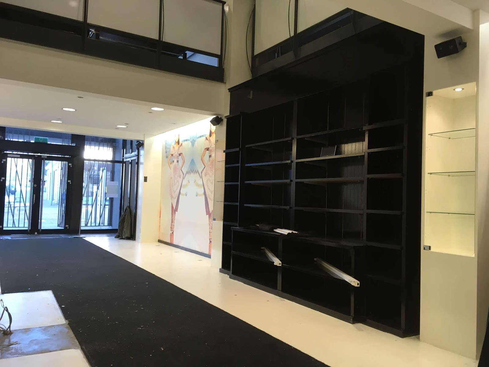
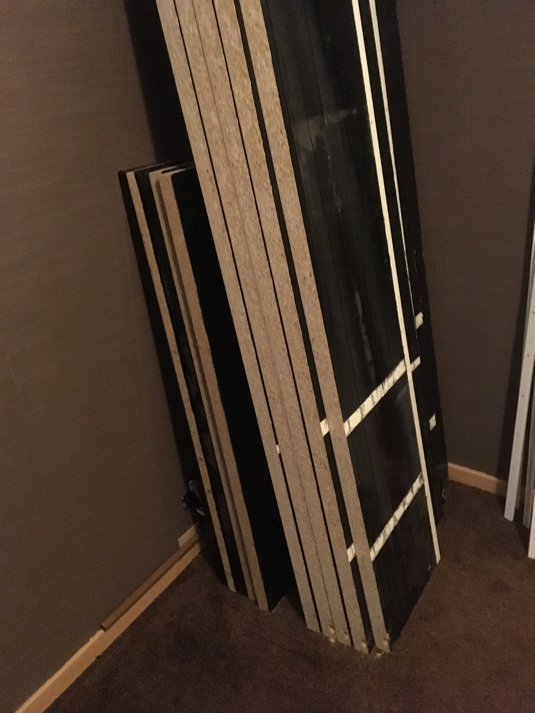

Dag 1 bestond uit met een cirkelzaag het gerecyclde hout op breedte te zagen (in een slaapkamer is dat een interessante ervaring, zelfs met een [aangesloten stofzuiger](https://www.bosch-professional.com/nl/nl/producten/gas-20-l-sfc-060197B000)).
Op de foto staat de afgewerkte stapel tegen de slaapkamermuur.
Het hout was oorspronkelijk wit en beige gelamineerd voordat het glanzend zwart opnieuw werd geverfd, vandaar het funky kleurenschema dat de komende maanden het uitzicht zou bepalen.

## Glued & Screwed
Er ontstond nog meer zaagsel bij het gebruik van een router om sleuven te maken die de planken met elkaar gaan verbinden.
Door het hout op deze manier met elkaar te verbinden, krijgt de hele structuur een goede sterkte terwijl het toch enigszins elegant blijft.

Alles aan elkaar gelijmd met [Gorilla Wood Glue](https://www.gorillaglue.nl/producten/gorilla_glue_houtlijm) (wat ik absoluut kan aanbevelen) en van buitenaf geschroefd om de boel bij elkaar te houden terwijl de lijm uithardt.
Door de plaatsing tegen de muur en de uiteindelijke afwerking van de linkerzijde van de boekenkast zijn de schroeven straks sowieso niet zichtbaar.
Door het skelet te maken terwijl de boekenkast in wezen op de voorkant lag, was het gemakkelijker om de dingen vierkant te houden (maar past nauwelijks op de vloer).
Er zijn een paar verstelbare voeten (ook recycled) geïnstalleerd om te voorkomen dat de onderste plank in het midden doorbuigt en tegelijkertijd een manier om de boekenkast waterpas te zetten en strak tegen de muur te stellen.

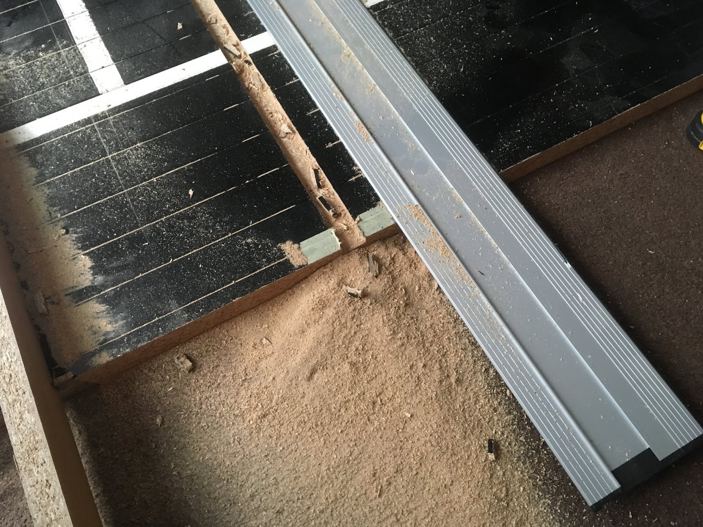
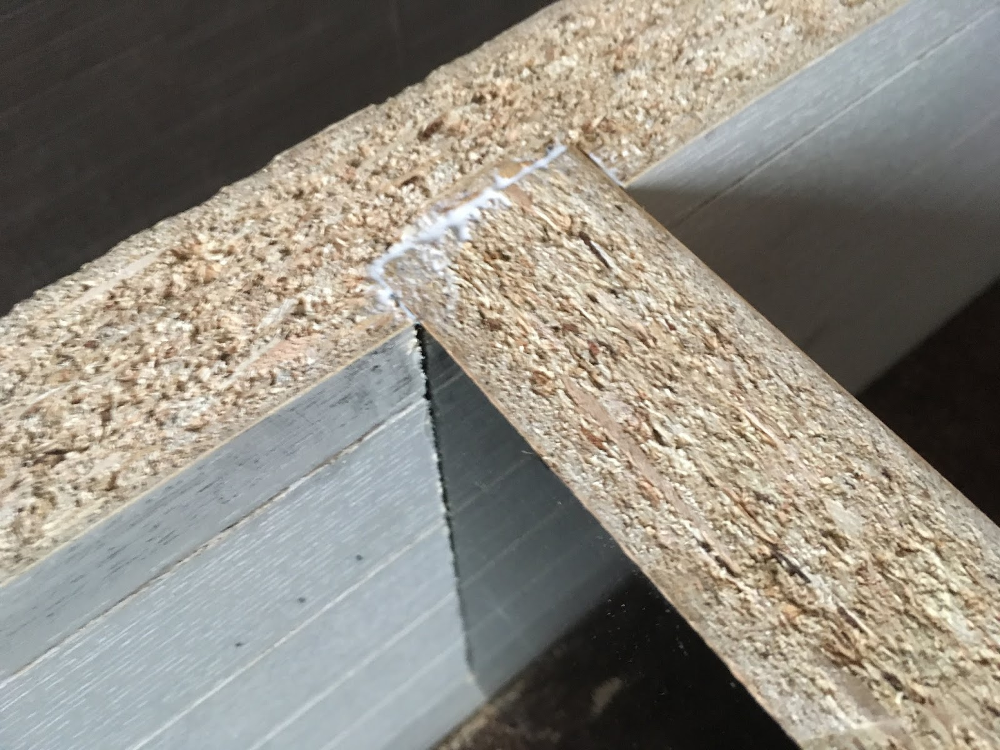
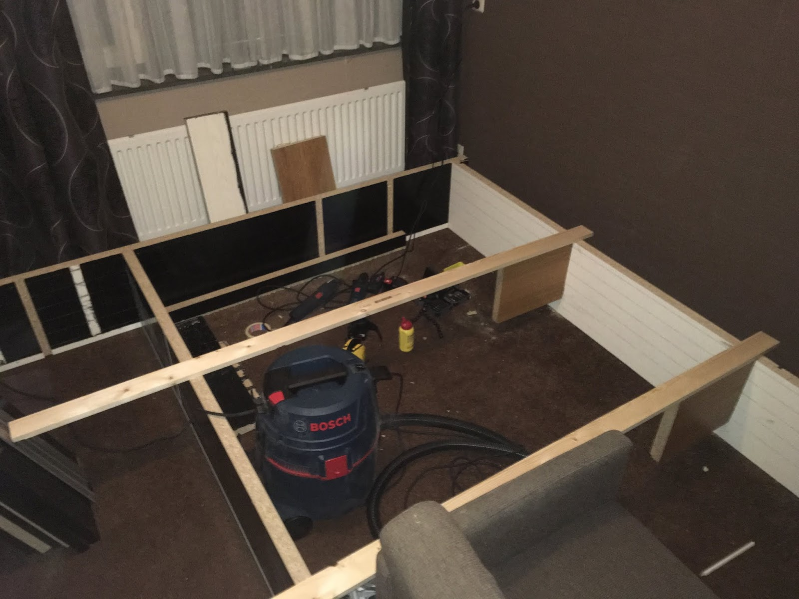
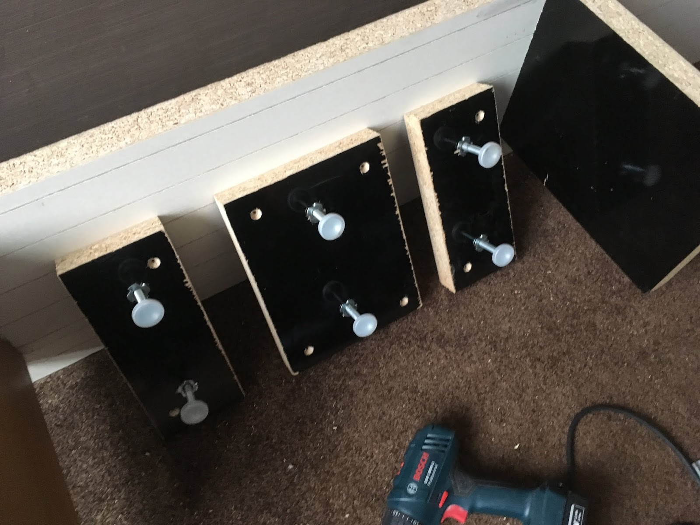

## Vakwerk
Met het skelet rechtop begon ik de vakken één voor één op te bouwen.
De maatvoering van de onderste vakken wordt bepaald door de maat van de [cassettes](https://www.hema.nl/vrije-tijd-kantoor/school-kantoor/bureau-accessoires/opbergen/tijdschriftcassette-14820041.html) welke ik gebruik om mijn tijdschriftencollectie op te slaan.
Om een paar kortere planken van 28mm gelamineerd spaanplaat te gebruiken en het ontwerp een beetje speels en elegant te houden, worden twee vakken met verschillende breedtes gebruikt; 3 of 4 op een rij.
Elke plank is verlijmd en geschroefd in de gefreesde sleuven in de buitenste staanders en rust op de laag eronder (ook weer verlijmd en geschroefd).
Hoewel de nieuwe boekenkast meer dan 2,5 meter breed is, zal hij zeker bestand zijn tegen doorzakken en een enorme lading kunnen dragen.

Volgende stap; verschillende rondes plamuren, schuren en meer plamuur om de openingen tussen de kortere planken te verbergen.
Ik heb ook besloten om een eenvoudige achterwand te installeren (het eerste stuk hout dat ik moest kopen), zodat de uiteindelijke boekenkast iets minder snel stof zal verzamelen.
Al het gerecyclde hout moet uiteindelijk worden geverfd, dus het installeren van een standaard whiteboard-achtergrond was prima.

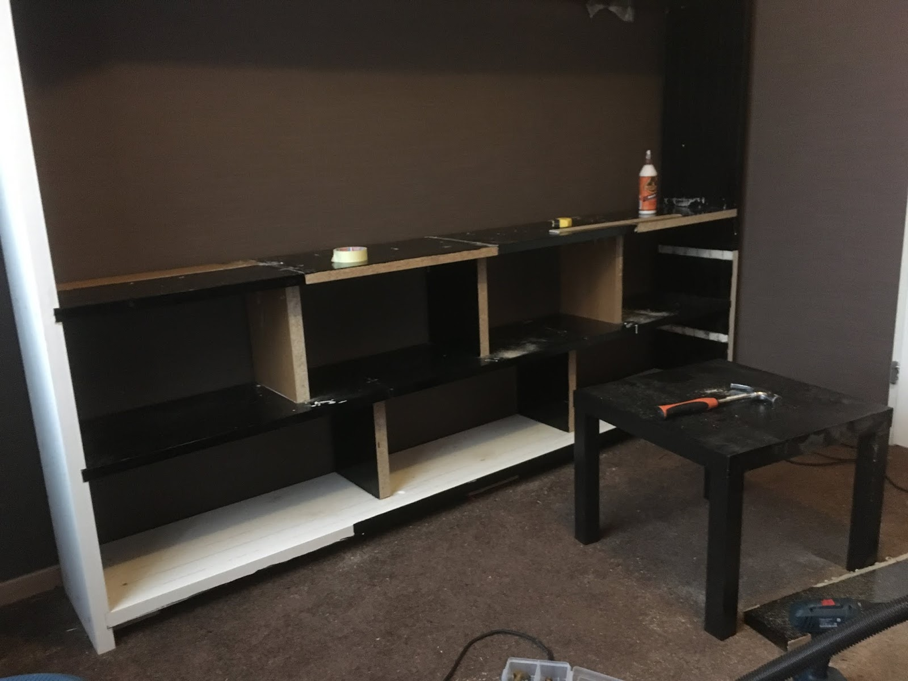
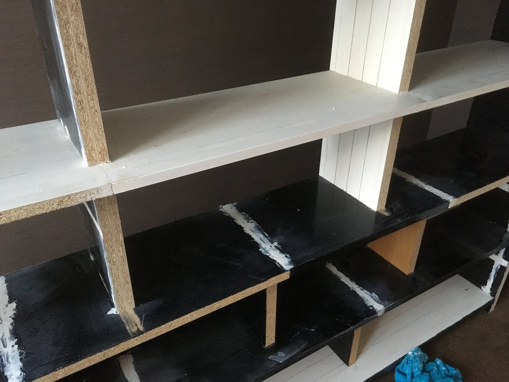
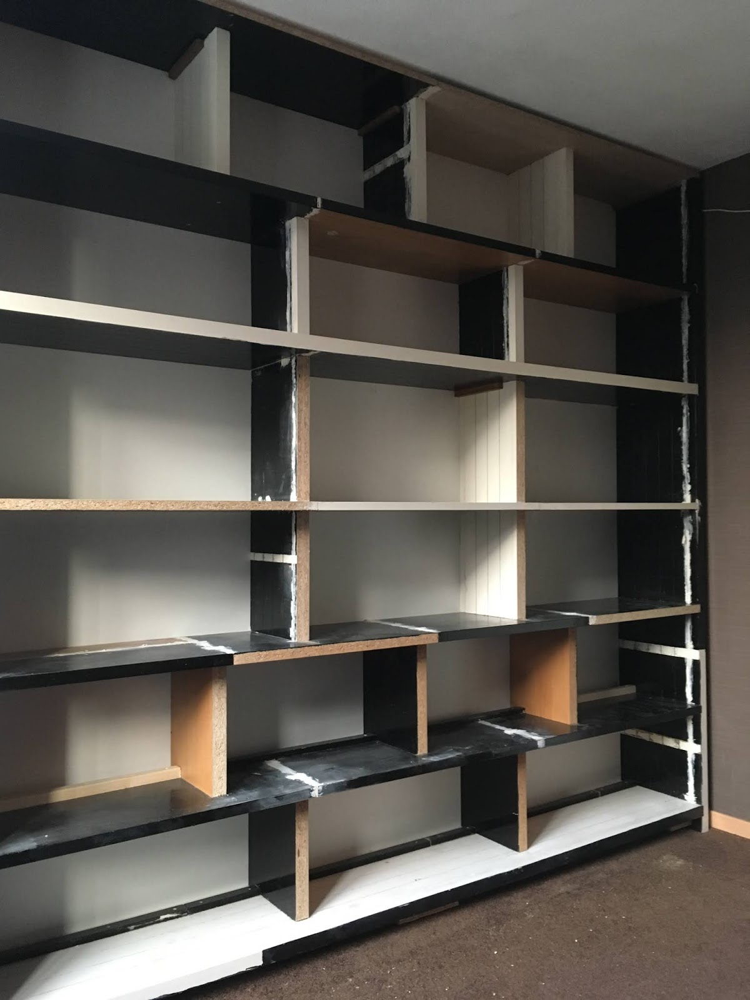

## Paint it Black
Ttijd om het wat presentabeler te maken.
Een hele dag schuren en een hele dag acrylkit aanbrengen in elke naad, zou het geheel er na het schilderen gladder uit moeten laten zien, en nogmaals, minder vatbaar voor het verzamelen van stof.
Na het schoonmaken van elk vak om het oppervlak van stof en vet te ontdoen, werden de vakken één voor één geverfd.
Merk op dat de voorzijde niet is geverfd, omdat die straks een andere afwerking krijgt.

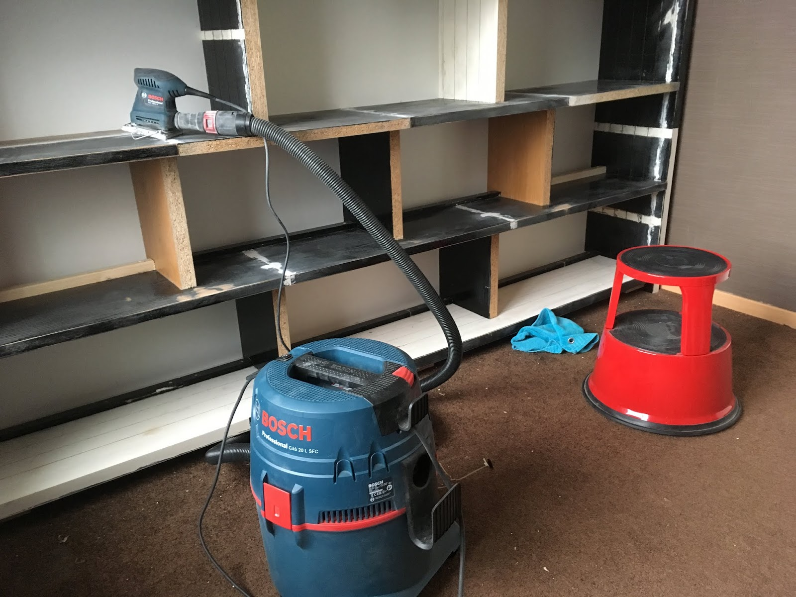
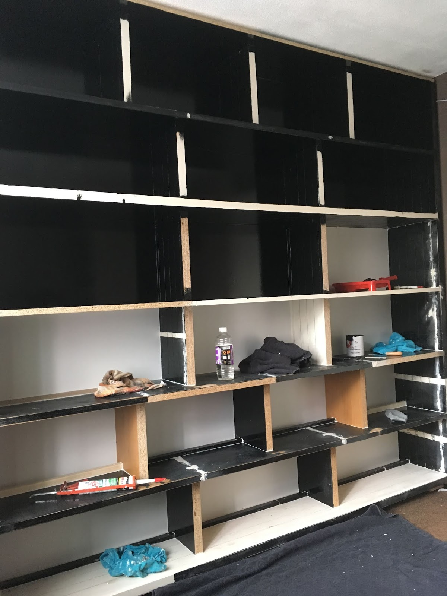
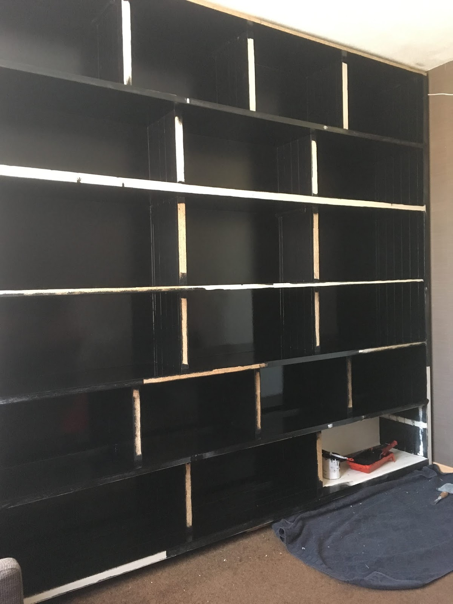

## Op zoek naar hout
Hoewel ik eikenhout wilde gebruiken voor de afwerking van de voorkant, kwam ik er na wat onderzoek achter dat ik zonder werkplaats kant-en-klare eikenstroken moest bestellen, wat veel te duur bleek.
Na enig wikken en wegen besloot ik de boekenkast af te werken met standaard meranti strips uit een bouwmarkt en meubelolie aan te brengen om het een rijkere uitstraling te geven.
Beginnend met de kleine "binnenste staanders", werden stukjes meranti geolied en aan de voorkant gelijmd.

Eindelijk (na maanden van opgetrokken wenkbrauwen door vrienden en voorbijgangers) begon de boekenkast eruit te zien zoals ik vanaf het begin voor ogen had.
Wanneer uiteindelijk gevuld met boeken; de boeken worden omringd door matzwart in hun vakken en de boekenkast lijkt gemaakt te zijn van mooi hardhout (terwijl het eigenlijk gemaakt is van recycled gelamineerd spaanplaat).

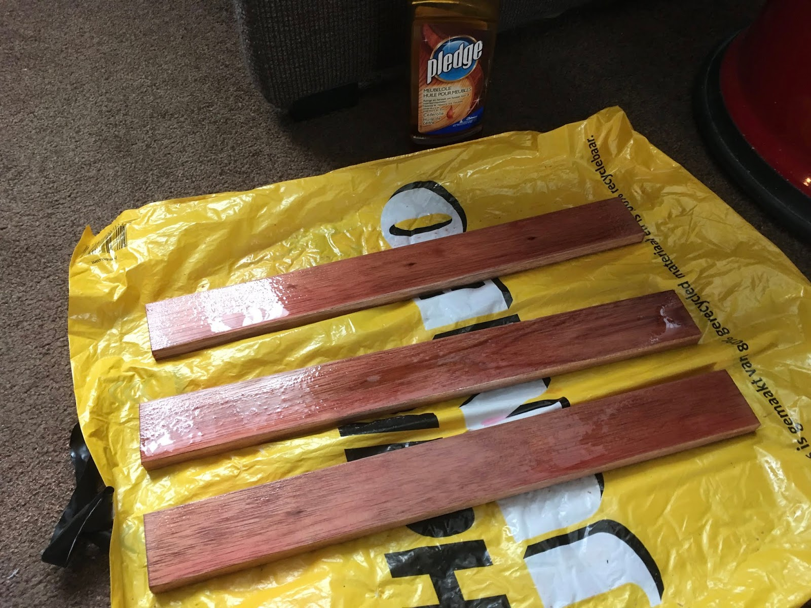
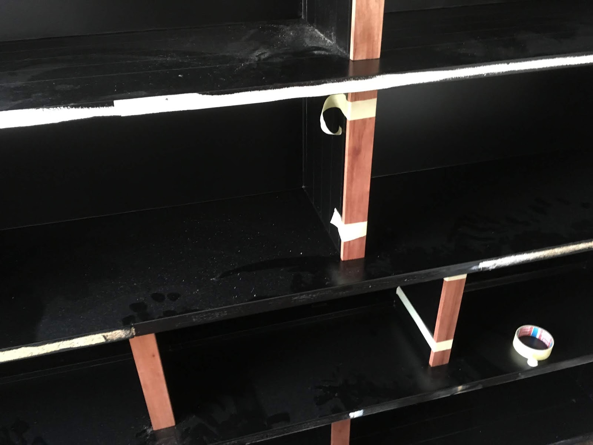

## Deuvels
De horizontale afwerkstrips hadden iets meer ondersteuning nodig dan ze gewoon op hun plaats te lijmen.
De beste oplossing zou zijn om met een router een sleuf en vinger te maken, maar het zou een enorme hoeveelheid extra werk zijn en we raakten behoorlijk geïrriteerd door al het zaagsel in huis (en er zou nog een zaagsel-explosie in de nabije toekomst plaatsvinden).

Zgn. _biscuits_ zouden ook een uitkomst bieden; maar ik heb daar niet de apparatuur voor, dus heb ik ervoor gekozen om voorzichtig een paar deuvels in elke strip en de planken te boren.
Met dit handige gele gereedschap zorgde ik ervoor dat het gat vierkant en op de juiste diepte werd geboord.
Wat creatief gebruik van houtklemmen en veel geduld tijdens het uitharden van de Gorilla Glue, en nog eens 7 dagen gingen voorbij om alle horizontale fronten gedaan te krijgen.

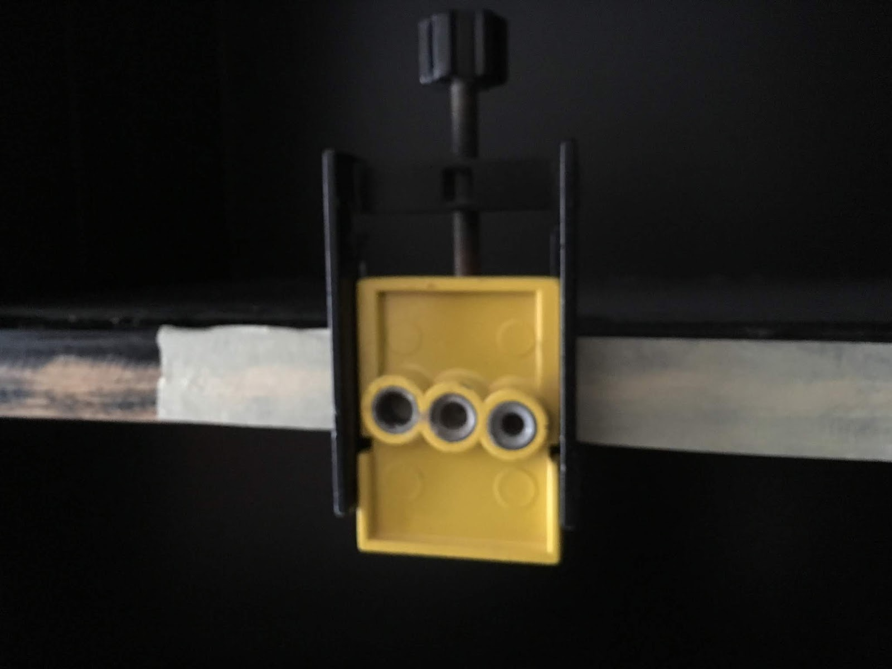
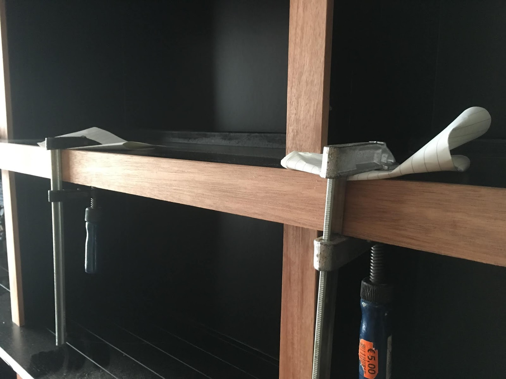

## Zaagsel
Toen werd het tijd om een fout op te lossen die was geslopen tussen het plannen voor het gebruik van op maat gemaakte eikenhouten strips en de uiteindelijke meranti-strips van standaardformaat.
Vanaf het begin (bij het routeren van de dado-sleuven) waren de vakken zorgvuldig bemeten om in bepaalde series boeken te passen.
De onderste twee planken worden gebruikt voor cassettes gevuld met tijdschriften.
Slechts 15mm ruimte boven de cassettes om stofophoping in de tijdschriften-cassettes te minimaliseren.

De standaard maat meranti-strips waren groter dan vooraf gepland, waardoor er te weinig ruimte overbleef om de cassettes in en uit te bewegen.
Zonder een machinewerkplaats dacht ik dat het de gemakkelijkste manier zou zijn om ze kleiner te maken terwijl ze al aan de boekenkast waren bevestigd.
Weer een zaagsel-explosie dus... 

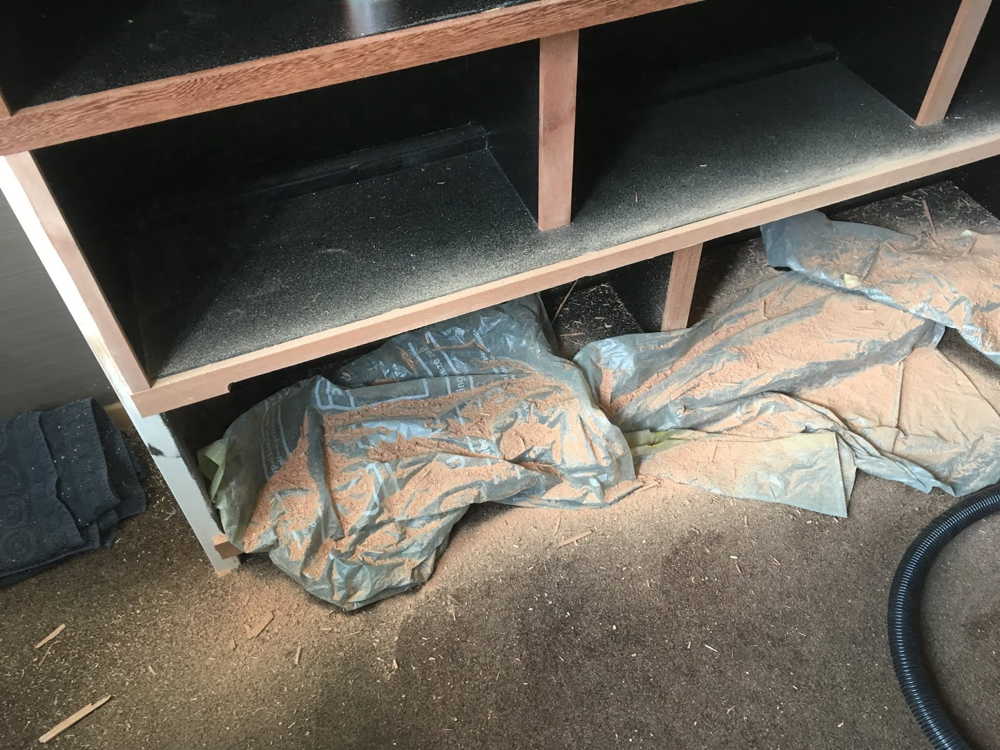

## Faux-panelen
Laatste deel van de bouw; de buitenste staanders.
Tijdens het maken van de plannen (meestal in mijn hoofd, enkele ruwe schetsen) wist ik dat ik niet kon vertrouwen op mijn (gebrekkige) vaardigheden om perfect passende vierkante en verstekverbindingen te maken tussen de horizontale planken en de buitenste staanders.

Dus bedacht ik deze truc; laat de horizontale stroken ongeveer halverwege de staander uitsteken. Daarna kleine, halve stroken ertussen plaatsen, hier hoeft niet te nauwkeurig gewerkt te worden en kan er telkens opnieuwe geschuurd en gepast worden, aangezien het steeds een klein stukje hout per keer was.
Op de buitenste hoek van de staander; ook een halve strook, maar deze loopt over de hele hoogte van 2,4 meter.
De lelijke opening in het midden wordt weer verborgen door een eenvoudige decoratieve meranti hardhouten strip.

Ook is de linkerkant van de boekenkast is bedekt met dunne hardhouten panelen om zowel het feit dat het een spaanhouten boekenkast is, als de schroeven, te verbergen die tijdens de constructie zijn gebruikt.

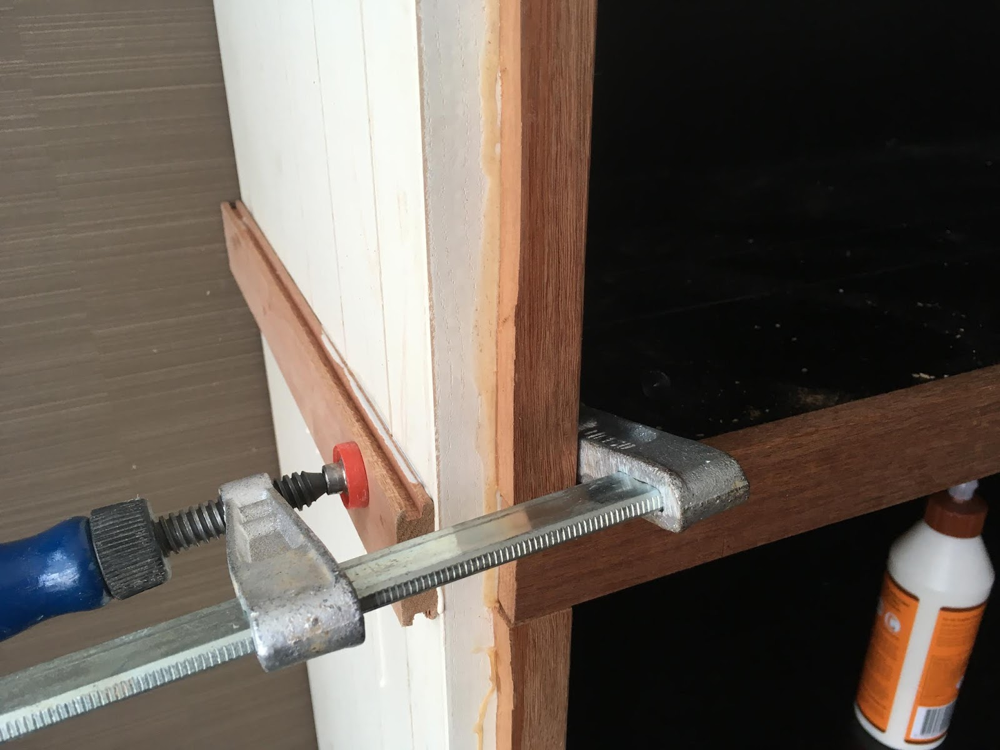
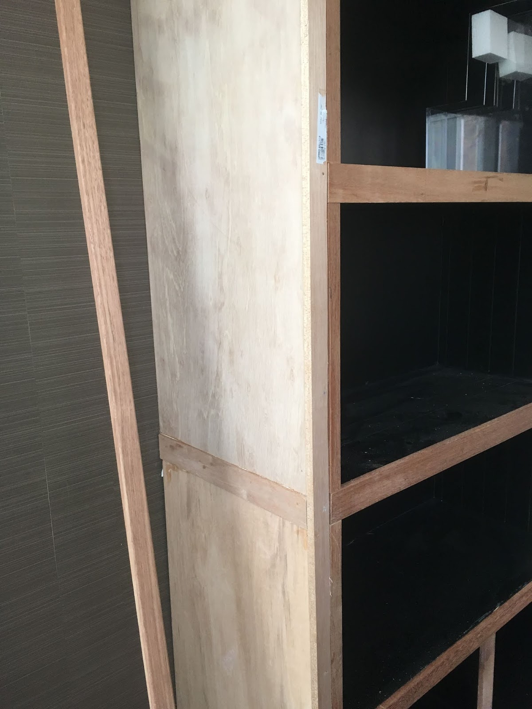

## Bijna klaar
Nu rest alleen nog wat schuren om de randen van het meranti-hout af te werken en een flinke hoeveelheid olie aan te brengen waar nog nodig is.
Ook moet ik de bovenkant van de boekenkast nog stevig tegen de muur bevestigen om kantelen te voorkomen, wat eigenlijk onmogelijk is vanwege het afgewerkte formaat, maar beter voorkomen dan genezen.

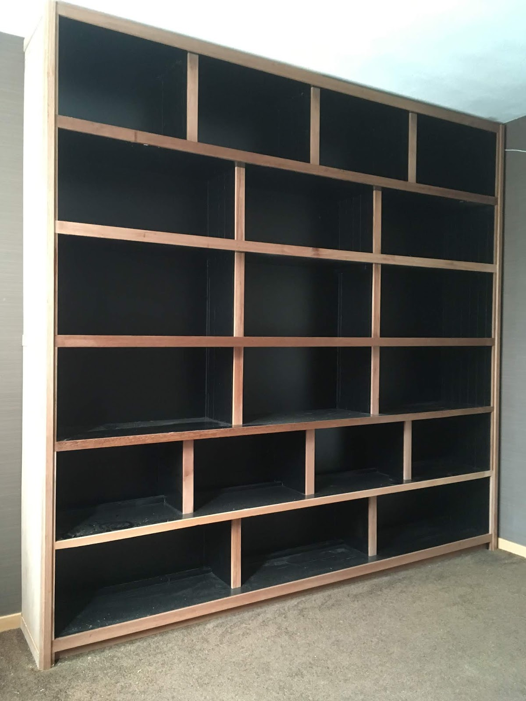
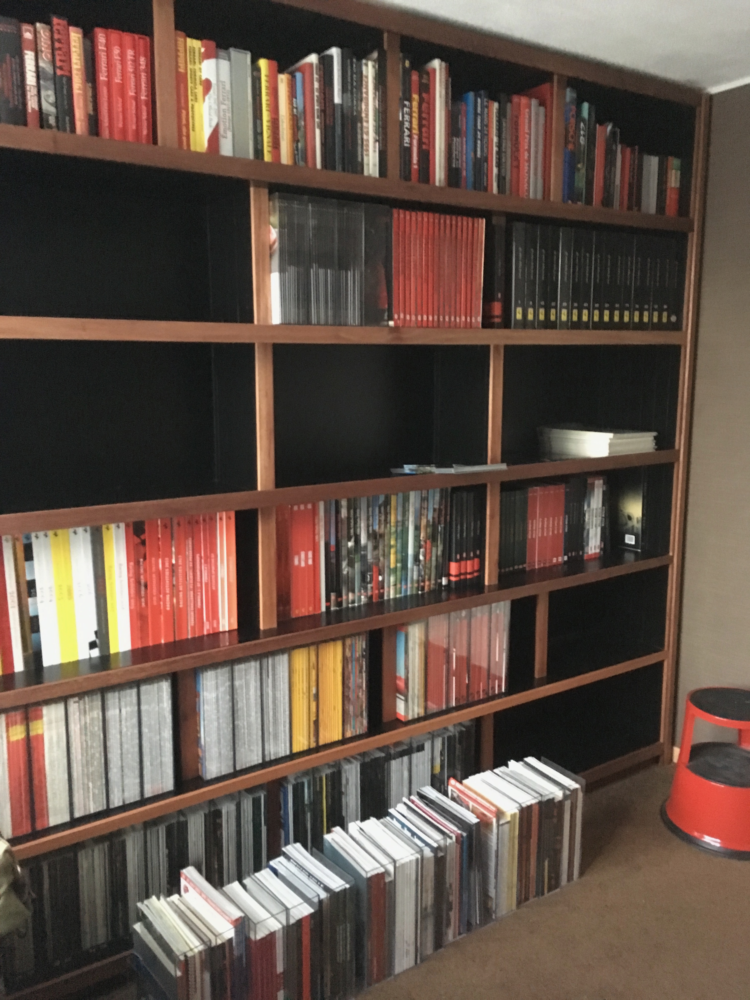

En natuurlijk een laatste schoonmaakbeurt voordat alle boeken en tijdschriften naar deze kamer werden verplaatst en ik vele uren in _my happy place_ heb doorgebracht om te beslissen welk boek nu waar zou moeten staan.
