Het verhaal van Prince's Cloud Guitar is verteld en gedocumenteerd door [veel mensen](https://www.fretboardjournal.com/features/the-origin-of-princes-cloud-guitar/), vaak met iets andere details. Wil je het volledige verhaal lezen, dan is [Guitar.com](https://guitar.com/features/interviews/prince-cloud-guitar-luthier-dave-rusan/) een goede plek om te beginnen.

Kortom, Prince wilde een iconische gitaar hebben als blikvanger in de _Purple Rain_ film en ging naar de plaatselijke Knut-Koupee Music Store in Minneapolis, waar [gitaarbouwer Dave Rusan](https://www.premierguitar.com/gear/gitaren/prince-cloud-gitaar) kreeg de opdracht toegewezen.
De opdracht was om een gitaar te bouwen, die belangrijk zou zijn voor de verhaallijn van de film Purple Rain, en het ontwerp moest een [basgitaar](https://madcatsandclouds.com/2018/12/30/the-cloud-bass/) uit 1972 nabootsen eigendom van André Cymone, Prince's vriend sinds zijn jeugd en een bassist in de voormalige band van Prince.
Deze bas is op zijn beurt geïnspireerd door een [F-stijl mandoline](https://artfulliving.com/prince-cloud-guitar-mystery-music-andrea-swensson/).

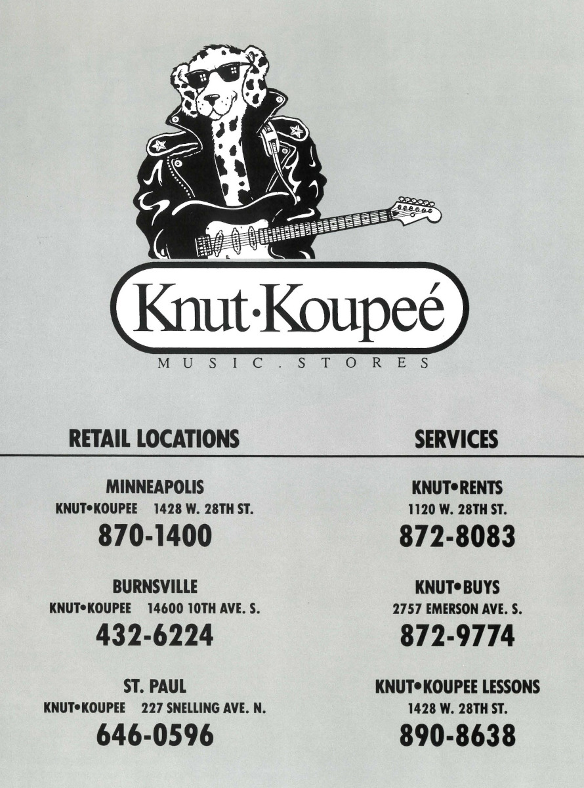
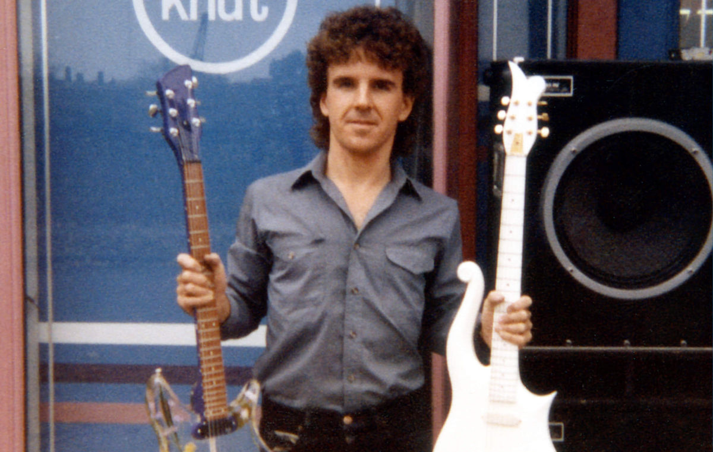
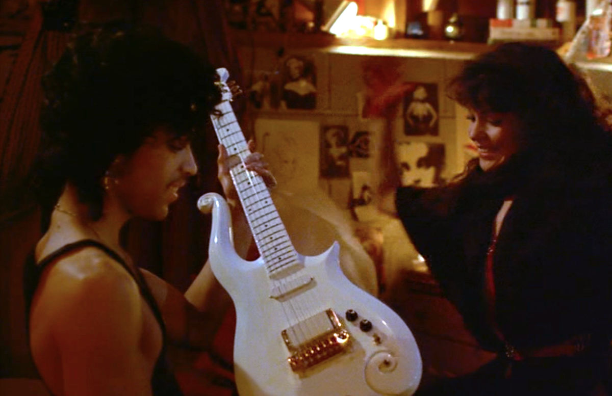



Hoe dan ook, de rest is geschiedenis om het maar zo te zeggen.
De door Dave Rusan gebouwde (witte) gitaar uit Purple Rain lijkt Prince erg te bevallen, aangezien er in de loop van een lange periode meerdere zijn gebouwd, gerepareerd en opnieuw geverfd.
Naar verluidt, toen de _Raspberry Beret_-video uit 1985 werd uitgebracht, werd de iconische gitaar bekend als de _Cloud Guitar_, waarschijnlijk vanwege de vergelijkbare vorm als de wolken op Prince' outfit in die video.

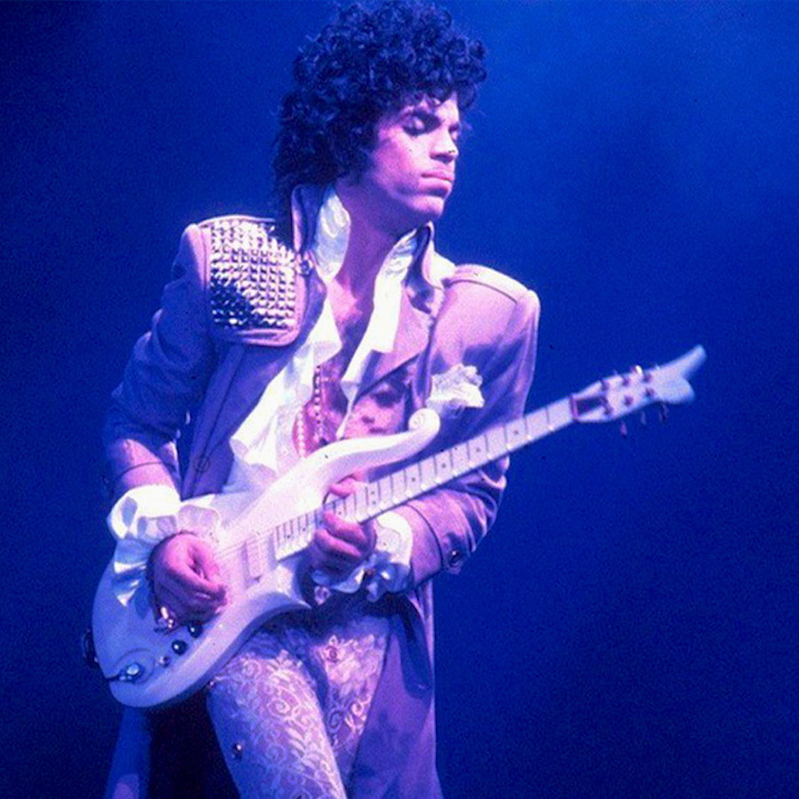

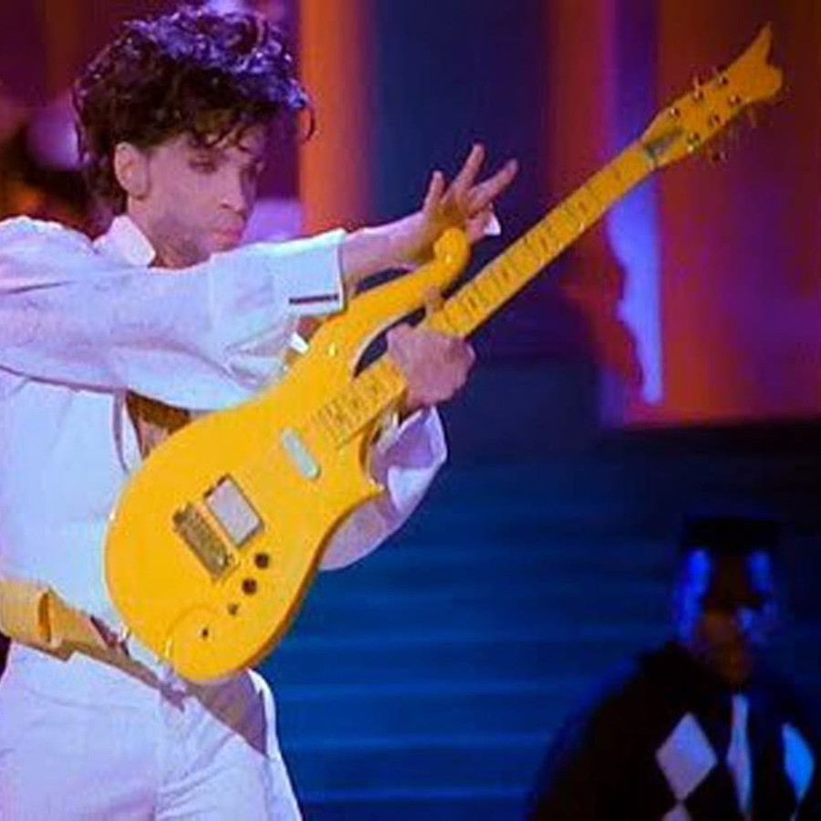

## Gitaren aan de muur
Mijn vader was gitarist, dus ik groeide op in een huis waar altijd meerdere gitaren waren, ook al had ik nooit het geduld om een instrument te leren bespelen.
Maar omdat ik gewend was aan gitaren die voor het grijpen aan de muur hingen, kreeg ik het idee om een _Cloud-guitaar_ tentoon te stellen als een Prince-rekwisiet.
Op een gegeven moment stonden er basis afmetingen online, maar het bouwen van een gitaar, ook al was het alleen maar voor decoratie en hoefde geen bespeelbaar instrument te zijn, leek me nog steeds een ontmoedigende taak en daar ben ik nooit aan begonnen.

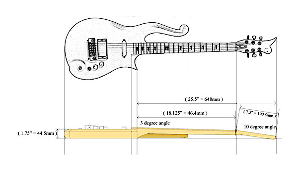
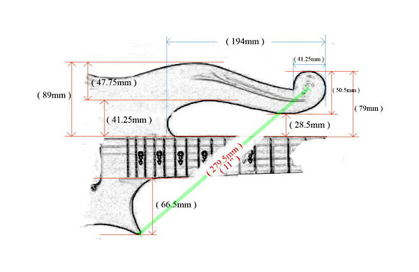

## Het echte werk
Na het overlijden van Prince werd een originele Cloud-guitaar uit 1982 van Prince (PM16549) [geveild voor maar liefst $ 563.500](https://www.julienslive.com/lot-details/index/catalog/320/lot/138241).
De [catalogus van deze veiling](https://www.juliensauctions.com/auctions/2020/Prince_Blue_Angel_Guitar/Prince_Blue_Angel_Flipping_Book/) staat nog steeds online en is een fascinerend document bedoeld om de herkomst van hun veilingkavel te bewijzen.
Een andere Prince-eigendom (PM16220) Cloud Guitar uit 1992 werd [geveild voor $ 192.000](https://www.julienslive.com/lot-details/index/catalog/427/lot/192988) in 2022, en Paisley Park Enterprises leverde een Yellow Cloud aan de collectie van het [Smithsonian National Museum of American History](https://americanhistory.si.edu/collections/search/object/nmah_607482).

Meer details over Cloud-guitaren van Prince, gebouwd door Dave Russan, en later Andy Beach, zijn te vinden in het [Prince Equipment Archive](http://guitarcloud.org/equipment/dave-rusan-cloud-guitar).
Dave Russan is [nog steeds een gitaarbouwer](https://www.facebook.com/RusanGuitarworks/) en maakt allerlei soorten gitaren met de hand, waaronder reproducties van het ontwerp dat hij voor Prince deed.
Een ongelooflijk bekwame, maar bescheiden en vriendelijke man die echte kunstwerken maakt.
Ongetwijfeld fantastische instrumenten voor degenen die gitaar kunnen spelen, waarschijnlijk geprijsd zoals ambachtswerk hoort te zijn, terwijl zijn klanten vele maanden geduldig op hun instrumenten zullen moeten wachten.



## Chinese avonturen
Toen hoorde ik dat Chinese copycats Cloud-achtige gitaren verkochten.
Ik weet zeker dat dit niets is vergeleken met de echte instrumenten uit eerder genoemde bronnen, maar ik leek de enige plausibele optie om een Cloud Guitar aan de muur van mijn thuiskantoor te krijgen.

De eerste poging werd besteld in maart 2020, maar er werd niets vernomen van de leverancier (later kwamen we erachter dat dit juist was toen een epidemie China toesloeg), dus uiteindelijk heb ik een aanvraag ingediend - en gekregen - tot volledige terugbetaling.
In december 2020 de tweede poging met een andere leverancier. Deze keer kreeg ik wat e-mailcorrespondentie, maar een pakket of zelfs enige tracking van een zending is nooit gekomen, dus dit eindigde opnieuw in een terugbetaling.
Drie keer is scheepsrecht ... enkele weken na de derde bestelling werden twee (lage resolutie) foto's ter _definitieve goedkeuring door de klant_ door deze derde leverancier opgestuurd.
Deze foto's konden me niets verduidelijken over 'kwaliteit', maar ik waagde de sprong en stemde in met de verzending.
Er volgden een paar lange weken met regelmatige, maar uiterst verwarrende tracking informatie, voordat het pakket (en een icasso voor de invoerrechten) daadwerkelijk voor mijn deur verscheen.
De houtbewerking en verfkwaliteit is niet zo slecht, maar het geheel voelt als een waardeloos instrument om te bespelen.
Maar dat had ik natuurlijk verwacht voordat ik bestelde en helemaal geen probleem voor mijn doel (en muzikale vaardigheden).

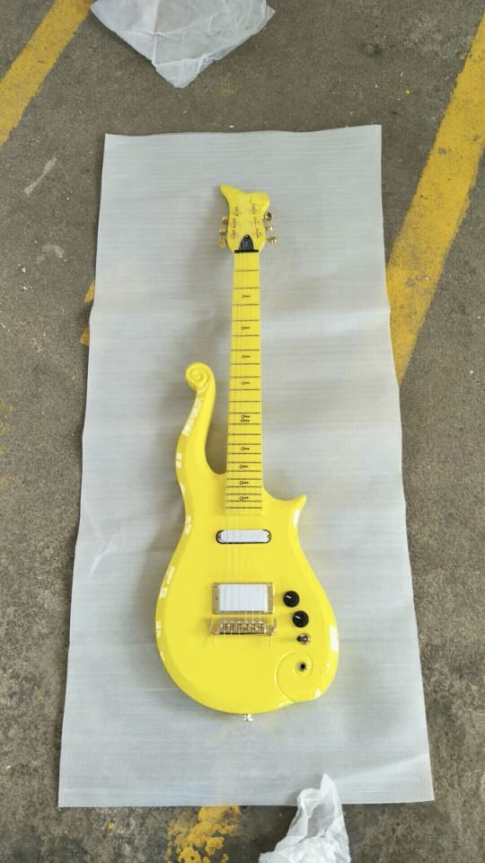
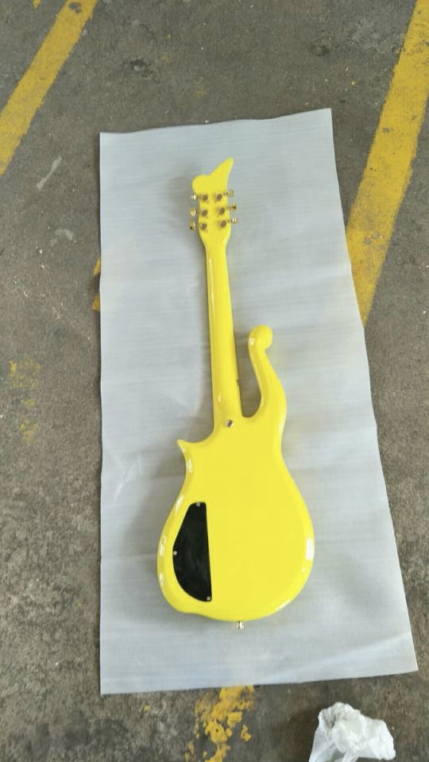

## Reiskoffer
Nu moet de gitaar aan de muur van het thuiskantoor worden bevestigd, wat natuurlijk gemakkelijk kon met de standaard gitaarklem die ik had.
Maar ik had dit plannetje om er meer een project van te maken.
Eerst bestelde ik een qua kleur (bijna) bijpassende gitaarband en krulde ik de elektrische kabel (in de oven) om het levensechter te maken.
Vervolgens kocht ik wat flightcase-hardware, sloeg een houten paneel in elkaar, lijmde een paars gekleurd stuk kunstleer op dit paneel en monteerde de hardware om het paneel een beetje op een gitaar-flightcase te laten lijken.

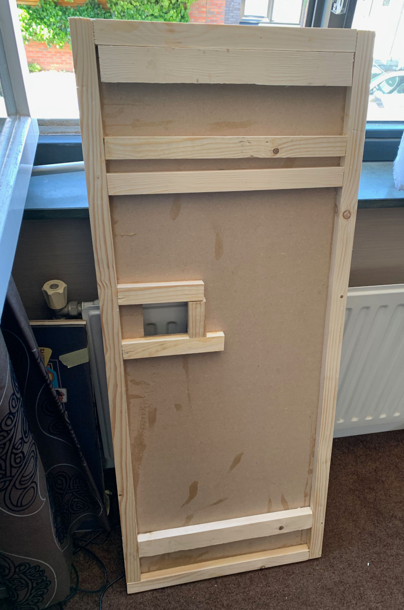
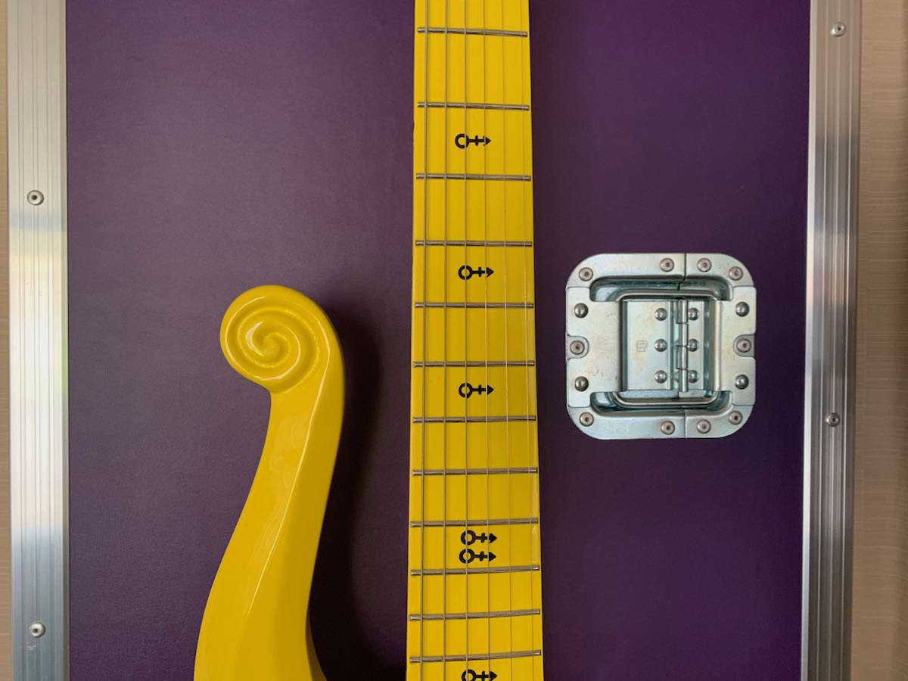
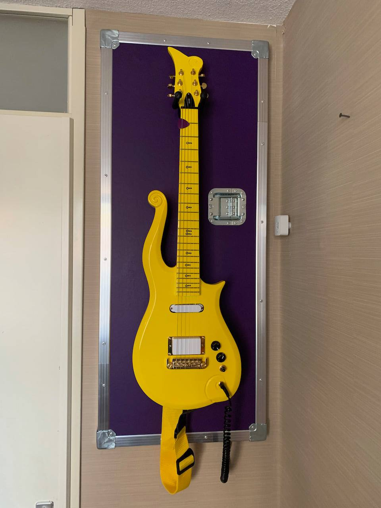

Voor de finishing touch kreeg ik wat hulp van een mede Prince [fam](https://prince.org/msg/7/354554) die de apparatuur heeft om nauwkeurig te snijden en een sjabloon voor me te maken.
Dat sjabloon werd gebruikt om het [adres](https://goo.gl/maps/C747YHh7vkPoJM636) te tamponeren zoals dat de echte flightcases van Prince dat zouden hebben.
Zo nu en dan denk ik dat ik het paneel wat moet verweren, of wat versleten stickers moet toevoegen, hoewel het rekwisiet in de huidige staat al regelmatig een glimlach opwekt.

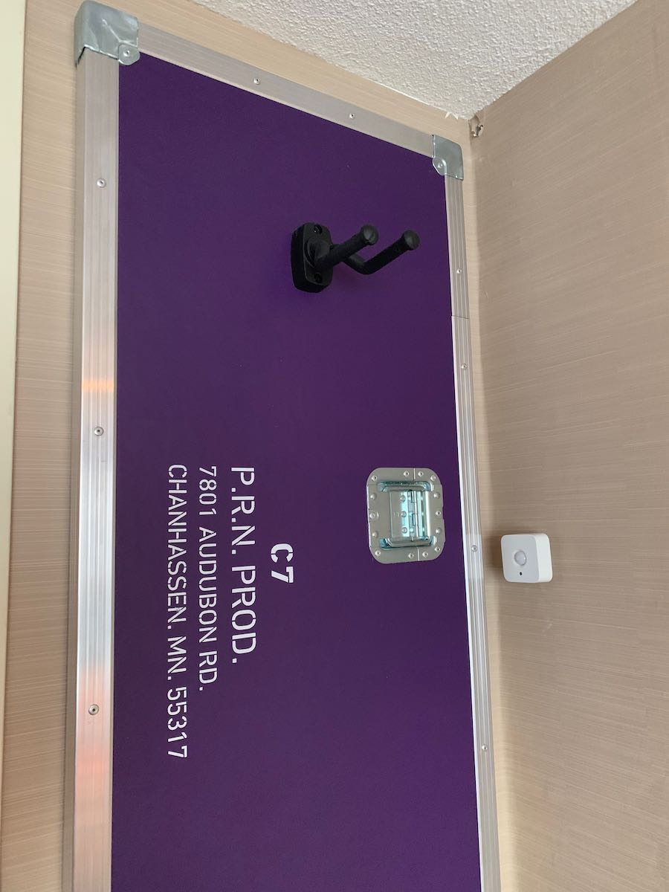
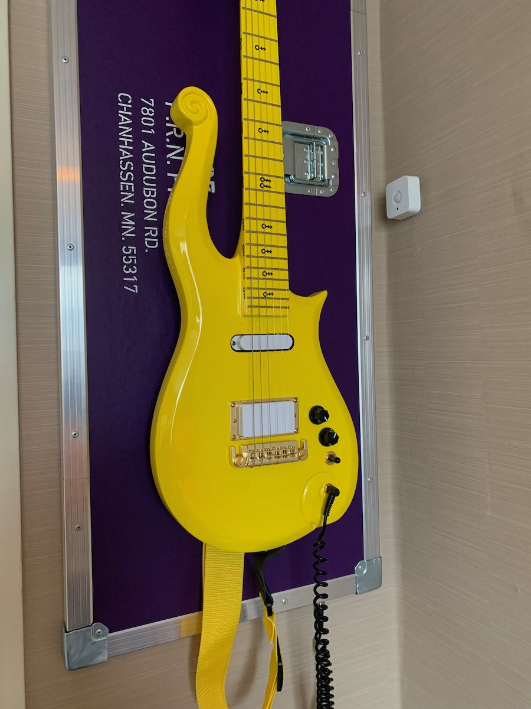

Tenslotte ... een video van Prince die een bevlogen live versie van _The Ride_ brengt in 1993 op (uiteraard) één van de echte Cloud Guitars.
Zet het volume LUID en laat deze magie je ziel doorboren!


