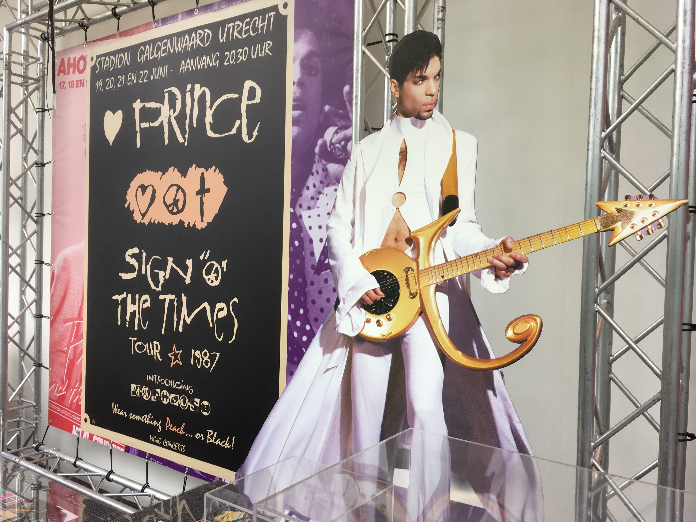
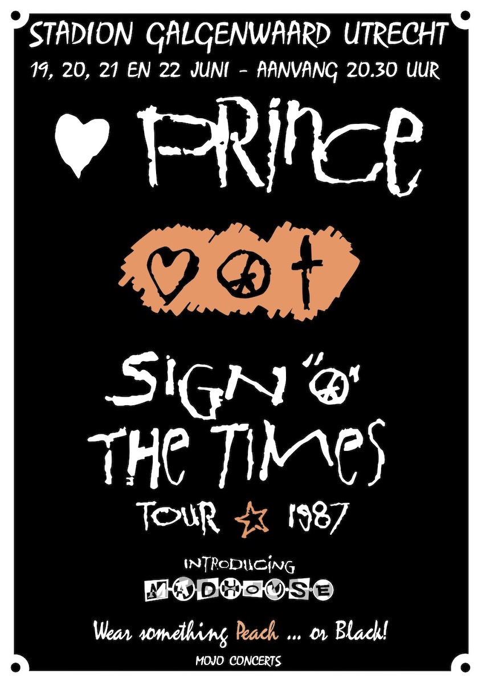
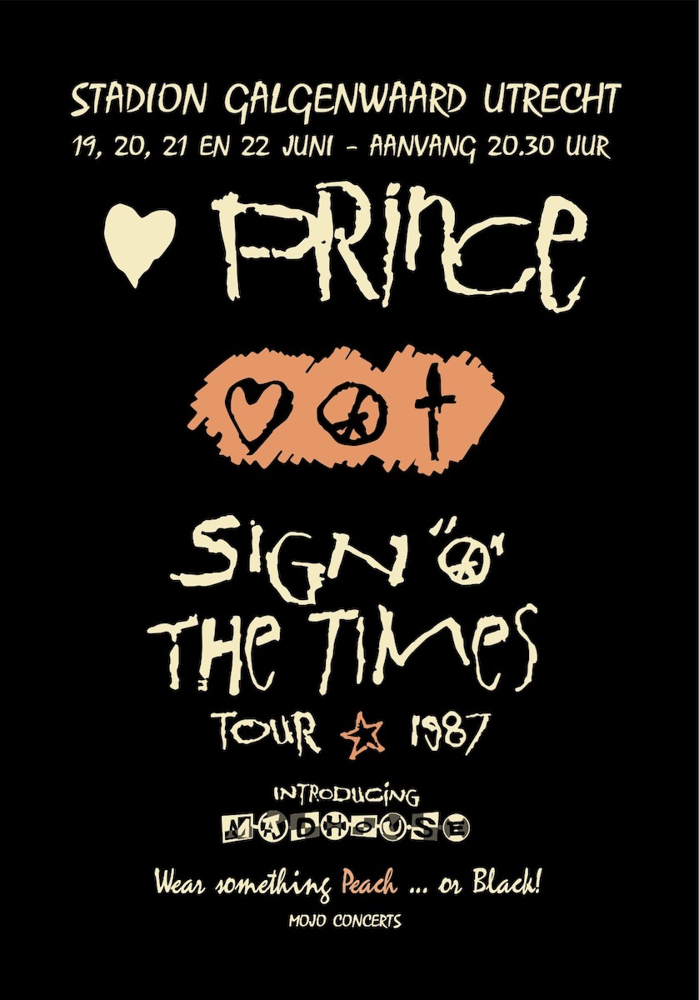
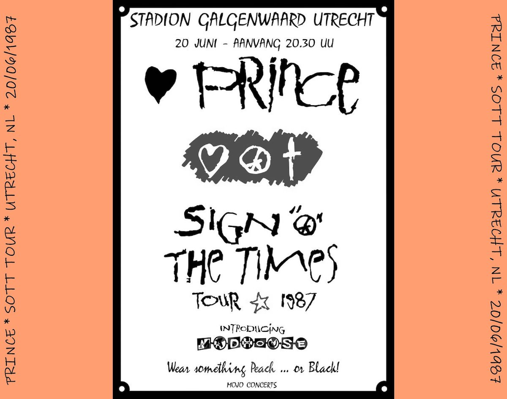

In [another post](../sign-o-the-times) I detailed how the [Sign 'O the Times Tour](http://princevault.com/index.php?title=Sign_O%27_The_Times_Tour) visited our hometown an the [Galgenwaard concert](http://princevault.com/index.php?title=20_June_1987) was the first substantial concert we ever attended.
Several months before the concert we got the ticks with some nice artwork in the middle. In the weeks commencing the actual concerts in June 1987, [posters](https://www.veilingagenda.nl/product/prince-sign-of-the-time-original-concert-poster-holland-origineel-eerste-print-poster-1987-1987/) popped up around town, anouncing the concerts using almost identical artwork. This make sense of course because both the tickets and the posters were produced by concert organiser Mojo, although some years later I found artwork online for a Dortmund concert where (to the best of my knowledge) Mojo was not involved.

In 2017 there was an exhibition at the Kunsthal in Rotterdam called ['Prince LOVE LIVE'](https://www.kunsthal.nl/nl/plan-je-bezoek/tentoonstellingen/prince/) where, after many years, I got eye-to-eye with a banner photo of the original poster of the Sign O' the Times tour Stadion Galgenwaard. 
All alone in a furthermore empty museum ... it just struck me. There I took many pictures of the banner and when I got home started drawing up a meticulous (although scaled down) reproduction of the tour poster for a couple of days.

Sharing this drawings in several online forums resulted in a few slightly different versions on requests. Got myself a framed (smaller-than-life) print at home and received a couple of snapshots from people that printed my files in various sizes for their own enjoyment, lovely!

> **Download vector files**  
This is a fan artwork and I do not own any copyright to the original artwork. If so would exists it would likely belong to Mojo Concerts (LiveNation) and/or the Prince Estate.

Since there are slight differences with the orginal; I easily recognise my vector files and it is always funny when this pops up on social media or sites like the [tour history](https://goldiesparade.co.uk/prince-tours/sign-o-the-times-tour/), on the very nice Prince website [A Pop Life](https://apoplife.nl/concert/prince-21-06-1987/) by a fellow dutchman or even in this tweet of the hugely popular website [Housequake.com](https://www.housequake.com/) and someone even used my artwork to make a CD cover for their bootleg.

 

