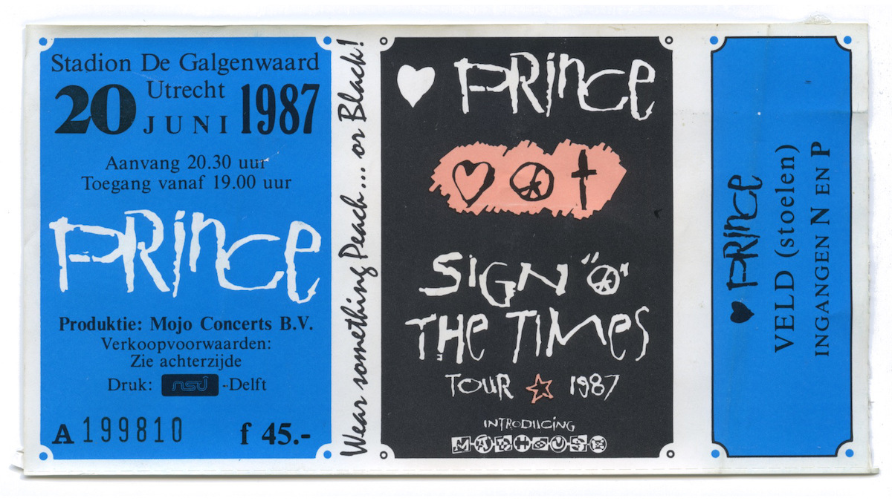
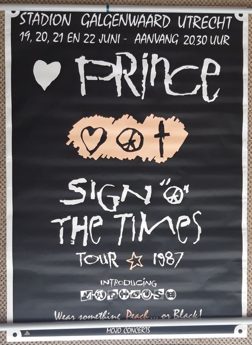
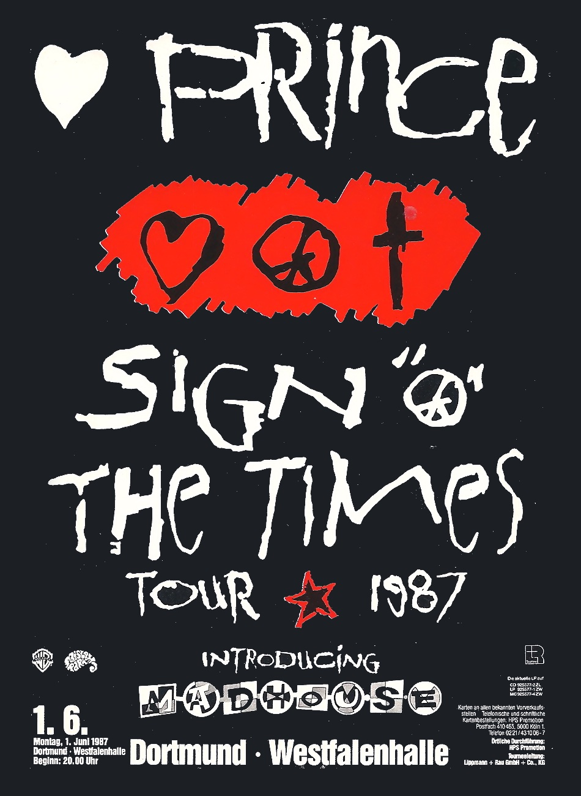
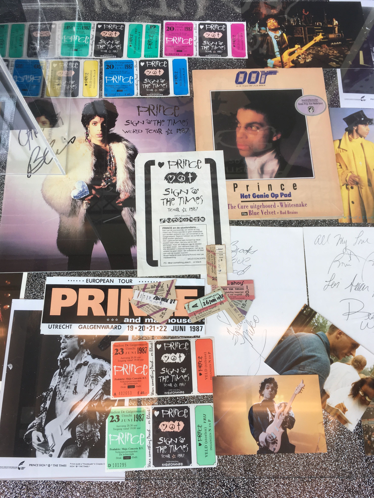
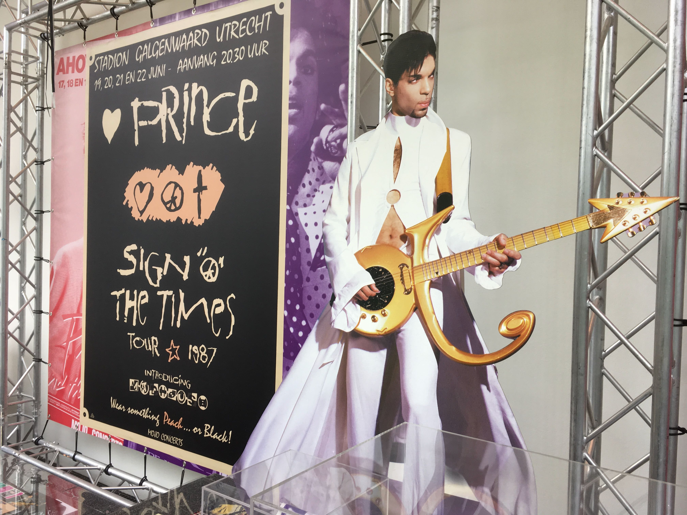
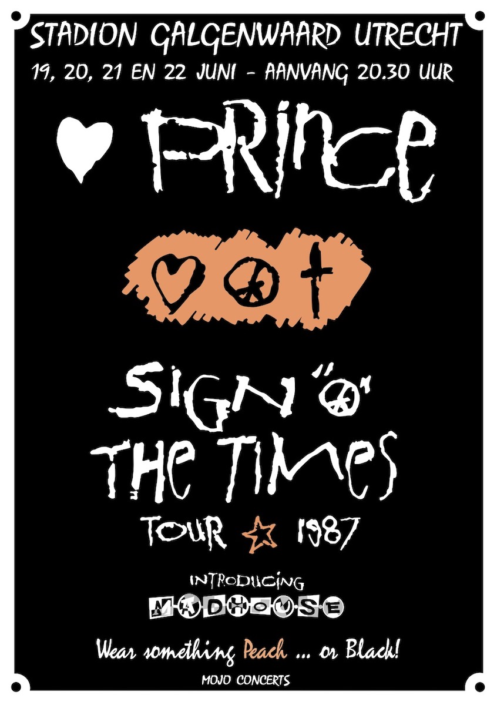
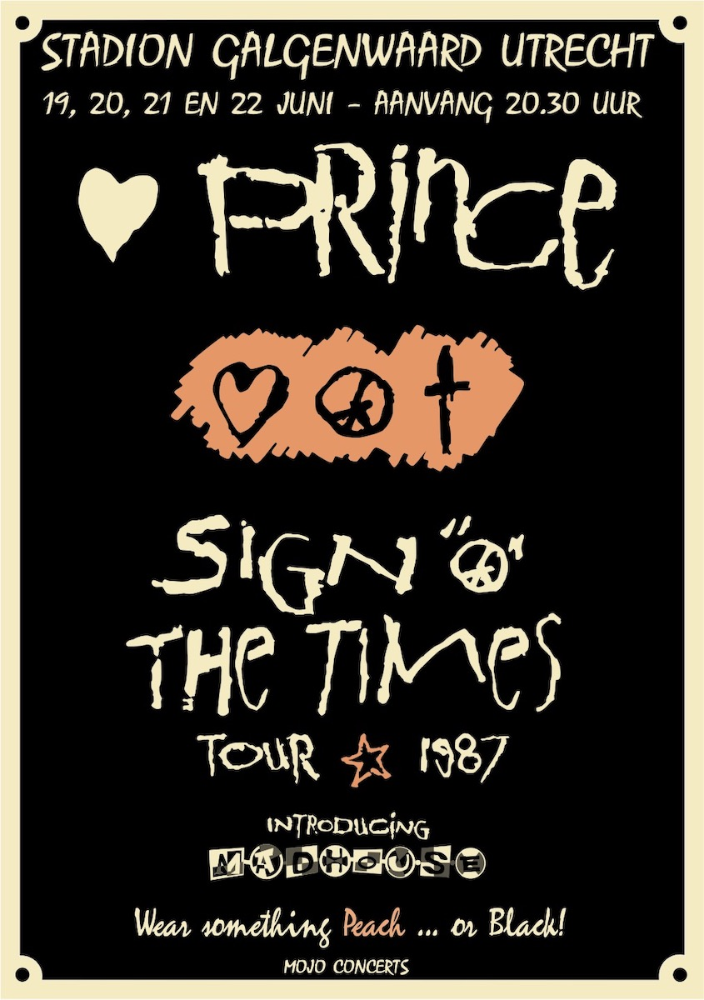
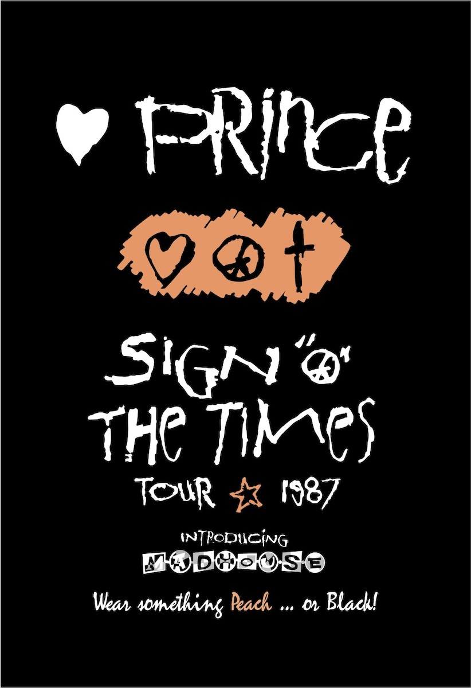
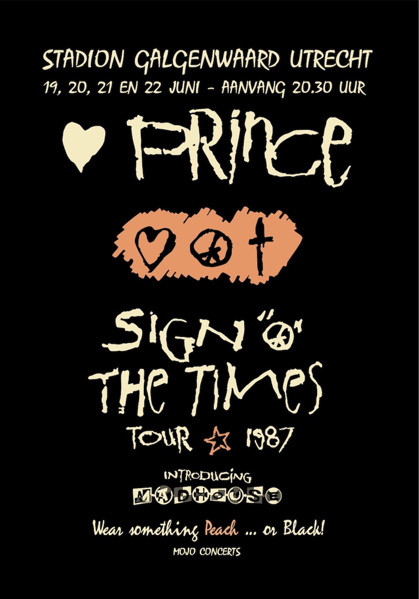
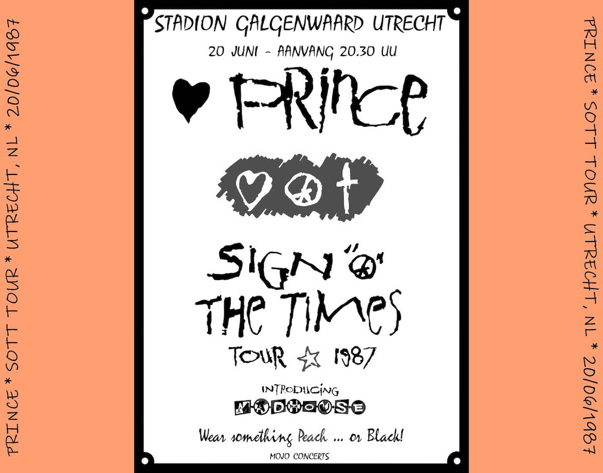

In [een andere post](../sign-o-the-times) heb ik beschreven hoe de [Sign 'O the Times Tour](http://princevault.com/index.php?title=Sign_O%27_The_Times_Tour) onze woonplaats aandeed en het [Galgenwaard concert](http://princevault.com/index.php?title=20_June_1987) was het eerste grote concert dat we ooit bijwoonden.
Enkele maanden voor het concert kregen we de tickets met wat mooi grafisch werk in het midden.
In de weken voorafgaand aan de eigenlijke concerten in juni 1987, [posters](https://www.veilingagenda.nl/product/prince-sign-of-the-time-original-concert-poster-holland-origineel-eerste-print-poster-1987-1987/) doken op in de stad en kondigde de concerten aan met bijna identieke grafisch werk.
Dit is natuurlijk logisch omdat zowel de kaartjes als de posters zijn geproduceerd door concertorganisator Mojo, hoewel ik enkele jaren later online illustraties vond voor een concert in Dortmund waar (voor zover ik weet) Mojo niet bij betrokken was.

In 2017 there was an exhibition at the Kunsthal in Rotterdam called ['Prince LOVE LIVE'](https://www.kunsthal.nl/nl/plan-je-bezoek/tentoonstellingen/prince/) where, after many years, I got eye-to-eye with a banner photo of the original poster of the Sign O' the Times tour Stadion Galgenwaard. 
All alone in a furthermore empty museum ... it just struck me. There I took many pictures of the banner and when I got home started drawing up a meticulous (although scaled down) reproduction of the tour poster for a couple of days.

In 2017 was er een tentoonstelling in de Kunsthal in Rotterdam genaamd ['Prince LOVE LIVE'](https://www.kunsthal.nl/nl/plan-je-bezoek/tentoonstellingen/prince/) waar ik na vele jaren oog in oog met een banner van de originele poster van de _Sign O' the Times tour_ in Stadion Galgenwaard.
Helemaal alleen in een verder leeg museum... het raakte me gewoon aan.
Daar heb ik veel foto's van dit spandoek gemaakt en toen ik thuiskwam, begon ik een paar dagen lang een minutieuze (hoewel verkleinde) reproductie van de tourposter te maken.

Het delen van deze tekeningen op verschillende online forums zou leidden tot verschillende verzoeken naar een paar iets afwijkende versies.
Ik heb thuis een ingelijste (smaller-than-life) afdruk gekregen en heb een paar kiekjes ontvangen van mensen die mijn bestanden in verschillende formaten hebben afgedrukt voor hun eigen plezier, heerlijk!

> **Download vectorbestanden**  
> Dit is een fan-artwork en ik heb geen auteursrecht op het originele artwork.  
> Als dat zou bestaan, zou het waarschijnlijk behoren aan Mojo Concerts (LiveNation) en/of de Prince Estate.

Since there are slight differences with the orginal; I easily recognise my vector files and it is always funny when this pops up on social media or sites like the [tour history](https://goldiesparade.co.uk/prince-tours/sign-o-the-times-tour/), on the very nice Prince website [A Pop Life](https://apoplife.nl/concert/prince-21-06-1987/) by a fellow dutchman or even in this tweet of the hugely popular website [Housequake.com](https://www.housequake.com/) and someone even used my artwork to make a CD cover for their bootleg.

Omdat er natuurlijk kleine verschillen zijn met het origineel herken ik mijn vectorbestanden gemakkelijk.
Het is altijd grappig als dit opduikt op sociale media of sites zoals de [tourgeschiedenis](https://goldiesparade.co.uk/prince-tours/sign-o-the-times-tour/), op de zeer mooie Prince-website [A Pop Life](https://apoplife.nl/concert/prince-21-06-1987/) van een landgenoot of zelfs in deze tweet van de immens populaire website [Housequake .com](https://www.housequake.com/).
Iemand gebruikte zelfs mijn artwork om een cd-hoes te maken voor hun bootleg.

 

