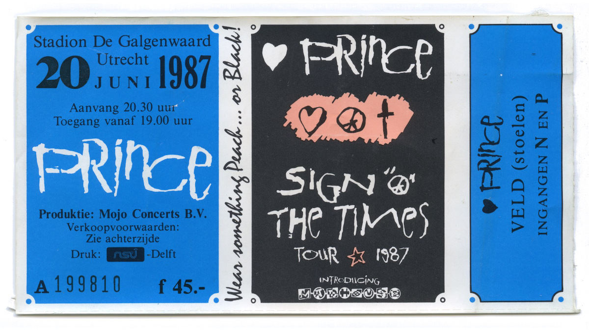
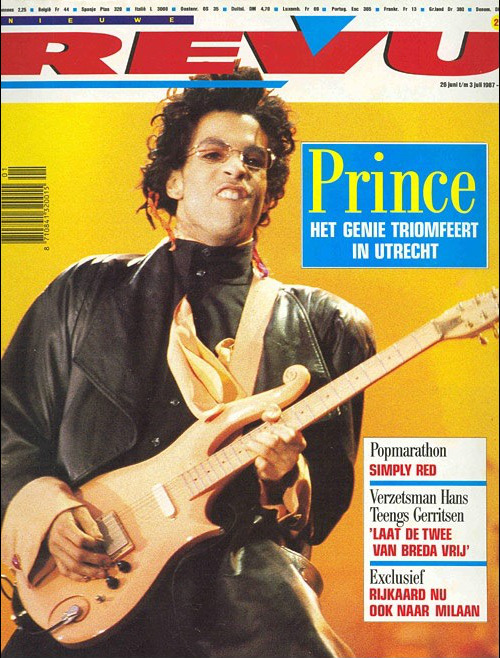

Wat mijmeringen na het beluisteren van de [7e aflevering](https://podcasts.apple.com/nl/podcast/prince-official-podcast/id1488187430?l=en&i=1000526528961) van de officiële Prince Podcast en het genieten van prachtige verhalen op de Sign O' the Times Tour in Utrecht.
Die tweede avond in Stadion Galgenwaard, zaterdag 20 juni 1987, was het eerste Prince-concert dat ik bijwoonde, eigenlijk het eerste concert van betekenis met een publiek van meer dan een paar honderd mensen.

Ik ben opgegroeid met het luisteren naar de rock'n roll-singles en LP-collectie van mijn vader.
De allereerste jaren van mijn tienerleven begon ik mijn eigen muziek te kopen, maar dit was all-over-the-place.
De eerste single die ik kocht was _Under Pressure_ van _David Bowie & Freddie Mercury_, gevolgd door [_Stray Cat Strut_](https://www.youtube.com/watch?v=m8vqgQ-e5UY).
Had mijn [_Doe Maar_](https://en.wikipedia.org/wiki/Doe_Maar) periode en toen _Thriller_ de wereld veroverde, luisterde ik daar ook best veel naar.
Maar ik was nooit een bepaalde fan of volgeling van iemand of welk type muziek dan ook.

## Als duiven huilen
Opeens, in augustus 1984, ik was 14 jaar oud, keken we naar [Top Pop](https://en.wikipedia.org/wiki/TopPop) op de Nederlandse tv en dit was de eerste keer dat ik [Prince]( https://en.wikipedia.org/wiki/Prince_(muzikant)) opmerkte.
Deze man was cool, deze muziek ([When Doves Cry](https://www.youtube.com/watch?v=UG3VcCAlUgE)) echt interessant.
Ik was verkocht vanaf de allereerste keer dat ik deze videoclip op tv zag.
Kocht het album _Purple Rain_ op de dag dat het uitkwam (zoals ik in de komende jaren met elk Prince-album zou doen) en ging natuurlijk naar de film _Purple Rain_ op de dag dat het in première ging in de [Hoog Catherijne](https://nl.wikipedia.org/wiki/Bioscoop_Catharijne) bioscoop.

Tegen de tijd dat Prince zijn volgende album uitbracht (_Around the World in a Day_) had ik al (op bestelling) de hele backcatalogus gekocht en alle songteksten opgeschreven ik in een grote (paarse) map bewaarde.
De eerste keer dat we wisten dat Prince naar Nederland kwam, was in augustus 1986 (wat eigenlijk zijn tweede keer was, hij was al eerder in Paradiso).
Ik was 16, maar op de één of andere manier waren dit andere tijden en in mijn eentje naar Rotterdam Ahoy reizen voor een concert leek me niet mogelijk.

## Teken O' the Times
Sign O' the Times werd begin 1987 uitgebracht, kocht het op de eerste dag en begon te luisteren.
Zoals veel van de albums van Prince, heb ik even de tijd moeten nemen om de verschillende songs en genres te leren kennen, maar ik vond het geweldig.

Toen verschenen de eerste nieuwsberichten over een aankomende tour die zelfs onze woonplaats Utrecht zou aandoen.
Ik ontmoette toen (mijn tegenwoordig vrouw en) toenmalige vriendin Daniëlle en dit was een no-brainer; wij gaan naar dat concert!

## Ben Noz
Kaarten kopen voor een groot concert was vroeger heel anders.
De kaartjes zouden op zaterdagochtend 9 mei om 9.00 uur in de verkoop gaan in een winkel genaamd Ben Noz.
Ben Noz, eigenlijk de naam van de eigenaar, was een sigarettenwinkel aan de Amsterdamse straatweg in Utrecht die zich had gespecialiseerd in kaartverkoop.

Op de vrijdag ervoor, rond 13.00 uur en net na school, nam ik de bus naar de Amsterdamse straatweg om in de rij te staan voor de kaartverkoop die de volgende ochtend begint, met een klapstoel, een slaapzak en wat eten terwijl ik vol zat verwacht op straat voor de ticketshop te slapen.
Toen ik bij de winkel aankwam, stonden er misschien al 10 van de 20 mensen in de rij, dus ik was vrij vroeg en zou de kaartjes moeten kunnen bemachtigen als alles goed ging.
Als ik het me goed herinner, hielden we de volgorde in de regel min of meer in de gaten van “ik zit achter jou aan en jij zit achter mij aan”, terwijl het al snel drukker werd op deze doorgaande weg met druk verkeer.
In de loop van de middag werd het gewoon te druk en rumoerig, de politie kwam een paar keer langs enzovoorts.

## Eerste nacht in Galgenwaard
Ik weet niet of dit escalatie-scenario's al bestond, of zelfs werd gebruikt bij eerdere kaartverkoop voor andere artiesten, maar we kregen vrijdagavond vroeg het bericht dat de kaartverkoop door Ben Noz verplaatst zou worden naar [De Galgenwaard](https://en.wikipedia.org/wiki/Stadion_Galgenwaard) voetbalstadion (met de start van de kaartverkoop nog gepland voor de volgende ochtend om 09:00 uur) omdat de situatie aan de Amsterdamse straatweg uit de hand liep.

Iemand uit de winkel kwam naar buiten en begon genummerde kaartjes uit te delen aan (in ieder geval) de eerste groep mensen die in de rij stonden.
De kaartverkoop zou de volgende ochtend beginnen in de volgorde van de genummerde kaartjes.
In theorie zou ik naar huis kunnen gaan, in een bed slapen en de volgende ochtend op tijd op _De Galgenwaard_ verschijnen.
Maar dat deed ik niet, misschien vertrouwde ik er niet op dat de verkoop zo georganiseerd zou zijn of misschien wilde ik de opwinding van de wachtrij met al die Prince [fams](https://prince.org/msg/7/354554) niet verlaten.
Dit moet de eerste keer zijn geweest dat ik andere mensen ontmoette die net zo veel of meer van de muziek van Prince hielden als ik.

Dus verhuisden de meesten van ons een paar kilometer naar de parkeerterreinen van _Stadion Galgenwaard_, aan de rand van de stad Utrecht.
Er was ruimte en gelegenheid voor veel mensen om 's nachts samen te komen zonder de andere Utrechters te veel te storen.

En wat een avond werd dit, ik heb zoveel Prince-fans ontmoet, we bespraken songteksten, we luisterden keer op keer naar _Sign O' the Times_ en vele andere albums op boomboxen en we bleven allemaal wakker deze nacht.
Er ontstonden voorzieningen, mensen die (waarschijnlijk illegaal) eten en drinken verkochten, Brooklyn Gym (waar ik een paar jaar later vele uren zou doorbrengen) werd the-place-to-be voor warme koffie of een toiletbezoek.
Op een gegeven moment kwam er iemand opdagen in een (Little) Red Corvette, die door dit publiek buitengewoon goed werd ontvangen.

Die avond ontmoette ik een kerel in dreadlocks genaamd _Rop_ die me voor het eerst en in detail vertelde over bootlegs en hoe je ze kunt vinden, en beloofde me zijn bootleg-lp's in de komende weken te lenen (een belofte die hij ook nakwam, herinner ik me [Chocolate Box](https://www.discogs.com/release/4876848-Prince-Chocolate-Box) en [Charade](https://www.discogs.com/release/1025764-Prince-And-The-Revolution-Charade)).

Er was livemuziek door mensen die gitaren, tamboerijnen en drums hadden meegebracht en samen zongen rond een klein kampvuur.
Dit was een onwerkelijke avond vol muziek en kameraadschap.
De volgende ochtend, om 09:00 uur, ging eigenlijk heel soepel en georganiseerd en het was bijna jammer om deze plek te verlaten toen ik de kaartjes had.
Maar niemand had geslapen die nacht en we hadden de kaartjes waarvoor we kwamen, dus de meeste mensen namen afscheid en ook ik ging naar huis.

## Beautiful Night in Galgenwaard
We hadden kaartjes voor de tweede avond, 20 juni (op de een of andere manier kwam ik niet op het idee om kaartjes voor meer dan één avond te kopen en zou ik daar ook echt het geld niet voor hebben gehad) maar de hele prinselijke gekte begon in Utrecht op vrijdagavond voordat de eerste van 4 concerten in Utrecht plaatsvond.

Als we goed luisterden op het balkon, konden we de vage muziek en het lawaai van het publiek tijdens het concert horen.
Dit allereerste popconcert in de Galgenwaard was die zaterdagochtend volop in het nieuws, op tv en in de ochtendkranten.
Uren voor het concert zouden we vertrekken naar Galgenwaard, ongeveer 20 minuten fietsen van huis.
We waren gekleed in "Peach and Black" zoals Prince ons had gevraagd en we kregen ons eerste kippenvel toen (ik denk dat het op _Ledig Erf_ was) een huis een enorm Peach-and-Black spandoek op de gevel had met de tekst "It's gonna be a Beautiful Night".

En zo werd het, een prachtige nacht. [Andere mensen](https://oor.nl/news/prince-in-1987-het-spannendste-teken-van-zijn-tijd/) zijn veel beter in staat of geïnformeerd om het eigenlijke concert te beschrijven, maar voor mij was toen, en is nog steeds, het beste concert dat ik ooit heb bijgewoond.

Wat een show, wat een adembenemend decor, wat een perfect uitgevoerde muziek met een langgerekte versie van _Forever in my Life_, één van mijn favorieten, en de energie tussen het podium en het publiek tijdens een nooit eindigende toegift van [_It's gonna be a Beautiful Night_](https://www.youtube.com/watch?v=eWESS-xjhTs).
Maar aan deze toegift kwam uiteindelijk een einde en bruisend gingen we naar huis.

In de loop der jaren heb ik veel andere mensen hetzelfde horen zeggen; maar dit was het beste concert dat ik ooit zou zien, en het zou alle andere concerten achteraf een klein beetje bederven, omdat ik die altijd zou vergelijken met _Sign O' the Times_ in Galgenwaard.

Volgende zomer konden we de ervaring herbeleven toen er een concertfilm uitkwam die we natuurlijk op de dag van de première gingen zien.

## Sign O' The Times - Super Deluxe-editie 2020
Nu zijn we in 2020, we verloren Prince een paar jaar geleden, en in september bracht zijn 'estate' een zogenaamde _Super Deluxe Edition_ uit van het geremasterde _Sign O' the Times_ album.
Deze set bevat een integrale opname van slechts één concert van die illustere _Sign O' the Times-tournee_ ...

Zaterdag 20 juni 1987, Stadion Galgenwaard, Utrecht ... ons allereerste Prince concert!

