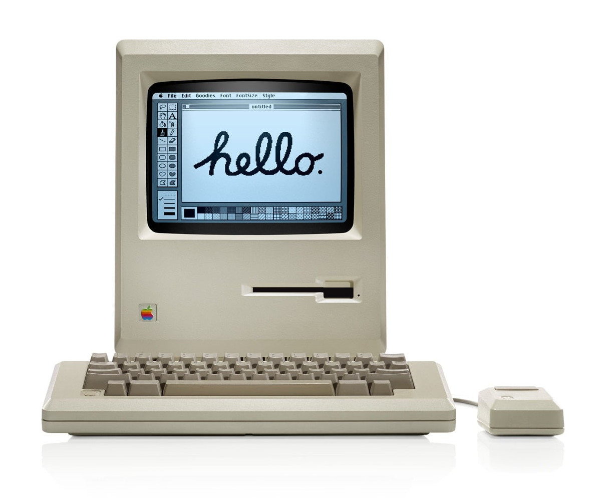
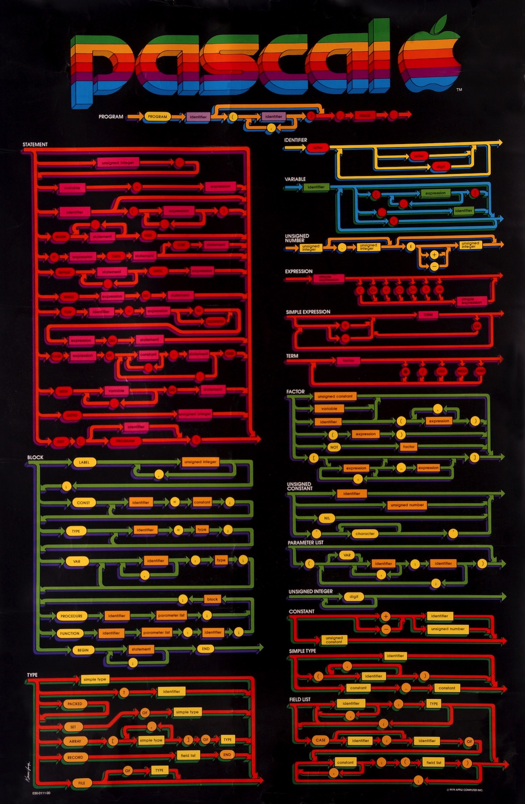
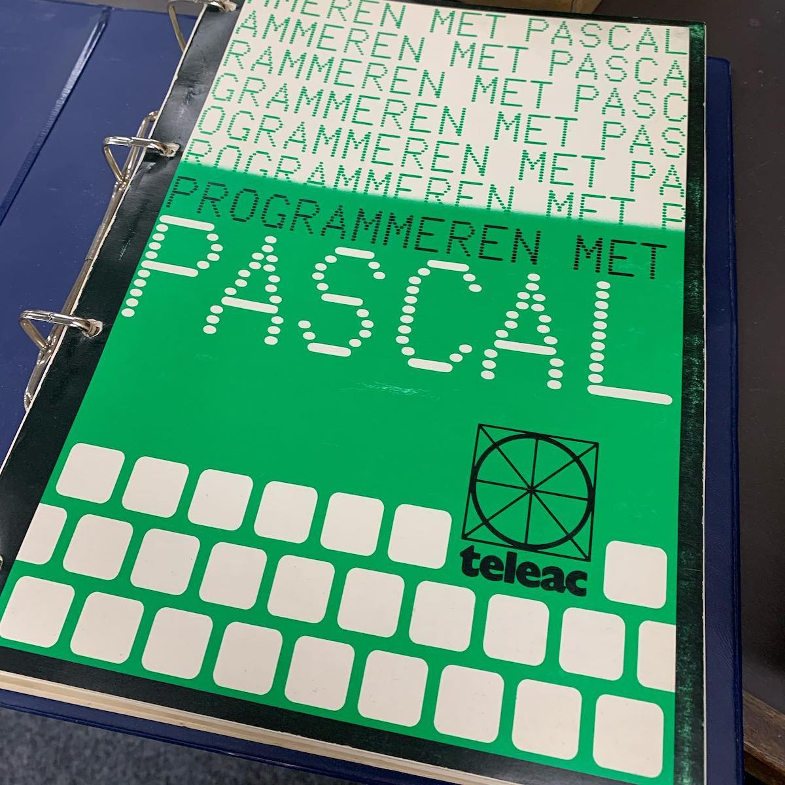
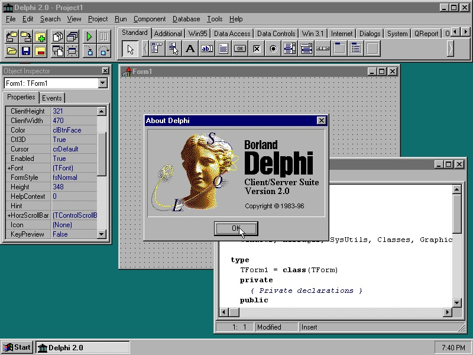
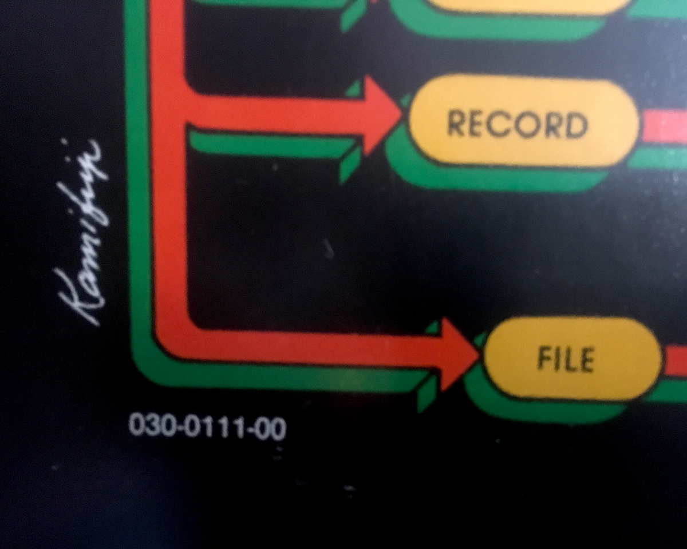

A couple of years ago I came across this official 1979 Apple poster. Often called the ultimate geek poster, this peculiar looking artefact has a quite interesting story and is an original piece of Apple Computer - and software engineering [history](http://www.computerhistory.org/collections/catalog/102640077).

## Apple Pascal
Around 1979, the Apple II became the “first personal computer” and [Bill Atkinson](https://twitter.com/billatk) became the primary developer of the programming language for the Apple II, called [Apple Pascal](https://web.archive.org/web/20150405004057/http://apple2info.net/images/2/24/Apple2Pascal_Operating_System_Ref.pdf). In the [Walter Isaacson](http://www.simonandschuster.com/books/Steve-Jobs/Walter-Isaacson/9781451648539) biography on [Steve Jobs](https://en.wikipedia.org/wiki/Steve_Jobs) we read that Jobs resisted the idea of Pascal, thinking that BASIC (Beginner’s All-purpose Symbolic Instruction Code) was all that the Apple II needed, but he gave Bill Atkinson a six-day period to prove him wrong. An so Atkinson did.

Apple Pascal is based on the [UCSD Pascal System](https://en.wikipedia.org/wiki/UCSD_Pascal), itself an implementation of the small, efficient programming language designed and published in 1970 by [Niklaus Wirth](https://en.wikipedia.org/wiki/Niklaus_Wirth). The language encourages good programming practices using structured program- and data structures. Niklaus Wirth named the language Pascal in honour of the French mathematician, philosopher and physicist [Blaise Pascal](https://en.wikipedia.org/wiki/Blaise_Pascal), who invented mechanical calculators in the 17th century.

## Borland Turbo Pascal with Objects
As a teenager I enjoyed a [Commodore 64](https://en.wikipedia.org/wiki/Commodore_64), which is tightly connected to the [BASIC programming language](https://www.c64-wiki.com/wiki/BASIC), and that’s where I learned programming for the first two years. While we did experiment with C64 Assembly programming and even Data Becker Pascal-64 it wasn’t until I got access to an 8088-2 MS-DOS based computer that I properly learned programming in Pascal. The tool of choice was developed by [Anders Hejlsberg]("https://twitter.com/ahejlsberg) and called Turbo Pascal, followed by Object Pascal (or Turbo Pascal with Objects) and eventually turned into [Delphi](https://en.wikipedia.org/wiki/Delphi_(IDE)).

## Apple Pascal Syntax Poster
An [interesting story]("https://vintagecomputer.ca/the-history-of-apples-pascal-syntax-poster-1979-80/) is posted on the internet, written by [Lucas Wagner](http://archive.li/xD6KS). We learn that my poster is reportedly the brain-child of [Jeff Raskin](https://en.wikipedia.org/wiki/Jef_Raskin), at least one of two fathers of the [Apple Macintosh](https://en.wikipedia.org/wiki/Macintosh). Raskin started designing a reference poster for Pascal since he found many of the existing Pascal charts did not fit the [Bill Atkinson](https://en.wikipedia.org/wiki/Bill_Atkinson) Apple Pascal compiler. Raskin worked from the original Niklaus Wirth publications, did some reorganisation on the drawings and made up a colour coding so that the higher lexical elements would correspond to the syntax diagrams below. Printing the diagram as a poster seemed a practical idea to keep to Apple Pascal reference within line-of-sight of the programmers.






## Along came Steve Jobs
Steve liked the idea and saw great marketing opportunity in it. Unfortunately, at least this is how the story is told, Steve did not fully understand the purpose and meaning of the elements and their colouring as envisioned by Raskin. On top of that, Steve hired upcoming graphical artist [Tom Kamifuji](http://www.artnet.com/artists/tom-kamifuji/) and requested him to make the poster more artistic. The end result was a glossy poster with a colour scheme that was oddly transformed from the Apple 'rainbow' logo designed by [Regis McKenna](https://en.wikipedia.org/wiki/Regis_McKenna), but applied without knowledge of the technical intentions those got 'lost in translation'.

## Production
The poster is credited to Kamifuji (without any further attributions), copyrighted 1979 and shows a document number ```030-0111-00```. This standard Apple document number translates to: "Technical Document (```030```) number ```111``` revision ```0```".
Printing was done by Westwood Press in Redwood City, California. The size of the print run is unknown to me, but this peculiar syntax poster only ended up with internal Apple developers and was given to some Californian dealers to promote Apple Pascal.



