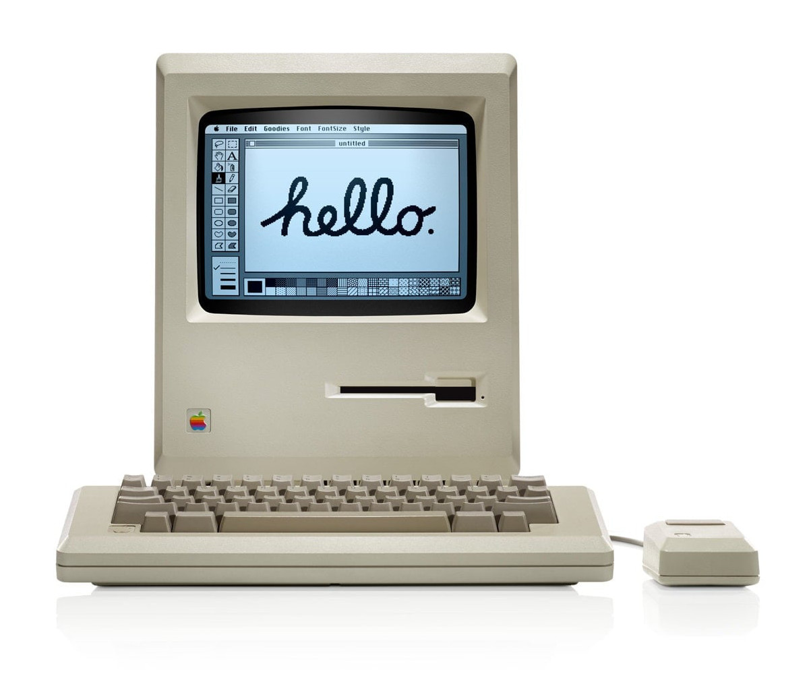
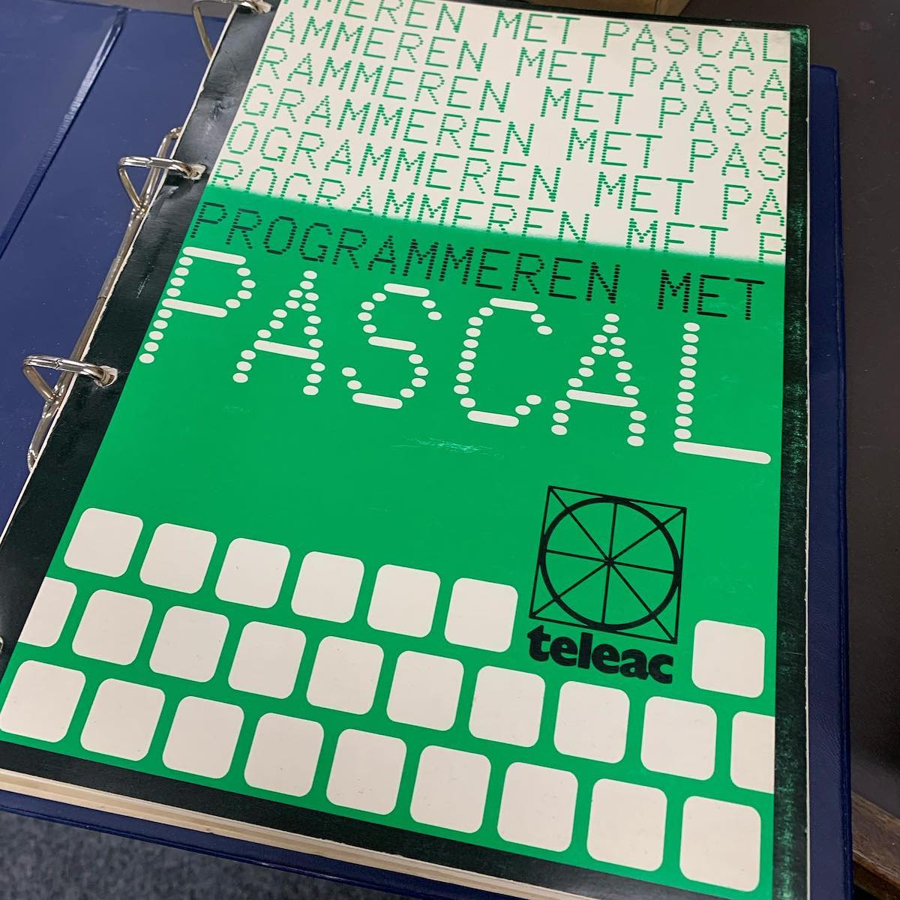
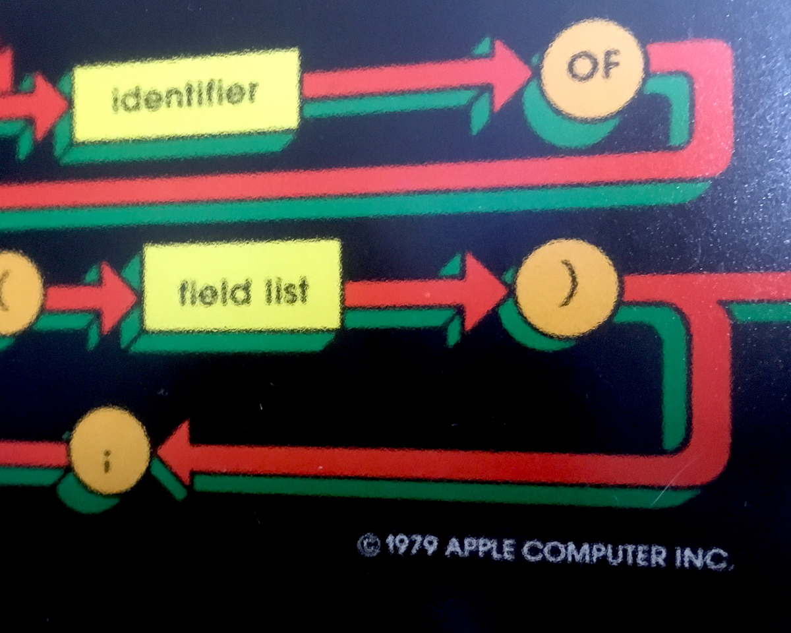

Een paar jaar geleden kwam ik deze officiële Apple-poster uit 1979 tegen.
Dit merkwaardig uitziende artefact, vaak de ultieme nerd-poster genoemd, heeft een heel interessant verhaal en is een origineel stukje Apple Computer - en software engineering [geschiedenis](http://www.computerhistory.org/collections/catalog/102640077).

## Appel Pascal
Rond 1979 werd de Apple II de "eerste personal computer" en werd [Bill Atkinson](https://twitter.com/billatk) de primaire ontwikkelaar van de programmeertaal voor de Apple II, genaamd [Apple Pascal](https://web.archive.org/web/20150405004057/http://apple2info.net/images/2/24/Apple2Pascal_Operating_System_Ref.pdf).
In de [Walter Isaacson](http://www.simonandschuster.com/books/Steve-Jobs/Walter-Isaacson/9781451648539) biografie over [Steve Jobs](https://en.wikipedia.org/wiki/Steve_Jobs) lezen we dat Jobs zich verzette tegen het idee van Pascal, omdat hij dacht dat BASIC (Beginner's All-purpose Symbolic Instruction Code) alles was wat de Apple II nodig had, maar hij gaf Bill Atkinson een periode van zes dagen om te bewijzen dat hij ongelijk had. En dat deed Atkinson.

Apple Pascal is gebaseerd op het [UCSD Pascal-systeem](https://en.wikipedia.org/wiki/UCSD_Pascal), zelf een implementatie van de kleine, efficiënte programmeertaal die in 1970 is ontworpen en gepubliceerd door [Niklaus Wirth](https://en.wikipedia.org/wiki/Niklaus_Wirth).
De taal stimuleert goede programmeerpraktijken met behulp van gestructureerde programma- en datastructuren.
Niklaus Wirth noemde de taal _Pascal_ ter ere van de Franse wiskundige, filosoof en natuurkundige [Blaise Pascal](https://en.wikipedia.org/wiki/Blaise_Pascal), die in de 17e eeuw mechanische rekenmachines uitvond.

## Borland Turbo Pascal with Objects
Als tiener genoot ik van een [Commodore 64](https://en.wikipedia.org/wiki/Commodore_64), die nauw verbonden is met de [BASIC programmeertaal](https://www.c64-wiki.com/wiki/BASIC), en daar heb ik de eerste twee jaar leren programmeren.
Hoewel we experimenteerden met C64 Assembly-programmering en zelfs met _Data Becker Pascal-64_, leerde ik pas goed programmeren in Pascal toen ik toegang kreeg tot een 8088-2 MS-DOS-computer.
De hierbij gebruikte implementatie werd ontwikkeld door [Anders Hejlsberg]("https://twitter.com/ahejlsberg) en heette _Turbo Pascal_, later opgevolgd door _Object Pascal_ (of _Turbo Pascal with Objects_) en veranderde uiteindelijk in [Delphi](https://en.wikipedia.org/wiki/Delphi_(IDE)).

## Apple Pascal Syntax-poster
Er is een [interessant verhaal]("https://vintagecomputer.ca/the-history-of-apples-pascal-syntax-poster-1979-80/) op internet geplaatst, geschreven door [Lucas Wagner](http://archive.li/xD6KS).
We vernemen dat mijn poster naar verluidt het geesteskind is van [Jeff Raskin](https://en.wikipedia.org/wiki/Jef_Raskin), ten minste één van de twee vaders van de [Apple Macintosh](https://en.wikipedia.org/wiki/Macintosh).
Raskin begon met het ontwerpen van een referentie-poster voor Pascal, omdat hij ontdekte dat veel van de bestaande Pascal-posters niet pasten bij de [Bill Atkinson](https://en.wikipedia.org/wiki/Bill_Atkinson) Apple Pascal-compiler.
Raskin werkte vanuit de originele Niklaus Wirth-publicaties, voerde wat reorganisatie uit op de tekeningen en bedacht een kleurcodering zodat de hogere lexicale elementen zouden overeenkomen met de onderstaande syntax-diagrammen.
Het diagram afdrukken als een poster leek een praktisch idee om de Apple Pascal-referentie binnen het gezichtsveld van de programmeurs te houden.






## Along came Steve Jobs
Steve vond het een goed idee en zag er geweldige marketingmogelijkheden in.
Helaas, zo wordt het verhaal tenminste verteld, begreep Steve het doel en de betekenis van de elementen en hun kleur niet volledig zoals Raskin voor ogen had.
Bovendien huurde Steve de opkomende grafische kunstenaar [Tom Kamifuji](http://www.artnet.com/artists/tom-kamifuji/) in en vroeg hem om de poster artistieker te maken.
Het eindresultaat was een glanzende poster met een kleurenschema dat was getransformeerd naar het Apple 'regenboog'-logo ontworpen door [Regis McKenna](https://en.wikipedia.org/wiki/Regis_McKenna), maar toegepast zonder kennis van de technische bedoelingen van de kleuren die daardoor 'lost in translation' zijn geraakt.

## Productie
De poster is gecrediteerd aan _Kamifuji_ (zonder verdere toeschrijvingen), copyright 1979 en toont een documentnummer ```030-0111-00```.
Dit standaard Apple-documentnummer vertaalt zich naar: "Technisch document (```030```) nummer ```111``` revisie ```0```.
Het drukken werd gedaan door Westwood Press in Redwood City, Californië.
De grootte van de oplage is mij onbekend, maar deze eigenaardige syntax-poster kwam alleen terecht bij interne Apple-ontwikkelaars en werd aan enkele Californische dealers gegeven om _Apple Pascal_ te promoten.



